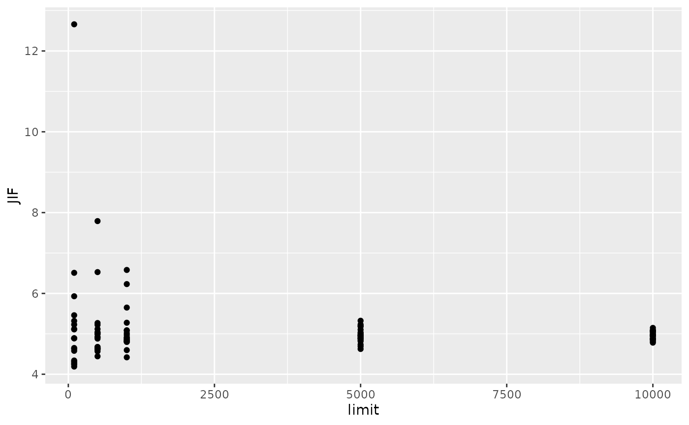

# JIF

``` r
knitr::opts_chunk$set(cache = TRUE)
```

``` r
library(OAmetrics)
```

    ## Loading required package: data.table

    ## This is OAmetrics 0.5.1

    ## OAmetrics is BETA software! Please report any bugs.

``` r
# Scientific Reports. According to website the JIF is 3.8 in 2023
res <- data.frame()
for (l in c(100, 500, 1000, 5000, 10000)) {
  for (r in 1:20) {
    start <- Sys.time()
    res0 <- get_JIF(issn="2045-2322", year=2023, limit=l, seed=r)
    end <- Sys.time()
    res0$dur <- end-start
    res0$limit <- l
    res <- rbind(res, res0)
    print(res)
    flush.console()
  }
}
```

    ## Warning in get_JIF(issn = "2045-2322", year = 2023, limit = l, seed = r): The
    ## journal published 47176 works in the two-year time window. Limiting to n=100
    ## random papers.

    ##              journal      issn year paper_limit total_citations citable_items
    ## 1 Scientific Reports 2045-2322 2023         100             512           100
    ##    JIF           dur limit
    ## 1 5.12 1.752011 secs   100

    ## Warning in get_JIF(issn = "2045-2322", year = 2023, limit = l, seed = r): The
    ## journal published 47176 works in the two-year time window. Limiting to n=100
    ## random papers.

    ##              journal      issn year paper_limit total_citations citable_items
    ## 1 Scientific Reports 2045-2322 2023         100             512           100
    ## 2 Scientific Reports 2045-2322 2023         100             511           100
    ##    JIF           dur limit
    ## 1 5.12 1.752011 secs   100
    ## 2 5.11 1.396888 secs   100

    ## Warning in get_JIF(issn = "2045-2322", year = 2023, limit = l, seed = r): The
    ## journal published 47176 works in the two-year time window. Limiting to n=100
    ## random papers.

    ##              journal      issn year paper_limit total_citations citable_items
    ## 1 Scientific Reports 2045-2322 2023         100             512           100
    ## 2 Scientific Reports 2045-2322 2023         100             511           100
    ## 3 Scientific Reports 2045-2322 2023         100             489           100
    ##    JIF           dur limit
    ## 1 5.12 1.752011 secs   100
    ## 2 5.11 1.396888 secs   100
    ## 3 4.89 1.439896 secs   100

    ## Warning in get_JIF(issn = "2045-2322", year = 2023, limit = l, seed = r): The
    ## journal published 47176 works in the two-year time window. Limiting to n=100
    ## random papers.

    ##              journal      issn year paper_limit total_citations citable_items
    ## 1 Scientific Reports 2045-2322 2023         100             512           100
    ## 2 Scientific Reports 2045-2322 2023         100             511           100
    ## 3 Scientific Reports 2045-2322 2023         100             489           100
    ## 4 Scientific Reports 2045-2322 2023         100            1266           100
    ##     JIF           dur limit
    ## 1  5.12 1.752011 secs   100
    ## 2  5.11 1.396888 secs   100
    ## 3  4.89 1.439896 secs   100
    ## 4 12.66 1.579624 secs   100

    ## Warning in get_JIF(issn = "2045-2322", year = 2023, limit = l, seed = r): The
    ## journal published 47176 works in the two-year time window. Limiting to n=100
    ## random papers.

    ##              journal      issn year paper_limit total_citations citable_items
    ## 1 Scientific Reports 2045-2322 2023         100             512           100
    ## 2 Scientific Reports 2045-2322 2023         100             511           100
    ## 3 Scientific Reports 2045-2322 2023         100             489           100
    ## 4 Scientific Reports 2045-2322 2023         100            1266           100
    ## 5 Scientific Reports 2045-2322 2023         100             489           100
    ##     JIF           dur limit
    ## 1  5.12 1.752011 secs   100
    ## 2  5.11 1.396888 secs   100
    ## 3  4.89 1.439896 secs   100
    ## 4 12.66 1.579624 secs   100
    ## 5  4.89 1.469686 secs   100

    ## Warning in get_JIF(issn = "2045-2322", year = 2023, limit = l, seed = r): The
    ## journal published 47176 works in the two-year time window. Limiting to n=100
    ## random papers.

    ##              journal      issn year paper_limit total_citations citable_items
    ## 1 Scientific Reports 2045-2322 2023         100             512           100
    ## 2 Scientific Reports 2045-2322 2023         100             511           100
    ## 3 Scientific Reports 2045-2322 2023         100             489           100
    ## 4 Scientific Reports 2045-2322 2023         100            1266           100
    ## 5 Scientific Reports 2045-2322 2023         100             489           100
    ## 6 Scientific Reports 2045-2322 2023         100             593           100
    ##     JIF           dur limit
    ## 1  5.12 1.752011 secs   100
    ## 2  5.11 1.396888 secs   100
    ## 3  4.89 1.439896 secs   100
    ## 4 12.66 1.579624 secs   100
    ## 5  4.89 1.469686 secs   100
    ## 6  5.93 1.610352 secs   100

    ## Warning in get_JIF(issn = "2045-2322", year = 2023, limit = l, seed = r): The
    ## journal published 47176 works in the two-year time window. Limiting to n=100
    ## random papers.

    ##              journal      issn year paper_limit total_citations citable_items
    ## 1 Scientific Reports 2045-2322 2023         100             512           100
    ## 2 Scientific Reports 2045-2322 2023         100             511           100
    ## 3 Scientific Reports 2045-2322 2023         100             489           100
    ## 4 Scientific Reports 2045-2322 2023         100            1266           100
    ## 5 Scientific Reports 2045-2322 2023         100             489           100
    ## 6 Scientific Reports 2045-2322 2023         100             593           100
    ## 7 Scientific Reports 2045-2322 2023         100             458           100
    ##     JIF           dur limit
    ## 1  5.12 1.752011 secs   100
    ## 2  5.11 1.396888 secs   100
    ## 3  4.89 1.439896 secs   100
    ## 4 12.66 1.579624 secs   100
    ## 5  4.89 1.469686 secs   100
    ## 6  5.93 1.610352 secs   100
    ## 7  4.58 1.472712 secs   100

    ## Warning in get_JIF(issn = "2045-2322", year = 2023, limit = l, seed = r): The
    ## journal published 47176 works in the two-year time window. Limiting to n=100
    ## random papers.

    ##              journal      issn year paper_limit total_citations citable_items
    ## 1 Scientific Reports 2045-2322 2023         100             512           100
    ## 2 Scientific Reports 2045-2322 2023         100             511           100
    ## 3 Scientific Reports 2045-2322 2023         100             489           100
    ## 4 Scientific Reports 2045-2322 2023         100            1266           100
    ## 5 Scientific Reports 2045-2322 2023         100             489           100
    ## 6 Scientific Reports 2045-2322 2023         100             593           100
    ## 7 Scientific Reports 2045-2322 2023         100             458           100
    ## 8 Scientific Reports 2045-2322 2023         100             434           100
    ##     JIF           dur limit
    ## 1  5.12 1.752011 secs   100
    ## 2  5.11 1.396888 secs   100
    ## 3  4.89 1.439896 secs   100
    ## 4 12.66 1.579624 secs   100
    ## 5  4.89 1.469686 secs   100
    ## 6  5.93 1.610352 secs   100
    ## 7  4.58 1.472712 secs   100
    ## 8  4.34 1.638556 secs   100

    ## Warning in get_JIF(issn = "2045-2322", year = 2023, limit = l, seed = r): The
    ## journal published 47176 works in the two-year time window. Limiting to n=100
    ## random papers.

    ##              journal      issn year paper_limit total_citations citable_items
    ## 1 Scientific Reports 2045-2322 2023         100             512           100
    ## 2 Scientific Reports 2045-2322 2023         100             511           100
    ## 3 Scientific Reports 2045-2322 2023         100             489           100
    ## 4 Scientific Reports 2045-2322 2023         100            1266           100
    ## 5 Scientific Reports 2045-2322 2023         100             489           100
    ## 6 Scientific Reports 2045-2322 2023         100             593           100
    ## 7 Scientific Reports 2045-2322 2023         100             458           100
    ## 8 Scientific Reports 2045-2322 2023         100             434           100
    ## 9 Scientific Reports 2045-2322 2023         100             426           100
    ##     JIF           dur limit
    ## 1  5.12 1.752011 secs   100
    ## 2  5.11 1.396888 secs   100
    ## 3  4.89 1.439896 secs   100
    ## 4 12.66 1.579624 secs   100
    ## 5  4.89 1.469686 secs   100
    ## 6  5.93 1.610352 secs   100
    ## 7  4.58 1.472712 secs   100
    ## 8  4.34 1.638556 secs   100
    ## 9  4.26 1.507276 secs   100

    ## Warning in get_JIF(issn = "2045-2322", year = 2023, limit = l, seed = r): The
    ## journal published 47176 works in the two-year time window. Limiting to n=100
    ## random papers.

    ##               journal      issn year paper_limit total_citations citable_items
    ## 1  Scientific Reports 2045-2322 2023         100             512           100
    ## 2  Scientific Reports 2045-2322 2023         100             511           100
    ## 3  Scientific Reports 2045-2322 2023         100             489           100
    ## 4  Scientific Reports 2045-2322 2023         100            1266           100
    ## 5  Scientific Reports 2045-2322 2023         100             489           100
    ## 6  Scientific Reports 2045-2322 2023         100             593           100
    ## 7  Scientific Reports 2045-2322 2023         100             458           100
    ## 8  Scientific Reports 2045-2322 2023         100             434           100
    ## 9  Scientific Reports 2045-2322 2023         100             426           100
    ## 10 Scientific Reports 2045-2322 2023         100             432           100
    ##      JIF           dur limit
    ## 1   5.12 1.752011 secs   100
    ## 2   5.11 1.396888 secs   100
    ## 3   4.89 1.439896 secs   100
    ## 4  12.66 1.579624 secs   100
    ## 5   4.89 1.469686 secs   100
    ## 6   5.93 1.610352 secs   100
    ## 7   4.58 1.472712 secs   100
    ## 8   4.34 1.638556 secs   100
    ## 9   4.26 1.507276 secs   100
    ## 10  4.32 1.449094 secs   100

    ## Warning in get_JIF(issn = "2045-2322", year = 2023, limit = l, seed = r): The
    ## journal published 47176 works in the two-year time window. Limiting to n=100
    ## random papers.

    ##               journal      issn year paper_limit total_citations citable_items
    ## 1  Scientific Reports 2045-2322 2023         100             512           100
    ## 2  Scientific Reports 2045-2322 2023         100             511           100
    ## 3  Scientific Reports 2045-2322 2023         100             489           100
    ## 4  Scientific Reports 2045-2322 2023         100            1266           100
    ## 5  Scientific Reports 2045-2322 2023         100             489           100
    ## 6  Scientific Reports 2045-2322 2023         100             593           100
    ## 7  Scientific Reports 2045-2322 2023         100             458           100
    ## 8  Scientific Reports 2045-2322 2023         100             434           100
    ## 9  Scientific Reports 2045-2322 2023         100             426           100
    ## 10 Scientific Reports 2045-2322 2023         100             432           100
    ## 11 Scientific Reports 2045-2322 2023         100             419           100
    ##      JIF           dur limit
    ## 1   5.12 1.752011 secs   100
    ## 2   5.11 1.396888 secs   100
    ## 3   4.89 1.439896 secs   100
    ## 4  12.66 1.579624 secs   100
    ## 5   4.89 1.469686 secs   100
    ## 6   5.93 1.610352 secs   100
    ## 7   4.58 1.472712 secs   100
    ## 8   4.34 1.638556 secs   100
    ## 9   4.26 1.507276 secs   100
    ## 10  4.32 1.449094 secs   100
    ## 11  4.19 1.540496 secs   100

    ## Warning in get_JIF(issn = "2045-2322", year = 2023, limit = l, seed = r): The
    ## journal published 47176 works in the two-year time window. Limiting to n=100
    ## random papers.

    ##               journal      issn year paper_limit total_citations citable_items
    ## 1  Scientific Reports 2045-2322 2023         100             512           100
    ## 2  Scientific Reports 2045-2322 2023         100             511           100
    ## 3  Scientific Reports 2045-2322 2023         100             489           100
    ## 4  Scientific Reports 2045-2322 2023         100            1266           100
    ## 5  Scientific Reports 2045-2322 2023         100             489           100
    ## 6  Scientific Reports 2045-2322 2023         100             593           100
    ## 7  Scientific Reports 2045-2322 2023         100             458           100
    ## 8  Scientific Reports 2045-2322 2023         100             434           100
    ## 9  Scientific Reports 2045-2322 2023         100             426           100
    ## 10 Scientific Reports 2045-2322 2023         100             432           100
    ## 11 Scientific Reports 2045-2322 2023         100             419           100
    ## 12 Scientific Reports 2045-2322 2023         100             463           100
    ##      JIF           dur limit
    ## 1   5.12 1.752011 secs   100
    ## 2   5.11 1.396888 secs   100
    ## 3   4.89 1.439896 secs   100
    ## 4  12.66 1.579624 secs   100
    ## 5   4.89 1.469686 secs   100
    ## 6   5.93 1.610352 secs   100
    ## 7   4.58 1.472712 secs   100
    ## 8   4.34 1.638556 secs   100
    ## 9   4.26 1.507276 secs   100
    ## 10  4.32 1.449094 secs   100
    ## 11  4.19 1.540496 secs   100
    ## 12  4.63 1.410278 secs   100

    ## Warning in get_JIF(issn = "2045-2322", year = 2023, limit = l, seed = r): The
    ## journal published 47176 works in the two-year time window. Limiting to n=100
    ## random papers.

    ##               journal      issn year paper_limit total_citations citable_items
    ## 1  Scientific Reports 2045-2322 2023         100             512           100
    ## 2  Scientific Reports 2045-2322 2023         100             511           100
    ## 3  Scientific Reports 2045-2322 2023         100             489           100
    ## 4  Scientific Reports 2045-2322 2023         100            1266           100
    ## 5  Scientific Reports 2045-2322 2023         100             489           100
    ## 6  Scientific Reports 2045-2322 2023         100             593           100
    ## 7  Scientific Reports 2045-2322 2023         100             458           100
    ## 8  Scientific Reports 2045-2322 2023         100             434           100
    ## 9  Scientific Reports 2045-2322 2023         100             426           100
    ## 10 Scientific Reports 2045-2322 2023         100             432           100
    ## 11 Scientific Reports 2045-2322 2023         100             419           100
    ## 12 Scientific Reports 2045-2322 2023         100             463           100
    ## 13 Scientific Reports 2045-2322 2023         100             532           100
    ##      JIF           dur limit
    ## 1   5.12 1.752011 secs   100
    ## 2   5.11 1.396888 secs   100
    ## 3   4.89 1.439896 secs   100
    ## 4  12.66 1.579624 secs   100
    ## 5   4.89 1.469686 secs   100
    ## 6   5.93 1.610352 secs   100
    ## 7   4.58 1.472712 secs   100
    ## 8   4.34 1.638556 secs   100
    ## 9   4.26 1.507276 secs   100
    ## 10  4.32 1.449094 secs   100
    ## 11  4.19 1.540496 secs   100
    ## 12  4.63 1.410278 secs   100
    ## 13  5.32 1.557856 secs   100

    ## Warning in get_JIF(issn = "2045-2322", year = 2023, limit = l, seed = r): The
    ## journal published 47176 works in the two-year time window. Limiting to n=100
    ## random papers.

    ##               journal      issn year paper_limit total_citations citable_items
    ## 1  Scientific Reports 2045-2322 2023         100             512           100
    ## 2  Scientific Reports 2045-2322 2023         100             511           100
    ## 3  Scientific Reports 2045-2322 2023         100             489           100
    ## 4  Scientific Reports 2045-2322 2023         100            1266           100
    ## 5  Scientific Reports 2045-2322 2023         100             489           100
    ## 6  Scientific Reports 2045-2322 2023         100             593           100
    ## 7  Scientific Reports 2045-2322 2023         100             458           100
    ## 8  Scientific Reports 2045-2322 2023         100             434           100
    ## 9  Scientific Reports 2045-2322 2023         100             426           100
    ## 10 Scientific Reports 2045-2322 2023         100             432           100
    ## 11 Scientific Reports 2045-2322 2023         100             419           100
    ## 12 Scientific Reports 2045-2322 2023         100             463           100
    ## 13 Scientific Reports 2045-2322 2023         100             532           100
    ## 14 Scientific Reports 2045-2322 2023         100             424           100
    ##      JIF           dur limit
    ## 1   5.12 1.752011 secs   100
    ## 2   5.11 1.396888 secs   100
    ## 3   4.89 1.439896 secs   100
    ## 4  12.66 1.579624 secs   100
    ## 5   4.89 1.469686 secs   100
    ## 6   5.93 1.610352 secs   100
    ## 7   4.58 1.472712 secs   100
    ## 8   4.34 1.638556 secs   100
    ## 9   4.26 1.507276 secs   100
    ## 10  4.32 1.449094 secs   100
    ## 11  4.19 1.540496 secs   100
    ## 12  4.63 1.410278 secs   100
    ## 13  5.32 1.557856 secs   100
    ## 14  4.24 1.401977 secs   100

    ## Warning in get_JIF(issn = "2045-2322", year = 2023, limit = l, seed = r): The
    ## journal published 47176 works in the two-year time window. Limiting to n=100
    ## random papers.

    ##               journal      issn year paper_limit total_citations citable_items
    ## 1  Scientific Reports 2045-2322 2023         100             512           100
    ## 2  Scientific Reports 2045-2322 2023         100             511           100
    ## 3  Scientific Reports 2045-2322 2023         100             489           100
    ## 4  Scientific Reports 2045-2322 2023         100            1266           100
    ## 5  Scientific Reports 2045-2322 2023         100             489           100
    ## 6  Scientific Reports 2045-2322 2023         100             593           100
    ## 7  Scientific Reports 2045-2322 2023         100             458           100
    ## 8  Scientific Reports 2045-2322 2023         100             434           100
    ## 9  Scientific Reports 2045-2322 2023         100             426           100
    ## 10 Scientific Reports 2045-2322 2023         100             432           100
    ## 11 Scientific Reports 2045-2322 2023         100             419           100
    ## 12 Scientific Reports 2045-2322 2023         100             463           100
    ## 13 Scientific Reports 2045-2322 2023         100             532           100
    ## 14 Scientific Reports 2045-2322 2023         100             424           100
    ## 15 Scientific Reports 2045-2322 2023         100             429           100
    ##      JIF           dur limit
    ## 1   5.12 1.752011 secs   100
    ## 2   5.11 1.396888 secs   100
    ## 3   4.89 1.439896 secs   100
    ## 4  12.66 1.579624 secs   100
    ## 5   4.89 1.469686 secs   100
    ## 6   5.93 1.610352 secs   100
    ## 7   4.58 1.472712 secs   100
    ## 8   4.34 1.638556 secs   100
    ## 9   4.26 1.507276 secs   100
    ## 10  4.32 1.449094 secs   100
    ## 11  4.19 1.540496 secs   100
    ## 12  4.63 1.410278 secs   100
    ## 13  5.32 1.557856 secs   100
    ## 14  4.24 1.401977 secs   100
    ## 15  4.29 1.554972 secs   100

    ## Warning in get_JIF(issn = "2045-2322", year = 2023, limit = l, seed = r): The
    ## journal published 47176 works in the two-year time window. Limiting to n=100
    ## random papers.

    ##               journal      issn year paper_limit total_citations citable_items
    ## 1  Scientific Reports 2045-2322 2023         100             512           100
    ## 2  Scientific Reports 2045-2322 2023         100             511           100
    ## 3  Scientific Reports 2045-2322 2023         100             489           100
    ## 4  Scientific Reports 2045-2322 2023         100            1266           100
    ## 5  Scientific Reports 2045-2322 2023         100             489           100
    ## 6  Scientific Reports 2045-2322 2023         100             593           100
    ## 7  Scientific Reports 2045-2322 2023         100             458           100
    ## 8  Scientific Reports 2045-2322 2023         100             434           100
    ## 9  Scientific Reports 2045-2322 2023         100             426           100
    ## 10 Scientific Reports 2045-2322 2023         100             432           100
    ## 11 Scientific Reports 2045-2322 2023         100             419           100
    ## 12 Scientific Reports 2045-2322 2023         100             463           100
    ## 13 Scientific Reports 2045-2322 2023         100             532           100
    ## 14 Scientific Reports 2045-2322 2023         100             424           100
    ## 15 Scientific Reports 2045-2322 2023         100             429           100
    ## 16 Scientific Reports 2045-2322 2023         100             523           100
    ##      JIF           dur limit
    ## 1   5.12 1.752011 secs   100
    ## 2   5.11 1.396888 secs   100
    ## 3   4.89 1.439896 secs   100
    ## 4  12.66 1.579624 secs   100
    ## 5   4.89 1.469686 secs   100
    ## 6   5.93 1.610352 secs   100
    ## 7   4.58 1.472712 secs   100
    ## 8   4.34 1.638556 secs   100
    ## 9   4.26 1.507276 secs   100
    ## 10  4.32 1.449094 secs   100
    ## 11  4.19 1.540496 secs   100
    ## 12  4.63 1.410278 secs   100
    ## 13  5.32 1.557856 secs   100
    ## 14  4.24 1.401977 secs   100
    ## 15  4.29 1.554972 secs   100
    ## 16  5.23 1.471356 secs   100

    ## Warning in get_JIF(issn = "2045-2322", year = 2023, limit = l, seed = r): The
    ## journal published 47176 works in the two-year time window. Limiting to n=100
    ## random papers.

    ##               journal      issn year paper_limit total_citations citable_items
    ## 1  Scientific Reports 2045-2322 2023         100             512           100
    ## 2  Scientific Reports 2045-2322 2023         100             511           100
    ## 3  Scientific Reports 2045-2322 2023         100             489           100
    ## 4  Scientific Reports 2045-2322 2023         100            1266           100
    ## 5  Scientific Reports 2045-2322 2023         100             489           100
    ## 6  Scientific Reports 2045-2322 2023         100             593           100
    ## 7  Scientific Reports 2045-2322 2023         100             458           100
    ## 8  Scientific Reports 2045-2322 2023         100             434           100
    ## 9  Scientific Reports 2045-2322 2023         100             426           100
    ## 10 Scientific Reports 2045-2322 2023         100             432           100
    ## 11 Scientific Reports 2045-2322 2023         100             419           100
    ## 12 Scientific Reports 2045-2322 2023         100             463           100
    ## 13 Scientific Reports 2045-2322 2023         100             532           100
    ## 14 Scientific Reports 2045-2322 2023         100             424           100
    ## 15 Scientific Reports 2045-2322 2023         100             429           100
    ## 16 Scientific Reports 2045-2322 2023         100             523           100
    ## 17 Scientific Reports 2045-2322 2023         100             489           100
    ##      JIF           dur limit
    ## 1   5.12 1.752011 secs   100
    ## 2   5.11 1.396888 secs   100
    ## 3   4.89 1.439896 secs   100
    ## 4  12.66 1.579624 secs   100
    ## 5   4.89 1.469686 secs   100
    ## 6   5.93 1.610352 secs   100
    ## 7   4.58 1.472712 secs   100
    ## 8   4.34 1.638556 secs   100
    ## 9   4.26 1.507276 secs   100
    ## 10  4.32 1.449094 secs   100
    ## 11  4.19 1.540496 secs   100
    ## 12  4.63 1.410278 secs   100
    ## 13  5.32 1.557856 secs   100
    ## 14  4.24 1.401977 secs   100
    ## 15  4.29 1.554972 secs   100
    ## 16  5.23 1.471356 secs   100
    ## 17  4.89 1.517072 secs   100

    ## Warning in get_JIF(issn = "2045-2322", year = 2023, limit = l, seed = r): The
    ## journal published 47176 works in the two-year time window. Limiting to n=100
    ## random papers.

    ##               journal      issn year paper_limit total_citations citable_items
    ## 1  Scientific Reports 2045-2322 2023         100             512           100
    ## 2  Scientific Reports 2045-2322 2023         100             511           100
    ## 3  Scientific Reports 2045-2322 2023         100             489           100
    ## 4  Scientific Reports 2045-2322 2023         100            1266           100
    ## 5  Scientific Reports 2045-2322 2023         100             489           100
    ## 6  Scientific Reports 2045-2322 2023         100             593           100
    ## 7  Scientific Reports 2045-2322 2023         100             458           100
    ## 8  Scientific Reports 2045-2322 2023         100             434           100
    ## 9  Scientific Reports 2045-2322 2023         100             426           100
    ## 10 Scientific Reports 2045-2322 2023         100             432           100
    ## 11 Scientific Reports 2045-2322 2023         100             419           100
    ## 12 Scientific Reports 2045-2322 2023         100             463           100
    ## 13 Scientific Reports 2045-2322 2023         100             532           100
    ## 14 Scientific Reports 2045-2322 2023         100             424           100
    ## 15 Scientific Reports 2045-2322 2023         100             429           100
    ## 16 Scientific Reports 2045-2322 2023         100             523           100
    ## 17 Scientific Reports 2045-2322 2023         100             489           100
    ## 18 Scientific Reports 2045-2322 2023         100             546           100
    ##      JIF           dur limit
    ## 1   5.12 1.752011 secs   100
    ## 2   5.11 1.396888 secs   100
    ## 3   4.89 1.439896 secs   100
    ## 4  12.66 1.579624 secs   100
    ## 5   4.89 1.469686 secs   100
    ## 6   5.93 1.610352 secs   100
    ## 7   4.58 1.472712 secs   100
    ## 8   4.34 1.638556 secs   100
    ## 9   4.26 1.507276 secs   100
    ## 10  4.32 1.449094 secs   100
    ## 11  4.19 1.540496 secs   100
    ## 12  4.63 1.410278 secs   100
    ## 13  5.32 1.557856 secs   100
    ## 14  4.24 1.401977 secs   100
    ## 15  4.29 1.554972 secs   100
    ## 16  5.23 1.471356 secs   100
    ## 17  4.89 1.517072 secs   100
    ## 18  5.46 1.569011 secs   100

    ## Warning in get_JIF(issn = "2045-2322", year = 2023, limit = l, seed = r): The
    ## journal published 47176 works in the two-year time window. Limiting to n=100
    ## random papers.

    ##               journal      issn year paper_limit total_citations citable_items
    ## 1  Scientific Reports 2045-2322 2023         100             512           100
    ## 2  Scientific Reports 2045-2322 2023         100             511           100
    ## 3  Scientific Reports 2045-2322 2023         100             489           100
    ## 4  Scientific Reports 2045-2322 2023         100            1266           100
    ## 5  Scientific Reports 2045-2322 2023         100             489           100
    ## 6  Scientific Reports 2045-2322 2023         100             593           100
    ## 7  Scientific Reports 2045-2322 2023         100             458           100
    ## 8  Scientific Reports 2045-2322 2023         100             434           100
    ## 9  Scientific Reports 2045-2322 2023         100             426           100
    ## 10 Scientific Reports 2045-2322 2023         100             432           100
    ## 11 Scientific Reports 2045-2322 2023         100             419           100
    ## 12 Scientific Reports 2045-2322 2023         100             463           100
    ## 13 Scientific Reports 2045-2322 2023         100             532           100
    ## 14 Scientific Reports 2045-2322 2023         100             424           100
    ## 15 Scientific Reports 2045-2322 2023         100             429           100
    ## 16 Scientific Reports 2045-2322 2023         100             523           100
    ## 17 Scientific Reports 2045-2322 2023         100             489           100
    ## 18 Scientific Reports 2045-2322 2023         100             546           100
    ## 19 Scientific Reports 2045-2322 2023         100             465           100
    ##      JIF           dur limit
    ## 1   5.12 1.752011 secs   100
    ## 2   5.11 1.396888 secs   100
    ## 3   4.89 1.439896 secs   100
    ## 4  12.66 1.579624 secs   100
    ## 5   4.89 1.469686 secs   100
    ## 6   5.93 1.610352 secs   100
    ## 7   4.58 1.472712 secs   100
    ## 8   4.34 1.638556 secs   100
    ## 9   4.26 1.507276 secs   100
    ## 10  4.32 1.449094 secs   100
    ## 11  4.19 1.540496 secs   100
    ## 12  4.63 1.410278 secs   100
    ## 13  5.32 1.557856 secs   100
    ## 14  4.24 1.401977 secs   100
    ## 15  4.29 1.554972 secs   100
    ## 16  5.23 1.471356 secs   100
    ## 17  4.89 1.517072 secs   100
    ## 18  5.46 1.569011 secs   100
    ## 19  4.65 1.517953 secs   100

    ## Warning in get_JIF(issn = "2045-2322", year = 2023, limit = l, seed = r): The
    ## journal published 47176 works in the two-year time window. Limiting to n=100
    ## random papers.

    ##               journal      issn year paper_limit total_citations citable_items
    ## 1  Scientific Reports 2045-2322 2023         100             512           100
    ## 2  Scientific Reports 2045-2322 2023         100             511           100
    ## 3  Scientific Reports 2045-2322 2023         100             489           100
    ## 4  Scientific Reports 2045-2322 2023         100            1266           100
    ## 5  Scientific Reports 2045-2322 2023         100             489           100
    ## 6  Scientific Reports 2045-2322 2023         100             593           100
    ## 7  Scientific Reports 2045-2322 2023         100             458           100
    ## 8  Scientific Reports 2045-2322 2023         100             434           100
    ## 9  Scientific Reports 2045-2322 2023         100             426           100
    ## 10 Scientific Reports 2045-2322 2023         100             432           100
    ## 11 Scientific Reports 2045-2322 2023         100             419           100
    ## 12 Scientific Reports 2045-2322 2023         100             463           100
    ## 13 Scientific Reports 2045-2322 2023         100             532           100
    ## 14 Scientific Reports 2045-2322 2023         100             424           100
    ## 15 Scientific Reports 2045-2322 2023         100             429           100
    ## 16 Scientific Reports 2045-2322 2023         100             523           100
    ## 17 Scientific Reports 2045-2322 2023         100             489           100
    ## 18 Scientific Reports 2045-2322 2023         100             546           100
    ## 19 Scientific Reports 2045-2322 2023         100             465           100
    ## 20 Scientific Reports 2045-2322 2023         100             651           100
    ##      JIF           dur limit
    ## 1   5.12 1.752011 secs   100
    ## 2   5.11 1.396888 secs   100
    ## 3   4.89 1.439896 secs   100
    ## 4  12.66 1.579624 secs   100
    ## 5   4.89 1.469686 secs   100
    ## 6   5.93 1.610352 secs   100
    ## 7   4.58 1.472712 secs   100
    ## 8   4.34 1.638556 secs   100
    ## 9   4.26 1.507276 secs   100
    ## 10  4.32 1.449094 secs   100
    ## 11  4.19 1.540496 secs   100
    ## 12  4.63 1.410278 secs   100
    ## 13  5.32 1.557856 secs   100
    ## 14  4.24 1.401977 secs   100
    ## 15  4.29 1.554972 secs   100
    ## 16  5.23 1.471356 secs   100
    ## 17  4.89 1.517072 secs   100
    ## 18  5.46 1.569011 secs   100
    ## 19  4.65 1.517953 secs   100
    ## 20  6.51 1.485307 secs   100

    ## Warning in get_JIF(issn = "2045-2322", year = 2023, limit = l, seed = r): The
    ## journal published 47176 works in the two-year time window. Limiting to n=500
    ## random papers.

    ##               journal      issn year paper_limit total_citations citable_items
    ## 1  Scientific Reports 2045-2322 2023         100             512           100
    ## 2  Scientific Reports 2045-2322 2023         100             511           100
    ## 3  Scientific Reports 2045-2322 2023         100             489           100
    ## 4  Scientific Reports 2045-2322 2023         100            1266           100
    ## 5  Scientific Reports 2045-2322 2023         100             489           100
    ## 6  Scientific Reports 2045-2322 2023         100             593           100
    ## 7  Scientific Reports 2045-2322 2023         100             458           100
    ## 8  Scientific Reports 2045-2322 2023         100             434           100
    ## 9  Scientific Reports 2045-2322 2023         100             426           100
    ## 10 Scientific Reports 2045-2322 2023         100             432           100
    ## 11 Scientific Reports 2045-2322 2023         100             419           100
    ## 12 Scientific Reports 2045-2322 2023         100             463           100
    ## 13 Scientific Reports 2045-2322 2023         100             532           100
    ## 14 Scientific Reports 2045-2322 2023         100             424           100
    ## 15 Scientific Reports 2045-2322 2023         100             429           100
    ## 16 Scientific Reports 2045-2322 2023         100             523           100
    ## 17 Scientific Reports 2045-2322 2023         100             489           100
    ## 18 Scientific Reports 2045-2322 2023         100             546           100
    ## 19 Scientific Reports 2045-2322 2023         100             465           100
    ## 20 Scientific Reports 2045-2322 2023         100             651           100
    ## 21 Scientific Reports 2045-2322 2023         500            2559           500
    ##       JIF           dur limit
    ## 1   5.120 1.752011 secs   100
    ## 2   5.110 1.396888 secs   100
    ## 3   4.890 1.439896 secs   100
    ## 4  12.660 1.579624 secs   100
    ## 5   4.890 1.469686 secs   100
    ## 6   5.930 1.610352 secs   100
    ## 7   4.580 1.472712 secs   100
    ## 8   4.340 1.638556 secs   100
    ## 9   4.260 1.507276 secs   100
    ## 10  4.320 1.449094 secs   100
    ## 11  4.190 1.540496 secs   100
    ## 12  4.630 1.410278 secs   100
    ## 13  5.320 1.557856 secs   100
    ## 14  4.240 1.401977 secs   100
    ## 15  4.290 1.554972 secs   100
    ## 16  5.230 1.471356 secs   100
    ## 17  4.890 1.517072 secs   100
    ## 18  5.460 1.569011 secs   100
    ## 19  4.650 1.517953 secs   100
    ## 20  6.510 1.485307 secs   100
    ## 21  5.118 2.738924 secs   500

    ## Warning in get_JIF(issn = "2045-2322", year = 2023, limit = l, seed = r): The
    ## journal published 47176 works in the two-year time window. Limiting to n=500
    ## random papers.

    ##               journal      issn year paper_limit total_citations citable_items
    ## 1  Scientific Reports 2045-2322 2023         100             512           100
    ## 2  Scientific Reports 2045-2322 2023         100             511           100
    ## 3  Scientific Reports 2045-2322 2023         100             489           100
    ## 4  Scientific Reports 2045-2322 2023         100            1266           100
    ## 5  Scientific Reports 2045-2322 2023         100             489           100
    ## 6  Scientific Reports 2045-2322 2023         100             593           100
    ## 7  Scientific Reports 2045-2322 2023         100             458           100
    ## 8  Scientific Reports 2045-2322 2023         100             434           100
    ## 9  Scientific Reports 2045-2322 2023         100             426           100
    ## 10 Scientific Reports 2045-2322 2023         100             432           100
    ## 11 Scientific Reports 2045-2322 2023         100             419           100
    ## 12 Scientific Reports 2045-2322 2023         100             463           100
    ## 13 Scientific Reports 2045-2322 2023         100             532           100
    ## 14 Scientific Reports 2045-2322 2023         100             424           100
    ## 15 Scientific Reports 2045-2322 2023         100             429           100
    ## 16 Scientific Reports 2045-2322 2023         100             523           100
    ## 17 Scientific Reports 2045-2322 2023         100             489           100
    ## 18 Scientific Reports 2045-2322 2023         100             546           100
    ## 19 Scientific Reports 2045-2322 2023         100             465           100
    ## 20 Scientific Reports 2045-2322 2023         100             651           100
    ## 21 Scientific Reports 2045-2322 2023         500            2559           500
    ## 22 Scientific Reports 2045-2322 2023         500            2497           500
    ##       JIF           dur limit
    ## 1   5.120 1.752011 secs   100
    ## 2   5.110 1.396888 secs   100
    ## 3   4.890 1.439896 secs   100
    ## 4  12.660 1.579624 secs   100
    ## 5   4.890 1.469686 secs   100
    ## 6   5.930 1.610352 secs   100
    ## 7   4.580 1.472712 secs   100
    ## 8   4.340 1.638556 secs   100
    ## 9   4.260 1.507276 secs   100
    ## 10  4.320 1.449094 secs   100
    ## 11  4.190 1.540496 secs   100
    ## 12  4.630 1.410278 secs   100
    ## 13  5.320 1.557856 secs   100
    ## 14  4.240 1.401977 secs   100
    ## 15  4.290 1.554972 secs   100
    ## 16  5.230 1.471356 secs   100
    ## 17  4.890 1.517072 secs   100
    ## 18  5.460 1.569011 secs   100
    ## 19  4.650 1.517953 secs   100
    ## 20  6.510 1.485307 secs   100
    ## 21  5.118 2.738924 secs   500
    ## 22  4.994 2.946519 secs   500

    ## Warning in get_JIF(issn = "2045-2322", year = 2023, limit = l, seed = r): The
    ## journal published 47176 works in the two-year time window. Limiting to n=500
    ## random papers.

    ##               journal      issn year paper_limit total_citations citable_items
    ## 1  Scientific Reports 2045-2322 2023         100             512           100
    ## 2  Scientific Reports 2045-2322 2023         100             511           100
    ## 3  Scientific Reports 2045-2322 2023         100             489           100
    ## 4  Scientific Reports 2045-2322 2023         100            1266           100
    ## 5  Scientific Reports 2045-2322 2023         100             489           100
    ## 6  Scientific Reports 2045-2322 2023         100             593           100
    ## 7  Scientific Reports 2045-2322 2023         100             458           100
    ## 8  Scientific Reports 2045-2322 2023         100             434           100
    ## 9  Scientific Reports 2045-2322 2023         100             426           100
    ## 10 Scientific Reports 2045-2322 2023         100             432           100
    ## 11 Scientific Reports 2045-2322 2023         100             419           100
    ## 12 Scientific Reports 2045-2322 2023         100             463           100
    ## 13 Scientific Reports 2045-2322 2023         100             532           100
    ## 14 Scientific Reports 2045-2322 2023         100             424           100
    ## 15 Scientific Reports 2045-2322 2023         100             429           100
    ## 16 Scientific Reports 2045-2322 2023         100             523           100
    ## 17 Scientific Reports 2045-2322 2023         100             489           100
    ## 18 Scientific Reports 2045-2322 2023         100             546           100
    ## 19 Scientific Reports 2045-2322 2023         100             465           100
    ## 20 Scientific Reports 2045-2322 2023         100             651           100
    ## 21 Scientific Reports 2045-2322 2023         500            2559           500
    ## 22 Scientific Reports 2045-2322 2023         500            2497           500
    ## 23 Scientific Reports 2045-2322 2023         500            2304           500
    ##       JIF           dur limit
    ## 1   5.120 1.752011 secs   100
    ## 2   5.110 1.396888 secs   100
    ## 3   4.890 1.439896 secs   100
    ## 4  12.660 1.579624 secs   100
    ## 5   4.890 1.469686 secs   100
    ## 6   5.930 1.610352 secs   100
    ## 7   4.580 1.472712 secs   100
    ## 8   4.340 1.638556 secs   100
    ## 9   4.260 1.507276 secs   100
    ## 10  4.320 1.449094 secs   100
    ## 11  4.190 1.540496 secs   100
    ## 12  4.630 1.410278 secs   100
    ## 13  5.320 1.557856 secs   100
    ## 14  4.240 1.401977 secs   100
    ## 15  4.290 1.554972 secs   100
    ## 16  5.230 1.471356 secs   100
    ## 17  4.890 1.517072 secs   100
    ## 18  5.460 1.569011 secs   100
    ## 19  4.650 1.517953 secs   100
    ## 20  6.510 1.485307 secs   100
    ## 21  5.118 2.738924 secs   500
    ## 22  4.994 2.946519 secs   500
    ## 23  4.608 2.785994 secs   500

    ## Warning in get_JIF(issn = "2045-2322", year = 2023, limit = l, seed = r): The
    ## journal published 47176 works in the two-year time window. Limiting to n=500
    ## random papers.

    ##               journal      issn year paper_limit total_citations citable_items
    ## 1  Scientific Reports 2045-2322 2023         100             512           100
    ## 2  Scientific Reports 2045-2322 2023         100             511           100
    ## 3  Scientific Reports 2045-2322 2023         100             489           100
    ## 4  Scientific Reports 2045-2322 2023         100            1266           100
    ## 5  Scientific Reports 2045-2322 2023         100             489           100
    ## 6  Scientific Reports 2045-2322 2023         100             593           100
    ## 7  Scientific Reports 2045-2322 2023         100             458           100
    ## 8  Scientific Reports 2045-2322 2023         100             434           100
    ## 9  Scientific Reports 2045-2322 2023         100             426           100
    ## 10 Scientific Reports 2045-2322 2023         100             432           100
    ## 11 Scientific Reports 2045-2322 2023         100             419           100
    ## 12 Scientific Reports 2045-2322 2023         100             463           100
    ## 13 Scientific Reports 2045-2322 2023         100             532           100
    ## 14 Scientific Reports 2045-2322 2023         100             424           100
    ## 15 Scientific Reports 2045-2322 2023         100             429           100
    ## 16 Scientific Reports 2045-2322 2023         100             523           100
    ## 17 Scientific Reports 2045-2322 2023         100             489           100
    ## 18 Scientific Reports 2045-2322 2023         100             546           100
    ## 19 Scientific Reports 2045-2322 2023         100             465           100
    ## 20 Scientific Reports 2045-2322 2023         100             651           100
    ## 21 Scientific Reports 2045-2322 2023         500            2559           500
    ## 22 Scientific Reports 2045-2322 2023         500            2497           500
    ## 23 Scientific Reports 2045-2322 2023         500            2304           500
    ## 24 Scientific Reports 2045-2322 2023         500            3264           500
    ##       JIF           dur limit
    ## 1   5.120 1.752011 secs   100
    ## 2   5.110 1.396888 secs   100
    ## 3   4.890 1.439896 secs   100
    ## 4  12.660 1.579624 secs   100
    ## 5   4.890 1.469686 secs   100
    ## 6   5.930 1.610352 secs   100
    ## 7   4.580 1.472712 secs   100
    ## 8   4.340 1.638556 secs   100
    ## 9   4.260 1.507276 secs   100
    ## 10  4.320 1.449094 secs   100
    ## 11  4.190 1.540496 secs   100
    ## 12  4.630 1.410278 secs   100
    ## 13  5.320 1.557856 secs   100
    ## 14  4.240 1.401977 secs   100
    ## 15  4.290 1.554972 secs   100
    ## 16  5.230 1.471356 secs   100
    ## 17  4.890 1.517072 secs   100
    ## 18  5.460 1.569011 secs   100
    ## 19  4.650 1.517953 secs   100
    ## 20  6.510 1.485307 secs   100
    ## 21  5.118 2.738924 secs   500
    ## 22  4.994 2.946519 secs   500
    ## 23  4.608 2.785994 secs   500
    ## 24  6.528 2.863682 secs   500

    ## Warning in get_JIF(issn = "2045-2322", year = 2023, limit = l, seed = r): The
    ## journal published 47176 works in the two-year time window. Limiting to n=500
    ## random papers.

    ##               journal      issn year paper_limit total_citations citable_items
    ## 1  Scientific Reports 2045-2322 2023         100             512           100
    ## 2  Scientific Reports 2045-2322 2023         100             511           100
    ## 3  Scientific Reports 2045-2322 2023         100             489           100
    ## 4  Scientific Reports 2045-2322 2023         100            1266           100
    ## 5  Scientific Reports 2045-2322 2023         100             489           100
    ## 6  Scientific Reports 2045-2322 2023         100             593           100
    ## 7  Scientific Reports 2045-2322 2023         100             458           100
    ## 8  Scientific Reports 2045-2322 2023         100             434           100
    ## 9  Scientific Reports 2045-2322 2023         100             426           100
    ## 10 Scientific Reports 2045-2322 2023         100             432           100
    ## 11 Scientific Reports 2045-2322 2023         100             419           100
    ## 12 Scientific Reports 2045-2322 2023         100             463           100
    ## 13 Scientific Reports 2045-2322 2023         100             532           100
    ## 14 Scientific Reports 2045-2322 2023         100             424           100
    ## 15 Scientific Reports 2045-2322 2023         100             429           100
    ## 16 Scientific Reports 2045-2322 2023         100             523           100
    ## 17 Scientific Reports 2045-2322 2023         100             489           100
    ## 18 Scientific Reports 2045-2322 2023         100             546           100
    ## 19 Scientific Reports 2045-2322 2023         100             465           100
    ## 20 Scientific Reports 2045-2322 2023         100             651           100
    ## 21 Scientific Reports 2045-2322 2023         500            2559           500
    ## 22 Scientific Reports 2045-2322 2023         500            2497           500
    ## 23 Scientific Reports 2045-2322 2023         500            2304           500
    ## 24 Scientific Reports 2045-2322 2023         500            3264           500
    ## 25 Scientific Reports 2045-2322 2023         500            2284           500
    ##       JIF           dur limit
    ## 1   5.120 1.752011 secs   100
    ## 2   5.110 1.396888 secs   100
    ## 3   4.890 1.439896 secs   100
    ## 4  12.660 1.579624 secs   100
    ## 5   4.890 1.469686 secs   100
    ## 6   5.930 1.610352 secs   100
    ## 7   4.580 1.472712 secs   100
    ## 8   4.340 1.638556 secs   100
    ## 9   4.260 1.507276 secs   100
    ## 10  4.320 1.449094 secs   100
    ## 11  4.190 1.540496 secs   100
    ## 12  4.630 1.410278 secs   100
    ## 13  5.320 1.557856 secs   100
    ## 14  4.240 1.401977 secs   100
    ## 15  4.290 1.554972 secs   100
    ## 16  5.230 1.471356 secs   100
    ## 17  4.890 1.517072 secs   100
    ## 18  5.460 1.569011 secs   100
    ## 19  4.650 1.517953 secs   100
    ## 20  6.510 1.485307 secs   100
    ## 21  5.118 2.738924 secs   500
    ## 22  4.994 2.946519 secs   500
    ## 23  4.608 2.785994 secs   500
    ## 24  6.528 2.863682 secs   500
    ## 25  4.568 3.083771 secs   500

    ## Warning in get_JIF(issn = "2045-2322", year = 2023, limit = l, seed = r): The
    ## journal published 47176 works in the two-year time window. Limiting to n=500
    ## random papers.

    ##               journal      issn year paper_limit total_citations citable_items
    ## 1  Scientific Reports 2045-2322 2023         100             512           100
    ## 2  Scientific Reports 2045-2322 2023         100             511           100
    ## 3  Scientific Reports 2045-2322 2023         100             489           100
    ## 4  Scientific Reports 2045-2322 2023         100            1266           100
    ## 5  Scientific Reports 2045-2322 2023         100             489           100
    ## 6  Scientific Reports 2045-2322 2023         100             593           100
    ## 7  Scientific Reports 2045-2322 2023         100             458           100
    ## 8  Scientific Reports 2045-2322 2023         100             434           100
    ## 9  Scientific Reports 2045-2322 2023         100             426           100
    ## 10 Scientific Reports 2045-2322 2023         100             432           100
    ## 11 Scientific Reports 2045-2322 2023         100             419           100
    ## 12 Scientific Reports 2045-2322 2023         100             463           100
    ## 13 Scientific Reports 2045-2322 2023         100             532           100
    ## 14 Scientific Reports 2045-2322 2023         100             424           100
    ## 15 Scientific Reports 2045-2322 2023         100             429           100
    ## 16 Scientific Reports 2045-2322 2023         100             523           100
    ## 17 Scientific Reports 2045-2322 2023         100             489           100
    ## 18 Scientific Reports 2045-2322 2023         100             546           100
    ## 19 Scientific Reports 2045-2322 2023         100             465           100
    ## 20 Scientific Reports 2045-2322 2023         100             651           100
    ## 21 Scientific Reports 2045-2322 2023         500            2559           500
    ## 22 Scientific Reports 2045-2322 2023         500            2497           500
    ## 23 Scientific Reports 2045-2322 2023         500            2304           500
    ## 24 Scientific Reports 2045-2322 2023         500            3264           500
    ## 25 Scientific Reports 2045-2322 2023         500            2284           500
    ## 26 Scientific Reports 2045-2322 2023         500            2441           500
    ##       JIF           dur limit
    ## 1   5.120 1.752011 secs   100
    ## 2   5.110 1.396888 secs   100
    ## 3   4.890 1.439896 secs   100
    ## 4  12.660 1.579624 secs   100
    ## 5   4.890 1.469686 secs   100
    ## 6   5.930 1.610352 secs   100
    ## 7   4.580 1.472712 secs   100
    ## 8   4.340 1.638556 secs   100
    ## 9   4.260 1.507276 secs   100
    ## 10  4.320 1.449094 secs   100
    ## 11  4.190 1.540496 secs   100
    ## 12  4.630 1.410278 secs   100
    ## 13  5.320 1.557856 secs   100
    ## 14  4.240 1.401977 secs   100
    ## 15  4.290 1.554972 secs   100
    ## 16  5.230 1.471356 secs   100
    ## 17  4.890 1.517072 secs   100
    ## 18  5.460 1.569011 secs   100
    ## 19  4.650 1.517953 secs   100
    ## 20  6.510 1.485307 secs   100
    ## 21  5.118 2.738924 secs   500
    ## 22  4.994 2.946519 secs   500
    ## 23  4.608 2.785994 secs   500
    ## 24  6.528 2.863682 secs   500
    ## 25  4.568 3.083771 secs   500
    ## 26  4.882 2.829758 secs   500

    ## Warning in get_JIF(issn = "2045-2322", year = 2023, limit = l, seed = r): The
    ## journal published 47176 works in the two-year time window. Limiting to n=500
    ## random papers.

    ##               journal      issn year paper_limit total_citations citable_items
    ## 1  Scientific Reports 2045-2322 2023         100             512           100
    ## 2  Scientific Reports 2045-2322 2023         100             511           100
    ## 3  Scientific Reports 2045-2322 2023         100             489           100
    ## 4  Scientific Reports 2045-2322 2023         100            1266           100
    ## 5  Scientific Reports 2045-2322 2023         100             489           100
    ## 6  Scientific Reports 2045-2322 2023         100             593           100
    ## 7  Scientific Reports 2045-2322 2023         100             458           100
    ## 8  Scientific Reports 2045-2322 2023         100             434           100
    ## 9  Scientific Reports 2045-2322 2023         100             426           100
    ## 10 Scientific Reports 2045-2322 2023         100             432           100
    ## 11 Scientific Reports 2045-2322 2023         100             419           100
    ## 12 Scientific Reports 2045-2322 2023         100             463           100
    ## 13 Scientific Reports 2045-2322 2023         100             532           100
    ## 14 Scientific Reports 2045-2322 2023         100             424           100
    ## 15 Scientific Reports 2045-2322 2023         100             429           100
    ## 16 Scientific Reports 2045-2322 2023         100             523           100
    ## 17 Scientific Reports 2045-2322 2023         100             489           100
    ## 18 Scientific Reports 2045-2322 2023         100             546           100
    ## 19 Scientific Reports 2045-2322 2023         100             465           100
    ## 20 Scientific Reports 2045-2322 2023         100             651           100
    ## 21 Scientific Reports 2045-2322 2023         500            2559           500
    ## 22 Scientific Reports 2045-2322 2023         500            2497           500
    ## 23 Scientific Reports 2045-2322 2023         500            2304           500
    ## 24 Scientific Reports 2045-2322 2023         500            3264           500
    ## 25 Scientific Reports 2045-2322 2023         500            2284           500
    ## 26 Scientific Reports 2045-2322 2023         500            2441           500
    ## 27 Scientific Reports 2045-2322 2023         500            2336           500
    ##       JIF           dur limit
    ## 1   5.120 1.752011 secs   100
    ## 2   5.110 1.396888 secs   100
    ## 3   4.890 1.439896 secs   100
    ## 4  12.660 1.579624 secs   100
    ## 5   4.890 1.469686 secs   100
    ## 6   5.930 1.610352 secs   100
    ## 7   4.580 1.472712 secs   100
    ## 8   4.340 1.638556 secs   100
    ## 9   4.260 1.507276 secs   100
    ## 10  4.320 1.449094 secs   100
    ## 11  4.190 1.540496 secs   100
    ## 12  4.630 1.410278 secs   100
    ## 13  5.320 1.557856 secs   100
    ## 14  4.240 1.401977 secs   100
    ## 15  4.290 1.554972 secs   100
    ## 16  5.230 1.471356 secs   100
    ## 17  4.890 1.517072 secs   100
    ## 18  5.460 1.569011 secs   100
    ## 19  4.650 1.517953 secs   100
    ## 20  6.510 1.485307 secs   100
    ## 21  5.118 2.738924 secs   500
    ## 22  4.994 2.946519 secs   500
    ## 23  4.608 2.785994 secs   500
    ## 24  6.528 2.863682 secs   500
    ## 25  4.568 3.083771 secs   500
    ## 26  4.882 2.829758 secs   500
    ## 27  4.672 3.025847 secs   500

    ## Warning in get_JIF(issn = "2045-2322", year = 2023, limit = l, seed = r): The
    ## journal published 47176 works in the two-year time window. Limiting to n=500
    ## random papers.

    ##               journal      issn year paper_limit total_citations citable_items
    ## 1  Scientific Reports 2045-2322 2023         100             512           100
    ## 2  Scientific Reports 2045-2322 2023         100             511           100
    ## 3  Scientific Reports 2045-2322 2023         100             489           100
    ## 4  Scientific Reports 2045-2322 2023         100            1266           100
    ## 5  Scientific Reports 2045-2322 2023         100             489           100
    ## 6  Scientific Reports 2045-2322 2023         100             593           100
    ## 7  Scientific Reports 2045-2322 2023         100             458           100
    ## 8  Scientific Reports 2045-2322 2023         100             434           100
    ## 9  Scientific Reports 2045-2322 2023         100             426           100
    ## 10 Scientific Reports 2045-2322 2023         100             432           100
    ## 11 Scientific Reports 2045-2322 2023         100             419           100
    ## 12 Scientific Reports 2045-2322 2023         100             463           100
    ## 13 Scientific Reports 2045-2322 2023         100             532           100
    ## 14 Scientific Reports 2045-2322 2023         100             424           100
    ## 15 Scientific Reports 2045-2322 2023         100             429           100
    ## 16 Scientific Reports 2045-2322 2023         100             523           100
    ## 17 Scientific Reports 2045-2322 2023         100             489           100
    ## 18 Scientific Reports 2045-2322 2023         100             546           100
    ## 19 Scientific Reports 2045-2322 2023         100             465           100
    ## 20 Scientific Reports 2045-2322 2023         100             651           100
    ## 21 Scientific Reports 2045-2322 2023         500            2559           500
    ## 22 Scientific Reports 2045-2322 2023         500            2497           500
    ## 23 Scientific Reports 2045-2322 2023         500            2304           500
    ## 24 Scientific Reports 2045-2322 2023         500            3264           500
    ## 25 Scientific Reports 2045-2322 2023         500            2284           500
    ## 26 Scientific Reports 2045-2322 2023         500            2441           500
    ## 27 Scientific Reports 2045-2322 2023         500            2336           500
    ## 28 Scientific Reports 2045-2322 2023         500            2461           500
    ##       JIF           dur limit
    ## 1   5.120 1.752011 secs   100
    ## 2   5.110 1.396888 secs   100
    ## 3   4.890 1.439896 secs   100
    ## 4  12.660 1.579624 secs   100
    ## 5   4.890 1.469686 secs   100
    ## 6   5.930 1.610352 secs   100
    ## 7   4.580 1.472712 secs   100
    ## 8   4.340 1.638556 secs   100
    ## 9   4.260 1.507276 secs   100
    ## 10  4.320 1.449094 secs   100
    ## 11  4.190 1.540496 secs   100
    ## 12  4.630 1.410278 secs   100
    ## 13  5.320 1.557856 secs   100
    ## 14  4.240 1.401977 secs   100
    ## 15  4.290 1.554972 secs   100
    ## 16  5.230 1.471356 secs   100
    ## 17  4.890 1.517072 secs   100
    ## 18  5.460 1.569011 secs   100
    ## 19  4.650 1.517953 secs   100
    ## 20  6.510 1.485307 secs   100
    ## 21  5.118 2.738924 secs   500
    ## 22  4.994 2.946519 secs   500
    ## 23  4.608 2.785994 secs   500
    ## 24  6.528 2.863682 secs   500
    ## 25  4.568 3.083771 secs   500
    ## 26  4.882 2.829758 secs   500
    ## 27  4.672 3.025847 secs   500
    ## 28  4.922 3.233591 secs   500

    ## Warning in get_JIF(issn = "2045-2322", year = 2023, limit = l, seed = r): The
    ## journal published 47176 works in the two-year time window. Limiting to n=500
    ## random papers.

    ##               journal      issn year paper_limit total_citations citable_items
    ## 1  Scientific Reports 2045-2322 2023         100             512           100
    ## 2  Scientific Reports 2045-2322 2023         100             511           100
    ## 3  Scientific Reports 2045-2322 2023         100             489           100
    ## 4  Scientific Reports 2045-2322 2023         100            1266           100
    ## 5  Scientific Reports 2045-2322 2023         100             489           100
    ## 6  Scientific Reports 2045-2322 2023         100             593           100
    ## 7  Scientific Reports 2045-2322 2023         100             458           100
    ## 8  Scientific Reports 2045-2322 2023         100             434           100
    ## 9  Scientific Reports 2045-2322 2023         100             426           100
    ## 10 Scientific Reports 2045-2322 2023         100             432           100
    ## 11 Scientific Reports 2045-2322 2023         100             419           100
    ## 12 Scientific Reports 2045-2322 2023         100             463           100
    ## 13 Scientific Reports 2045-2322 2023         100             532           100
    ## 14 Scientific Reports 2045-2322 2023         100             424           100
    ## 15 Scientific Reports 2045-2322 2023         100             429           100
    ## 16 Scientific Reports 2045-2322 2023         100             523           100
    ## 17 Scientific Reports 2045-2322 2023         100             489           100
    ## 18 Scientific Reports 2045-2322 2023         100             546           100
    ## 19 Scientific Reports 2045-2322 2023         100             465           100
    ## 20 Scientific Reports 2045-2322 2023         100             651           100
    ## 21 Scientific Reports 2045-2322 2023         500            2559           500
    ## 22 Scientific Reports 2045-2322 2023         500            2497           500
    ## 23 Scientific Reports 2045-2322 2023         500            2304           500
    ## 24 Scientific Reports 2045-2322 2023         500            3264           500
    ## 25 Scientific Reports 2045-2322 2023         500            2284           500
    ## 26 Scientific Reports 2045-2322 2023         500            2441           500
    ## 27 Scientific Reports 2045-2322 2023         500            2336           500
    ## 28 Scientific Reports 2045-2322 2023         500            2461           500
    ## 29 Scientific Reports 2045-2322 2023         500            2320           500
    ##       JIF           dur limit
    ## 1   5.120 1.752011 secs   100
    ## 2   5.110 1.396888 secs   100
    ## 3   4.890 1.439896 secs   100
    ## 4  12.660 1.579624 secs   100
    ## 5   4.890 1.469686 secs   100
    ## 6   5.930 1.610352 secs   100
    ## 7   4.580 1.472712 secs   100
    ## 8   4.340 1.638556 secs   100
    ## 9   4.260 1.507276 secs   100
    ## 10  4.320 1.449094 secs   100
    ## 11  4.190 1.540496 secs   100
    ## 12  4.630 1.410278 secs   100
    ## 13  5.320 1.557856 secs   100
    ## 14  4.240 1.401977 secs   100
    ## 15  4.290 1.554972 secs   100
    ## 16  5.230 1.471356 secs   100
    ## 17  4.890 1.517072 secs   100
    ## 18  5.460 1.569011 secs   100
    ## 19  4.650 1.517953 secs   100
    ## 20  6.510 1.485307 secs   100
    ## 21  5.118 2.738924 secs   500
    ## 22  4.994 2.946519 secs   500
    ## 23  4.608 2.785994 secs   500
    ## 24  6.528 2.863682 secs   500
    ## 25  4.568 3.083771 secs   500
    ## 26  4.882 2.829758 secs   500
    ## 27  4.672 3.025847 secs   500
    ## 28  4.922 3.233591 secs   500
    ## 29  4.640 3.124625 secs   500

    ## Warning in get_JIF(issn = "2045-2322", year = 2023, limit = l, seed = r): The
    ## journal published 47176 works in the two-year time window. Limiting to n=500
    ## random papers.

    ##               journal      issn year paper_limit total_citations citable_items
    ## 1  Scientific Reports 2045-2322 2023         100             512           100
    ## 2  Scientific Reports 2045-2322 2023         100             511           100
    ## 3  Scientific Reports 2045-2322 2023         100             489           100
    ## 4  Scientific Reports 2045-2322 2023         100            1266           100
    ## 5  Scientific Reports 2045-2322 2023         100             489           100
    ## 6  Scientific Reports 2045-2322 2023         100             593           100
    ## 7  Scientific Reports 2045-2322 2023         100             458           100
    ## 8  Scientific Reports 2045-2322 2023         100             434           100
    ## 9  Scientific Reports 2045-2322 2023         100             426           100
    ## 10 Scientific Reports 2045-2322 2023         100             432           100
    ## 11 Scientific Reports 2045-2322 2023         100             419           100
    ## 12 Scientific Reports 2045-2322 2023         100             463           100
    ## 13 Scientific Reports 2045-2322 2023         100             532           100
    ## 14 Scientific Reports 2045-2322 2023         100             424           100
    ## 15 Scientific Reports 2045-2322 2023         100             429           100
    ## 16 Scientific Reports 2045-2322 2023         100             523           100
    ## 17 Scientific Reports 2045-2322 2023         100             489           100
    ## 18 Scientific Reports 2045-2322 2023         100             546           100
    ## 19 Scientific Reports 2045-2322 2023         100             465           100
    ## 20 Scientific Reports 2045-2322 2023         100             651           100
    ## 21 Scientific Reports 2045-2322 2023         500            2559           500
    ## 22 Scientific Reports 2045-2322 2023         500            2497           500
    ## 23 Scientific Reports 2045-2322 2023         500            2304           500
    ## 24 Scientific Reports 2045-2322 2023         500            3264           500
    ## 25 Scientific Reports 2045-2322 2023         500            2284           500
    ## 26 Scientific Reports 2045-2322 2023         500            2441           500
    ## 27 Scientific Reports 2045-2322 2023         500            2336           500
    ## 28 Scientific Reports 2045-2322 2023         500            2461           500
    ## 29 Scientific Reports 2045-2322 2023         500            2320           500
    ## 30 Scientific Reports 2045-2322 2023         500            2611           500
    ##       JIF           dur limit
    ## 1   5.120 1.752011 secs   100
    ## 2   5.110 1.396888 secs   100
    ## 3   4.890 1.439896 secs   100
    ## 4  12.660 1.579624 secs   100
    ## 5   4.890 1.469686 secs   100
    ## 6   5.930 1.610352 secs   100
    ## 7   4.580 1.472712 secs   100
    ## 8   4.340 1.638556 secs   100
    ## 9   4.260 1.507276 secs   100
    ## 10  4.320 1.449094 secs   100
    ## 11  4.190 1.540496 secs   100
    ## 12  4.630 1.410278 secs   100
    ## 13  5.320 1.557856 secs   100
    ## 14  4.240 1.401977 secs   100
    ## 15  4.290 1.554972 secs   100
    ## 16  5.230 1.471356 secs   100
    ## 17  4.890 1.517072 secs   100
    ## 18  5.460 1.569011 secs   100
    ## 19  4.650 1.517953 secs   100
    ## 20  6.510 1.485307 secs   100
    ## 21  5.118 2.738924 secs   500
    ## 22  4.994 2.946519 secs   500
    ## 23  4.608 2.785994 secs   500
    ## 24  6.528 2.863682 secs   500
    ## 25  4.568 3.083771 secs   500
    ## 26  4.882 2.829758 secs   500
    ## 27  4.672 3.025847 secs   500
    ## 28  4.922 3.233591 secs   500
    ## 29  4.640 3.124625 secs   500
    ## 30  5.222 2.900604 secs   500

    ## Warning in get_JIF(issn = "2045-2322", year = 2023, limit = l, seed = r): The
    ## journal published 47176 works in the two-year time window. Limiting to n=500
    ## random papers.

    ##               journal      issn year paper_limit total_citations citable_items
    ## 1  Scientific Reports 2045-2322 2023         100             512           100
    ## 2  Scientific Reports 2045-2322 2023         100             511           100
    ## 3  Scientific Reports 2045-2322 2023         100             489           100
    ## 4  Scientific Reports 2045-2322 2023         100            1266           100
    ## 5  Scientific Reports 2045-2322 2023         100             489           100
    ## 6  Scientific Reports 2045-2322 2023         100             593           100
    ## 7  Scientific Reports 2045-2322 2023         100             458           100
    ## 8  Scientific Reports 2045-2322 2023         100             434           100
    ## 9  Scientific Reports 2045-2322 2023         100             426           100
    ## 10 Scientific Reports 2045-2322 2023         100             432           100
    ## 11 Scientific Reports 2045-2322 2023         100             419           100
    ## 12 Scientific Reports 2045-2322 2023         100             463           100
    ## 13 Scientific Reports 2045-2322 2023         100             532           100
    ## 14 Scientific Reports 2045-2322 2023         100             424           100
    ## 15 Scientific Reports 2045-2322 2023         100             429           100
    ## 16 Scientific Reports 2045-2322 2023         100             523           100
    ## 17 Scientific Reports 2045-2322 2023         100             489           100
    ## 18 Scientific Reports 2045-2322 2023         100             546           100
    ## 19 Scientific Reports 2045-2322 2023         100             465           100
    ## 20 Scientific Reports 2045-2322 2023         100             651           100
    ## 21 Scientific Reports 2045-2322 2023         500            2559           500
    ## 22 Scientific Reports 2045-2322 2023         500            2497           500
    ## 23 Scientific Reports 2045-2322 2023         500            2304           500
    ## 24 Scientific Reports 2045-2322 2023         500            3264           500
    ## 25 Scientific Reports 2045-2322 2023         500            2284           500
    ## 26 Scientific Reports 2045-2322 2023         500            2441           500
    ## 27 Scientific Reports 2045-2322 2023         500            2336           500
    ## 28 Scientific Reports 2045-2322 2023         500            2461           500
    ## 29 Scientific Reports 2045-2322 2023         500            2320           500
    ## 30 Scientific Reports 2045-2322 2023         500            2611           500
    ## 31 Scientific Reports 2045-2322 2023         500            2634           500
    ##       JIF           dur limit
    ## 1   5.120 1.752011 secs   100
    ## 2   5.110 1.396888 secs   100
    ## 3   4.890 1.439896 secs   100
    ## 4  12.660 1.579624 secs   100
    ## 5   4.890 1.469686 secs   100
    ## 6   5.930 1.610352 secs   100
    ## 7   4.580 1.472712 secs   100
    ## 8   4.340 1.638556 secs   100
    ## 9   4.260 1.507276 secs   100
    ## 10  4.320 1.449094 secs   100
    ## 11  4.190 1.540496 secs   100
    ## 12  4.630 1.410278 secs   100
    ## 13  5.320 1.557856 secs   100
    ## 14  4.240 1.401977 secs   100
    ## 15  4.290 1.554972 secs   100
    ## 16  5.230 1.471356 secs   100
    ## 17  4.890 1.517072 secs   100
    ## 18  5.460 1.569011 secs   100
    ## 19  4.650 1.517953 secs   100
    ## 20  6.510 1.485307 secs   100
    ## 21  5.118 2.738924 secs   500
    ## 22  4.994 2.946519 secs   500
    ## 23  4.608 2.785994 secs   500
    ## 24  6.528 2.863682 secs   500
    ## 25  4.568 3.083771 secs   500
    ## 26  4.882 2.829758 secs   500
    ## 27  4.672 3.025847 secs   500
    ## 28  4.922 3.233591 secs   500
    ## 29  4.640 3.124625 secs   500
    ## 30  5.222 2.900604 secs   500
    ## 31  5.268 2.744524 secs   500

    ## Warning in get_JIF(issn = "2045-2322", year = 2023, limit = l, seed = r): The
    ## journal published 47176 works in the two-year time window. Limiting to n=500
    ## random papers.

    ##               journal      issn year paper_limit total_citations citable_items
    ## 1  Scientific Reports 2045-2322 2023         100             512           100
    ## 2  Scientific Reports 2045-2322 2023         100             511           100
    ## 3  Scientific Reports 2045-2322 2023         100             489           100
    ## 4  Scientific Reports 2045-2322 2023         100            1266           100
    ## 5  Scientific Reports 2045-2322 2023         100             489           100
    ## 6  Scientific Reports 2045-2322 2023         100             593           100
    ## 7  Scientific Reports 2045-2322 2023         100             458           100
    ## 8  Scientific Reports 2045-2322 2023         100             434           100
    ## 9  Scientific Reports 2045-2322 2023         100             426           100
    ## 10 Scientific Reports 2045-2322 2023         100             432           100
    ## 11 Scientific Reports 2045-2322 2023         100             419           100
    ## 12 Scientific Reports 2045-2322 2023         100             463           100
    ## 13 Scientific Reports 2045-2322 2023         100             532           100
    ## 14 Scientific Reports 2045-2322 2023         100             424           100
    ## 15 Scientific Reports 2045-2322 2023         100             429           100
    ## 16 Scientific Reports 2045-2322 2023         100             523           100
    ## 17 Scientific Reports 2045-2322 2023         100             489           100
    ## 18 Scientific Reports 2045-2322 2023         100             546           100
    ## 19 Scientific Reports 2045-2322 2023         100             465           100
    ## 20 Scientific Reports 2045-2322 2023         100             651           100
    ## 21 Scientific Reports 2045-2322 2023         500            2559           500
    ## 22 Scientific Reports 2045-2322 2023         500            2497           500
    ## 23 Scientific Reports 2045-2322 2023         500            2304           500
    ## 24 Scientific Reports 2045-2322 2023         500            3264           500
    ## 25 Scientific Reports 2045-2322 2023         500            2284           500
    ## 26 Scientific Reports 2045-2322 2023         500            2441           500
    ## 27 Scientific Reports 2045-2322 2023         500            2336           500
    ## 28 Scientific Reports 2045-2322 2023         500            2461           500
    ## 29 Scientific Reports 2045-2322 2023         500            2320           500
    ## 30 Scientific Reports 2045-2322 2023         500            2611           500
    ## 31 Scientific Reports 2045-2322 2023         500            2634           500
    ## 32 Scientific Reports 2045-2322 2023         500            2222           500
    ##       JIF           dur limit
    ## 1   5.120 1.752011 secs   100
    ## 2   5.110 1.396888 secs   100
    ## 3   4.890 1.439896 secs   100
    ## 4  12.660 1.579624 secs   100
    ## 5   4.890 1.469686 secs   100
    ## 6   5.930 1.610352 secs   100
    ## 7   4.580 1.472712 secs   100
    ## 8   4.340 1.638556 secs   100
    ## 9   4.260 1.507276 secs   100
    ## 10  4.320 1.449094 secs   100
    ## 11  4.190 1.540496 secs   100
    ## 12  4.630 1.410278 secs   100
    ## 13  5.320 1.557856 secs   100
    ## 14  4.240 1.401977 secs   100
    ## 15  4.290 1.554972 secs   100
    ## 16  5.230 1.471356 secs   100
    ## 17  4.890 1.517072 secs   100
    ## 18  5.460 1.569011 secs   100
    ## 19  4.650 1.517953 secs   100
    ## 20  6.510 1.485307 secs   100
    ## 21  5.118 2.738924 secs   500
    ## 22  4.994 2.946519 secs   500
    ## 23  4.608 2.785994 secs   500
    ## 24  6.528 2.863682 secs   500
    ## 25  4.568 3.083771 secs   500
    ## 26  4.882 2.829758 secs   500
    ## 27  4.672 3.025847 secs   500
    ## 28  4.922 3.233591 secs   500
    ## 29  4.640 3.124625 secs   500
    ## 30  5.222 2.900604 secs   500
    ## 31  5.268 2.744524 secs   500
    ## 32  4.444 2.875863 secs   500

    ## Warning in get_JIF(issn = "2045-2322", year = 2023, limit = l, seed = r): The
    ## journal published 47176 works in the two-year time window. Limiting to n=500
    ## random papers.

    ##               journal      issn year paper_limit total_citations citable_items
    ## 1  Scientific Reports 2045-2322 2023         100             512           100
    ## 2  Scientific Reports 2045-2322 2023         100             511           100
    ## 3  Scientific Reports 2045-2322 2023         100             489           100
    ## 4  Scientific Reports 2045-2322 2023         100            1266           100
    ## 5  Scientific Reports 2045-2322 2023         100             489           100
    ## 6  Scientific Reports 2045-2322 2023         100             593           100
    ## 7  Scientific Reports 2045-2322 2023         100             458           100
    ## 8  Scientific Reports 2045-2322 2023         100             434           100
    ## 9  Scientific Reports 2045-2322 2023         100             426           100
    ## 10 Scientific Reports 2045-2322 2023         100             432           100
    ## 11 Scientific Reports 2045-2322 2023         100             419           100
    ## 12 Scientific Reports 2045-2322 2023         100             463           100
    ## 13 Scientific Reports 2045-2322 2023         100             532           100
    ## 14 Scientific Reports 2045-2322 2023         100             424           100
    ## 15 Scientific Reports 2045-2322 2023         100             429           100
    ## 16 Scientific Reports 2045-2322 2023         100             523           100
    ## 17 Scientific Reports 2045-2322 2023         100             489           100
    ## 18 Scientific Reports 2045-2322 2023         100             546           100
    ## 19 Scientific Reports 2045-2322 2023         100             465           100
    ## 20 Scientific Reports 2045-2322 2023         100             651           100
    ## 21 Scientific Reports 2045-2322 2023         500            2559           500
    ## 22 Scientific Reports 2045-2322 2023         500            2497           500
    ## 23 Scientific Reports 2045-2322 2023         500            2304           500
    ## 24 Scientific Reports 2045-2322 2023         500            3264           500
    ## 25 Scientific Reports 2045-2322 2023         500            2284           500
    ## 26 Scientific Reports 2045-2322 2023         500            2441           500
    ## 27 Scientific Reports 2045-2322 2023         500            2336           500
    ## 28 Scientific Reports 2045-2322 2023         500            2461           500
    ## 29 Scientific Reports 2045-2322 2023         500            2320           500
    ## 30 Scientific Reports 2045-2322 2023         500            2611           500
    ## 31 Scientific Reports 2045-2322 2023         500            2634           500
    ## 32 Scientific Reports 2045-2322 2023         500            2222           500
    ## 33 Scientific Reports 2045-2322 2023         500            2316           500
    ##       JIF           dur limit
    ## 1   5.120 1.752011 secs   100
    ## 2   5.110 1.396888 secs   100
    ## 3   4.890 1.439896 secs   100
    ## 4  12.660 1.579624 secs   100
    ## 5   4.890 1.469686 secs   100
    ## 6   5.930 1.610352 secs   100
    ## 7   4.580 1.472712 secs   100
    ## 8   4.340 1.638556 secs   100
    ## 9   4.260 1.507276 secs   100
    ## 10  4.320 1.449094 secs   100
    ## 11  4.190 1.540496 secs   100
    ## 12  4.630 1.410278 secs   100
    ## 13  5.320 1.557856 secs   100
    ## 14  4.240 1.401977 secs   100
    ## 15  4.290 1.554972 secs   100
    ## 16  5.230 1.471356 secs   100
    ## 17  4.890 1.517072 secs   100
    ## 18  5.460 1.569011 secs   100
    ## 19  4.650 1.517953 secs   100
    ## 20  6.510 1.485307 secs   100
    ## 21  5.118 2.738924 secs   500
    ## 22  4.994 2.946519 secs   500
    ## 23  4.608 2.785994 secs   500
    ## 24  6.528 2.863682 secs   500
    ## 25  4.568 3.083771 secs   500
    ## 26  4.882 2.829758 secs   500
    ## 27  4.672 3.025847 secs   500
    ## 28  4.922 3.233591 secs   500
    ## 29  4.640 3.124625 secs   500
    ## 30  5.222 2.900604 secs   500
    ## 31  5.268 2.744524 secs   500
    ## 32  4.444 2.875863 secs   500
    ## 33  4.632 3.115325 secs   500

    ## Warning in get_JIF(issn = "2045-2322", year = 2023, limit = l, seed = r): The
    ## journal published 47176 works in the two-year time window. Limiting to n=500
    ## random papers.

    ##               journal      issn year paper_limit total_citations citable_items
    ## 1  Scientific Reports 2045-2322 2023         100             512           100
    ## 2  Scientific Reports 2045-2322 2023         100             511           100
    ## 3  Scientific Reports 2045-2322 2023         100             489           100
    ## 4  Scientific Reports 2045-2322 2023         100            1266           100
    ## 5  Scientific Reports 2045-2322 2023         100             489           100
    ## 6  Scientific Reports 2045-2322 2023         100             593           100
    ## 7  Scientific Reports 2045-2322 2023         100             458           100
    ## 8  Scientific Reports 2045-2322 2023         100             434           100
    ## 9  Scientific Reports 2045-2322 2023         100             426           100
    ## 10 Scientific Reports 2045-2322 2023         100             432           100
    ## 11 Scientific Reports 2045-2322 2023         100             419           100
    ## 12 Scientific Reports 2045-2322 2023         100             463           100
    ## 13 Scientific Reports 2045-2322 2023         100             532           100
    ## 14 Scientific Reports 2045-2322 2023         100             424           100
    ## 15 Scientific Reports 2045-2322 2023         100             429           100
    ## 16 Scientific Reports 2045-2322 2023         100             523           100
    ## 17 Scientific Reports 2045-2322 2023         100             489           100
    ## 18 Scientific Reports 2045-2322 2023         100             546           100
    ## 19 Scientific Reports 2045-2322 2023         100             465           100
    ## 20 Scientific Reports 2045-2322 2023         100             651           100
    ## 21 Scientific Reports 2045-2322 2023         500            2559           500
    ## 22 Scientific Reports 2045-2322 2023         500            2497           500
    ## 23 Scientific Reports 2045-2322 2023         500            2304           500
    ## 24 Scientific Reports 2045-2322 2023         500            3264           500
    ## 25 Scientific Reports 2045-2322 2023         500            2284           500
    ## 26 Scientific Reports 2045-2322 2023         500            2441           500
    ## 27 Scientific Reports 2045-2322 2023         500            2336           500
    ## 28 Scientific Reports 2045-2322 2023         500            2461           500
    ## 29 Scientific Reports 2045-2322 2023         500            2320           500
    ## 30 Scientific Reports 2045-2322 2023         500            2611           500
    ## 31 Scientific Reports 2045-2322 2023         500            2634           500
    ## 32 Scientific Reports 2045-2322 2023         500            2222           500
    ## 33 Scientific Reports 2045-2322 2023         500            2316           500
    ## 34 Scientific Reports 2045-2322 2023         500            2500           500
    ##       JIF           dur limit
    ## 1   5.120 1.752011 secs   100
    ## 2   5.110 1.396888 secs   100
    ## 3   4.890 1.439896 secs   100
    ## 4  12.660 1.579624 secs   100
    ## 5   4.890 1.469686 secs   100
    ## 6   5.930 1.610352 secs   100
    ## 7   4.580 1.472712 secs   100
    ## 8   4.340 1.638556 secs   100
    ## 9   4.260 1.507276 secs   100
    ## 10  4.320 1.449094 secs   100
    ## 11  4.190 1.540496 secs   100
    ## 12  4.630 1.410278 secs   100
    ## 13  5.320 1.557856 secs   100
    ## 14  4.240 1.401977 secs   100
    ## 15  4.290 1.554972 secs   100
    ## 16  5.230 1.471356 secs   100
    ## 17  4.890 1.517072 secs   100
    ## 18  5.460 1.569011 secs   100
    ## 19  4.650 1.517953 secs   100
    ## 20  6.510 1.485307 secs   100
    ## 21  5.118 2.738924 secs   500
    ## 22  4.994 2.946519 secs   500
    ## 23  4.608 2.785994 secs   500
    ## 24  6.528 2.863682 secs   500
    ## 25  4.568 3.083771 secs   500
    ## 26  4.882 2.829758 secs   500
    ## 27  4.672 3.025847 secs   500
    ## 28  4.922 3.233591 secs   500
    ## 29  4.640 3.124625 secs   500
    ## 30  5.222 2.900604 secs   500
    ## 31  5.268 2.744524 secs   500
    ## 32  4.444 2.875863 secs   500
    ## 33  4.632 3.115325 secs   500
    ## 34  5.000 2.696057 secs   500

    ## Warning in get_JIF(issn = "2045-2322", year = 2023, limit = l, seed = r): The
    ## journal published 47176 works in the two-year time window. Limiting to n=500
    ## random papers.

    ##               journal      issn year paper_limit total_citations citable_items
    ## 1  Scientific Reports 2045-2322 2023         100             512           100
    ## 2  Scientific Reports 2045-2322 2023         100             511           100
    ## 3  Scientific Reports 2045-2322 2023         100             489           100
    ## 4  Scientific Reports 2045-2322 2023         100            1266           100
    ## 5  Scientific Reports 2045-2322 2023         100             489           100
    ## 6  Scientific Reports 2045-2322 2023         100             593           100
    ## 7  Scientific Reports 2045-2322 2023         100             458           100
    ## 8  Scientific Reports 2045-2322 2023         100             434           100
    ## 9  Scientific Reports 2045-2322 2023         100             426           100
    ## 10 Scientific Reports 2045-2322 2023         100             432           100
    ## 11 Scientific Reports 2045-2322 2023         100             419           100
    ## 12 Scientific Reports 2045-2322 2023         100             463           100
    ## 13 Scientific Reports 2045-2322 2023         100             532           100
    ## 14 Scientific Reports 2045-2322 2023         100             424           100
    ## 15 Scientific Reports 2045-2322 2023         100             429           100
    ## 16 Scientific Reports 2045-2322 2023         100             523           100
    ## 17 Scientific Reports 2045-2322 2023         100             489           100
    ## 18 Scientific Reports 2045-2322 2023         100             546           100
    ## 19 Scientific Reports 2045-2322 2023         100             465           100
    ## 20 Scientific Reports 2045-2322 2023         100             651           100
    ## 21 Scientific Reports 2045-2322 2023         500            2559           500
    ## 22 Scientific Reports 2045-2322 2023         500            2497           500
    ## 23 Scientific Reports 2045-2322 2023         500            2304           500
    ## 24 Scientific Reports 2045-2322 2023         500            3264           500
    ## 25 Scientific Reports 2045-2322 2023         500            2284           500
    ## 26 Scientific Reports 2045-2322 2023         500            2441           500
    ## 27 Scientific Reports 2045-2322 2023         500            2336           500
    ## 28 Scientific Reports 2045-2322 2023         500            2461           500
    ## 29 Scientific Reports 2045-2322 2023         500            2320           500
    ## 30 Scientific Reports 2045-2322 2023         500            2611           500
    ## 31 Scientific Reports 2045-2322 2023         500            2634           500
    ## 32 Scientific Reports 2045-2322 2023         500            2222           500
    ## 33 Scientific Reports 2045-2322 2023         500            2316           500
    ## 34 Scientific Reports 2045-2322 2023         500            2500           500
    ## 35 Scientific Reports 2045-2322 2023         500            2314           500
    ##       JIF           dur limit
    ## 1   5.120 1.752011 secs   100
    ## 2   5.110 1.396888 secs   100
    ## 3   4.890 1.439896 secs   100
    ## 4  12.660 1.579624 secs   100
    ## 5   4.890 1.469686 secs   100
    ## 6   5.930 1.610352 secs   100
    ## 7   4.580 1.472712 secs   100
    ## 8   4.340 1.638556 secs   100
    ## 9   4.260 1.507276 secs   100
    ## 10  4.320 1.449094 secs   100
    ## 11  4.190 1.540496 secs   100
    ## 12  4.630 1.410278 secs   100
    ## 13  5.320 1.557856 secs   100
    ## 14  4.240 1.401977 secs   100
    ## 15  4.290 1.554972 secs   100
    ## 16  5.230 1.471356 secs   100
    ## 17  4.890 1.517072 secs   100
    ## 18  5.460 1.569011 secs   100
    ## 19  4.650 1.517953 secs   100
    ## 20  6.510 1.485307 secs   100
    ## 21  5.118 2.738924 secs   500
    ## 22  4.994 2.946519 secs   500
    ## 23  4.608 2.785994 secs   500
    ## 24  6.528 2.863682 secs   500
    ## 25  4.568 3.083771 secs   500
    ## 26  4.882 2.829758 secs   500
    ## 27  4.672 3.025847 secs   500
    ## 28  4.922 3.233591 secs   500
    ## 29  4.640 3.124625 secs   500
    ## 30  5.222 2.900604 secs   500
    ## 31  5.268 2.744524 secs   500
    ## 32  4.444 2.875863 secs   500
    ## 33  4.632 3.115325 secs   500
    ## 34  5.000 2.696057 secs   500
    ## 35  4.628 2.955697 secs   500

    ## Warning in get_JIF(issn = "2045-2322", year = 2023, limit = l, seed = r): The
    ## journal published 47176 works in the two-year time window. Limiting to n=500
    ## random papers.

    ##               journal      issn year paper_limit total_citations citable_items
    ## 1  Scientific Reports 2045-2322 2023         100             512           100
    ## 2  Scientific Reports 2045-2322 2023         100             511           100
    ## 3  Scientific Reports 2045-2322 2023         100             489           100
    ## 4  Scientific Reports 2045-2322 2023         100            1266           100
    ## 5  Scientific Reports 2045-2322 2023         100             489           100
    ## 6  Scientific Reports 2045-2322 2023         100             593           100
    ## 7  Scientific Reports 2045-2322 2023         100             458           100
    ## 8  Scientific Reports 2045-2322 2023         100             434           100
    ## 9  Scientific Reports 2045-2322 2023         100             426           100
    ## 10 Scientific Reports 2045-2322 2023         100             432           100
    ## 11 Scientific Reports 2045-2322 2023         100             419           100
    ## 12 Scientific Reports 2045-2322 2023         100             463           100
    ## 13 Scientific Reports 2045-2322 2023         100             532           100
    ## 14 Scientific Reports 2045-2322 2023         100             424           100
    ## 15 Scientific Reports 2045-2322 2023         100             429           100
    ## 16 Scientific Reports 2045-2322 2023         100             523           100
    ## 17 Scientific Reports 2045-2322 2023         100             489           100
    ## 18 Scientific Reports 2045-2322 2023         100             546           100
    ## 19 Scientific Reports 2045-2322 2023         100             465           100
    ## 20 Scientific Reports 2045-2322 2023         100             651           100
    ## 21 Scientific Reports 2045-2322 2023         500            2559           500
    ## 22 Scientific Reports 2045-2322 2023         500            2497           500
    ## 23 Scientific Reports 2045-2322 2023         500            2304           500
    ## 24 Scientific Reports 2045-2322 2023         500            3264           500
    ## 25 Scientific Reports 2045-2322 2023         500            2284           500
    ## 26 Scientific Reports 2045-2322 2023         500            2441           500
    ## 27 Scientific Reports 2045-2322 2023         500            2336           500
    ## 28 Scientific Reports 2045-2322 2023         500            2461           500
    ## 29 Scientific Reports 2045-2322 2023         500            2320           500
    ## 30 Scientific Reports 2045-2322 2023         500            2611           500
    ## 31 Scientific Reports 2045-2322 2023         500            2634           500
    ## 32 Scientific Reports 2045-2322 2023         500            2222           500
    ## 33 Scientific Reports 2045-2322 2023         500            2316           500
    ## 34 Scientific Reports 2045-2322 2023         500            2500           500
    ## 35 Scientific Reports 2045-2322 2023         500            2314           500
    ## 36 Scientific Reports 2045-2322 2023         500            3895           500
    ##       JIF           dur limit
    ## 1   5.120 1.752011 secs   100
    ## 2   5.110 1.396888 secs   100
    ## 3   4.890 1.439896 secs   100
    ## 4  12.660 1.579624 secs   100
    ## 5   4.890 1.469686 secs   100
    ## 6   5.930 1.610352 secs   100
    ## 7   4.580 1.472712 secs   100
    ## 8   4.340 1.638556 secs   100
    ## 9   4.260 1.507276 secs   100
    ## 10  4.320 1.449094 secs   100
    ## 11  4.190 1.540496 secs   100
    ## 12  4.630 1.410278 secs   100
    ## 13  5.320 1.557856 secs   100
    ## 14  4.240 1.401977 secs   100
    ## 15  4.290 1.554972 secs   100
    ## 16  5.230 1.471356 secs   100
    ## 17  4.890 1.517072 secs   100
    ## 18  5.460 1.569011 secs   100
    ## 19  4.650 1.517953 secs   100
    ## 20  6.510 1.485307 secs   100
    ## 21  5.118 2.738924 secs   500
    ## 22  4.994 2.946519 secs   500
    ## 23  4.608 2.785994 secs   500
    ## 24  6.528 2.863682 secs   500
    ## 25  4.568 3.083771 secs   500
    ## 26  4.882 2.829758 secs   500
    ## 27  4.672 3.025847 secs   500
    ## 28  4.922 3.233591 secs   500
    ## 29  4.640 3.124625 secs   500
    ## 30  5.222 2.900604 secs   500
    ## 31  5.268 2.744524 secs   500
    ## 32  4.444 2.875863 secs   500
    ## 33  4.632 3.115325 secs   500
    ## 34  5.000 2.696057 secs   500
    ## 35  4.628 2.955697 secs   500
    ## 36  7.790 3.004427 secs   500

    ## Warning in get_JIF(issn = "2045-2322", year = 2023, limit = l, seed = r): The
    ## journal published 47176 works in the two-year time window. Limiting to n=500
    ## random papers.

    ##               journal      issn year paper_limit total_citations citable_items
    ## 1  Scientific Reports 2045-2322 2023         100             512           100
    ## 2  Scientific Reports 2045-2322 2023         100             511           100
    ## 3  Scientific Reports 2045-2322 2023         100             489           100
    ## 4  Scientific Reports 2045-2322 2023         100            1266           100
    ## 5  Scientific Reports 2045-2322 2023         100             489           100
    ## 6  Scientific Reports 2045-2322 2023         100             593           100
    ## 7  Scientific Reports 2045-2322 2023         100             458           100
    ## 8  Scientific Reports 2045-2322 2023         100             434           100
    ## 9  Scientific Reports 2045-2322 2023         100             426           100
    ## 10 Scientific Reports 2045-2322 2023         100             432           100
    ## 11 Scientific Reports 2045-2322 2023         100             419           100
    ## 12 Scientific Reports 2045-2322 2023         100             463           100
    ## 13 Scientific Reports 2045-2322 2023         100             532           100
    ## 14 Scientific Reports 2045-2322 2023         100             424           100
    ## 15 Scientific Reports 2045-2322 2023         100             429           100
    ## 16 Scientific Reports 2045-2322 2023         100             523           100
    ## 17 Scientific Reports 2045-2322 2023         100             489           100
    ## 18 Scientific Reports 2045-2322 2023         100             546           100
    ## 19 Scientific Reports 2045-2322 2023         100             465           100
    ## 20 Scientific Reports 2045-2322 2023         100             651           100
    ## 21 Scientific Reports 2045-2322 2023         500            2559           500
    ## 22 Scientific Reports 2045-2322 2023         500            2497           500
    ## 23 Scientific Reports 2045-2322 2023         500            2304           500
    ## 24 Scientific Reports 2045-2322 2023         500            3264           500
    ## 25 Scientific Reports 2045-2322 2023         500            2284           500
    ## 26 Scientific Reports 2045-2322 2023         500            2441           500
    ## 27 Scientific Reports 2045-2322 2023         500            2336           500
    ## 28 Scientific Reports 2045-2322 2023         500            2461           500
    ## 29 Scientific Reports 2045-2322 2023         500            2320           500
    ## 30 Scientific Reports 2045-2322 2023         500            2611           500
    ## 31 Scientific Reports 2045-2322 2023         500            2634           500
    ## 32 Scientific Reports 2045-2322 2023         500            2222           500
    ## 33 Scientific Reports 2045-2322 2023         500            2316           500
    ## 34 Scientific Reports 2045-2322 2023         500            2500           500
    ## 35 Scientific Reports 2045-2322 2023         500            2314           500
    ## 36 Scientific Reports 2045-2322 2023         500            3895           500
    ## 37 Scientific Reports 2045-2322 2023         500            2458           500
    ##       JIF           dur limit
    ## 1   5.120 1.752011 secs   100
    ## 2   5.110 1.396888 secs   100
    ## 3   4.890 1.439896 secs   100
    ## 4  12.660 1.579624 secs   100
    ## 5   4.890 1.469686 secs   100
    ## 6   5.930 1.610352 secs   100
    ## 7   4.580 1.472712 secs   100
    ## 8   4.340 1.638556 secs   100
    ## 9   4.260 1.507276 secs   100
    ## 10  4.320 1.449094 secs   100
    ## 11  4.190 1.540496 secs   100
    ## 12  4.630 1.410278 secs   100
    ## 13  5.320 1.557856 secs   100
    ## 14  4.240 1.401977 secs   100
    ## 15  4.290 1.554972 secs   100
    ## 16  5.230 1.471356 secs   100
    ## 17  4.890 1.517072 secs   100
    ## 18  5.460 1.569011 secs   100
    ## 19  4.650 1.517953 secs   100
    ## 20  6.510 1.485307 secs   100
    ## 21  5.118 2.738924 secs   500
    ## 22  4.994 2.946519 secs   500
    ## 23  4.608 2.785994 secs   500
    ## 24  6.528 2.863682 secs   500
    ## 25  4.568 3.083771 secs   500
    ## 26  4.882 2.829758 secs   500
    ## 27  4.672 3.025847 secs   500
    ## 28  4.922 3.233591 secs   500
    ## 29  4.640 3.124625 secs   500
    ## 30  5.222 2.900604 secs   500
    ## 31  5.268 2.744524 secs   500
    ## 32  4.444 2.875863 secs   500
    ## 33  4.632 3.115325 secs   500
    ## 34  5.000 2.696057 secs   500
    ## 35  4.628 2.955697 secs   500
    ## 36  7.790 3.004427 secs   500
    ## 37  4.916 2.662792 secs   500

    ## Warning in get_JIF(issn = "2045-2322", year = 2023, limit = l, seed = r): The
    ## journal published 47176 works in the two-year time window. Limiting to n=500
    ## random papers.

    ##               journal      issn year paper_limit total_citations citable_items
    ## 1  Scientific Reports 2045-2322 2023         100             512           100
    ## 2  Scientific Reports 2045-2322 2023         100             511           100
    ## 3  Scientific Reports 2045-2322 2023         100             489           100
    ## 4  Scientific Reports 2045-2322 2023         100            1266           100
    ## 5  Scientific Reports 2045-2322 2023         100             489           100
    ## 6  Scientific Reports 2045-2322 2023         100             593           100
    ## 7  Scientific Reports 2045-2322 2023         100             458           100
    ## 8  Scientific Reports 2045-2322 2023         100             434           100
    ## 9  Scientific Reports 2045-2322 2023         100             426           100
    ## 10 Scientific Reports 2045-2322 2023         100             432           100
    ## 11 Scientific Reports 2045-2322 2023         100             419           100
    ## 12 Scientific Reports 2045-2322 2023         100             463           100
    ## 13 Scientific Reports 2045-2322 2023         100             532           100
    ## 14 Scientific Reports 2045-2322 2023         100             424           100
    ## 15 Scientific Reports 2045-2322 2023         100             429           100
    ## 16 Scientific Reports 2045-2322 2023         100             523           100
    ## 17 Scientific Reports 2045-2322 2023         100             489           100
    ## 18 Scientific Reports 2045-2322 2023         100             546           100
    ## 19 Scientific Reports 2045-2322 2023         100             465           100
    ## 20 Scientific Reports 2045-2322 2023         100             651           100
    ## 21 Scientific Reports 2045-2322 2023         500            2559           500
    ## 22 Scientific Reports 2045-2322 2023         500            2497           500
    ## 23 Scientific Reports 2045-2322 2023         500            2304           500
    ## 24 Scientific Reports 2045-2322 2023         500            3264           500
    ## 25 Scientific Reports 2045-2322 2023         500            2284           500
    ## 26 Scientific Reports 2045-2322 2023         500            2441           500
    ## 27 Scientific Reports 2045-2322 2023         500            2336           500
    ## 28 Scientific Reports 2045-2322 2023         500            2461           500
    ## 29 Scientific Reports 2045-2322 2023         500            2320           500
    ## 30 Scientific Reports 2045-2322 2023         500            2611           500
    ## 31 Scientific Reports 2045-2322 2023         500            2634           500
    ## 32 Scientific Reports 2045-2322 2023         500            2222           500
    ## 33 Scientific Reports 2045-2322 2023         500            2316           500
    ## 34 Scientific Reports 2045-2322 2023         500            2500           500
    ## 35 Scientific Reports 2045-2322 2023         500            2314           500
    ## 36 Scientific Reports 2045-2322 2023         500            3895           500
    ## 37 Scientific Reports 2045-2322 2023         500            2458           500
    ## 38 Scientific Reports 2045-2322 2023         500            2518           500
    ##       JIF           dur limit
    ## 1   5.120 1.752011 secs   100
    ## 2   5.110 1.396888 secs   100
    ## 3   4.890 1.439896 secs   100
    ## 4  12.660 1.579624 secs   100
    ## 5   4.890 1.469686 secs   100
    ## 6   5.930 1.610352 secs   100
    ## 7   4.580 1.472712 secs   100
    ## 8   4.340 1.638556 secs   100
    ## 9   4.260 1.507276 secs   100
    ## 10  4.320 1.449094 secs   100
    ## 11  4.190 1.540496 secs   100
    ## 12  4.630 1.410278 secs   100
    ## 13  5.320 1.557856 secs   100
    ## 14  4.240 1.401977 secs   100
    ## 15  4.290 1.554972 secs   100
    ## 16  5.230 1.471356 secs   100
    ## 17  4.890 1.517072 secs   100
    ## 18  5.460 1.569011 secs   100
    ## 19  4.650 1.517953 secs   100
    ## 20  6.510 1.485307 secs   100
    ## 21  5.118 2.738924 secs   500
    ## 22  4.994 2.946519 secs   500
    ## 23  4.608 2.785994 secs   500
    ## 24  6.528 2.863682 secs   500
    ## 25  4.568 3.083771 secs   500
    ## 26  4.882 2.829758 secs   500
    ## 27  4.672 3.025847 secs   500
    ## 28  4.922 3.233591 secs   500
    ## 29  4.640 3.124625 secs   500
    ## 30  5.222 2.900604 secs   500
    ## 31  5.268 2.744524 secs   500
    ## 32  4.444 2.875863 secs   500
    ## 33  4.632 3.115325 secs   500
    ## 34  5.000 2.696057 secs   500
    ## 35  4.628 2.955697 secs   500
    ## 36  7.790 3.004427 secs   500
    ## 37  4.916 2.662792 secs   500
    ## 38  5.036 2.735915 secs   500

    ## Warning in get_JIF(issn = "2045-2322", year = 2023, limit = l, seed = r): The
    ## journal published 47176 works in the two-year time window. Limiting to n=500
    ## random papers.

    ##               journal      issn year paper_limit total_citations citable_items
    ## 1  Scientific Reports 2045-2322 2023         100             512           100
    ## 2  Scientific Reports 2045-2322 2023         100             511           100
    ## 3  Scientific Reports 2045-2322 2023         100             489           100
    ## 4  Scientific Reports 2045-2322 2023         100            1266           100
    ## 5  Scientific Reports 2045-2322 2023         100             489           100
    ## 6  Scientific Reports 2045-2322 2023         100             593           100
    ## 7  Scientific Reports 2045-2322 2023         100             458           100
    ## 8  Scientific Reports 2045-2322 2023         100             434           100
    ## 9  Scientific Reports 2045-2322 2023         100             426           100
    ## 10 Scientific Reports 2045-2322 2023         100             432           100
    ## 11 Scientific Reports 2045-2322 2023         100             419           100
    ## 12 Scientific Reports 2045-2322 2023         100             463           100
    ## 13 Scientific Reports 2045-2322 2023         100             532           100
    ## 14 Scientific Reports 2045-2322 2023         100             424           100
    ## 15 Scientific Reports 2045-2322 2023         100             429           100
    ## 16 Scientific Reports 2045-2322 2023         100             523           100
    ## 17 Scientific Reports 2045-2322 2023         100             489           100
    ## 18 Scientific Reports 2045-2322 2023         100             546           100
    ## 19 Scientific Reports 2045-2322 2023         100             465           100
    ## 20 Scientific Reports 2045-2322 2023         100             651           100
    ## 21 Scientific Reports 2045-2322 2023         500            2559           500
    ## 22 Scientific Reports 2045-2322 2023         500            2497           500
    ## 23 Scientific Reports 2045-2322 2023         500            2304           500
    ## 24 Scientific Reports 2045-2322 2023         500            3264           500
    ## 25 Scientific Reports 2045-2322 2023         500            2284           500
    ## 26 Scientific Reports 2045-2322 2023         500            2441           500
    ## 27 Scientific Reports 2045-2322 2023         500            2336           500
    ## 28 Scientific Reports 2045-2322 2023         500            2461           500
    ## 29 Scientific Reports 2045-2322 2023         500            2320           500
    ## 30 Scientific Reports 2045-2322 2023         500            2611           500
    ## 31 Scientific Reports 2045-2322 2023         500            2634           500
    ## 32 Scientific Reports 2045-2322 2023         500            2222           500
    ## 33 Scientific Reports 2045-2322 2023         500            2316           500
    ## 34 Scientific Reports 2045-2322 2023         500            2500           500
    ## 35 Scientific Reports 2045-2322 2023         500            2314           500
    ## 36 Scientific Reports 2045-2322 2023         500            3895           500
    ## 37 Scientific Reports 2045-2322 2023         500            2458           500
    ## 38 Scientific Reports 2045-2322 2023         500            2518           500
    ## 39 Scientific Reports 2045-2322 2023         500            2338           500
    ##       JIF           dur limit
    ## 1   5.120 1.752011 secs   100
    ## 2   5.110 1.396888 secs   100
    ## 3   4.890 1.439896 secs   100
    ## 4  12.660 1.579624 secs   100
    ## 5   4.890 1.469686 secs   100
    ## 6   5.930 1.610352 secs   100
    ## 7   4.580 1.472712 secs   100
    ## 8   4.340 1.638556 secs   100
    ## 9   4.260 1.507276 secs   100
    ## 10  4.320 1.449094 secs   100
    ## 11  4.190 1.540496 secs   100
    ## 12  4.630 1.410278 secs   100
    ## 13  5.320 1.557856 secs   100
    ## 14  4.240 1.401977 secs   100
    ## 15  4.290 1.554972 secs   100
    ## 16  5.230 1.471356 secs   100
    ## 17  4.890 1.517072 secs   100
    ## 18  5.460 1.569011 secs   100
    ## 19  4.650 1.517953 secs   100
    ## 20  6.510 1.485307 secs   100
    ## 21  5.118 2.738924 secs   500
    ## 22  4.994 2.946519 secs   500
    ## 23  4.608 2.785994 secs   500
    ## 24  6.528 2.863682 secs   500
    ## 25  4.568 3.083771 secs   500
    ## 26  4.882 2.829758 secs   500
    ## 27  4.672 3.025847 secs   500
    ## 28  4.922 3.233591 secs   500
    ## 29  4.640 3.124625 secs   500
    ## 30  5.222 2.900604 secs   500
    ## 31  5.268 2.744524 secs   500
    ## 32  4.444 2.875863 secs   500
    ## 33  4.632 3.115325 secs   500
    ## 34  5.000 2.696057 secs   500
    ## 35  4.628 2.955697 secs   500
    ## 36  7.790 3.004427 secs   500
    ## 37  4.916 2.662792 secs   500
    ## 38  5.036 2.735915 secs   500
    ## 39  4.676 2.620272 secs   500

    ## Warning in get_JIF(issn = "2045-2322", year = 2023, limit = l, seed = r): The
    ## journal published 47176 works in the two-year time window. Limiting to n=500
    ## random papers.

    ##               journal      issn year paper_limit total_citations citable_items
    ## 1  Scientific Reports 2045-2322 2023         100             512           100
    ## 2  Scientific Reports 2045-2322 2023         100             511           100
    ## 3  Scientific Reports 2045-2322 2023         100             489           100
    ## 4  Scientific Reports 2045-2322 2023         100            1266           100
    ## 5  Scientific Reports 2045-2322 2023         100             489           100
    ## 6  Scientific Reports 2045-2322 2023         100             593           100
    ## 7  Scientific Reports 2045-2322 2023         100             458           100
    ## 8  Scientific Reports 2045-2322 2023         100             434           100
    ## 9  Scientific Reports 2045-2322 2023         100             426           100
    ## 10 Scientific Reports 2045-2322 2023         100             432           100
    ## 11 Scientific Reports 2045-2322 2023         100             419           100
    ## 12 Scientific Reports 2045-2322 2023         100             463           100
    ## 13 Scientific Reports 2045-2322 2023         100             532           100
    ## 14 Scientific Reports 2045-2322 2023         100             424           100
    ## 15 Scientific Reports 2045-2322 2023         100             429           100
    ## 16 Scientific Reports 2045-2322 2023         100             523           100
    ## 17 Scientific Reports 2045-2322 2023         100             489           100
    ## 18 Scientific Reports 2045-2322 2023         100             546           100
    ## 19 Scientific Reports 2045-2322 2023         100             465           100
    ## 20 Scientific Reports 2045-2322 2023         100             651           100
    ## 21 Scientific Reports 2045-2322 2023         500            2559           500
    ## 22 Scientific Reports 2045-2322 2023         500            2497           500
    ## 23 Scientific Reports 2045-2322 2023         500            2304           500
    ## 24 Scientific Reports 2045-2322 2023         500            3264           500
    ## 25 Scientific Reports 2045-2322 2023         500            2284           500
    ## 26 Scientific Reports 2045-2322 2023         500            2441           500
    ## 27 Scientific Reports 2045-2322 2023         500            2336           500
    ## 28 Scientific Reports 2045-2322 2023         500            2461           500
    ## 29 Scientific Reports 2045-2322 2023         500            2320           500
    ## 30 Scientific Reports 2045-2322 2023         500            2611           500
    ## 31 Scientific Reports 2045-2322 2023         500            2634           500
    ## 32 Scientific Reports 2045-2322 2023         500            2222           500
    ## 33 Scientific Reports 2045-2322 2023         500            2316           500
    ## 34 Scientific Reports 2045-2322 2023         500            2500           500
    ## 35 Scientific Reports 2045-2322 2023         500            2314           500
    ## 36 Scientific Reports 2045-2322 2023         500            3895           500
    ## 37 Scientific Reports 2045-2322 2023         500            2458           500
    ## 38 Scientific Reports 2045-2322 2023         500            2518           500
    ## 39 Scientific Reports 2045-2322 2023         500            2338           500
    ## 40 Scientific Reports 2045-2322 2023         500            2517           500
    ##       JIF           dur limit
    ## 1   5.120 1.752011 secs   100
    ## 2   5.110 1.396888 secs   100
    ## 3   4.890 1.439896 secs   100
    ## 4  12.660 1.579624 secs   100
    ## 5   4.890 1.469686 secs   100
    ## 6   5.930 1.610352 secs   100
    ## 7   4.580 1.472712 secs   100
    ## 8   4.340 1.638556 secs   100
    ## 9   4.260 1.507276 secs   100
    ## 10  4.320 1.449094 secs   100
    ## 11  4.190 1.540496 secs   100
    ## 12  4.630 1.410278 secs   100
    ## 13  5.320 1.557856 secs   100
    ## 14  4.240 1.401977 secs   100
    ## 15  4.290 1.554972 secs   100
    ## 16  5.230 1.471356 secs   100
    ## 17  4.890 1.517072 secs   100
    ## 18  5.460 1.569011 secs   100
    ## 19  4.650 1.517953 secs   100
    ## 20  6.510 1.485307 secs   100
    ## 21  5.118 2.738924 secs   500
    ## 22  4.994 2.946519 secs   500
    ## 23  4.608 2.785994 secs   500
    ## 24  6.528 2.863682 secs   500
    ## 25  4.568 3.083771 secs   500
    ## 26  4.882 2.829758 secs   500
    ## 27  4.672 3.025847 secs   500
    ## 28  4.922 3.233591 secs   500
    ## 29  4.640 3.124625 secs   500
    ## 30  5.222 2.900604 secs   500
    ## 31  5.268 2.744524 secs   500
    ## 32  4.444 2.875863 secs   500
    ## 33  4.632 3.115325 secs   500
    ## 34  5.000 2.696057 secs   500
    ## 35  4.628 2.955697 secs   500
    ## 36  7.790 3.004427 secs   500
    ## 37  4.916 2.662792 secs   500
    ## 38  5.036 2.735915 secs   500
    ## 39  4.676 2.620272 secs   500
    ## 40  5.034 2.946559 secs   500

    ## Warning in get_JIF(issn = "2045-2322", year = 2023, limit = l, seed = r): The
    ## journal published 47176 works in the two-year time window. Limiting to n=1000
    ## random papers.

    ##               journal      issn year paper_limit total_citations citable_items
    ## 1  Scientific Reports 2045-2322 2023         100             512           100
    ## 2  Scientific Reports 2045-2322 2023         100             511           100
    ## 3  Scientific Reports 2045-2322 2023         100             489           100
    ## 4  Scientific Reports 2045-2322 2023         100            1266           100
    ## 5  Scientific Reports 2045-2322 2023         100             489           100
    ## 6  Scientific Reports 2045-2322 2023         100             593           100
    ## 7  Scientific Reports 2045-2322 2023         100             458           100
    ## 8  Scientific Reports 2045-2322 2023         100             434           100
    ## 9  Scientific Reports 2045-2322 2023         100             426           100
    ## 10 Scientific Reports 2045-2322 2023         100             432           100
    ## 11 Scientific Reports 2045-2322 2023         100             419           100
    ## 12 Scientific Reports 2045-2322 2023         100             463           100
    ## 13 Scientific Reports 2045-2322 2023         100             532           100
    ## 14 Scientific Reports 2045-2322 2023         100             424           100
    ## 15 Scientific Reports 2045-2322 2023         100             429           100
    ## 16 Scientific Reports 2045-2322 2023         100             523           100
    ## 17 Scientific Reports 2045-2322 2023         100             489           100
    ## 18 Scientific Reports 2045-2322 2023         100             546           100
    ## 19 Scientific Reports 2045-2322 2023         100             465           100
    ## 20 Scientific Reports 2045-2322 2023         100             651           100
    ## 21 Scientific Reports 2045-2322 2023         500            2559           500
    ## 22 Scientific Reports 2045-2322 2023         500            2497           500
    ## 23 Scientific Reports 2045-2322 2023         500            2304           500
    ## 24 Scientific Reports 2045-2322 2023         500            3264           500
    ## 25 Scientific Reports 2045-2322 2023         500            2284           500
    ## 26 Scientific Reports 2045-2322 2023         500            2441           500
    ## 27 Scientific Reports 2045-2322 2023         500            2336           500
    ## 28 Scientific Reports 2045-2322 2023         500            2461           500
    ## 29 Scientific Reports 2045-2322 2023         500            2320           500
    ## 30 Scientific Reports 2045-2322 2023         500            2611           500
    ## 31 Scientific Reports 2045-2322 2023         500            2634           500
    ## 32 Scientific Reports 2045-2322 2023         500            2222           500
    ## 33 Scientific Reports 2045-2322 2023         500            2316           500
    ## 34 Scientific Reports 2045-2322 2023         500            2500           500
    ## 35 Scientific Reports 2045-2322 2023         500            2314           500
    ## 36 Scientific Reports 2045-2322 2023         500            3895           500
    ## 37 Scientific Reports 2045-2322 2023         500            2458           500
    ## 38 Scientific Reports 2045-2322 2023         500            2518           500
    ## 39 Scientific Reports 2045-2322 2023         500            2338           500
    ## 40 Scientific Reports 2045-2322 2023         500            2517           500
    ## 41 Scientific Reports 2045-2322 2023        1000            6581          1000
    ##       JIF           dur limit
    ## 1   5.120 1.752011 secs   100
    ## 2   5.110 1.396888 secs   100
    ## 3   4.890 1.439896 secs   100
    ## 4  12.660 1.579624 secs   100
    ## 5   4.890 1.469686 secs   100
    ## 6   5.930 1.610352 secs   100
    ## 7   4.580 1.472712 secs   100
    ## 8   4.340 1.638556 secs   100
    ## 9   4.260 1.507276 secs   100
    ## 10  4.320 1.449094 secs   100
    ## 11  4.190 1.540496 secs   100
    ## 12  4.630 1.410278 secs   100
    ## 13  5.320 1.557856 secs   100
    ## 14  4.240 1.401977 secs   100
    ## 15  4.290 1.554972 secs   100
    ## 16  5.230 1.471356 secs   100
    ## 17  4.890 1.517072 secs   100
    ## 18  5.460 1.569011 secs   100
    ## 19  4.650 1.517953 secs   100
    ## 20  6.510 1.485307 secs   100
    ## 21  5.118 2.738924 secs   500
    ## 22  4.994 2.946519 secs   500
    ## 23  4.608 2.785994 secs   500
    ## 24  6.528 2.863682 secs   500
    ## 25  4.568 3.083771 secs   500
    ## 26  4.882 2.829758 secs   500
    ## 27  4.672 3.025847 secs   500
    ## 28  4.922 3.233591 secs   500
    ## 29  4.640 3.124625 secs   500
    ## 30  5.222 2.900604 secs   500
    ## 31  5.268 2.744524 secs   500
    ## 32  4.444 2.875863 secs   500
    ## 33  4.632 3.115325 secs   500
    ## 34  5.000 2.696057 secs   500
    ## 35  4.628 2.955697 secs   500
    ## 36  7.790 3.004427 secs   500
    ## 37  4.916 2.662792 secs   500
    ## 38  5.036 2.735915 secs   500
    ## 39  4.676 2.620272 secs   500
    ## 40  5.034 2.946559 secs   500
    ## 41  6.581 4.730866 secs  1000

    ## Warning in get_JIF(issn = "2045-2322", year = 2023, limit = l, seed = r): The
    ## journal published 47176 works in the two-year time window. Limiting to n=1000
    ## random papers.

    ##               journal      issn year paper_limit total_citations citable_items
    ## 1  Scientific Reports 2045-2322 2023         100             512           100
    ## 2  Scientific Reports 2045-2322 2023         100             511           100
    ## 3  Scientific Reports 2045-2322 2023         100             489           100
    ## 4  Scientific Reports 2045-2322 2023         100            1266           100
    ## 5  Scientific Reports 2045-2322 2023         100             489           100
    ## 6  Scientific Reports 2045-2322 2023         100             593           100
    ## 7  Scientific Reports 2045-2322 2023         100             458           100
    ## 8  Scientific Reports 2045-2322 2023         100             434           100
    ## 9  Scientific Reports 2045-2322 2023         100             426           100
    ## 10 Scientific Reports 2045-2322 2023         100             432           100
    ## 11 Scientific Reports 2045-2322 2023         100             419           100
    ## 12 Scientific Reports 2045-2322 2023         100             463           100
    ## 13 Scientific Reports 2045-2322 2023         100             532           100
    ## 14 Scientific Reports 2045-2322 2023         100             424           100
    ## 15 Scientific Reports 2045-2322 2023         100             429           100
    ## 16 Scientific Reports 2045-2322 2023         100             523           100
    ## 17 Scientific Reports 2045-2322 2023         100             489           100
    ## 18 Scientific Reports 2045-2322 2023         100             546           100
    ## 19 Scientific Reports 2045-2322 2023         100             465           100
    ## 20 Scientific Reports 2045-2322 2023         100             651           100
    ## 21 Scientific Reports 2045-2322 2023         500            2559           500
    ## 22 Scientific Reports 2045-2322 2023         500            2497           500
    ## 23 Scientific Reports 2045-2322 2023         500            2304           500
    ## 24 Scientific Reports 2045-2322 2023         500            3264           500
    ## 25 Scientific Reports 2045-2322 2023         500            2284           500
    ## 26 Scientific Reports 2045-2322 2023         500            2441           500
    ## 27 Scientific Reports 2045-2322 2023         500            2336           500
    ## 28 Scientific Reports 2045-2322 2023         500            2461           500
    ## 29 Scientific Reports 2045-2322 2023         500            2320           500
    ## 30 Scientific Reports 2045-2322 2023         500            2611           500
    ## 31 Scientific Reports 2045-2322 2023         500            2634           500
    ## 32 Scientific Reports 2045-2322 2023         500            2222           500
    ## 33 Scientific Reports 2045-2322 2023         500            2316           500
    ## 34 Scientific Reports 2045-2322 2023         500            2500           500
    ## 35 Scientific Reports 2045-2322 2023         500            2314           500
    ## 36 Scientific Reports 2045-2322 2023         500            3895           500
    ## 37 Scientific Reports 2045-2322 2023         500            2458           500
    ## 38 Scientific Reports 2045-2322 2023         500            2518           500
    ## 39 Scientific Reports 2045-2322 2023         500            2338           500
    ## 40 Scientific Reports 2045-2322 2023         500            2517           500
    ## 41 Scientific Reports 2045-2322 2023        1000            6581          1000
    ## 42 Scientific Reports 2045-2322 2023        1000            5275          1000
    ##       JIF           dur limit
    ## 1   5.120 1.752011 secs   100
    ## 2   5.110 1.396888 secs   100
    ## 3   4.890 1.439896 secs   100
    ## 4  12.660 1.579624 secs   100
    ## 5   4.890 1.469686 secs   100
    ## 6   5.930 1.610352 secs   100
    ## 7   4.580 1.472712 secs   100
    ## 8   4.340 1.638556 secs   100
    ## 9   4.260 1.507276 secs   100
    ## 10  4.320 1.449094 secs   100
    ## 11  4.190 1.540496 secs   100
    ## 12  4.630 1.410278 secs   100
    ## 13  5.320 1.557856 secs   100
    ## 14  4.240 1.401977 secs   100
    ## 15  4.290 1.554972 secs   100
    ## 16  5.230 1.471356 secs   100
    ## 17  4.890 1.517072 secs   100
    ## 18  5.460 1.569011 secs   100
    ## 19  4.650 1.517953 secs   100
    ## 20  6.510 1.485307 secs   100
    ## 21  5.118 2.738924 secs   500
    ## 22  4.994 2.946519 secs   500
    ## 23  4.608 2.785994 secs   500
    ## 24  6.528 2.863682 secs   500
    ## 25  4.568 3.083771 secs   500
    ## 26  4.882 2.829758 secs   500
    ## 27  4.672 3.025847 secs   500
    ## 28  4.922 3.233591 secs   500
    ## 29  4.640 3.124625 secs   500
    ## 30  5.222 2.900604 secs   500
    ## 31  5.268 2.744524 secs   500
    ## 32  4.444 2.875863 secs   500
    ## 33  4.632 3.115325 secs   500
    ## 34  5.000 2.696057 secs   500
    ## 35  4.628 2.955697 secs   500
    ## 36  7.790 3.004427 secs   500
    ## 37  4.916 2.662792 secs   500
    ## 38  5.036 2.735915 secs   500
    ## 39  4.676 2.620272 secs   500
    ## 40  5.034 2.946559 secs   500
    ## 41  6.581 4.730866 secs  1000
    ## 42  5.275 4.520644 secs  1000

    ## Warning in get_JIF(issn = "2045-2322", year = 2023, limit = l, seed = r): The
    ## journal published 47176 works in the two-year time window. Limiting to n=1000
    ## random papers.

    ##               journal      issn year paper_limit total_citations citable_items
    ## 1  Scientific Reports 2045-2322 2023         100             512           100
    ## 2  Scientific Reports 2045-2322 2023         100             511           100
    ## 3  Scientific Reports 2045-2322 2023         100             489           100
    ## 4  Scientific Reports 2045-2322 2023         100            1266           100
    ## 5  Scientific Reports 2045-2322 2023         100             489           100
    ## 6  Scientific Reports 2045-2322 2023         100             593           100
    ## 7  Scientific Reports 2045-2322 2023         100             458           100
    ## 8  Scientific Reports 2045-2322 2023         100             434           100
    ## 9  Scientific Reports 2045-2322 2023         100             426           100
    ## 10 Scientific Reports 2045-2322 2023         100             432           100
    ## 11 Scientific Reports 2045-2322 2023         100             419           100
    ## 12 Scientific Reports 2045-2322 2023         100             463           100
    ## 13 Scientific Reports 2045-2322 2023         100             532           100
    ## 14 Scientific Reports 2045-2322 2023         100             424           100
    ## 15 Scientific Reports 2045-2322 2023         100             429           100
    ## 16 Scientific Reports 2045-2322 2023         100             523           100
    ## 17 Scientific Reports 2045-2322 2023         100             489           100
    ## 18 Scientific Reports 2045-2322 2023         100             546           100
    ## 19 Scientific Reports 2045-2322 2023         100             465           100
    ## 20 Scientific Reports 2045-2322 2023         100             651           100
    ## 21 Scientific Reports 2045-2322 2023         500            2559           500
    ## 22 Scientific Reports 2045-2322 2023         500            2497           500
    ## 23 Scientific Reports 2045-2322 2023         500            2304           500
    ## 24 Scientific Reports 2045-2322 2023         500            3264           500
    ## 25 Scientific Reports 2045-2322 2023         500            2284           500
    ## 26 Scientific Reports 2045-2322 2023         500            2441           500
    ## 27 Scientific Reports 2045-2322 2023         500            2336           500
    ## 28 Scientific Reports 2045-2322 2023         500            2461           500
    ## 29 Scientific Reports 2045-2322 2023         500            2320           500
    ## 30 Scientific Reports 2045-2322 2023         500            2611           500
    ## 31 Scientific Reports 2045-2322 2023         500            2634           500
    ## 32 Scientific Reports 2045-2322 2023         500            2222           500
    ## 33 Scientific Reports 2045-2322 2023         500            2316           500
    ## 34 Scientific Reports 2045-2322 2023         500            2500           500
    ## 35 Scientific Reports 2045-2322 2023         500            2314           500
    ## 36 Scientific Reports 2045-2322 2023         500            3895           500
    ## 37 Scientific Reports 2045-2322 2023         500            2458           500
    ## 38 Scientific Reports 2045-2322 2023         500            2518           500
    ## 39 Scientific Reports 2045-2322 2023         500            2338           500
    ## 40 Scientific Reports 2045-2322 2023         500            2517           500
    ## 41 Scientific Reports 2045-2322 2023        1000            6581          1000
    ## 42 Scientific Reports 2045-2322 2023        1000            5275          1000
    ## 43 Scientific Reports 2045-2322 2023        1000            4816          1000
    ##       JIF           dur limit
    ## 1   5.120 1.752011 secs   100
    ## 2   5.110 1.396888 secs   100
    ## 3   4.890 1.439896 secs   100
    ## 4  12.660 1.579624 secs   100
    ## 5   4.890 1.469686 secs   100
    ## 6   5.930 1.610352 secs   100
    ## 7   4.580 1.472712 secs   100
    ## 8   4.340 1.638556 secs   100
    ## 9   4.260 1.507276 secs   100
    ## 10  4.320 1.449094 secs   100
    ## 11  4.190 1.540496 secs   100
    ## 12  4.630 1.410278 secs   100
    ## 13  5.320 1.557856 secs   100
    ## 14  4.240 1.401977 secs   100
    ## 15  4.290 1.554972 secs   100
    ## 16  5.230 1.471356 secs   100
    ## 17  4.890 1.517072 secs   100
    ## 18  5.460 1.569011 secs   100
    ## 19  4.650 1.517953 secs   100
    ## 20  6.510 1.485307 secs   100
    ## 21  5.118 2.738924 secs   500
    ## 22  4.994 2.946519 secs   500
    ## 23  4.608 2.785994 secs   500
    ## 24  6.528 2.863682 secs   500
    ## 25  4.568 3.083771 secs   500
    ## 26  4.882 2.829758 secs   500
    ## 27  4.672 3.025847 secs   500
    ## 28  4.922 3.233591 secs   500
    ## 29  4.640 3.124625 secs   500
    ## 30  5.222 2.900604 secs   500
    ## 31  5.268 2.744524 secs   500
    ## 32  4.444 2.875863 secs   500
    ## 33  4.632 3.115325 secs   500
    ## 34  5.000 2.696057 secs   500
    ## 35  4.628 2.955697 secs   500
    ## 36  7.790 3.004427 secs   500
    ## 37  4.916 2.662792 secs   500
    ## 38  5.036 2.735915 secs   500
    ## 39  4.676 2.620272 secs   500
    ## 40  5.034 2.946559 secs   500
    ## 41  6.581 4.730866 secs  1000
    ## 42  5.275 4.520644 secs  1000
    ## 43  4.816 4.634638 secs  1000

    ## Warning in get_JIF(issn = "2045-2322", year = 2023, limit = l, seed = r): The
    ## journal published 47176 works in the two-year time window. Limiting to n=1000
    ## random papers.

    ##               journal      issn year paper_limit total_citations citable_items
    ## 1  Scientific Reports 2045-2322 2023         100             512           100
    ## 2  Scientific Reports 2045-2322 2023         100             511           100
    ## 3  Scientific Reports 2045-2322 2023         100             489           100
    ## 4  Scientific Reports 2045-2322 2023         100            1266           100
    ## 5  Scientific Reports 2045-2322 2023         100             489           100
    ## 6  Scientific Reports 2045-2322 2023         100             593           100
    ## 7  Scientific Reports 2045-2322 2023         100             458           100
    ## 8  Scientific Reports 2045-2322 2023         100             434           100
    ## 9  Scientific Reports 2045-2322 2023         100             426           100
    ## 10 Scientific Reports 2045-2322 2023         100             432           100
    ## 11 Scientific Reports 2045-2322 2023         100             419           100
    ## 12 Scientific Reports 2045-2322 2023         100             463           100
    ## 13 Scientific Reports 2045-2322 2023         100             532           100
    ## 14 Scientific Reports 2045-2322 2023         100             424           100
    ## 15 Scientific Reports 2045-2322 2023         100             429           100
    ## 16 Scientific Reports 2045-2322 2023         100             523           100
    ## 17 Scientific Reports 2045-2322 2023         100             489           100
    ## 18 Scientific Reports 2045-2322 2023         100             546           100
    ## 19 Scientific Reports 2045-2322 2023         100             465           100
    ## 20 Scientific Reports 2045-2322 2023         100             651           100
    ## 21 Scientific Reports 2045-2322 2023         500            2559           500
    ## 22 Scientific Reports 2045-2322 2023         500            2497           500
    ## 23 Scientific Reports 2045-2322 2023         500            2304           500
    ## 24 Scientific Reports 2045-2322 2023         500            3264           500
    ## 25 Scientific Reports 2045-2322 2023         500            2284           500
    ## 26 Scientific Reports 2045-2322 2023         500            2441           500
    ## 27 Scientific Reports 2045-2322 2023         500            2336           500
    ## 28 Scientific Reports 2045-2322 2023         500            2461           500
    ## 29 Scientific Reports 2045-2322 2023         500            2320           500
    ## 30 Scientific Reports 2045-2322 2023         500            2611           500
    ## 31 Scientific Reports 2045-2322 2023         500            2634           500
    ## 32 Scientific Reports 2045-2322 2023         500            2222           500
    ## 33 Scientific Reports 2045-2322 2023         500            2316           500
    ## 34 Scientific Reports 2045-2322 2023         500            2500           500
    ## 35 Scientific Reports 2045-2322 2023         500            2314           500
    ## 36 Scientific Reports 2045-2322 2023         500            3895           500
    ## 37 Scientific Reports 2045-2322 2023         500            2458           500
    ## 38 Scientific Reports 2045-2322 2023         500            2518           500
    ## 39 Scientific Reports 2045-2322 2023         500            2338           500
    ## 40 Scientific Reports 2045-2322 2023         500            2517           500
    ## 41 Scientific Reports 2045-2322 2023        1000            6581          1000
    ## 42 Scientific Reports 2045-2322 2023        1000            5275          1000
    ## 43 Scientific Reports 2045-2322 2023        1000            4816          1000
    ## 44 Scientific Reports 2045-2322 2023        1000            5650          1000
    ##       JIF           dur limit
    ## 1   5.120 1.752011 secs   100
    ## 2   5.110 1.396888 secs   100
    ## 3   4.890 1.439896 secs   100
    ## 4  12.660 1.579624 secs   100
    ## 5   4.890 1.469686 secs   100
    ## 6   5.930 1.610352 secs   100
    ## 7   4.580 1.472712 secs   100
    ## 8   4.340 1.638556 secs   100
    ## 9   4.260 1.507276 secs   100
    ## 10  4.320 1.449094 secs   100
    ## 11  4.190 1.540496 secs   100
    ## 12  4.630 1.410278 secs   100
    ## 13  5.320 1.557856 secs   100
    ## 14  4.240 1.401977 secs   100
    ## 15  4.290 1.554972 secs   100
    ## 16  5.230 1.471356 secs   100
    ## 17  4.890 1.517072 secs   100
    ## 18  5.460 1.569011 secs   100
    ## 19  4.650 1.517953 secs   100
    ## 20  6.510 1.485307 secs   100
    ## 21  5.118 2.738924 secs   500
    ## 22  4.994 2.946519 secs   500
    ## 23  4.608 2.785994 secs   500
    ## 24  6.528 2.863682 secs   500
    ## 25  4.568 3.083771 secs   500
    ## 26  4.882 2.829758 secs   500
    ## 27  4.672 3.025847 secs   500
    ## 28  4.922 3.233591 secs   500
    ## 29  4.640 3.124625 secs   500
    ## 30  5.222 2.900604 secs   500
    ## 31  5.268 2.744524 secs   500
    ## 32  4.444 2.875863 secs   500
    ## 33  4.632 3.115325 secs   500
    ## 34  5.000 2.696057 secs   500
    ## 35  4.628 2.955697 secs   500
    ## 36  7.790 3.004427 secs   500
    ## 37  4.916 2.662792 secs   500
    ## 38  5.036 2.735915 secs   500
    ## 39  4.676 2.620272 secs   500
    ## 40  5.034 2.946559 secs   500
    ## 41  6.581 4.730866 secs  1000
    ## 42  5.275 4.520644 secs  1000
    ## 43  4.816 4.634638 secs  1000
    ## 44  5.650 4.402042 secs  1000

    ## Warning in get_JIF(issn = "2045-2322", year = 2023, limit = l, seed = r): The
    ## journal published 47176 works in the two-year time window. Limiting to n=1000
    ## random papers.

    ##               journal      issn year paper_limit total_citations citable_items
    ## 1  Scientific Reports 2045-2322 2023         100             512           100
    ## 2  Scientific Reports 2045-2322 2023         100             511           100
    ## 3  Scientific Reports 2045-2322 2023         100             489           100
    ## 4  Scientific Reports 2045-2322 2023         100            1266           100
    ## 5  Scientific Reports 2045-2322 2023         100             489           100
    ## 6  Scientific Reports 2045-2322 2023         100             593           100
    ## 7  Scientific Reports 2045-2322 2023         100             458           100
    ## 8  Scientific Reports 2045-2322 2023         100             434           100
    ## 9  Scientific Reports 2045-2322 2023         100             426           100
    ## 10 Scientific Reports 2045-2322 2023         100             432           100
    ## 11 Scientific Reports 2045-2322 2023         100             419           100
    ## 12 Scientific Reports 2045-2322 2023         100             463           100
    ## 13 Scientific Reports 2045-2322 2023         100             532           100
    ## 14 Scientific Reports 2045-2322 2023         100             424           100
    ## 15 Scientific Reports 2045-2322 2023         100             429           100
    ## 16 Scientific Reports 2045-2322 2023         100             523           100
    ## 17 Scientific Reports 2045-2322 2023         100             489           100
    ## 18 Scientific Reports 2045-2322 2023         100             546           100
    ## 19 Scientific Reports 2045-2322 2023         100             465           100
    ## 20 Scientific Reports 2045-2322 2023         100             651           100
    ## 21 Scientific Reports 2045-2322 2023         500            2559           500
    ## 22 Scientific Reports 2045-2322 2023         500            2497           500
    ## 23 Scientific Reports 2045-2322 2023         500            2304           500
    ## 24 Scientific Reports 2045-2322 2023         500            3264           500
    ## 25 Scientific Reports 2045-2322 2023         500            2284           500
    ## 26 Scientific Reports 2045-2322 2023         500            2441           500
    ## 27 Scientific Reports 2045-2322 2023         500            2336           500
    ## 28 Scientific Reports 2045-2322 2023         500            2461           500
    ## 29 Scientific Reports 2045-2322 2023         500            2320           500
    ## 30 Scientific Reports 2045-2322 2023         500            2611           500
    ## 31 Scientific Reports 2045-2322 2023         500            2634           500
    ## 32 Scientific Reports 2045-2322 2023         500            2222           500
    ## 33 Scientific Reports 2045-2322 2023         500            2316           500
    ## 34 Scientific Reports 2045-2322 2023         500            2500           500
    ## 35 Scientific Reports 2045-2322 2023         500            2314           500
    ## 36 Scientific Reports 2045-2322 2023         500            3895           500
    ## 37 Scientific Reports 2045-2322 2023         500            2458           500
    ## 38 Scientific Reports 2045-2322 2023         500            2518           500
    ## 39 Scientific Reports 2045-2322 2023         500            2338           500
    ## 40 Scientific Reports 2045-2322 2023         500            2517           500
    ## 41 Scientific Reports 2045-2322 2023        1000            6581          1000
    ## 42 Scientific Reports 2045-2322 2023        1000            5275          1000
    ## 43 Scientific Reports 2045-2322 2023        1000            4816          1000
    ## 44 Scientific Reports 2045-2322 2023        1000            5650          1000
    ## 45 Scientific Reports 2045-2322 2023        1000            4842          1000
    ##       JIF           dur limit
    ## 1   5.120 1.752011 secs   100
    ## 2   5.110 1.396888 secs   100
    ## 3   4.890 1.439896 secs   100
    ## 4  12.660 1.579624 secs   100
    ## 5   4.890 1.469686 secs   100
    ## 6   5.930 1.610352 secs   100
    ## 7   4.580 1.472712 secs   100
    ## 8   4.340 1.638556 secs   100
    ## 9   4.260 1.507276 secs   100
    ## 10  4.320 1.449094 secs   100
    ## 11  4.190 1.540496 secs   100
    ## 12  4.630 1.410278 secs   100
    ## 13  5.320 1.557856 secs   100
    ## 14  4.240 1.401977 secs   100
    ## 15  4.290 1.554972 secs   100
    ## 16  5.230 1.471356 secs   100
    ## 17  4.890 1.517072 secs   100
    ## 18  5.460 1.569011 secs   100
    ## 19  4.650 1.517953 secs   100
    ## 20  6.510 1.485307 secs   100
    ## 21  5.118 2.738924 secs   500
    ## 22  4.994 2.946519 secs   500
    ## 23  4.608 2.785994 secs   500
    ## 24  6.528 2.863682 secs   500
    ## 25  4.568 3.083771 secs   500
    ## 26  4.882 2.829758 secs   500
    ## 27  4.672 3.025847 secs   500
    ## 28  4.922 3.233591 secs   500
    ## 29  4.640 3.124625 secs   500
    ## 30  5.222 2.900604 secs   500
    ## 31  5.268 2.744524 secs   500
    ## 32  4.444 2.875863 secs   500
    ## 33  4.632 3.115325 secs   500
    ## 34  5.000 2.696057 secs   500
    ## 35  4.628 2.955697 secs   500
    ## 36  7.790 3.004427 secs   500
    ## 37  4.916 2.662792 secs   500
    ## 38  5.036 2.735915 secs   500
    ## 39  4.676 2.620272 secs   500
    ## 40  5.034 2.946559 secs   500
    ## 41  6.581 4.730866 secs  1000
    ## 42  5.275 4.520644 secs  1000
    ## 43  4.816 4.634638 secs  1000
    ## 44  5.650 4.402042 secs  1000
    ## 45  4.842 4.477942 secs  1000

    ## Warning in get_JIF(issn = "2045-2322", year = 2023, limit = l, seed = r): The
    ## journal published 47176 works in the two-year time window. Limiting to n=1000
    ## random papers.

    ##               journal      issn year paper_limit total_citations citable_items
    ## 1  Scientific Reports 2045-2322 2023         100             512           100
    ## 2  Scientific Reports 2045-2322 2023         100             511           100
    ## 3  Scientific Reports 2045-2322 2023         100             489           100
    ## 4  Scientific Reports 2045-2322 2023         100            1266           100
    ## 5  Scientific Reports 2045-2322 2023         100             489           100
    ## 6  Scientific Reports 2045-2322 2023         100             593           100
    ## 7  Scientific Reports 2045-2322 2023         100             458           100
    ## 8  Scientific Reports 2045-2322 2023         100             434           100
    ## 9  Scientific Reports 2045-2322 2023         100             426           100
    ## 10 Scientific Reports 2045-2322 2023         100             432           100
    ## 11 Scientific Reports 2045-2322 2023         100             419           100
    ## 12 Scientific Reports 2045-2322 2023         100             463           100
    ## 13 Scientific Reports 2045-2322 2023         100             532           100
    ## 14 Scientific Reports 2045-2322 2023         100             424           100
    ## 15 Scientific Reports 2045-2322 2023         100             429           100
    ## 16 Scientific Reports 2045-2322 2023         100             523           100
    ## 17 Scientific Reports 2045-2322 2023         100             489           100
    ## 18 Scientific Reports 2045-2322 2023         100             546           100
    ## 19 Scientific Reports 2045-2322 2023         100             465           100
    ## 20 Scientific Reports 2045-2322 2023         100             651           100
    ## 21 Scientific Reports 2045-2322 2023         500            2559           500
    ## 22 Scientific Reports 2045-2322 2023         500            2497           500
    ## 23 Scientific Reports 2045-2322 2023         500            2304           500
    ## 24 Scientific Reports 2045-2322 2023         500            3264           500
    ## 25 Scientific Reports 2045-2322 2023         500            2284           500
    ## 26 Scientific Reports 2045-2322 2023         500            2441           500
    ## 27 Scientific Reports 2045-2322 2023         500            2336           500
    ## 28 Scientific Reports 2045-2322 2023         500            2461           500
    ## 29 Scientific Reports 2045-2322 2023         500            2320           500
    ## 30 Scientific Reports 2045-2322 2023         500            2611           500
    ## 31 Scientific Reports 2045-2322 2023         500            2634           500
    ## 32 Scientific Reports 2045-2322 2023         500            2222           500
    ## 33 Scientific Reports 2045-2322 2023         500            2316           500
    ## 34 Scientific Reports 2045-2322 2023         500            2500           500
    ## 35 Scientific Reports 2045-2322 2023         500            2314           500
    ## 36 Scientific Reports 2045-2322 2023         500            3895           500
    ## 37 Scientific Reports 2045-2322 2023         500            2458           500
    ## 38 Scientific Reports 2045-2322 2023         500            2518           500
    ## 39 Scientific Reports 2045-2322 2023         500            2338           500
    ## 40 Scientific Reports 2045-2322 2023         500            2517           500
    ## 41 Scientific Reports 2045-2322 2023        1000            6581          1000
    ## 42 Scientific Reports 2045-2322 2023        1000            5275          1000
    ## 43 Scientific Reports 2045-2322 2023        1000            4816          1000
    ## 44 Scientific Reports 2045-2322 2023        1000            5650          1000
    ## 45 Scientific Reports 2045-2322 2023        1000            4842          1000
    ## 46 Scientific Reports 2045-2322 2023        1000            4800          1000
    ##       JIF           dur limit
    ## 1   5.120 1.752011 secs   100
    ## 2   5.110 1.396888 secs   100
    ## 3   4.890 1.439896 secs   100
    ## 4  12.660 1.579624 secs   100
    ## 5   4.890 1.469686 secs   100
    ## 6   5.930 1.610352 secs   100
    ## 7   4.580 1.472712 secs   100
    ## 8   4.340 1.638556 secs   100
    ## 9   4.260 1.507276 secs   100
    ## 10  4.320 1.449094 secs   100
    ## 11  4.190 1.540496 secs   100
    ## 12  4.630 1.410278 secs   100
    ## 13  5.320 1.557856 secs   100
    ## 14  4.240 1.401977 secs   100
    ## 15  4.290 1.554972 secs   100
    ## 16  5.230 1.471356 secs   100
    ## 17  4.890 1.517072 secs   100
    ## 18  5.460 1.569011 secs   100
    ## 19  4.650 1.517953 secs   100
    ## 20  6.510 1.485307 secs   100
    ## 21  5.118 2.738924 secs   500
    ## 22  4.994 2.946519 secs   500
    ## 23  4.608 2.785994 secs   500
    ## 24  6.528 2.863682 secs   500
    ## 25  4.568 3.083771 secs   500
    ## 26  4.882 2.829758 secs   500
    ## 27  4.672 3.025847 secs   500
    ## 28  4.922 3.233591 secs   500
    ## 29  4.640 3.124625 secs   500
    ## 30  5.222 2.900604 secs   500
    ## 31  5.268 2.744524 secs   500
    ## 32  4.444 2.875863 secs   500
    ## 33  4.632 3.115325 secs   500
    ## 34  5.000 2.696057 secs   500
    ## 35  4.628 2.955697 secs   500
    ## 36  7.790 3.004427 secs   500
    ## 37  4.916 2.662792 secs   500
    ## 38  5.036 2.735915 secs   500
    ## 39  4.676 2.620272 secs   500
    ## 40  5.034 2.946559 secs   500
    ## 41  6.581 4.730866 secs  1000
    ## 42  5.275 4.520644 secs  1000
    ## 43  4.816 4.634638 secs  1000
    ## 44  5.650 4.402042 secs  1000
    ## 45  4.842 4.477942 secs  1000
    ## 46  4.800 4.661064 secs  1000

    ## Warning in get_JIF(issn = "2045-2322", year = 2023, limit = l, seed = r): The
    ## journal published 47176 works in the two-year time window. Limiting to n=1000
    ## random papers.

    ##               journal      issn year paper_limit total_citations citable_items
    ## 1  Scientific Reports 2045-2322 2023         100             512           100
    ## 2  Scientific Reports 2045-2322 2023         100             511           100
    ## 3  Scientific Reports 2045-2322 2023         100             489           100
    ## 4  Scientific Reports 2045-2322 2023         100            1266           100
    ## 5  Scientific Reports 2045-2322 2023         100             489           100
    ## 6  Scientific Reports 2045-2322 2023         100             593           100
    ## 7  Scientific Reports 2045-2322 2023         100             458           100
    ## 8  Scientific Reports 2045-2322 2023         100             434           100
    ## 9  Scientific Reports 2045-2322 2023         100             426           100
    ## 10 Scientific Reports 2045-2322 2023         100             432           100
    ## 11 Scientific Reports 2045-2322 2023         100             419           100
    ## 12 Scientific Reports 2045-2322 2023         100             463           100
    ## 13 Scientific Reports 2045-2322 2023         100             532           100
    ## 14 Scientific Reports 2045-2322 2023         100             424           100
    ## 15 Scientific Reports 2045-2322 2023         100             429           100
    ## 16 Scientific Reports 2045-2322 2023         100             523           100
    ## 17 Scientific Reports 2045-2322 2023         100             489           100
    ## 18 Scientific Reports 2045-2322 2023         100             546           100
    ## 19 Scientific Reports 2045-2322 2023         100             465           100
    ## 20 Scientific Reports 2045-2322 2023         100             651           100
    ## 21 Scientific Reports 2045-2322 2023         500            2559           500
    ## 22 Scientific Reports 2045-2322 2023         500            2497           500
    ## 23 Scientific Reports 2045-2322 2023         500            2304           500
    ## 24 Scientific Reports 2045-2322 2023         500            3264           500
    ## 25 Scientific Reports 2045-2322 2023         500            2284           500
    ## 26 Scientific Reports 2045-2322 2023         500            2441           500
    ## 27 Scientific Reports 2045-2322 2023         500            2336           500
    ## 28 Scientific Reports 2045-2322 2023         500            2461           500
    ## 29 Scientific Reports 2045-2322 2023         500            2320           500
    ## 30 Scientific Reports 2045-2322 2023         500            2611           500
    ## 31 Scientific Reports 2045-2322 2023         500            2634           500
    ## 32 Scientific Reports 2045-2322 2023         500            2222           500
    ## 33 Scientific Reports 2045-2322 2023         500            2316           500
    ## 34 Scientific Reports 2045-2322 2023         500            2500           500
    ## 35 Scientific Reports 2045-2322 2023         500            2314           500
    ## 36 Scientific Reports 2045-2322 2023         500            3895           500
    ## 37 Scientific Reports 2045-2322 2023         500            2458           500
    ## 38 Scientific Reports 2045-2322 2023         500            2518           500
    ## 39 Scientific Reports 2045-2322 2023         500            2338           500
    ## 40 Scientific Reports 2045-2322 2023         500            2517           500
    ## 41 Scientific Reports 2045-2322 2023        1000            6581          1000
    ## 42 Scientific Reports 2045-2322 2023        1000            5275          1000
    ## 43 Scientific Reports 2045-2322 2023        1000            4816          1000
    ## 44 Scientific Reports 2045-2322 2023        1000            5650          1000
    ## 45 Scientific Reports 2045-2322 2023        1000            4842          1000
    ## 46 Scientific Reports 2045-2322 2023        1000            4800          1000
    ## 47 Scientific Reports 2045-2322 2023        1000            4912          1000
    ##       JIF           dur limit
    ## 1   5.120 1.752011 secs   100
    ## 2   5.110 1.396888 secs   100
    ## 3   4.890 1.439896 secs   100
    ## 4  12.660 1.579624 secs   100
    ## 5   4.890 1.469686 secs   100
    ## 6   5.930 1.610352 secs   100
    ## 7   4.580 1.472712 secs   100
    ## 8   4.340 1.638556 secs   100
    ## 9   4.260 1.507276 secs   100
    ## 10  4.320 1.449094 secs   100
    ## 11  4.190 1.540496 secs   100
    ## 12  4.630 1.410278 secs   100
    ## 13  5.320 1.557856 secs   100
    ## 14  4.240 1.401977 secs   100
    ## 15  4.290 1.554972 secs   100
    ## 16  5.230 1.471356 secs   100
    ## 17  4.890 1.517072 secs   100
    ## 18  5.460 1.569011 secs   100
    ## 19  4.650 1.517953 secs   100
    ## 20  6.510 1.485307 secs   100
    ## 21  5.118 2.738924 secs   500
    ## 22  4.994 2.946519 secs   500
    ## 23  4.608 2.785994 secs   500
    ## 24  6.528 2.863682 secs   500
    ## 25  4.568 3.083771 secs   500
    ## 26  4.882 2.829758 secs   500
    ## 27  4.672 3.025847 secs   500
    ## 28  4.922 3.233591 secs   500
    ## 29  4.640 3.124625 secs   500
    ## 30  5.222 2.900604 secs   500
    ## 31  5.268 2.744524 secs   500
    ## 32  4.444 2.875863 secs   500
    ## 33  4.632 3.115325 secs   500
    ## 34  5.000 2.696057 secs   500
    ## 35  4.628 2.955697 secs   500
    ## 36  7.790 3.004427 secs   500
    ## 37  4.916 2.662792 secs   500
    ## 38  5.036 2.735915 secs   500
    ## 39  4.676 2.620272 secs   500
    ## 40  5.034 2.946559 secs   500
    ## 41  6.581 4.730866 secs  1000
    ## 42  5.275 4.520644 secs  1000
    ## 43  4.816 4.634638 secs  1000
    ## 44  5.650 4.402042 secs  1000
    ## 45  4.842 4.477942 secs  1000
    ## 46  4.800 4.661064 secs  1000
    ## 47  4.912 5.127784 secs  1000

    ## Warning in get_JIF(issn = "2045-2322", year = 2023, limit = l, seed = r): The
    ## journal published 47176 works in the two-year time window. Limiting to n=1000
    ## random papers.

    ##               journal      issn year paper_limit total_citations citable_items
    ## 1  Scientific Reports 2045-2322 2023         100             512           100
    ## 2  Scientific Reports 2045-2322 2023         100             511           100
    ## 3  Scientific Reports 2045-2322 2023         100             489           100
    ## 4  Scientific Reports 2045-2322 2023         100            1266           100
    ## 5  Scientific Reports 2045-2322 2023         100             489           100
    ## 6  Scientific Reports 2045-2322 2023         100             593           100
    ## 7  Scientific Reports 2045-2322 2023         100             458           100
    ## 8  Scientific Reports 2045-2322 2023         100             434           100
    ## 9  Scientific Reports 2045-2322 2023         100             426           100
    ## 10 Scientific Reports 2045-2322 2023         100             432           100
    ## 11 Scientific Reports 2045-2322 2023         100             419           100
    ## 12 Scientific Reports 2045-2322 2023         100             463           100
    ## 13 Scientific Reports 2045-2322 2023         100             532           100
    ## 14 Scientific Reports 2045-2322 2023         100             424           100
    ## 15 Scientific Reports 2045-2322 2023         100             429           100
    ## 16 Scientific Reports 2045-2322 2023         100             523           100
    ## 17 Scientific Reports 2045-2322 2023         100             489           100
    ## 18 Scientific Reports 2045-2322 2023         100             546           100
    ## 19 Scientific Reports 2045-2322 2023         100             465           100
    ## 20 Scientific Reports 2045-2322 2023         100             651           100
    ## 21 Scientific Reports 2045-2322 2023         500            2559           500
    ## 22 Scientific Reports 2045-2322 2023         500            2497           500
    ## 23 Scientific Reports 2045-2322 2023         500            2304           500
    ## 24 Scientific Reports 2045-2322 2023         500            3264           500
    ## 25 Scientific Reports 2045-2322 2023         500            2284           500
    ## 26 Scientific Reports 2045-2322 2023         500            2441           500
    ## 27 Scientific Reports 2045-2322 2023         500            2336           500
    ## 28 Scientific Reports 2045-2322 2023         500            2461           500
    ## 29 Scientific Reports 2045-2322 2023         500            2320           500
    ## 30 Scientific Reports 2045-2322 2023         500            2611           500
    ## 31 Scientific Reports 2045-2322 2023         500            2634           500
    ## 32 Scientific Reports 2045-2322 2023         500            2222           500
    ## 33 Scientific Reports 2045-2322 2023         500            2316           500
    ## 34 Scientific Reports 2045-2322 2023         500            2500           500
    ## 35 Scientific Reports 2045-2322 2023         500            2314           500
    ## 36 Scientific Reports 2045-2322 2023         500            3895           500
    ## 37 Scientific Reports 2045-2322 2023         500            2458           500
    ## 38 Scientific Reports 2045-2322 2023         500            2518           500
    ## 39 Scientific Reports 2045-2322 2023         500            2338           500
    ## 40 Scientific Reports 2045-2322 2023         500            2517           500
    ## 41 Scientific Reports 2045-2322 2023        1000            6581          1000
    ## 42 Scientific Reports 2045-2322 2023        1000            5275          1000
    ## 43 Scientific Reports 2045-2322 2023        1000            4816          1000
    ## 44 Scientific Reports 2045-2322 2023        1000            5650          1000
    ## 45 Scientific Reports 2045-2322 2023        1000            4842          1000
    ## 46 Scientific Reports 2045-2322 2023        1000            4800          1000
    ## 47 Scientific Reports 2045-2322 2023        1000            4912          1000
    ## 48 Scientific Reports 2045-2322 2023        1000            5081          1000
    ##       JIF           dur limit
    ## 1   5.120 1.752011 secs   100
    ## 2   5.110 1.396888 secs   100
    ## 3   4.890 1.439896 secs   100
    ## 4  12.660 1.579624 secs   100
    ## 5   4.890 1.469686 secs   100
    ## 6   5.930 1.610352 secs   100
    ## 7   4.580 1.472712 secs   100
    ## 8   4.340 1.638556 secs   100
    ## 9   4.260 1.507276 secs   100
    ## 10  4.320 1.449094 secs   100
    ## 11  4.190 1.540496 secs   100
    ## 12  4.630 1.410278 secs   100
    ## 13  5.320 1.557856 secs   100
    ## 14  4.240 1.401977 secs   100
    ## 15  4.290 1.554972 secs   100
    ## 16  5.230 1.471356 secs   100
    ## 17  4.890 1.517072 secs   100
    ## 18  5.460 1.569011 secs   100
    ## 19  4.650 1.517953 secs   100
    ## 20  6.510 1.485307 secs   100
    ## 21  5.118 2.738924 secs   500
    ## 22  4.994 2.946519 secs   500
    ## 23  4.608 2.785994 secs   500
    ## 24  6.528 2.863682 secs   500
    ## 25  4.568 3.083771 secs   500
    ## 26  4.882 2.829758 secs   500
    ## 27  4.672 3.025847 secs   500
    ## 28  4.922 3.233591 secs   500
    ## 29  4.640 3.124625 secs   500
    ## 30  5.222 2.900604 secs   500
    ## 31  5.268 2.744524 secs   500
    ## 32  4.444 2.875863 secs   500
    ## 33  4.632 3.115325 secs   500
    ## 34  5.000 2.696057 secs   500
    ## 35  4.628 2.955697 secs   500
    ## 36  7.790 3.004427 secs   500
    ## 37  4.916 2.662792 secs   500
    ## 38  5.036 2.735915 secs   500
    ## 39  4.676 2.620272 secs   500
    ## 40  5.034 2.946559 secs   500
    ## 41  6.581 4.730866 secs  1000
    ## 42  5.275 4.520644 secs  1000
    ## 43  4.816 4.634638 secs  1000
    ## 44  5.650 4.402042 secs  1000
    ## 45  4.842 4.477942 secs  1000
    ## 46  4.800 4.661064 secs  1000
    ## 47  4.912 5.127784 secs  1000
    ## 48  5.081 4.995382 secs  1000

    ## Warning in get_JIF(issn = "2045-2322", year = 2023, limit = l, seed = r): The
    ## journal published 47176 works in the two-year time window. Limiting to n=1000
    ## random papers.

    ##               journal      issn year paper_limit total_citations citable_items
    ## 1  Scientific Reports 2045-2322 2023         100             512           100
    ## 2  Scientific Reports 2045-2322 2023         100             511           100
    ## 3  Scientific Reports 2045-2322 2023         100             489           100
    ## 4  Scientific Reports 2045-2322 2023         100            1266           100
    ## 5  Scientific Reports 2045-2322 2023         100             489           100
    ## 6  Scientific Reports 2045-2322 2023         100             593           100
    ## 7  Scientific Reports 2045-2322 2023         100             458           100
    ## 8  Scientific Reports 2045-2322 2023         100             434           100
    ## 9  Scientific Reports 2045-2322 2023         100             426           100
    ## 10 Scientific Reports 2045-2322 2023         100             432           100
    ## 11 Scientific Reports 2045-2322 2023         100             419           100
    ## 12 Scientific Reports 2045-2322 2023         100             463           100
    ## 13 Scientific Reports 2045-2322 2023         100             532           100
    ## 14 Scientific Reports 2045-2322 2023         100             424           100
    ## 15 Scientific Reports 2045-2322 2023         100             429           100
    ## 16 Scientific Reports 2045-2322 2023         100             523           100
    ## 17 Scientific Reports 2045-2322 2023         100             489           100
    ## 18 Scientific Reports 2045-2322 2023         100             546           100
    ## 19 Scientific Reports 2045-2322 2023         100             465           100
    ## 20 Scientific Reports 2045-2322 2023         100             651           100
    ## 21 Scientific Reports 2045-2322 2023         500            2559           500
    ## 22 Scientific Reports 2045-2322 2023         500            2497           500
    ## 23 Scientific Reports 2045-2322 2023         500            2304           500
    ## 24 Scientific Reports 2045-2322 2023         500            3264           500
    ## 25 Scientific Reports 2045-2322 2023         500            2284           500
    ## 26 Scientific Reports 2045-2322 2023         500            2441           500
    ## 27 Scientific Reports 2045-2322 2023         500            2336           500
    ## 28 Scientific Reports 2045-2322 2023         500            2461           500
    ## 29 Scientific Reports 2045-2322 2023         500            2320           500
    ## 30 Scientific Reports 2045-2322 2023         500            2611           500
    ## 31 Scientific Reports 2045-2322 2023         500            2634           500
    ## 32 Scientific Reports 2045-2322 2023         500            2222           500
    ## 33 Scientific Reports 2045-2322 2023         500            2316           500
    ## 34 Scientific Reports 2045-2322 2023         500            2500           500
    ## 35 Scientific Reports 2045-2322 2023         500            2314           500
    ## 36 Scientific Reports 2045-2322 2023         500            3895           500
    ## 37 Scientific Reports 2045-2322 2023         500            2458           500
    ## 38 Scientific Reports 2045-2322 2023         500            2518           500
    ## 39 Scientific Reports 2045-2322 2023         500            2338           500
    ## 40 Scientific Reports 2045-2322 2023         500            2517           500
    ## 41 Scientific Reports 2045-2322 2023        1000            6581          1000
    ## 42 Scientific Reports 2045-2322 2023        1000            5275          1000
    ## 43 Scientific Reports 2045-2322 2023        1000            4816          1000
    ## 44 Scientific Reports 2045-2322 2023        1000            5650          1000
    ## 45 Scientific Reports 2045-2322 2023        1000            4842          1000
    ## 46 Scientific Reports 2045-2322 2023        1000            4800          1000
    ## 47 Scientific Reports 2045-2322 2023        1000            4912          1000
    ## 48 Scientific Reports 2045-2322 2023        1000            5081          1000
    ## 49 Scientific Reports 2045-2322 2023        1000            4597          1000
    ##       JIF           dur limit
    ## 1   5.120 1.752011 secs   100
    ## 2   5.110 1.396888 secs   100
    ## 3   4.890 1.439896 secs   100
    ## 4  12.660 1.579624 secs   100
    ## 5   4.890 1.469686 secs   100
    ## 6   5.930 1.610352 secs   100
    ## 7   4.580 1.472712 secs   100
    ## 8   4.340 1.638556 secs   100
    ## 9   4.260 1.507276 secs   100
    ## 10  4.320 1.449094 secs   100
    ## 11  4.190 1.540496 secs   100
    ## 12  4.630 1.410278 secs   100
    ## 13  5.320 1.557856 secs   100
    ## 14  4.240 1.401977 secs   100
    ## 15  4.290 1.554972 secs   100
    ## 16  5.230 1.471356 secs   100
    ## 17  4.890 1.517072 secs   100
    ## 18  5.460 1.569011 secs   100
    ## 19  4.650 1.517953 secs   100
    ## 20  6.510 1.485307 secs   100
    ## 21  5.118 2.738924 secs   500
    ## 22  4.994 2.946519 secs   500
    ## 23  4.608 2.785994 secs   500
    ## 24  6.528 2.863682 secs   500
    ## 25  4.568 3.083771 secs   500
    ## 26  4.882 2.829758 secs   500
    ## 27  4.672 3.025847 secs   500
    ## 28  4.922 3.233591 secs   500
    ## 29  4.640 3.124625 secs   500
    ## 30  5.222 2.900604 secs   500
    ## 31  5.268 2.744524 secs   500
    ## 32  4.444 2.875863 secs   500
    ## 33  4.632 3.115325 secs   500
    ## 34  5.000 2.696057 secs   500
    ## 35  4.628 2.955697 secs   500
    ## 36  7.790 3.004427 secs   500
    ## 37  4.916 2.662792 secs   500
    ## 38  5.036 2.735915 secs   500
    ## 39  4.676 2.620272 secs   500
    ## 40  5.034 2.946559 secs   500
    ## 41  6.581 4.730866 secs  1000
    ## 42  5.275 4.520644 secs  1000
    ## 43  4.816 4.634638 secs  1000
    ## 44  5.650 4.402042 secs  1000
    ## 45  4.842 4.477942 secs  1000
    ## 46  4.800 4.661064 secs  1000
    ## 47  4.912 5.127784 secs  1000
    ## 48  5.081 4.995382 secs  1000
    ## 49  4.597 4.379323 secs  1000

    ## Warning in get_JIF(issn = "2045-2322", year = 2023, limit = l, seed = r): The
    ## journal published 47176 works in the two-year time window. Limiting to n=1000
    ## random papers.

    ##               journal      issn year paper_limit total_citations citable_items
    ## 1  Scientific Reports 2045-2322 2023         100             512           100
    ## 2  Scientific Reports 2045-2322 2023         100             511           100
    ## 3  Scientific Reports 2045-2322 2023         100             489           100
    ## 4  Scientific Reports 2045-2322 2023         100            1266           100
    ## 5  Scientific Reports 2045-2322 2023         100             489           100
    ## 6  Scientific Reports 2045-2322 2023         100             593           100
    ## 7  Scientific Reports 2045-2322 2023         100             458           100
    ## 8  Scientific Reports 2045-2322 2023         100             434           100
    ## 9  Scientific Reports 2045-2322 2023         100             426           100
    ## 10 Scientific Reports 2045-2322 2023         100             432           100
    ## 11 Scientific Reports 2045-2322 2023         100             419           100
    ## 12 Scientific Reports 2045-2322 2023         100             463           100
    ## 13 Scientific Reports 2045-2322 2023         100             532           100
    ## 14 Scientific Reports 2045-2322 2023         100             424           100
    ## 15 Scientific Reports 2045-2322 2023         100             429           100
    ## 16 Scientific Reports 2045-2322 2023         100             523           100
    ## 17 Scientific Reports 2045-2322 2023         100             489           100
    ## 18 Scientific Reports 2045-2322 2023         100             546           100
    ## 19 Scientific Reports 2045-2322 2023         100             465           100
    ## 20 Scientific Reports 2045-2322 2023         100             651           100
    ## 21 Scientific Reports 2045-2322 2023         500            2559           500
    ## 22 Scientific Reports 2045-2322 2023         500            2497           500
    ## 23 Scientific Reports 2045-2322 2023         500            2304           500
    ## 24 Scientific Reports 2045-2322 2023         500            3264           500
    ## 25 Scientific Reports 2045-2322 2023         500            2284           500
    ## 26 Scientific Reports 2045-2322 2023         500            2441           500
    ## 27 Scientific Reports 2045-2322 2023         500            2336           500
    ## 28 Scientific Reports 2045-2322 2023         500            2461           500
    ## 29 Scientific Reports 2045-2322 2023         500            2320           500
    ## 30 Scientific Reports 2045-2322 2023         500            2611           500
    ## 31 Scientific Reports 2045-2322 2023         500            2634           500
    ## 32 Scientific Reports 2045-2322 2023         500            2222           500
    ## 33 Scientific Reports 2045-2322 2023         500            2316           500
    ## 34 Scientific Reports 2045-2322 2023         500            2500           500
    ## 35 Scientific Reports 2045-2322 2023         500            2314           500
    ## 36 Scientific Reports 2045-2322 2023         500            3895           500
    ## 37 Scientific Reports 2045-2322 2023         500            2458           500
    ## 38 Scientific Reports 2045-2322 2023         500            2518           500
    ## 39 Scientific Reports 2045-2322 2023         500            2338           500
    ## 40 Scientific Reports 2045-2322 2023         500            2517           500
    ## 41 Scientific Reports 2045-2322 2023        1000            6581          1000
    ## 42 Scientific Reports 2045-2322 2023        1000            5275          1000
    ## 43 Scientific Reports 2045-2322 2023        1000            4816          1000
    ## 44 Scientific Reports 2045-2322 2023        1000            5650          1000
    ## 45 Scientific Reports 2045-2322 2023        1000            4842          1000
    ## 46 Scientific Reports 2045-2322 2023        1000            4800          1000
    ## 47 Scientific Reports 2045-2322 2023        1000            4912          1000
    ## 48 Scientific Reports 2045-2322 2023        1000            5081          1000
    ## 49 Scientific Reports 2045-2322 2023        1000            4597          1000
    ## 50 Scientific Reports 2045-2322 2023        1000            4868          1000
    ##       JIF           dur limit
    ## 1   5.120 1.752011 secs   100
    ## 2   5.110 1.396888 secs   100
    ## 3   4.890 1.439896 secs   100
    ## 4  12.660 1.579624 secs   100
    ## 5   4.890 1.469686 secs   100
    ## 6   5.930 1.610352 secs   100
    ## 7   4.580 1.472712 secs   100
    ## 8   4.340 1.638556 secs   100
    ## 9   4.260 1.507276 secs   100
    ## 10  4.320 1.449094 secs   100
    ## 11  4.190 1.540496 secs   100
    ## 12  4.630 1.410278 secs   100
    ## 13  5.320 1.557856 secs   100
    ## 14  4.240 1.401977 secs   100
    ## 15  4.290 1.554972 secs   100
    ## 16  5.230 1.471356 secs   100
    ## 17  4.890 1.517072 secs   100
    ## 18  5.460 1.569011 secs   100
    ## 19  4.650 1.517953 secs   100
    ## 20  6.510 1.485307 secs   100
    ## 21  5.118 2.738924 secs   500
    ## 22  4.994 2.946519 secs   500
    ## 23  4.608 2.785994 secs   500
    ## 24  6.528 2.863682 secs   500
    ## 25  4.568 3.083771 secs   500
    ## 26  4.882 2.829758 secs   500
    ## 27  4.672 3.025847 secs   500
    ## 28  4.922 3.233591 secs   500
    ## 29  4.640 3.124625 secs   500
    ## 30  5.222 2.900604 secs   500
    ## 31  5.268 2.744524 secs   500
    ## 32  4.444 2.875863 secs   500
    ## 33  4.632 3.115325 secs   500
    ## 34  5.000 2.696057 secs   500
    ## 35  4.628 2.955697 secs   500
    ## 36  7.790 3.004427 secs   500
    ## 37  4.916 2.662792 secs   500
    ## 38  5.036 2.735915 secs   500
    ## 39  4.676 2.620272 secs   500
    ## 40  5.034 2.946559 secs   500
    ## 41  6.581 4.730866 secs  1000
    ## 42  5.275 4.520644 secs  1000
    ## 43  4.816 4.634638 secs  1000
    ## 44  5.650 4.402042 secs  1000
    ## 45  4.842 4.477942 secs  1000
    ## 46  4.800 4.661064 secs  1000
    ## 47  4.912 5.127784 secs  1000
    ## 48  5.081 4.995382 secs  1000
    ## 49  4.597 4.379323 secs  1000
    ## 50  4.868 4.544868 secs  1000

    ## Warning in get_JIF(issn = "2045-2322", year = 2023, limit = l, seed = r): The
    ## journal published 47176 works in the two-year time window. Limiting to n=1000
    ## random papers.

    ##               journal      issn year paper_limit total_citations citable_items
    ## 1  Scientific Reports 2045-2322 2023         100             512           100
    ## 2  Scientific Reports 2045-2322 2023         100             511           100
    ## 3  Scientific Reports 2045-2322 2023         100             489           100
    ## 4  Scientific Reports 2045-2322 2023         100            1266           100
    ## 5  Scientific Reports 2045-2322 2023         100             489           100
    ## 6  Scientific Reports 2045-2322 2023         100             593           100
    ## 7  Scientific Reports 2045-2322 2023         100             458           100
    ## 8  Scientific Reports 2045-2322 2023         100             434           100
    ## 9  Scientific Reports 2045-2322 2023         100             426           100
    ## 10 Scientific Reports 2045-2322 2023         100             432           100
    ## 11 Scientific Reports 2045-2322 2023         100             419           100
    ## 12 Scientific Reports 2045-2322 2023         100             463           100
    ## 13 Scientific Reports 2045-2322 2023         100             532           100
    ## 14 Scientific Reports 2045-2322 2023         100             424           100
    ## 15 Scientific Reports 2045-2322 2023         100             429           100
    ## 16 Scientific Reports 2045-2322 2023         100             523           100
    ## 17 Scientific Reports 2045-2322 2023         100             489           100
    ## 18 Scientific Reports 2045-2322 2023         100             546           100
    ## 19 Scientific Reports 2045-2322 2023         100             465           100
    ## 20 Scientific Reports 2045-2322 2023         100             651           100
    ## 21 Scientific Reports 2045-2322 2023         500            2559           500
    ## 22 Scientific Reports 2045-2322 2023         500            2497           500
    ## 23 Scientific Reports 2045-2322 2023         500            2304           500
    ## 24 Scientific Reports 2045-2322 2023         500            3264           500
    ## 25 Scientific Reports 2045-2322 2023         500            2284           500
    ## 26 Scientific Reports 2045-2322 2023         500            2441           500
    ## 27 Scientific Reports 2045-2322 2023         500            2336           500
    ## 28 Scientific Reports 2045-2322 2023         500            2461           500
    ## 29 Scientific Reports 2045-2322 2023         500            2320           500
    ## 30 Scientific Reports 2045-2322 2023         500            2611           500
    ## 31 Scientific Reports 2045-2322 2023         500            2634           500
    ## 32 Scientific Reports 2045-2322 2023         500            2222           500
    ## 33 Scientific Reports 2045-2322 2023         500            2316           500
    ## 34 Scientific Reports 2045-2322 2023         500            2500           500
    ## 35 Scientific Reports 2045-2322 2023         500            2314           500
    ## 36 Scientific Reports 2045-2322 2023         500            3895           500
    ## 37 Scientific Reports 2045-2322 2023         500            2458           500
    ## 38 Scientific Reports 2045-2322 2023         500            2518           500
    ## 39 Scientific Reports 2045-2322 2023         500            2338           500
    ## 40 Scientific Reports 2045-2322 2023         500            2517           500
    ## 41 Scientific Reports 2045-2322 2023        1000            6581          1000
    ## 42 Scientific Reports 2045-2322 2023        1000            5275          1000
    ## 43 Scientific Reports 2045-2322 2023        1000            4816          1000
    ## 44 Scientific Reports 2045-2322 2023        1000            5650          1000
    ## 45 Scientific Reports 2045-2322 2023        1000            4842          1000
    ## 46 Scientific Reports 2045-2322 2023        1000            4800          1000
    ## 47 Scientific Reports 2045-2322 2023        1000            4912          1000
    ## 48 Scientific Reports 2045-2322 2023        1000            5081          1000
    ## 49 Scientific Reports 2045-2322 2023        1000            4597          1000
    ## 50 Scientific Reports 2045-2322 2023        1000            4868          1000
    ## 51 Scientific Reports 2045-2322 2023        1000            4873          1000
    ##       JIF           dur limit
    ## 1   5.120 1.752011 secs   100
    ## 2   5.110 1.396888 secs   100
    ## 3   4.890 1.439896 secs   100
    ## 4  12.660 1.579624 secs   100
    ## 5   4.890 1.469686 secs   100
    ## 6   5.930 1.610352 secs   100
    ## 7   4.580 1.472712 secs   100
    ## 8   4.340 1.638556 secs   100
    ## 9   4.260 1.507276 secs   100
    ## 10  4.320 1.449094 secs   100
    ## 11  4.190 1.540496 secs   100
    ## 12  4.630 1.410278 secs   100
    ## 13  5.320 1.557856 secs   100
    ## 14  4.240 1.401977 secs   100
    ## 15  4.290 1.554972 secs   100
    ## 16  5.230 1.471356 secs   100
    ## 17  4.890 1.517072 secs   100
    ## 18  5.460 1.569011 secs   100
    ## 19  4.650 1.517953 secs   100
    ## 20  6.510 1.485307 secs   100
    ## 21  5.118 2.738924 secs   500
    ## 22  4.994 2.946519 secs   500
    ## 23  4.608 2.785994 secs   500
    ## 24  6.528 2.863682 secs   500
    ## 25  4.568 3.083771 secs   500
    ## 26  4.882 2.829758 secs   500
    ## 27  4.672 3.025847 secs   500
    ## 28  4.922 3.233591 secs   500
    ## 29  4.640 3.124625 secs   500
    ## 30  5.222 2.900604 secs   500
    ## 31  5.268 2.744524 secs   500
    ## 32  4.444 2.875863 secs   500
    ## 33  4.632 3.115325 secs   500
    ## 34  5.000 2.696057 secs   500
    ## 35  4.628 2.955697 secs   500
    ## 36  7.790 3.004427 secs   500
    ## 37  4.916 2.662792 secs   500
    ## 38  5.036 2.735915 secs   500
    ## 39  4.676 2.620272 secs   500
    ## 40  5.034 2.946559 secs   500
    ## 41  6.581 4.730866 secs  1000
    ## 42  5.275 4.520644 secs  1000
    ## 43  4.816 4.634638 secs  1000
    ## 44  5.650 4.402042 secs  1000
    ## 45  4.842 4.477942 secs  1000
    ## 46  4.800 4.661064 secs  1000
    ## 47  4.912 5.127784 secs  1000
    ## 48  5.081 4.995382 secs  1000
    ## 49  4.597 4.379323 secs  1000
    ## 50  4.868 4.544868 secs  1000
    ## 51  4.873 4.505158 secs  1000

    ## Warning in get_JIF(issn = "2045-2322", year = 2023, limit = l, seed = r): The
    ## journal published 47176 works in the two-year time window. Limiting to n=1000
    ## random papers.

    ##               journal      issn year paper_limit total_citations citable_items
    ## 1  Scientific Reports 2045-2322 2023         100             512           100
    ## 2  Scientific Reports 2045-2322 2023         100             511           100
    ## 3  Scientific Reports 2045-2322 2023         100             489           100
    ## 4  Scientific Reports 2045-2322 2023         100            1266           100
    ## 5  Scientific Reports 2045-2322 2023         100             489           100
    ## 6  Scientific Reports 2045-2322 2023         100             593           100
    ## 7  Scientific Reports 2045-2322 2023         100             458           100
    ## 8  Scientific Reports 2045-2322 2023         100             434           100
    ## 9  Scientific Reports 2045-2322 2023         100             426           100
    ## 10 Scientific Reports 2045-2322 2023         100             432           100
    ## 11 Scientific Reports 2045-2322 2023         100             419           100
    ## 12 Scientific Reports 2045-2322 2023         100             463           100
    ## 13 Scientific Reports 2045-2322 2023         100             532           100
    ## 14 Scientific Reports 2045-2322 2023         100             424           100
    ## 15 Scientific Reports 2045-2322 2023         100             429           100
    ## 16 Scientific Reports 2045-2322 2023         100             523           100
    ## 17 Scientific Reports 2045-2322 2023         100             489           100
    ## 18 Scientific Reports 2045-2322 2023         100             546           100
    ## 19 Scientific Reports 2045-2322 2023         100             465           100
    ## 20 Scientific Reports 2045-2322 2023         100             651           100
    ## 21 Scientific Reports 2045-2322 2023         500            2559           500
    ## 22 Scientific Reports 2045-2322 2023         500            2497           500
    ## 23 Scientific Reports 2045-2322 2023         500            2304           500
    ## 24 Scientific Reports 2045-2322 2023         500            3264           500
    ## 25 Scientific Reports 2045-2322 2023         500            2284           500
    ## 26 Scientific Reports 2045-2322 2023         500            2441           500
    ## 27 Scientific Reports 2045-2322 2023         500            2336           500
    ## 28 Scientific Reports 2045-2322 2023         500            2461           500
    ## 29 Scientific Reports 2045-2322 2023         500            2320           500
    ## 30 Scientific Reports 2045-2322 2023         500            2611           500
    ## 31 Scientific Reports 2045-2322 2023         500            2634           500
    ## 32 Scientific Reports 2045-2322 2023         500            2222           500
    ## 33 Scientific Reports 2045-2322 2023         500            2316           500
    ## 34 Scientific Reports 2045-2322 2023         500            2500           500
    ## 35 Scientific Reports 2045-2322 2023         500            2314           500
    ## 36 Scientific Reports 2045-2322 2023         500            3895           500
    ## 37 Scientific Reports 2045-2322 2023         500            2458           500
    ## 38 Scientific Reports 2045-2322 2023         500            2518           500
    ## 39 Scientific Reports 2045-2322 2023         500            2338           500
    ## 40 Scientific Reports 2045-2322 2023         500            2517           500
    ## 41 Scientific Reports 2045-2322 2023        1000            6581          1000
    ## 42 Scientific Reports 2045-2322 2023        1000            5275          1000
    ## 43 Scientific Reports 2045-2322 2023        1000            4816          1000
    ## 44 Scientific Reports 2045-2322 2023        1000            5650          1000
    ## 45 Scientific Reports 2045-2322 2023        1000            4842          1000
    ## 46 Scientific Reports 2045-2322 2023        1000            4800          1000
    ## 47 Scientific Reports 2045-2322 2023        1000            4912          1000
    ## 48 Scientific Reports 2045-2322 2023        1000            5081          1000
    ## 49 Scientific Reports 2045-2322 2023        1000            4597          1000
    ## 50 Scientific Reports 2045-2322 2023        1000            4868          1000
    ## 51 Scientific Reports 2045-2322 2023        1000            4873          1000
    ## 52 Scientific Reports 2045-2322 2023        1000            4419          1000
    ##       JIF           dur limit
    ## 1   5.120 1.752011 secs   100
    ## 2   5.110 1.396888 secs   100
    ## 3   4.890 1.439896 secs   100
    ## 4  12.660 1.579624 secs   100
    ## 5   4.890 1.469686 secs   100
    ## 6   5.930 1.610352 secs   100
    ## 7   4.580 1.472712 secs   100
    ## 8   4.340 1.638556 secs   100
    ## 9   4.260 1.507276 secs   100
    ## 10  4.320 1.449094 secs   100
    ## 11  4.190 1.540496 secs   100
    ## 12  4.630 1.410278 secs   100
    ## 13  5.320 1.557856 secs   100
    ## 14  4.240 1.401977 secs   100
    ## 15  4.290 1.554972 secs   100
    ## 16  5.230 1.471356 secs   100
    ## 17  4.890 1.517072 secs   100
    ## 18  5.460 1.569011 secs   100
    ## 19  4.650 1.517953 secs   100
    ## 20  6.510 1.485307 secs   100
    ## 21  5.118 2.738924 secs   500
    ## 22  4.994 2.946519 secs   500
    ## 23  4.608 2.785994 secs   500
    ## 24  6.528 2.863682 secs   500
    ## 25  4.568 3.083771 secs   500
    ## 26  4.882 2.829758 secs   500
    ## 27  4.672 3.025847 secs   500
    ## 28  4.922 3.233591 secs   500
    ## 29  4.640 3.124625 secs   500
    ## 30  5.222 2.900604 secs   500
    ## 31  5.268 2.744524 secs   500
    ## 32  4.444 2.875863 secs   500
    ## 33  4.632 3.115325 secs   500
    ## 34  5.000 2.696057 secs   500
    ## 35  4.628 2.955697 secs   500
    ## 36  7.790 3.004427 secs   500
    ## 37  4.916 2.662792 secs   500
    ## 38  5.036 2.735915 secs   500
    ## 39  4.676 2.620272 secs   500
    ## 40  5.034 2.946559 secs   500
    ## 41  6.581 4.730866 secs  1000
    ## 42  5.275 4.520644 secs  1000
    ## 43  4.816 4.634638 secs  1000
    ## 44  5.650 4.402042 secs  1000
    ## 45  4.842 4.477942 secs  1000
    ## 46  4.800 4.661064 secs  1000
    ## 47  4.912 5.127784 secs  1000
    ## 48  5.081 4.995382 secs  1000
    ## 49  4.597 4.379323 secs  1000
    ## 50  4.868 4.544868 secs  1000
    ## 51  4.873 4.505158 secs  1000
    ## 52  4.419 4.642851 secs  1000

    ## Warning in get_JIF(issn = "2045-2322", year = 2023, limit = l, seed = r): The
    ## journal published 47176 works in the two-year time window. Limiting to n=1000
    ## random papers.

    ##               journal      issn year paper_limit total_citations citable_items
    ## 1  Scientific Reports 2045-2322 2023         100             512           100
    ## 2  Scientific Reports 2045-2322 2023         100             511           100
    ## 3  Scientific Reports 2045-2322 2023         100             489           100
    ## 4  Scientific Reports 2045-2322 2023         100            1266           100
    ## 5  Scientific Reports 2045-2322 2023         100             489           100
    ## 6  Scientific Reports 2045-2322 2023         100             593           100
    ## 7  Scientific Reports 2045-2322 2023         100             458           100
    ## 8  Scientific Reports 2045-2322 2023         100             434           100
    ## 9  Scientific Reports 2045-2322 2023         100             426           100
    ## 10 Scientific Reports 2045-2322 2023         100             432           100
    ## 11 Scientific Reports 2045-2322 2023         100             419           100
    ## 12 Scientific Reports 2045-2322 2023         100             463           100
    ## 13 Scientific Reports 2045-2322 2023         100             532           100
    ## 14 Scientific Reports 2045-2322 2023         100             424           100
    ## 15 Scientific Reports 2045-2322 2023         100             429           100
    ## 16 Scientific Reports 2045-2322 2023         100             523           100
    ## 17 Scientific Reports 2045-2322 2023         100             489           100
    ## 18 Scientific Reports 2045-2322 2023         100             546           100
    ## 19 Scientific Reports 2045-2322 2023         100             465           100
    ## 20 Scientific Reports 2045-2322 2023         100             651           100
    ## 21 Scientific Reports 2045-2322 2023         500            2559           500
    ## 22 Scientific Reports 2045-2322 2023         500            2497           500
    ## 23 Scientific Reports 2045-2322 2023         500            2304           500
    ## 24 Scientific Reports 2045-2322 2023         500            3264           500
    ## 25 Scientific Reports 2045-2322 2023         500            2284           500
    ## 26 Scientific Reports 2045-2322 2023         500            2441           500
    ## 27 Scientific Reports 2045-2322 2023         500            2336           500
    ## 28 Scientific Reports 2045-2322 2023         500            2461           500
    ## 29 Scientific Reports 2045-2322 2023         500            2320           500
    ## 30 Scientific Reports 2045-2322 2023         500            2611           500
    ## 31 Scientific Reports 2045-2322 2023         500            2634           500
    ## 32 Scientific Reports 2045-2322 2023         500            2222           500
    ## 33 Scientific Reports 2045-2322 2023         500            2316           500
    ## 34 Scientific Reports 2045-2322 2023         500            2500           500
    ## 35 Scientific Reports 2045-2322 2023         500            2314           500
    ## 36 Scientific Reports 2045-2322 2023         500            3895           500
    ## 37 Scientific Reports 2045-2322 2023         500            2458           500
    ## 38 Scientific Reports 2045-2322 2023         500            2518           500
    ## 39 Scientific Reports 2045-2322 2023         500            2338           500
    ## 40 Scientific Reports 2045-2322 2023         500            2517           500
    ## 41 Scientific Reports 2045-2322 2023        1000            6581          1000
    ## 42 Scientific Reports 2045-2322 2023        1000            5275          1000
    ## 43 Scientific Reports 2045-2322 2023        1000            4816          1000
    ## 44 Scientific Reports 2045-2322 2023        1000            5650          1000
    ## 45 Scientific Reports 2045-2322 2023        1000            4842          1000
    ## 46 Scientific Reports 2045-2322 2023        1000            4800          1000
    ## 47 Scientific Reports 2045-2322 2023        1000            4912          1000
    ## 48 Scientific Reports 2045-2322 2023        1000            5081          1000
    ## 49 Scientific Reports 2045-2322 2023        1000            4597          1000
    ## 50 Scientific Reports 2045-2322 2023        1000            4868          1000
    ## 51 Scientific Reports 2045-2322 2023        1000            4873          1000
    ## 52 Scientific Reports 2045-2322 2023        1000            4419          1000
    ## 53 Scientific Reports 2045-2322 2023        1000            4907          1000
    ##       JIF           dur limit
    ## 1   5.120 1.752011 secs   100
    ## 2   5.110 1.396888 secs   100
    ## 3   4.890 1.439896 secs   100
    ## 4  12.660 1.579624 secs   100
    ## 5   4.890 1.469686 secs   100
    ## 6   5.930 1.610352 secs   100
    ## 7   4.580 1.472712 secs   100
    ## 8   4.340 1.638556 secs   100
    ## 9   4.260 1.507276 secs   100
    ## 10  4.320 1.449094 secs   100
    ## 11  4.190 1.540496 secs   100
    ## 12  4.630 1.410278 secs   100
    ## 13  5.320 1.557856 secs   100
    ## 14  4.240 1.401977 secs   100
    ## 15  4.290 1.554972 secs   100
    ## 16  5.230 1.471356 secs   100
    ## 17  4.890 1.517072 secs   100
    ## 18  5.460 1.569011 secs   100
    ## 19  4.650 1.517953 secs   100
    ## 20  6.510 1.485307 secs   100
    ## 21  5.118 2.738924 secs   500
    ## 22  4.994 2.946519 secs   500
    ## 23  4.608 2.785994 secs   500
    ## 24  6.528 2.863682 secs   500
    ## 25  4.568 3.083771 secs   500
    ## 26  4.882 2.829758 secs   500
    ## 27  4.672 3.025847 secs   500
    ## 28  4.922 3.233591 secs   500
    ## 29  4.640 3.124625 secs   500
    ## 30  5.222 2.900604 secs   500
    ## 31  5.268 2.744524 secs   500
    ## 32  4.444 2.875863 secs   500
    ## 33  4.632 3.115325 secs   500
    ## 34  5.000 2.696057 secs   500
    ## 35  4.628 2.955697 secs   500
    ## 36  7.790 3.004427 secs   500
    ## 37  4.916 2.662792 secs   500
    ## 38  5.036 2.735915 secs   500
    ## 39  4.676 2.620272 secs   500
    ## 40  5.034 2.946559 secs   500
    ## 41  6.581 4.730866 secs  1000
    ## 42  5.275 4.520644 secs  1000
    ## 43  4.816 4.634638 secs  1000
    ## 44  5.650 4.402042 secs  1000
    ## 45  4.842 4.477942 secs  1000
    ## 46  4.800 4.661064 secs  1000
    ## 47  4.912 5.127784 secs  1000
    ## 48  5.081 4.995382 secs  1000
    ## 49  4.597 4.379323 secs  1000
    ## 50  4.868 4.544868 secs  1000
    ## 51  4.873 4.505158 secs  1000
    ## 52  4.419 4.642851 secs  1000
    ## 53  4.907 4.710698 secs  1000

    ## Warning in get_JIF(issn = "2045-2322", year = 2023, limit = l, seed = r): The
    ## journal published 47176 works in the two-year time window. Limiting to n=1000
    ## random papers.

    ##               journal      issn year paper_limit total_citations citable_items
    ## 1  Scientific Reports 2045-2322 2023         100             512           100
    ## 2  Scientific Reports 2045-2322 2023         100             511           100
    ## 3  Scientific Reports 2045-2322 2023         100             489           100
    ## 4  Scientific Reports 2045-2322 2023         100            1266           100
    ## 5  Scientific Reports 2045-2322 2023         100             489           100
    ## 6  Scientific Reports 2045-2322 2023         100             593           100
    ## 7  Scientific Reports 2045-2322 2023         100             458           100
    ## 8  Scientific Reports 2045-2322 2023         100             434           100
    ## 9  Scientific Reports 2045-2322 2023         100             426           100
    ## 10 Scientific Reports 2045-2322 2023         100             432           100
    ## 11 Scientific Reports 2045-2322 2023         100             419           100
    ## 12 Scientific Reports 2045-2322 2023         100             463           100
    ## 13 Scientific Reports 2045-2322 2023         100             532           100
    ## 14 Scientific Reports 2045-2322 2023         100             424           100
    ## 15 Scientific Reports 2045-2322 2023         100             429           100
    ## 16 Scientific Reports 2045-2322 2023         100             523           100
    ## 17 Scientific Reports 2045-2322 2023         100             489           100
    ## 18 Scientific Reports 2045-2322 2023         100             546           100
    ## 19 Scientific Reports 2045-2322 2023         100             465           100
    ## 20 Scientific Reports 2045-2322 2023         100             651           100
    ## 21 Scientific Reports 2045-2322 2023         500            2559           500
    ## 22 Scientific Reports 2045-2322 2023         500            2497           500
    ## 23 Scientific Reports 2045-2322 2023         500            2304           500
    ## 24 Scientific Reports 2045-2322 2023         500            3264           500
    ## 25 Scientific Reports 2045-2322 2023         500            2284           500
    ## 26 Scientific Reports 2045-2322 2023         500            2441           500
    ## 27 Scientific Reports 2045-2322 2023         500            2336           500
    ## 28 Scientific Reports 2045-2322 2023         500            2461           500
    ## 29 Scientific Reports 2045-2322 2023         500            2320           500
    ## 30 Scientific Reports 2045-2322 2023         500            2611           500
    ## 31 Scientific Reports 2045-2322 2023         500            2634           500
    ## 32 Scientific Reports 2045-2322 2023         500            2222           500
    ## 33 Scientific Reports 2045-2322 2023         500            2316           500
    ## 34 Scientific Reports 2045-2322 2023         500            2500           500
    ## 35 Scientific Reports 2045-2322 2023         500            2314           500
    ## 36 Scientific Reports 2045-2322 2023         500            3895           500
    ## 37 Scientific Reports 2045-2322 2023         500            2458           500
    ## 38 Scientific Reports 2045-2322 2023         500            2518           500
    ## 39 Scientific Reports 2045-2322 2023         500            2338           500
    ## 40 Scientific Reports 2045-2322 2023         500            2517           500
    ## 41 Scientific Reports 2045-2322 2023        1000            6581          1000
    ## 42 Scientific Reports 2045-2322 2023        1000            5275          1000
    ## 43 Scientific Reports 2045-2322 2023        1000            4816          1000
    ## 44 Scientific Reports 2045-2322 2023        1000            5650          1000
    ## 45 Scientific Reports 2045-2322 2023        1000            4842          1000
    ## 46 Scientific Reports 2045-2322 2023        1000            4800          1000
    ## 47 Scientific Reports 2045-2322 2023        1000            4912          1000
    ## 48 Scientific Reports 2045-2322 2023        1000            5081          1000
    ## 49 Scientific Reports 2045-2322 2023        1000            4597          1000
    ## 50 Scientific Reports 2045-2322 2023        1000            4868          1000
    ## 51 Scientific Reports 2045-2322 2023        1000            4873          1000
    ## 52 Scientific Reports 2045-2322 2023        1000            4419          1000
    ## 53 Scientific Reports 2045-2322 2023        1000            4907          1000
    ## 54 Scientific Reports 2045-2322 2023        1000            4971          1000
    ##       JIF           dur limit
    ## 1   5.120 1.752011 secs   100
    ## 2   5.110 1.396888 secs   100
    ## 3   4.890 1.439896 secs   100
    ## 4  12.660 1.579624 secs   100
    ## 5   4.890 1.469686 secs   100
    ## 6   5.930 1.610352 secs   100
    ## 7   4.580 1.472712 secs   100
    ## 8   4.340 1.638556 secs   100
    ## 9   4.260 1.507276 secs   100
    ## 10  4.320 1.449094 secs   100
    ## 11  4.190 1.540496 secs   100
    ## 12  4.630 1.410278 secs   100
    ## 13  5.320 1.557856 secs   100
    ## 14  4.240 1.401977 secs   100
    ## 15  4.290 1.554972 secs   100
    ## 16  5.230 1.471356 secs   100
    ## 17  4.890 1.517072 secs   100
    ## 18  5.460 1.569011 secs   100
    ## 19  4.650 1.517953 secs   100
    ## 20  6.510 1.485307 secs   100
    ## 21  5.118 2.738924 secs   500
    ## 22  4.994 2.946519 secs   500
    ## 23  4.608 2.785994 secs   500
    ## 24  6.528 2.863682 secs   500
    ## 25  4.568 3.083771 secs   500
    ## 26  4.882 2.829758 secs   500
    ## 27  4.672 3.025847 secs   500
    ## 28  4.922 3.233591 secs   500
    ## 29  4.640 3.124625 secs   500
    ## 30  5.222 2.900604 secs   500
    ## 31  5.268 2.744524 secs   500
    ## 32  4.444 2.875863 secs   500
    ## 33  4.632 3.115325 secs   500
    ## 34  5.000 2.696057 secs   500
    ## 35  4.628 2.955697 secs   500
    ## 36  7.790 3.004427 secs   500
    ## 37  4.916 2.662792 secs   500
    ## 38  5.036 2.735915 secs   500
    ## 39  4.676 2.620272 secs   500
    ## 40  5.034 2.946559 secs   500
    ## 41  6.581 4.730866 secs  1000
    ## 42  5.275 4.520644 secs  1000
    ## 43  4.816 4.634638 secs  1000
    ## 44  5.650 4.402042 secs  1000
    ## 45  4.842 4.477942 secs  1000
    ## 46  4.800 4.661064 secs  1000
    ## 47  4.912 5.127784 secs  1000
    ## 48  5.081 4.995382 secs  1000
    ## 49  4.597 4.379323 secs  1000
    ## 50  4.868 4.544868 secs  1000
    ## 51  4.873 4.505158 secs  1000
    ## 52  4.419 4.642851 secs  1000
    ## 53  4.907 4.710698 secs  1000
    ## 54  4.971 4.591399 secs  1000

    ## Warning in get_JIF(issn = "2045-2322", year = 2023, limit = l, seed = r): The
    ## journal published 47176 works in the two-year time window. Limiting to n=1000
    ## random papers.

    ##               journal      issn year paper_limit total_citations citable_items
    ## 1  Scientific Reports 2045-2322 2023         100             512           100
    ## 2  Scientific Reports 2045-2322 2023         100             511           100
    ## 3  Scientific Reports 2045-2322 2023         100             489           100
    ## 4  Scientific Reports 2045-2322 2023         100            1266           100
    ## 5  Scientific Reports 2045-2322 2023         100             489           100
    ## 6  Scientific Reports 2045-2322 2023         100             593           100
    ## 7  Scientific Reports 2045-2322 2023         100             458           100
    ## 8  Scientific Reports 2045-2322 2023         100             434           100
    ## 9  Scientific Reports 2045-2322 2023         100             426           100
    ## 10 Scientific Reports 2045-2322 2023         100             432           100
    ## 11 Scientific Reports 2045-2322 2023         100             419           100
    ## 12 Scientific Reports 2045-2322 2023         100             463           100
    ## 13 Scientific Reports 2045-2322 2023         100             532           100
    ## 14 Scientific Reports 2045-2322 2023         100             424           100
    ## 15 Scientific Reports 2045-2322 2023         100             429           100
    ## 16 Scientific Reports 2045-2322 2023         100             523           100
    ## 17 Scientific Reports 2045-2322 2023         100             489           100
    ## 18 Scientific Reports 2045-2322 2023         100             546           100
    ## 19 Scientific Reports 2045-2322 2023         100             465           100
    ## 20 Scientific Reports 2045-2322 2023         100             651           100
    ## 21 Scientific Reports 2045-2322 2023         500            2559           500
    ## 22 Scientific Reports 2045-2322 2023         500            2497           500
    ## 23 Scientific Reports 2045-2322 2023         500            2304           500
    ## 24 Scientific Reports 2045-2322 2023         500            3264           500
    ## 25 Scientific Reports 2045-2322 2023         500            2284           500
    ## 26 Scientific Reports 2045-2322 2023         500            2441           500
    ## 27 Scientific Reports 2045-2322 2023         500            2336           500
    ## 28 Scientific Reports 2045-2322 2023         500            2461           500
    ## 29 Scientific Reports 2045-2322 2023         500            2320           500
    ## 30 Scientific Reports 2045-2322 2023         500            2611           500
    ## 31 Scientific Reports 2045-2322 2023         500            2634           500
    ## 32 Scientific Reports 2045-2322 2023         500            2222           500
    ## 33 Scientific Reports 2045-2322 2023         500            2316           500
    ## 34 Scientific Reports 2045-2322 2023         500            2500           500
    ## 35 Scientific Reports 2045-2322 2023         500            2314           500
    ## 36 Scientific Reports 2045-2322 2023         500            3895           500
    ## 37 Scientific Reports 2045-2322 2023         500            2458           500
    ## 38 Scientific Reports 2045-2322 2023         500            2518           500
    ## 39 Scientific Reports 2045-2322 2023         500            2338           500
    ## 40 Scientific Reports 2045-2322 2023         500            2517           500
    ## 41 Scientific Reports 2045-2322 2023        1000            6581          1000
    ## 42 Scientific Reports 2045-2322 2023        1000            5275          1000
    ## 43 Scientific Reports 2045-2322 2023        1000            4816          1000
    ## 44 Scientific Reports 2045-2322 2023        1000            5650          1000
    ## 45 Scientific Reports 2045-2322 2023        1000            4842          1000
    ## 46 Scientific Reports 2045-2322 2023        1000            4800          1000
    ## 47 Scientific Reports 2045-2322 2023        1000            4912          1000
    ## 48 Scientific Reports 2045-2322 2023        1000            5081          1000
    ## 49 Scientific Reports 2045-2322 2023        1000            4597          1000
    ## 50 Scientific Reports 2045-2322 2023        1000            4868          1000
    ## 51 Scientific Reports 2045-2322 2023        1000            4873          1000
    ## 52 Scientific Reports 2045-2322 2023        1000            4419          1000
    ## 53 Scientific Reports 2045-2322 2023        1000            4907          1000
    ## 54 Scientific Reports 2045-2322 2023        1000            4971          1000
    ## 55 Scientific Reports 2045-2322 2023        1000            4819          1000
    ##       JIF           dur limit
    ## 1   5.120 1.752011 secs   100
    ## 2   5.110 1.396888 secs   100
    ## 3   4.890 1.439896 secs   100
    ## 4  12.660 1.579624 secs   100
    ## 5   4.890 1.469686 secs   100
    ## 6   5.930 1.610352 secs   100
    ## 7   4.580 1.472712 secs   100
    ## 8   4.340 1.638556 secs   100
    ## 9   4.260 1.507276 secs   100
    ## 10  4.320 1.449094 secs   100
    ## 11  4.190 1.540496 secs   100
    ## 12  4.630 1.410278 secs   100
    ## 13  5.320 1.557856 secs   100
    ## 14  4.240 1.401977 secs   100
    ## 15  4.290 1.554972 secs   100
    ## 16  5.230 1.471356 secs   100
    ## 17  4.890 1.517072 secs   100
    ## 18  5.460 1.569011 secs   100
    ## 19  4.650 1.517953 secs   100
    ## 20  6.510 1.485307 secs   100
    ## 21  5.118 2.738924 secs   500
    ## 22  4.994 2.946519 secs   500
    ## 23  4.608 2.785994 secs   500
    ## 24  6.528 2.863682 secs   500
    ## 25  4.568 3.083771 secs   500
    ## 26  4.882 2.829758 secs   500
    ## 27  4.672 3.025847 secs   500
    ## 28  4.922 3.233591 secs   500
    ## 29  4.640 3.124625 secs   500
    ## 30  5.222 2.900604 secs   500
    ## 31  5.268 2.744524 secs   500
    ## 32  4.444 2.875863 secs   500
    ## 33  4.632 3.115325 secs   500
    ## 34  5.000 2.696057 secs   500
    ## 35  4.628 2.955697 secs   500
    ## 36  7.790 3.004427 secs   500
    ## 37  4.916 2.662792 secs   500
    ## 38  5.036 2.735915 secs   500
    ## 39  4.676 2.620272 secs   500
    ## 40  5.034 2.946559 secs   500
    ## 41  6.581 4.730866 secs  1000
    ## 42  5.275 4.520644 secs  1000
    ## 43  4.816 4.634638 secs  1000
    ## 44  5.650 4.402042 secs  1000
    ## 45  4.842 4.477942 secs  1000
    ## 46  4.800 4.661064 secs  1000
    ## 47  4.912 5.127784 secs  1000
    ## 48  5.081 4.995382 secs  1000
    ## 49  4.597 4.379323 secs  1000
    ## 50  4.868 4.544868 secs  1000
    ## 51  4.873 4.505158 secs  1000
    ## 52  4.419 4.642851 secs  1000
    ## 53  4.907 4.710698 secs  1000
    ## 54  4.971 4.591399 secs  1000
    ## 55  4.819 5.117762 secs  1000

    ## Warning in get_JIF(issn = "2045-2322", year = 2023, limit = l, seed = r): The
    ## journal published 47176 works in the two-year time window. Limiting to n=1000
    ## random papers.

    ##               journal      issn year paper_limit total_citations citable_items
    ## 1  Scientific Reports 2045-2322 2023         100             512           100
    ## 2  Scientific Reports 2045-2322 2023         100             511           100
    ## 3  Scientific Reports 2045-2322 2023         100             489           100
    ## 4  Scientific Reports 2045-2322 2023         100            1266           100
    ## 5  Scientific Reports 2045-2322 2023         100             489           100
    ## 6  Scientific Reports 2045-2322 2023         100             593           100
    ## 7  Scientific Reports 2045-2322 2023         100             458           100
    ## 8  Scientific Reports 2045-2322 2023         100             434           100
    ## 9  Scientific Reports 2045-2322 2023         100             426           100
    ## 10 Scientific Reports 2045-2322 2023         100             432           100
    ## 11 Scientific Reports 2045-2322 2023         100             419           100
    ## 12 Scientific Reports 2045-2322 2023         100             463           100
    ## 13 Scientific Reports 2045-2322 2023         100             532           100
    ## 14 Scientific Reports 2045-2322 2023         100             424           100
    ## 15 Scientific Reports 2045-2322 2023         100             429           100
    ## 16 Scientific Reports 2045-2322 2023         100             523           100
    ## 17 Scientific Reports 2045-2322 2023         100             489           100
    ## 18 Scientific Reports 2045-2322 2023         100             546           100
    ## 19 Scientific Reports 2045-2322 2023         100             465           100
    ## 20 Scientific Reports 2045-2322 2023         100             651           100
    ## 21 Scientific Reports 2045-2322 2023         500            2559           500
    ## 22 Scientific Reports 2045-2322 2023         500            2497           500
    ## 23 Scientific Reports 2045-2322 2023         500            2304           500
    ## 24 Scientific Reports 2045-2322 2023         500            3264           500
    ## 25 Scientific Reports 2045-2322 2023         500            2284           500
    ## 26 Scientific Reports 2045-2322 2023         500            2441           500
    ## 27 Scientific Reports 2045-2322 2023         500            2336           500
    ## 28 Scientific Reports 2045-2322 2023         500            2461           500
    ## 29 Scientific Reports 2045-2322 2023         500            2320           500
    ## 30 Scientific Reports 2045-2322 2023         500            2611           500
    ## 31 Scientific Reports 2045-2322 2023         500            2634           500
    ## 32 Scientific Reports 2045-2322 2023         500            2222           500
    ## 33 Scientific Reports 2045-2322 2023         500            2316           500
    ## 34 Scientific Reports 2045-2322 2023         500            2500           500
    ## 35 Scientific Reports 2045-2322 2023         500            2314           500
    ## 36 Scientific Reports 2045-2322 2023         500            3895           500
    ## 37 Scientific Reports 2045-2322 2023         500            2458           500
    ## 38 Scientific Reports 2045-2322 2023         500            2518           500
    ## 39 Scientific Reports 2045-2322 2023         500            2338           500
    ## 40 Scientific Reports 2045-2322 2023         500            2517           500
    ## 41 Scientific Reports 2045-2322 2023        1000            6581          1000
    ## 42 Scientific Reports 2045-2322 2023        1000            5275          1000
    ## 43 Scientific Reports 2045-2322 2023        1000            4816          1000
    ## 44 Scientific Reports 2045-2322 2023        1000            5650          1000
    ## 45 Scientific Reports 2045-2322 2023        1000            4842          1000
    ## 46 Scientific Reports 2045-2322 2023        1000            4800          1000
    ## 47 Scientific Reports 2045-2322 2023        1000            4912          1000
    ## 48 Scientific Reports 2045-2322 2023        1000            5081          1000
    ## 49 Scientific Reports 2045-2322 2023        1000            4597          1000
    ## 50 Scientific Reports 2045-2322 2023        1000            4868          1000
    ## 51 Scientific Reports 2045-2322 2023        1000            4873          1000
    ## 52 Scientific Reports 2045-2322 2023        1000            4419          1000
    ## 53 Scientific Reports 2045-2322 2023        1000            4907          1000
    ## 54 Scientific Reports 2045-2322 2023        1000            4971          1000
    ## 55 Scientific Reports 2045-2322 2023        1000            4819          1000
    ## 56 Scientific Reports 2045-2322 2023        1000            6231          1000
    ##       JIF           dur limit
    ## 1   5.120 1.752011 secs   100
    ## 2   5.110 1.396888 secs   100
    ## 3   4.890 1.439896 secs   100
    ## 4  12.660 1.579624 secs   100
    ## 5   4.890 1.469686 secs   100
    ## 6   5.930 1.610352 secs   100
    ## 7   4.580 1.472712 secs   100
    ## 8   4.340 1.638556 secs   100
    ## 9   4.260 1.507276 secs   100
    ## 10  4.320 1.449094 secs   100
    ## 11  4.190 1.540496 secs   100
    ## 12  4.630 1.410278 secs   100
    ## 13  5.320 1.557856 secs   100
    ## 14  4.240 1.401977 secs   100
    ## 15  4.290 1.554972 secs   100
    ## 16  5.230 1.471356 secs   100
    ## 17  4.890 1.517072 secs   100
    ## 18  5.460 1.569011 secs   100
    ## 19  4.650 1.517953 secs   100
    ## 20  6.510 1.485307 secs   100
    ## 21  5.118 2.738924 secs   500
    ## 22  4.994 2.946519 secs   500
    ## 23  4.608 2.785994 secs   500
    ## 24  6.528 2.863682 secs   500
    ## 25  4.568 3.083771 secs   500
    ## 26  4.882 2.829758 secs   500
    ## 27  4.672 3.025847 secs   500
    ## 28  4.922 3.233591 secs   500
    ## 29  4.640 3.124625 secs   500
    ## 30  5.222 2.900604 secs   500
    ## 31  5.268 2.744524 secs   500
    ## 32  4.444 2.875863 secs   500
    ## 33  4.632 3.115325 secs   500
    ## 34  5.000 2.696057 secs   500
    ## 35  4.628 2.955697 secs   500
    ## 36  7.790 3.004427 secs   500
    ## 37  4.916 2.662792 secs   500
    ## 38  5.036 2.735915 secs   500
    ## 39  4.676 2.620272 secs   500
    ## 40  5.034 2.946559 secs   500
    ## 41  6.581 4.730866 secs  1000
    ## 42  5.275 4.520644 secs  1000
    ## 43  4.816 4.634638 secs  1000
    ## 44  5.650 4.402042 secs  1000
    ## 45  4.842 4.477942 secs  1000
    ## 46  4.800 4.661064 secs  1000
    ## 47  4.912 5.127784 secs  1000
    ## 48  5.081 4.995382 secs  1000
    ## 49  4.597 4.379323 secs  1000
    ## 50  4.868 4.544868 secs  1000
    ## 51  4.873 4.505158 secs  1000
    ## 52  4.419 4.642851 secs  1000
    ## 53  4.907 4.710698 secs  1000
    ## 54  4.971 4.591399 secs  1000
    ## 55  4.819 5.117762 secs  1000
    ## 56  6.231 4.830374 secs  1000

    ## Warning in get_JIF(issn = "2045-2322", year = 2023, limit = l, seed = r): The
    ## journal published 47176 works in the two-year time window. Limiting to n=1000
    ## random papers.

    ##               journal      issn year paper_limit total_citations citable_items
    ## 1  Scientific Reports 2045-2322 2023         100             512           100
    ## 2  Scientific Reports 2045-2322 2023         100             511           100
    ## 3  Scientific Reports 2045-2322 2023         100             489           100
    ## 4  Scientific Reports 2045-2322 2023         100            1266           100
    ## 5  Scientific Reports 2045-2322 2023         100             489           100
    ## 6  Scientific Reports 2045-2322 2023         100             593           100
    ## 7  Scientific Reports 2045-2322 2023         100             458           100
    ## 8  Scientific Reports 2045-2322 2023         100             434           100
    ## 9  Scientific Reports 2045-2322 2023         100             426           100
    ## 10 Scientific Reports 2045-2322 2023         100             432           100
    ## 11 Scientific Reports 2045-2322 2023         100             419           100
    ## 12 Scientific Reports 2045-2322 2023         100             463           100
    ## 13 Scientific Reports 2045-2322 2023         100             532           100
    ## 14 Scientific Reports 2045-2322 2023         100             424           100
    ## 15 Scientific Reports 2045-2322 2023         100             429           100
    ## 16 Scientific Reports 2045-2322 2023         100             523           100
    ## 17 Scientific Reports 2045-2322 2023         100             489           100
    ## 18 Scientific Reports 2045-2322 2023         100             546           100
    ## 19 Scientific Reports 2045-2322 2023         100             465           100
    ## 20 Scientific Reports 2045-2322 2023         100             651           100
    ## 21 Scientific Reports 2045-2322 2023         500            2559           500
    ## 22 Scientific Reports 2045-2322 2023         500            2497           500
    ## 23 Scientific Reports 2045-2322 2023         500            2304           500
    ## 24 Scientific Reports 2045-2322 2023         500            3264           500
    ## 25 Scientific Reports 2045-2322 2023         500            2284           500
    ## 26 Scientific Reports 2045-2322 2023         500            2441           500
    ## 27 Scientific Reports 2045-2322 2023         500            2336           500
    ## 28 Scientific Reports 2045-2322 2023         500            2461           500
    ## 29 Scientific Reports 2045-2322 2023         500            2320           500
    ## 30 Scientific Reports 2045-2322 2023         500            2611           500
    ## 31 Scientific Reports 2045-2322 2023         500            2634           500
    ## 32 Scientific Reports 2045-2322 2023         500            2222           500
    ## 33 Scientific Reports 2045-2322 2023         500            2316           500
    ## 34 Scientific Reports 2045-2322 2023         500            2500           500
    ## 35 Scientific Reports 2045-2322 2023         500            2314           500
    ## 36 Scientific Reports 2045-2322 2023         500            3895           500
    ## 37 Scientific Reports 2045-2322 2023         500            2458           500
    ## 38 Scientific Reports 2045-2322 2023         500            2518           500
    ## 39 Scientific Reports 2045-2322 2023         500            2338           500
    ## 40 Scientific Reports 2045-2322 2023         500            2517           500
    ## 41 Scientific Reports 2045-2322 2023        1000            6581          1000
    ## 42 Scientific Reports 2045-2322 2023        1000            5275          1000
    ## 43 Scientific Reports 2045-2322 2023        1000            4816          1000
    ## 44 Scientific Reports 2045-2322 2023        1000            5650          1000
    ## 45 Scientific Reports 2045-2322 2023        1000            4842          1000
    ## 46 Scientific Reports 2045-2322 2023        1000            4800          1000
    ## 47 Scientific Reports 2045-2322 2023        1000            4912          1000
    ## 48 Scientific Reports 2045-2322 2023        1000            5081          1000
    ## 49 Scientific Reports 2045-2322 2023        1000            4597          1000
    ## 50 Scientific Reports 2045-2322 2023        1000            4868          1000
    ## 51 Scientific Reports 2045-2322 2023        1000            4873          1000
    ## 52 Scientific Reports 2045-2322 2023        1000            4419          1000
    ## 53 Scientific Reports 2045-2322 2023        1000            4907          1000
    ## 54 Scientific Reports 2045-2322 2023        1000            4971          1000
    ## 55 Scientific Reports 2045-2322 2023        1000            4819          1000
    ## 56 Scientific Reports 2045-2322 2023        1000            6231          1000
    ## 57 Scientific Reports 2045-2322 2023        1000            4803          1000
    ##       JIF           dur limit
    ## 1   5.120 1.752011 secs   100
    ## 2   5.110 1.396888 secs   100
    ## 3   4.890 1.439896 secs   100
    ## 4  12.660 1.579624 secs   100
    ## 5   4.890 1.469686 secs   100
    ## 6   5.930 1.610352 secs   100
    ## 7   4.580 1.472712 secs   100
    ## 8   4.340 1.638556 secs   100
    ## 9   4.260 1.507276 secs   100
    ## 10  4.320 1.449094 secs   100
    ## 11  4.190 1.540496 secs   100
    ## 12  4.630 1.410278 secs   100
    ## 13  5.320 1.557856 secs   100
    ## 14  4.240 1.401977 secs   100
    ## 15  4.290 1.554972 secs   100
    ## 16  5.230 1.471356 secs   100
    ## 17  4.890 1.517072 secs   100
    ## 18  5.460 1.569011 secs   100
    ## 19  4.650 1.517953 secs   100
    ## 20  6.510 1.485307 secs   100
    ## 21  5.118 2.738924 secs   500
    ## 22  4.994 2.946519 secs   500
    ## 23  4.608 2.785994 secs   500
    ## 24  6.528 2.863682 secs   500
    ## 25  4.568 3.083771 secs   500
    ## 26  4.882 2.829758 secs   500
    ## 27  4.672 3.025847 secs   500
    ## 28  4.922 3.233591 secs   500
    ## 29  4.640 3.124625 secs   500
    ## 30  5.222 2.900604 secs   500
    ## 31  5.268 2.744524 secs   500
    ## 32  4.444 2.875863 secs   500
    ## 33  4.632 3.115325 secs   500
    ## 34  5.000 2.696057 secs   500
    ## 35  4.628 2.955697 secs   500
    ## 36  7.790 3.004427 secs   500
    ## 37  4.916 2.662792 secs   500
    ## 38  5.036 2.735915 secs   500
    ## 39  4.676 2.620272 secs   500
    ## 40  5.034 2.946559 secs   500
    ## 41  6.581 4.730866 secs  1000
    ## 42  5.275 4.520644 secs  1000
    ## 43  4.816 4.634638 secs  1000
    ## 44  5.650 4.402042 secs  1000
    ## 45  4.842 4.477942 secs  1000
    ## 46  4.800 4.661064 secs  1000
    ## 47  4.912 5.127784 secs  1000
    ## 48  5.081 4.995382 secs  1000
    ## 49  4.597 4.379323 secs  1000
    ## 50  4.868 4.544868 secs  1000
    ## 51  4.873 4.505158 secs  1000
    ## 52  4.419 4.642851 secs  1000
    ## 53  4.907 4.710698 secs  1000
    ## 54  4.971 4.591399 secs  1000
    ## 55  4.819 5.117762 secs  1000
    ## 56  6.231 4.830374 secs  1000
    ## 57  4.803 4.472593 secs  1000

    ## Warning in get_JIF(issn = "2045-2322", year = 2023, limit = l, seed = r): The
    ## journal published 47176 works in the two-year time window. Limiting to n=1000
    ## random papers.

    ##               journal      issn year paper_limit total_citations citable_items
    ## 1  Scientific Reports 2045-2322 2023         100             512           100
    ## 2  Scientific Reports 2045-2322 2023         100             511           100
    ## 3  Scientific Reports 2045-2322 2023         100             489           100
    ## 4  Scientific Reports 2045-2322 2023         100            1266           100
    ## 5  Scientific Reports 2045-2322 2023         100             489           100
    ## 6  Scientific Reports 2045-2322 2023         100             593           100
    ## 7  Scientific Reports 2045-2322 2023         100             458           100
    ## 8  Scientific Reports 2045-2322 2023         100             434           100
    ## 9  Scientific Reports 2045-2322 2023         100             426           100
    ## 10 Scientific Reports 2045-2322 2023         100             432           100
    ## 11 Scientific Reports 2045-2322 2023         100             419           100
    ## 12 Scientific Reports 2045-2322 2023         100             463           100
    ## 13 Scientific Reports 2045-2322 2023         100             532           100
    ## 14 Scientific Reports 2045-2322 2023         100             424           100
    ## 15 Scientific Reports 2045-2322 2023         100             429           100
    ## 16 Scientific Reports 2045-2322 2023         100             523           100
    ## 17 Scientific Reports 2045-2322 2023         100             489           100
    ## 18 Scientific Reports 2045-2322 2023         100             546           100
    ## 19 Scientific Reports 2045-2322 2023         100             465           100
    ## 20 Scientific Reports 2045-2322 2023         100             651           100
    ## 21 Scientific Reports 2045-2322 2023         500            2559           500
    ## 22 Scientific Reports 2045-2322 2023         500            2497           500
    ## 23 Scientific Reports 2045-2322 2023         500            2304           500
    ## 24 Scientific Reports 2045-2322 2023         500            3264           500
    ## 25 Scientific Reports 2045-2322 2023         500            2284           500
    ## 26 Scientific Reports 2045-2322 2023         500            2441           500
    ## 27 Scientific Reports 2045-2322 2023         500            2336           500
    ## 28 Scientific Reports 2045-2322 2023         500            2461           500
    ## 29 Scientific Reports 2045-2322 2023         500            2320           500
    ## 30 Scientific Reports 2045-2322 2023         500            2611           500
    ## 31 Scientific Reports 2045-2322 2023         500            2634           500
    ## 32 Scientific Reports 2045-2322 2023         500            2222           500
    ## 33 Scientific Reports 2045-2322 2023         500            2316           500
    ## 34 Scientific Reports 2045-2322 2023         500            2500           500
    ## 35 Scientific Reports 2045-2322 2023         500            2314           500
    ## 36 Scientific Reports 2045-2322 2023         500            3895           500
    ## 37 Scientific Reports 2045-2322 2023         500            2458           500
    ## 38 Scientific Reports 2045-2322 2023         500            2518           500
    ## 39 Scientific Reports 2045-2322 2023         500            2338           500
    ## 40 Scientific Reports 2045-2322 2023         500            2517           500
    ## 41 Scientific Reports 2045-2322 2023        1000            6581          1000
    ## 42 Scientific Reports 2045-2322 2023        1000            5275          1000
    ## 43 Scientific Reports 2045-2322 2023        1000            4816          1000
    ## 44 Scientific Reports 2045-2322 2023        1000            5650          1000
    ## 45 Scientific Reports 2045-2322 2023        1000            4842          1000
    ## 46 Scientific Reports 2045-2322 2023        1000            4800          1000
    ## 47 Scientific Reports 2045-2322 2023        1000            4912          1000
    ## 48 Scientific Reports 2045-2322 2023        1000            5081          1000
    ## 49 Scientific Reports 2045-2322 2023        1000            4597          1000
    ## 50 Scientific Reports 2045-2322 2023        1000            4868          1000
    ## 51 Scientific Reports 2045-2322 2023        1000            4873          1000
    ## 52 Scientific Reports 2045-2322 2023        1000            4419          1000
    ## 53 Scientific Reports 2045-2322 2023        1000            4907          1000
    ## 54 Scientific Reports 2045-2322 2023        1000            4971          1000
    ## 55 Scientific Reports 2045-2322 2023        1000            4819          1000
    ## 56 Scientific Reports 2045-2322 2023        1000            6231          1000
    ## 57 Scientific Reports 2045-2322 2023        1000            4803          1000
    ## 58 Scientific Reports 2045-2322 2023        1000            5088          1000
    ##       JIF           dur limit
    ## 1   5.120 1.752011 secs   100
    ## 2   5.110 1.396888 secs   100
    ## 3   4.890 1.439896 secs   100
    ## 4  12.660 1.579624 secs   100
    ## 5   4.890 1.469686 secs   100
    ## 6   5.930 1.610352 secs   100
    ## 7   4.580 1.472712 secs   100
    ## 8   4.340 1.638556 secs   100
    ## 9   4.260 1.507276 secs   100
    ## 10  4.320 1.449094 secs   100
    ## 11  4.190 1.540496 secs   100
    ## 12  4.630 1.410278 secs   100
    ## 13  5.320 1.557856 secs   100
    ## 14  4.240 1.401977 secs   100
    ## 15  4.290 1.554972 secs   100
    ## 16  5.230 1.471356 secs   100
    ## 17  4.890 1.517072 secs   100
    ## 18  5.460 1.569011 secs   100
    ## 19  4.650 1.517953 secs   100
    ## 20  6.510 1.485307 secs   100
    ## 21  5.118 2.738924 secs   500
    ## 22  4.994 2.946519 secs   500
    ## 23  4.608 2.785994 secs   500
    ## 24  6.528 2.863682 secs   500
    ## 25  4.568 3.083771 secs   500
    ## 26  4.882 2.829758 secs   500
    ## 27  4.672 3.025847 secs   500
    ## 28  4.922 3.233591 secs   500
    ## 29  4.640 3.124625 secs   500
    ## 30  5.222 2.900604 secs   500
    ## 31  5.268 2.744524 secs   500
    ## 32  4.444 2.875863 secs   500
    ## 33  4.632 3.115325 secs   500
    ## 34  5.000 2.696057 secs   500
    ## 35  4.628 2.955697 secs   500
    ## 36  7.790 3.004427 secs   500
    ## 37  4.916 2.662792 secs   500
    ## 38  5.036 2.735915 secs   500
    ## 39  4.676 2.620272 secs   500
    ## 40  5.034 2.946559 secs   500
    ## 41  6.581 4.730866 secs  1000
    ## 42  5.275 4.520644 secs  1000
    ## 43  4.816 4.634638 secs  1000
    ## 44  5.650 4.402042 secs  1000
    ## 45  4.842 4.477942 secs  1000
    ## 46  4.800 4.661064 secs  1000
    ## 47  4.912 5.127784 secs  1000
    ## 48  5.081 4.995382 secs  1000
    ## 49  4.597 4.379323 secs  1000
    ## 50  4.868 4.544868 secs  1000
    ## 51  4.873 4.505158 secs  1000
    ## 52  4.419 4.642851 secs  1000
    ## 53  4.907 4.710698 secs  1000
    ## 54  4.971 4.591399 secs  1000
    ## 55  4.819 5.117762 secs  1000
    ## 56  6.231 4.830374 secs  1000
    ## 57  4.803 4.472593 secs  1000
    ## 58  5.088 4.173405 secs  1000

    ## Warning in get_JIF(issn = "2045-2322", year = 2023, limit = l, seed = r): The
    ## journal published 47176 works in the two-year time window. Limiting to n=1000
    ## random papers.

    ##               journal      issn year paper_limit total_citations citable_items
    ## 1  Scientific Reports 2045-2322 2023         100             512           100
    ## 2  Scientific Reports 2045-2322 2023         100             511           100
    ## 3  Scientific Reports 2045-2322 2023         100             489           100
    ## 4  Scientific Reports 2045-2322 2023         100            1266           100
    ## 5  Scientific Reports 2045-2322 2023         100             489           100
    ## 6  Scientific Reports 2045-2322 2023         100             593           100
    ## 7  Scientific Reports 2045-2322 2023         100             458           100
    ## 8  Scientific Reports 2045-2322 2023         100             434           100
    ## 9  Scientific Reports 2045-2322 2023         100             426           100
    ## 10 Scientific Reports 2045-2322 2023         100             432           100
    ## 11 Scientific Reports 2045-2322 2023         100             419           100
    ## 12 Scientific Reports 2045-2322 2023         100             463           100
    ## 13 Scientific Reports 2045-2322 2023         100             532           100
    ## 14 Scientific Reports 2045-2322 2023         100             424           100
    ## 15 Scientific Reports 2045-2322 2023         100             429           100
    ## 16 Scientific Reports 2045-2322 2023         100             523           100
    ## 17 Scientific Reports 2045-2322 2023         100             489           100
    ## 18 Scientific Reports 2045-2322 2023         100             546           100
    ## 19 Scientific Reports 2045-2322 2023         100             465           100
    ## 20 Scientific Reports 2045-2322 2023         100             651           100
    ## 21 Scientific Reports 2045-2322 2023         500            2559           500
    ## 22 Scientific Reports 2045-2322 2023         500            2497           500
    ## 23 Scientific Reports 2045-2322 2023         500            2304           500
    ## 24 Scientific Reports 2045-2322 2023         500            3264           500
    ## 25 Scientific Reports 2045-2322 2023         500            2284           500
    ## 26 Scientific Reports 2045-2322 2023         500            2441           500
    ## 27 Scientific Reports 2045-2322 2023         500            2336           500
    ## 28 Scientific Reports 2045-2322 2023         500            2461           500
    ## 29 Scientific Reports 2045-2322 2023         500            2320           500
    ## 30 Scientific Reports 2045-2322 2023         500            2611           500
    ## 31 Scientific Reports 2045-2322 2023         500            2634           500
    ## 32 Scientific Reports 2045-2322 2023         500            2222           500
    ## 33 Scientific Reports 2045-2322 2023         500            2316           500
    ## 34 Scientific Reports 2045-2322 2023         500            2500           500
    ## 35 Scientific Reports 2045-2322 2023         500            2314           500
    ## 36 Scientific Reports 2045-2322 2023         500            3895           500
    ## 37 Scientific Reports 2045-2322 2023         500            2458           500
    ## 38 Scientific Reports 2045-2322 2023         500            2518           500
    ## 39 Scientific Reports 2045-2322 2023         500            2338           500
    ## 40 Scientific Reports 2045-2322 2023         500            2517           500
    ## 41 Scientific Reports 2045-2322 2023        1000            6581          1000
    ## 42 Scientific Reports 2045-2322 2023        1000            5275          1000
    ## 43 Scientific Reports 2045-2322 2023        1000            4816          1000
    ## 44 Scientific Reports 2045-2322 2023        1000            5650          1000
    ## 45 Scientific Reports 2045-2322 2023        1000            4842          1000
    ## 46 Scientific Reports 2045-2322 2023        1000            4800          1000
    ## 47 Scientific Reports 2045-2322 2023        1000            4912          1000
    ## 48 Scientific Reports 2045-2322 2023        1000            5081          1000
    ## 49 Scientific Reports 2045-2322 2023        1000            4597          1000
    ## 50 Scientific Reports 2045-2322 2023        1000            4868          1000
    ## 51 Scientific Reports 2045-2322 2023        1000            4873          1000
    ## 52 Scientific Reports 2045-2322 2023        1000            4419          1000
    ## 53 Scientific Reports 2045-2322 2023        1000            4907          1000
    ## 54 Scientific Reports 2045-2322 2023        1000            4971          1000
    ## 55 Scientific Reports 2045-2322 2023        1000            4819          1000
    ## 56 Scientific Reports 2045-2322 2023        1000            6231          1000
    ## 57 Scientific Reports 2045-2322 2023        1000            4803          1000
    ## 58 Scientific Reports 2045-2322 2023        1000            5088          1000
    ## 59 Scientific Reports 2045-2322 2023        1000            4825          1000
    ##       JIF           dur limit
    ## 1   5.120 1.752011 secs   100
    ## 2   5.110 1.396888 secs   100
    ## 3   4.890 1.439896 secs   100
    ## 4  12.660 1.579624 secs   100
    ## 5   4.890 1.469686 secs   100
    ## 6   5.930 1.610352 secs   100
    ## 7   4.580 1.472712 secs   100
    ## 8   4.340 1.638556 secs   100
    ## 9   4.260 1.507276 secs   100
    ## 10  4.320 1.449094 secs   100
    ## 11  4.190 1.540496 secs   100
    ## 12  4.630 1.410278 secs   100
    ## 13  5.320 1.557856 secs   100
    ## 14  4.240 1.401977 secs   100
    ## 15  4.290 1.554972 secs   100
    ## 16  5.230 1.471356 secs   100
    ## 17  4.890 1.517072 secs   100
    ## 18  5.460 1.569011 secs   100
    ## 19  4.650 1.517953 secs   100
    ## 20  6.510 1.485307 secs   100
    ## 21  5.118 2.738924 secs   500
    ## 22  4.994 2.946519 secs   500
    ## 23  4.608 2.785994 secs   500
    ## 24  6.528 2.863682 secs   500
    ## 25  4.568 3.083771 secs   500
    ## 26  4.882 2.829758 secs   500
    ## 27  4.672 3.025847 secs   500
    ## 28  4.922 3.233591 secs   500
    ## 29  4.640 3.124625 secs   500
    ## 30  5.222 2.900604 secs   500
    ## 31  5.268 2.744524 secs   500
    ## 32  4.444 2.875863 secs   500
    ## 33  4.632 3.115325 secs   500
    ## 34  5.000 2.696057 secs   500
    ## 35  4.628 2.955697 secs   500
    ## 36  7.790 3.004427 secs   500
    ## 37  4.916 2.662792 secs   500
    ## 38  5.036 2.735915 secs   500
    ## 39  4.676 2.620272 secs   500
    ## 40  5.034 2.946559 secs   500
    ## 41  6.581 4.730866 secs  1000
    ## 42  5.275 4.520644 secs  1000
    ## 43  4.816 4.634638 secs  1000
    ## 44  5.650 4.402042 secs  1000
    ## 45  4.842 4.477942 secs  1000
    ## 46  4.800 4.661064 secs  1000
    ## 47  4.912 5.127784 secs  1000
    ## 48  5.081 4.995382 secs  1000
    ## 49  4.597 4.379323 secs  1000
    ## 50  4.868 4.544868 secs  1000
    ## 51  4.873 4.505158 secs  1000
    ## 52  4.419 4.642851 secs  1000
    ## 53  4.907 4.710698 secs  1000
    ## 54  4.971 4.591399 secs  1000
    ## 55  4.819 5.117762 secs  1000
    ## 56  6.231 4.830374 secs  1000
    ## 57  4.803 4.472593 secs  1000
    ## 58  5.088 4.173405 secs  1000
    ## 59  4.825 4.549632 secs  1000

    ## Warning in get_JIF(issn = "2045-2322", year = 2023, limit = l, seed = r): The
    ## journal published 47176 works in the two-year time window. Limiting to n=1000
    ## random papers.

    ##               journal      issn year paper_limit total_citations citable_items
    ## 1  Scientific Reports 2045-2322 2023         100             512           100
    ## 2  Scientific Reports 2045-2322 2023         100             511           100
    ## 3  Scientific Reports 2045-2322 2023         100             489           100
    ## 4  Scientific Reports 2045-2322 2023         100            1266           100
    ## 5  Scientific Reports 2045-2322 2023         100             489           100
    ## 6  Scientific Reports 2045-2322 2023         100             593           100
    ## 7  Scientific Reports 2045-2322 2023         100             458           100
    ## 8  Scientific Reports 2045-2322 2023         100             434           100
    ## 9  Scientific Reports 2045-2322 2023         100             426           100
    ## 10 Scientific Reports 2045-2322 2023         100             432           100
    ## 11 Scientific Reports 2045-2322 2023         100             419           100
    ## 12 Scientific Reports 2045-2322 2023         100             463           100
    ## 13 Scientific Reports 2045-2322 2023         100             532           100
    ## 14 Scientific Reports 2045-2322 2023         100             424           100
    ## 15 Scientific Reports 2045-2322 2023         100             429           100
    ## 16 Scientific Reports 2045-2322 2023         100             523           100
    ## 17 Scientific Reports 2045-2322 2023         100             489           100
    ## 18 Scientific Reports 2045-2322 2023         100             546           100
    ## 19 Scientific Reports 2045-2322 2023         100             465           100
    ## 20 Scientific Reports 2045-2322 2023         100             651           100
    ## 21 Scientific Reports 2045-2322 2023         500            2559           500
    ## 22 Scientific Reports 2045-2322 2023         500            2497           500
    ## 23 Scientific Reports 2045-2322 2023         500            2304           500
    ## 24 Scientific Reports 2045-2322 2023         500            3264           500
    ## 25 Scientific Reports 2045-2322 2023         500            2284           500
    ## 26 Scientific Reports 2045-2322 2023         500            2441           500
    ## 27 Scientific Reports 2045-2322 2023         500            2336           500
    ## 28 Scientific Reports 2045-2322 2023         500            2461           500
    ## 29 Scientific Reports 2045-2322 2023         500            2320           500
    ## 30 Scientific Reports 2045-2322 2023         500            2611           500
    ## 31 Scientific Reports 2045-2322 2023         500            2634           500
    ## 32 Scientific Reports 2045-2322 2023         500            2222           500
    ## 33 Scientific Reports 2045-2322 2023         500            2316           500
    ## 34 Scientific Reports 2045-2322 2023         500            2500           500
    ## 35 Scientific Reports 2045-2322 2023         500            2314           500
    ## 36 Scientific Reports 2045-2322 2023         500            3895           500
    ## 37 Scientific Reports 2045-2322 2023         500            2458           500
    ## 38 Scientific Reports 2045-2322 2023         500            2518           500
    ## 39 Scientific Reports 2045-2322 2023         500            2338           500
    ## 40 Scientific Reports 2045-2322 2023         500            2517           500
    ## 41 Scientific Reports 2045-2322 2023        1000            6581          1000
    ## 42 Scientific Reports 2045-2322 2023        1000            5275          1000
    ## 43 Scientific Reports 2045-2322 2023        1000            4816          1000
    ## 44 Scientific Reports 2045-2322 2023        1000            5650          1000
    ## 45 Scientific Reports 2045-2322 2023        1000            4842          1000
    ## 46 Scientific Reports 2045-2322 2023        1000            4800          1000
    ## 47 Scientific Reports 2045-2322 2023        1000            4912          1000
    ## 48 Scientific Reports 2045-2322 2023        1000            5081          1000
    ## 49 Scientific Reports 2045-2322 2023        1000            4597          1000
    ## 50 Scientific Reports 2045-2322 2023        1000            4868          1000
    ## 51 Scientific Reports 2045-2322 2023        1000            4873          1000
    ## 52 Scientific Reports 2045-2322 2023        1000            4419          1000
    ## 53 Scientific Reports 2045-2322 2023        1000            4907          1000
    ## 54 Scientific Reports 2045-2322 2023        1000            4971          1000
    ## 55 Scientific Reports 2045-2322 2023        1000            4819          1000
    ## 56 Scientific Reports 2045-2322 2023        1000            6231          1000
    ## 57 Scientific Reports 2045-2322 2023        1000            4803          1000
    ## 58 Scientific Reports 2045-2322 2023        1000            5088          1000
    ## 59 Scientific Reports 2045-2322 2023        1000            4825          1000
    ## 60 Scientific Reports 2045-2322 2023        1000            5016          1000
    ##       JIF           dur limit
    ## 1   5.120 1.752011 secs   100
    ## 2   5.110 1.396888 secs   100
    ## 3   4.890 1.439896 secs   100
    ## 4  12.660 1.579624 secs   100
    ## 5   4.890 1.469686 secs   100
    ## 6   5.930 1.610352 secs   100
    ## 7   4.580 1.472712 secs   100
    ## 8   4.340 1.638556 secs   100
    ## 9   4.260 1.507276 secs   100
    ## 10  4.320 1.449094 secs   100
    ## 11  4.190 1.540496 secs   100
    ## 12  4.630 1.410278 secs   100
    ## 13  5.320 1.557856 secs   100
    ## 14  4.240 1.401977 secs   100
    ## 15  4.290 1.554972 secs   100
    ## 16  5.230 1.471356 secs   100
    ## 17  4.890 1.517072 secs   100
    ## 18  5.460 1.569011 secs   100
    ## 19  4.650 1.517953 secs   100
    ## 20  6.510 1.485307 secs   100
    ## 21  5.118 2.738924 secs   500
    ## 22  4.994 2.946519 secs   500
    ## 23  4.608 2.785994 secs   500
    ## 24  6.528 2.863682 secs   500
    ## 25  4.568 3.083771 secs   500
    ## 26  4.882 2.829758 secs   500
    ## 27  4.672 3.025847 secs   500
    ## 28  4.922 3.233591 secs   500
    ## 29  4.640 3.124625 secs   500
    ## 30  5.222 2.900604 secs   500
    ## 31  5.268 2.744524 secs   500
    ## 32  4.444 2.875863 secs   500
    ## 33  4.632 3.115325 secs   500
    ## 34  5.000 2.696057 secs   500
    ## 35  4.628 2.955697 secs   500
    ## 36  7.790 3.004427 secs   500
    ## 37  4.916 2.662792 secs   500
    ## 38  5.036 2.735915 secs   500
    ## 39  4.676 2.620272 secs   500
    ## 40  5.034 2.946559 secs   500
    ## 41  6.581 4.730866 secs  1000
    ## 42  5.275 4.520644 secs  1000
    ## 43  4.816 4.634638 secs  1000
    ## 44  5.650 4.402042 secs  1000
    ## 45  4.842 4.477942 secs  1000
    ## 46  4.800 4.661064 secs  1000
    ## 47  4.912 5.127784 secs  1000
    ## 48  5.081 4.995382 secs  1000
    ## 49  4.597 4.379323 secs  1000
    ## 50  4.868 4.544868 secs  1000
    ## 51  4.873 4.505158 secs  1000
    ## 52  4.419 4.642851 secs  1000
    ## 53  4.907 4.710698 secs  1000
    ## 54  4.971 4.591399 secs  1000
    ## 55  4.819 5.117762 secs  1000
    ## 56  6.231 4.830374 secs  1000
    ## 57  4.803 4.472593 secs  1000
    ## 58  5.088 4.173405 secs  1000
    ## 59  4.825 4.549632 secs  1000
    ## 60  5.016 4.564148 secs  1000

    ## Warning in get_JIF(issn = "2045-2322", year = 2023, limit = l, seed = r): The
    ## journal published 47176 works in the two-year time window. Limiting to n=5000
    ## random papers.

    ##               journal      issn year paper_limit total_citations citable_items
    ## 1  Scientific Reports 2045-2322 2023         100             512           100
    ## 2  Scientific Reports 2045-2322 2023         100             511           100
    ## 3  Scientific Reports 2045-2322 2023         100             489           100
    ## 4  Scientific Reports 2045-2322 2023         100            1266           100
    ## 5  Scientific Reports 2045-2322 2023         100             489           100
    ## 6  Scientific Reports 2045-2322 2023         100             593           100
    ## 7  Scientific Reports 2045-2322 2023         100             458           100
    ## 8  Scientific Reports 2045-2322 2023         100             434           100
    ## 9  Scientific Reports 2045-2322 2023         100             426           100
    ## 10 Scientific Reports 2045-2322 2023         100             432           100
    ## 11 Scientific Reports 2045-2322 2023         100             419           100
    ## 12 Scientific Reports 2045-2322 2023         100             463           100
    ## 13 Scientific Reports 2045-2322 2023         100             532           100
    ## 14 Scientific Reports 2045-2322 2023         100             424           100
    ## 15 Scientific Reports 2045-2322 2023         100             429           100
    ## 16 Scientific Reports 2045-2322 2023         100             523           100
    ## 17 Scientific Reports 2045-2322 2023         100             489           100
    ## 18 Scientific Reports 2045-2322 2023         100             546           100
    ## 19 Scientific Reports 2045-2322 2023         100             465           100
    ## 20 Scientific Reports 2045-2322 2023         100             651           100
    ## 21 Scientific Reports 2045-2322 2023         500            2559           500
    ## 22 Scientific Reports 2045-2322 2023         500            2497           500
    ## 23 Scientific Reports 2045-2322 2023         500            2304           500
    ## 24 Scientific Reports 2045-2322 2023         500            3264           500
    ## 25 Scientific Reports 2045-2322 2023         500            2284           500
    ## 26 Scientific Reports 2045-2322 2023         500            2441           500
    ## 27 Scientific Reports 2045-2322 2023         500            2336           500
    ## 28 Scientific Reports 2045-2322 2023         500            2461           500
    ## 29 Scientific Reports 2045-2322 2023         500            2320           500
    ## 30 Scientific Reports 2045-2322 2023         500            2611           500
    ## 31 Scientific Reports 2045-2322 2023         500            2634           500
    ## 32 Scientific Reports 2045-2322 2023         500            2222           500
    ## 33 Scientific Reports 2045-2322 2023         500            2316           500
    ## 34 Scientific Reports 2045-2322 2023         500            2500           500
    ## 35 Scientific Reports 2045-2322 2023         500            2314           500
    ## 36 Scientific Reports 2045-2322 2023         500            3895           500
    ## 37 Scientific Reports 2045-2322 2023         500            2458           500
    ## 38 Scientific Reports 2045-2322 2023         500            2518           500
    ## 39 Scientific Reports 2045-2322 2023         500            2338           500
    ## 40 Scientific Reports 2045-2322 2023         500            2517           500
    ## 41 Scientific Reports 2045-2322 2023        1000            6581          1000
    ## 42 Scientific Reports 2045-2322 2023        1000            5275          1000
    ## 43 Scientific Reports 2045-2322 2023        1000            4816          1000
    ## 44 Scientific Reports 2045-2322 2023        1000            5650          1000
    ## 45 Scientific Reports 2045-2322 2023        1000            4842          1000
    ## 46 Scientific Reports 2045-2322 2023        1000            4800          1000
    ## 47 Scientific Reports 2045-2322 2023        1000            4912          1000
    ## 48 Scientific Reports 2045-2322 2023        1000            5081          1000
    ## 49 Scientific Reports 2045-2322 2023        1000            4597          1000
    ## 50 Scientific Reports 2045-2322 2023        1000            4868          1000
    ## 51 Scientific Reports 2045-2322 2023        1000            4873          1000
    ## 52 Scientific Reports 2045-2322 2023        1000            4419          1000
    ## 53 Scientific Reports 2045-2322 2023        1000            4907          1000
    ## 54 Scientific Reports 2045-2322 2023        1000            4971          1000
    ## 55 Scientific Reports 2045-2322 2023        1000            4819          1000
    ## 56 Scientific Reports 2045-2322 2023        1000            6231          1000
    ## 57 Scientific Reports 2045-2322 2023        1000            4803          1000
    ## 58 Scientific Reports 2045-2322 2023        1000            5088          1000
    ## 59 Scientific Reports 2045-2322 2023        1000            4825          1000
    ## 60 Scientific Reports 2045-2322 2023        1000            5016          1000
    ## 61 Scientific Reports 2045-2322 2023        5000           26621          5000
    ##        JIF            dur limit
    ## 1   5.1200  1.752011 secs   100
    ## 2   5.1100  1.396888 secs   100
    ## 3   4.8900  1.439896 secs   100
    ## 4  12.6600  1.579624 secs   100
    ## 5   4.8900  1.469686 secs   100
    ## 6   5.9300  1.610352 secs   100
    ## 7   4.5800  1.472712 secs   100
    ## 8   4.3400  1.638556 secs   100
    ## 9   4.2600  1.507276 secs   100
    ## 10  4.3200  1.449094 secs   100
    ## 11  4.1900  1.540496 secs   100
    ## 12  4.6300  1.410278 secs   100
    ## 13  5.3200  1.557856 secs   100
    ## 14  4.2400  1.401977 secs   100
    ## 15  4.2900  1.554972 secs   100
    ## 16  5.2300  1.471356 secs   100
    ## 17  4.8900  1.517072 secs   100
    ## 18  5.4600  1.569011 secs   100
    ## 19  4.6500  1.517953 secs   100
    ## 20  6.5100  1.485307 secs   100
    ## 21  5.1180  2.738924 secs   500
    ## 22  4.9940  2.946519 secs   500
    ## 23  4.6080  2.785994 secs   500
    ## 24  6.5280  2.863682 secs   500
    ## 25  4.5680  3.083771 secs   500
    ## 26  4.8820  2.829758 secs   500
    ## 27  4.6720  3.025847 secs   500
    ## 28  4.9220  3.233591 secs   500
    ## 29  4.6400  3.124625 secs   500
    ## 30  5.2220  2.900604 secs   500
    ## 31  5.2680  2.744524 secs   500
    ## 32  4.4440  2.875863 secs   500
    ## 33  4.6320  3.115325 secs   500
    ## 34  5.0000  2.696057 secs   500
    ## 35  4.6280  2.955697 secs   500
    ## 36  7.7900  3.004427 secs   500
    ## 37  4.9160  2.662792 secs   500
    ## 38  5.0360  2.735915 secs   500
    ## 39  4.6760  2.620272 secs   500
    ## 40  5.0340  2.946559 secs   500
    ## 41  6.5810  4.730866 secs  1000
    ## 42  5.2750  4.520644 secs  1000
    ## 43  4.8160  4.634638 secs  1000
    ## 44  5.6500  4.402042 secs  1000
    ## 45  4.8420  4.477942 secs  1000
    ## 46  4.8000  4.661064 secs  1000
    ## 47  4.9120  5.127784 secs  1000
    ## 48  5.0810  4.995382 secs  1000
    ## 49  4.5970  4.379323 secs  1000
    ## 50  4.8680  4.544868 secs  1000
    ## 51  4.8730  4.505158 secs  1000
    ## 52  4.4190  4.642851 secs  1000
    ## 53  4.9070  4.710698 secs  1000
    ## 54  4.9710  4.591399 secs  1000
    ## 55  4.8190  5.117762 secs  1000
    ## 56  6.2310  4.830374 secs  1000
    ## 57  4.8030  4.472593 secs  1000
    ## 58  5.0880  4.173405 secs  1000
    ## 59  4.8250  4.549632 secs  1000
    ## 60  5.0160  4.564148 secs  1000
    ## 61  5.3242 18.726619 secs  5000

    ## Warning in get_JIF(issn = "2045-2322", year = 2023, limit = l, seed = r): The
    ## journal published 47176 works in the two-year time window. Limiting to n=5000
    ## random papers.

    ##               journal      issn year paper_limit total_citations citable_items
    ## 1  Scientific Reports 2045-2322 2023         100             512           100
    ## 2  Scientific Reports 2045-2322 2023         100             511           100
    ## 3  Scientific Reports 2045-2322 2023         100             489           100
    ## 4  Scientific Reports 2045-2322 2023         100            1266           100
    ## 5  Scientific Reports 2045-2322 2023         100             489           100
    ## 6  Scientific Reports 2045-2322 2023         100             593           100
    ## 7  Scientific Reports 2045-2322 2023         100             458           100
    ## 8  Scientific Reports 2045-2322 2023         100             434           100
    ## 9  Scientific Reports 2045-2322 2023         100             426           100
    ## 10 Scientific Reports 2045-2322 2023         100             432           100
    ## 11 Scientific Reports 2045-2322 2023         100             419           100
    ## 12 Scientific Reports 2045-2322 2023         100             463           100
    ## 13 Scientific Reports 2045-2322 2023         100             532           100
    ## 14 Scientific Reports 2045-2322 2023         100             424           100
    ## 15 Scientific Reports 2045-2322 2023         100             429           100
    ## 16 Scientific Reports 2045-2322 2023         100             523           100
    ## 17 Scientific Reports 2045-2322 2023         100             489           100
    ## 18 Scientific Reports 2045-2322 2023         100             546           100
    ## 19 Scientific Reports 2045-2322 2023         100             465           100
    ## 20 Scientific Reports 2045-2322 2023         100             651           100
    ## 21 Scientific Reports 2045-2322 2023         500            2559           500
    ## 22 Scientific Reports 2045-2322 2023         500            2497           500
    ## 23 Scientific Reports 2045-2322 2023         500            2304           500
    ## 24 Scientific Reports 2045-2322 2023         500            3264           500
    ## 25 Scientific Reports 2045-2322 2023         500            2284           500
    ## 26 Scientific Reports 2045-2322 2023         500            2441           500
    ## 27 Scientific Reports 2045-2322 2023         500            2336           500
    ## 28 Scientific Reports 2045-2322 2023         500            2461           500
    ## 29 Scientific Reports 2045-2322 2023         500            2320           500
    ## 30 Scientific Reports 2045-2322 2023         500            2611           500
    ## 31 Scientific Reports 2045-2322 2023         500            2634           500
    ## 32 Scientific Reports 2045-2322 2023         500            2222           500
    ## 33 Scientific Reports 2045-2322 2023         500            2316           500
    ## 34 Scientific Reports 2045-2322 2023         500            2500           500
    ## 35 Scientific Reports 2045-2322 2023         500            2314           500
    ## 36 Scientific Reports 2045-2322 2023         500            3895           500
    ## 37 Scientific Reports 2045-2322 2023         500            2458           500
    ## 38 Scientific Reports 2045-2322 2023         500            2518           500
    ## 39 Scientific Reports 2045-2322 2023         500            2338           500
    ## 40 Scientific Reports 2045-2322 2023         500            2517           500
    ## 41 Scientific Reports 2045-2322 2023        1000            6581          1000
    ## 42 Scientific Reports 2045-2322 2023        1000            5275          1000
    ## 43 Scientific Reports 2045-2322 2023        1000            4816          1000
    ## 44 Scientific Reports 2045-2322 2023        1000            5650          1000
    ## 45 Scientific Reports 2045-2322 2023        1000            4842          1000
    ## 46 Scientific Reports 2045-2322 2023        1000            4800          1000
    ## 47 Scientific Reports 2045-2322 2023        1000            4912          1000
    ## 48 Scientific Reports 2045-2322 2023        1000            5081          1000
    ## 49 Scientific Reports 2045-2322 2023        1000            4597          1000
    ## 50 Scientific Reports 2045-2322 2023        1000            4868          1000
    ## 51 Scientific Reports 2045-2322 2023        1000            4873          1000
    ## 52 Scientific Reports 2045-2322 2023        1000            4419          1000
    ## 53 Scientific Reports 2045-2322 2023        1000            4907          1000
    ## 54 Scientific Reports 2045-2322 2023        1000            4971          1000
    ## 55 Scientific Reports 2045-2322 2023        1000            4819          1000
    ## 56 Scientific Reports 2045-2322 2023        1000            6231          1000
    ## 57 Scientific Reports 2045-2322 2023        1000            4803          1000
    ## 58 Scientific Reports 2045-2322 2023        1000            5088          1000
    ## 59 Scientific Reports 2045-2322 2023        1000            4825          1000
    ## 60 Scientific Reports 2045-2322 2023        1000            5016          1000
    ## 61 Scientific Reports 2045-2322 2023        5000           26621          5000
    ## 62 Scientific Reports 2045-2322 2023        5000           24858          5000
    ##        JIF            dur limit
    ## 1   5.1200  1.752011 secs   100
    ## 2   5.1100  1.396888 secs   100
    ## 3   4.8900  1.439896 secs   100
    ## 4  12.6600  1.579624 secs   100
    ## 5   4.8900  1.469686 secs   100
    ## 6   5.9300  1.610352 secs   100
    ## 7   4.5800  1.472712 secs   100
    ## 8   4.3400  1.638556 secs   100
    ## 9   4.2600  1.507276 secs   100
    ## 10  4.3200  1.449094 secs   100
    ## 11  4.1900  1.540496 secs   100
    ## 12  4.6300  1.410278 secs   100
    ## 13  5.3200  1.557856 secs   100
    ## 14  4.2400  1.401977 secs   100
    ## 15  4.2900  1.554972 secs   100
    ## 16  5.2300  1.471356 secs   100
    ## 17  4.8900  1.517072 secs   100
    ## 18  5.4600  1.569011 secs   100
    ## 19  4.6500  1.517953 secs   100
    ## 20  6.5100  1.485307 secs   100
    ## 21  5.1180  2.738924 secs   500
    ## 22  4.9940  2.946519 secs   500
    ## 23  4.6080  2.785994 secs   500
    ## 24  6.5280  2.863682 secs   500
    ## 25  4.5680  3.083771 secs   500
    ## 26  4.8820  2.829758 secs   500
    ## 27  4.6720  3.025847 secs   500
    ## 28  4.9220  3.233591 secs   500
    ## 29  4.6400  3.124625 secs   500
    ## 30  5.2220  2.900604 secs   500
    ## 31  5.2680  2.744524 secs   500
    ## 32  4.4440  2.875863 secs   500
    ## 33  4.6320  3.115325 secs   500
    ## 34  5.0000  2.696057 secs   500
    ## 35  4.6280  2.955697 secs   500
    ## 36  7.7900  3.004427 secs   500
    ## 37  4.9160  2.662792 secs   500
    ## 38  5.0360  2.735915 secs   500
    ## 39  4.6760  2.620272 secs   500
    ## 40  5.0340  2.946559 secs   500
    ## 41  6.5810  4.730866 secs  1000
    ## 42  5.2750  4.520644 secs  1000
    ## 43  4.8160  4.634638 secs  1000
    ## 44  5.6500  4.402042 secs  1000
    ## 45  4.8420  4.477942 secs  1000
    ## 46  4.8000  4.661064 secs  1000
    ## 47  4.9120  5.127784 secs  1000
    ## 48  5.0810  4.995382 secs  1000
    ## 49  4.5970  4.379323 secs  1000
    ## 50  4.8680  4.544868 secs  1000
    ## 51  4.8730  4.505158 secs  1000
    ## 52  4.4190  4.642851 secs  1000
    ## 53  4.9070  4.710698 secs  1000
    ## 54  4.9710  4.591399 secs  1000
    ## 55  4.8190  5.117762 secs  1000
    ## 56  6.2310  4.830374 secs  1000
    ## 57  4.8030  4.472593 secs  1000
    ## 58  5.0880  4.173405 secs  1000
    ## 59  4.8250  4.549632 secs  1000
    ## 60  5.0160  4.564148 secs  1000
    ## 61  5.3242 18.726619 secs  5000
    ## 62  4.9716 17.322717 secs  5000

    ## Warning in get_JIF(issn = "2045-2322", year = 2023, limit = l, seed = r): The
    ## journal published 47176 works in the two-year time window. Limiting to n=5000
    ## random papers.

    ##               journal      issn year paper_limit total_citations citable_items
    ## 1  Scientific Reports 2045-2322 2023         100             512           100
    ## 2  Scientific Reports 2045-2322 2023         100             511           100
    ## 3  Scientific Reports 2045-2322 2023         100             489           100
    ## 4  Scientific Reports 2045-2322 2023         100            1266           100
    ## 5  Scientific Reports 2045-2322 2023         100             489           100
    ## 6  Scientific Reports 2045-2322 2023         100             593           100
    ## 7  Scientific Reports 2045-2322 2023         100             458           100
    ## 8  Scientific Reports 2045-2322 2023         100             434           100
    ## 9  Scientific Reports 2045-2322 2023         100             426           100
    ## 10 Scientific Reports 2045-2322 2023         100             432           100
    ## 11 Scientific Reports 2045-2322 2023         100             419           100
    ## 12 Scientific Reports 2045-2322 2023         100             463           100
    ## 13 Scientific Reports 2045-2322 2023         100             532           100
    ## 14 Scientific Reports 2045-2322 2023         100             424           100
    ## 15 Scientific Reports 2045-2322 2023         100             429           100
    ## 16 Scientific Reports 2045-2322 2023         100             523           100
    ## 17 Scientific Reports 2045-2322 2023         100             489           100
    ## 18 Scientific Reports 2045-2322 2023         100             546           100
    ## 19 Scientific Reports 2045-2322 2023         100             465           100
    ## 20 Scientific Reports 2045-2322 2023         100             651           100
    ## 21 Scientific Reports 2045-2322 2023         500            2559           500
    ## 22 Scientific Reports 2045-2322 2023         500            2497           500
    ## 23 Scientific Reports 2045-2322 2023         500            2304           500
    ## 24 Scientific Reports 2045-2322 2023         500            3264           500
    ## 25 Scientific Reports 2045-2322 2023         500            2284           500
    ## 26 Scientific Reports 2045-2322 2023         500            2441           500
    ## 27 Scientific Reports 2045-2322 2023         500            2336           500
    ## 28 Scientific Reports 2045-2322 2023         500            2461           500
    ## 29 Scientific Reports 2045-2322 2023         500            2320           500
    ## 30 Scientific Reports 2045-2322 2023         500            2611           500
    ## 31 Scientific Reports 2045-2322 2023         500            2634           500
    ## 32 Scientific Reports 2045-2322 2023         500            2222           500
    ## 33 Scientific Reports 2045-2322 2023         500            2316           500
    ## 34 Scientific Reports 2045-2322 2023         500            2500           500
    ## 35 Scientific Reports 2045-2322 2023         500            2314           500
    ## 36 Scientific Reports 2045-2322 2023         500            3895           500
    ## 37 Scientific Reports 2045-2322 2023         500            2458           500
    ## 38 Scientific Reports 2045-2322 2023         500            2518           500
    ## 39 Scientific Reports 2045-2322 2023         500            2338           500
    ## 40 Scientific Reports 2045-2322 2023         500            2517           500
    ## 41 Scientific Reports 2045-2322 2023        1000            6581          1000
    ## 42 Scientific Reports 2045-2322 2023        1000            5275          1000
    ## 43 Scientific Reports 2045-2322 2023        1000            4816          1000
    ## 44 Scientific Reports 2045-2322 2023        1000            5650          1000
    ## 45 Scientific Reports 2045-2322 2023        1000            4842          1000
    ## 46 Scientific Reports 2045-2322 2023        1000            4800          1000
    ## 47 Scientific Reports 2045-2322 2023        1000            4912          1000
    ## 48 Scientific Reports 2045-2322 2023        1000            5081          1000
    ## 49 Scientific Reports 2045-2322 2023        1000            4597          1000
    ## 50 Scientific Reports 2045-2322 2023        1000            4868          1000
    ## 51 Scientific Reports 2045-2322 2023        1000            4873          1000
    ## 52 Scientific Reports 2045-2322 2023        1000            4419          1000
    ## 53 Scientific Reports 2045-2322 2023        1000            4907          1000
    ## 54 Scientific Reports 2045-2322 2023        1000            4971          1000
    ## 55 Scientific Reports 2045-2322 2023        1000            4819          1000
    ## 56 Scientific Reports 2045-2322 2023        1000            6231          1000
    ## 57 Scientific Reports 2045-2322 2023        1000            4803          1000
    ## 58 Scientific Reports 2045-2322 2023        1000            5088          1000
    ## 59 Scientific Reports 2045-2322 2023        1000            4825          1000
    ## 60 Scientific Reports 2045-2322 2023        1000            5016          1000
    ## 61 Scientific Reports 2045-2322 2023        5000           26621          5000
    ## 62 Scientific Reports 2045-2322 2023        5000           24858          5000
    ## 63 Scientific Reports 2045-2322 2023        5000           24875          5000
    ##        JIF            dur limit
    ## 1   5.1200  1.752011 secs   100
    ## 2   5.1100  1.396888 secs   100
    ## 3   4.8900  1.439896 secs   100
    ## 4  12.6600  1.579624 secs   100
    ## 5   4.8900  1.469686 secs   100
    ## 6   5.9300  1.610352 secs   100
    ## 7   4.5800  1.472712 secs   100
    ## 8   4.3400  1.638556 secs   100
    ## 9   4.2600  1.507276 secs   100
    ## 10  4.3200  1.449094 secs   100
    ## 11  4.1900  1.540496 secs   100
    ## 12  4.6300  1.410278 secs   100
    ## 13  5.3200  1.557856 secs   100
    ## 14  4.2400  1.401977 secs   100
    ## 15  4.2900  1.554972 secs   100
    ## 16  5.2300  1.471356 secs   100
    ## 17  4.8900  1.517072 secs   100
    ## 18  5.4600  1.569011 secs   100
    ## 19  4.6500  1.517953 secs   100
    ## 20  6.5100  1.485307 secs   100
    ## 21  5.1180  2.738924 secs   500
    ## 22  4.9940  2.946519 secs   500
    ## 23  4.6080  2.785994 secs   500
    ## 24  6.5280  2.863682 secs   500
    ## 25  4.5680  3.083771 secs   500
    ## 26  4.8820  2.829758 secs   500
    ## 27  4.6720  3.025847 secs   500
    ## 28  4.9220  3.233591 secs   500
    ## 29  4.6400  3.124625 secs   500
    ## 30  5.2220  2.900604 secs   500
    ## 31  5.2680  2.744524 secs   500
    ## 32  4.4440  2.875863 secs   500
    ## 33  4.6320  3.115325 secs   500
    ## 34  5.0000  2.696057 secs   500
    ## 35  4.6280  2.955697 secs   500
    ## 36  7.7900  3.004427 secs   500
    ## 37  4.9160  2.662792 secs   500
    ## 38  5.0360  2.735915 secs   500
    ## 39  4.6760  2.620272 secs   500
    ## 40  5.0340  2.946559 secs   500
    ## 41  6.5810  4.730866 secs  1000
    ## 42  5.2750  4.520644 secs  1000
    ## 43  4.8160  4.634638 secs  1000
    ## 44  5.6500  4.402042 secs  1000
    ## 45  4.8420  4.477942 secs  1000
    ## 46  4.8000  4.661064 secs  1000
    ## 47  4.9120  5.127784 secs  1000
    ## 48  5.0810  4.995382 secs  1000
    ## 49  4.5970  4.379323 secs  1000
    ## 50  4.8680  4.544868 secs  1000
    ## 51  4.8730  4.505158 secs  1000
    ## 52  4.4190  4.642851 secs  1000
    ## 53  4.9070  4.710698 secs  1000
    ## 54  4.9710  4.591399 secs  1000
    ## 55  4.8190  5.117762 secs  1000
    ## 56  6.2310  4.830374 secs  1000
    ## 57  4.8030  4.472593 secs  1000
    ## 58  5.0880  4.173405 secs  1000
    ## 59  4.8250  4.549632 secs  1000
    ## 60  5.0160  4.564148 secs  1000
    ## 61  5.3242 18.726619 secs  5000
    ## 62  4.9716 17.322717 secs  5000
    ## 63  4.9750 18.040767 secs  5000

    ## Warning in get_JIF(issn = "2045-2322", year = 2023, limit = l, seed = r): The
    ## journal published 47176 works in the two-year time window. Limiting to n=5000
    ## random papers.

    ##               journal      issn year paper_limit total_citations citable_items
    ## 1  Scientific Reports 2045-2322 2023         100             512           100
    ## 2  Scientific Reports 2045-2322 2023         100             511           100
    ## 3  Scientific Reports 2045-2322 2023         100             489           100
    ## 4  Scientific Reports 2045-2322 2023         100            1266           100
    ## 5  Scientific Reports 2045-2322 2023         100             489           100
    ## 6  Scientific Reports 2045-2322 2023         100             593           100
    ## 7  Scientific Reports 2045-2322 2023         100             458           100
    ## 8  Scientific Reports 2045-2322 2023         100             434           100
    ## 9  Scientific Reports 2045-2322 2023         100             426           100
    ## 10 Scientific Reports 2045-2322 2023         100             432           100
    ## 11 Scientific Reports 2045-2322 2023         100             419           100
    ## 12 Scientific Reports 2045-2322 2023         100             463           100
    ## 13 Scientific Reports 2045-2322 2023         100             532           100
    ## 14 Scientific Reports 2045-2322 2023         100             424           100
    ## 15 Scientific Reports 2045-2322 2023         100             429           100
    ## 16 Scientific Reports 2045-2322 2023         100             523           100
    ## 17 Scientific Reports 2045-2322 2023         100             489           100
    ## 18 Scientific Reports 2045-2322 2023         100             546           100
    ## 19 Scientific Reports 2045-2322 2023         100             465           100
    ## 20 Scientific Reports 2045-2322 2023         100             651           100
    ## 21 Scientific Reports 2045-2322 2023         500            2559           500
    ## 22 Scientific Reports 2045-2322 2023         500            2497           500
    ## 23 Scientific Reports 2045-2322 2023         500            2304           500
    ## 24 Scientific Reports 2045-2322 2023         500            3264           500
    ## 25 Scientific Reports 2045-2322 2023         500            2284           500
    ## 26 Scientific Reports 2045-2322 2023         500            2441           500
    ## 27 Scientific Reports 2045-2322 2023         500            2336           500
    ## 28 Scientific Reports 2045-2322 2023         500            2461           500
    ## 29 Scientific Reports 2045-2322 2023         500            2320           500
    ## 30 Scientific Reports 2045-2322 2023         500            2611           500
    ## 31 Scientific Reports 2045-2322 2023         500            2634           500
    ## 32 Scientific Reports 2045-2322 2023         500            2222           500
    ## 33 Scientific Reports 2045-2322 2023         500            2316           500
    ## 34 Scientific Reports 2045-2322 2023         500            2500           500
    ## 35 Scientific Reports 2045-2322 2023         500            2314           500
    ## 36 Scientific Reports 2045-2322 2023         500            3895           500
    ## 37 Scientific Reports 2045-2322 2023         500            2458           500
    ## 38 Scientific Reports 2045-2322 2023         500            2518           500
    ## 39 Scientific Reports 2045-2322 2023         500            2338           500
    ## 40 Scientific Reports 2045-2322 2023         500            2517           500
    ## 41 Scientific Reports 2045-2322 2023        1000            6581          1000
    ## 42 Scientific Reports 2045-2322 2023        1000            5275          1000
    ## 43 Scientific Reports 2045-2322 2023        1000            4816          1000
    ## 44 Scientific Reports 2045-2322 2023        1000            5650          1000
    ## 45 Scientific Reports 2045-2322 2023        1000            4842          1000
    ## 46 Scientific Reports 2045-2322 2023        1000            4800          1000
    ## 47 Scientific Reports 2045-2322 2023        1000            4912          1000
    ## 48 Scientific Reports 2045-2322 2023        1000            5081          1000
    ## 49 Scientific Reports 2045-2322 2023        1000            4597          1000
    ## 50 Scientific Reports 2045-2322 2023        1000            4868          1000
    ## 51 Scientific Reports 2045-2322 2023        1000            4873          1000
    ## 52 Scientific Reports 2045-2322 2023        1000            4419          1000
    ## 53 Scientific Reports 2045-2322 2023        1000            4907          1000
    ## 54 Scientific Reports 2045-2322 2023        1000            4971          1000
    ## 55 Scientific Reports 2045-2322 2023        1000            4819          1000
    ## 56 Scientific Reports 2045-2322 2023        1000            6231          1000
    ## 57 Scientific Reports 2045-2322 2023        1000            4803          1000
    ## 58 Scientific Reports 2045-2322 2023        1000            5088          1000
    ## 59 Scientific Reports 2045-2322 2023        1000            4825          1000
    ## 60 Scientific Reports 2045-2322 2023        1000            5016          1000
    ## 61 Scientific Reports 2045-2322 2023        5000           26621          5000
    ## 62 Scientific Reports 2045-2322 2023        5000           24858          5000
    ## 63 Scientific Reports 2045-2322 2023        5000           24875          5000
    ## 64 Scientific Reports 2045-2322 2023        5000           24756          5000
    ##        JIF            dur limit
    ## 1   5.1200  1.752011 secs   100
    ## 2   5.1100  1.396888 secs   100
    ## 3   4.8900  1.439896 secs   100
    ## 4  12.6600  1.579624 secs   100
    ## 5   4.8900  1.469686 secs   100
    ## 6   5.9300  1.610352 secs   100
    ## 7   4.5800  1.472712 secs   100
    ## 8   4.3400  1.638556 secs   100
    ## 9   4.2600  1.507276 secs   100
    ## 10  4.3200  1.449094 secs   100
    ## 11  4.1900  1.540496 secs   100
    ## 12  4.6300  1.410278 secs   100
    ## 13  5.3200  1.557856 secs   100
    ## 14  4.2400  1.401977 secs   100
    ## 15  4.2900  1.554972 secs   100
    ## 16  5.2300  1.471356 secs   100
    ## 17  4.8900  1.517072 secs   100
    ## 18  5.4600  1.569011 secs   100
    ## 19  4.6500  1.517953 secs   100
    ## 20  6.5100  1.485307 secs   100
    ## 21  5.1180  2.738924 secs   500
    ## 22  4.9940  2.946519 secs   500
    ## 23  4.6080  2.785994 secs   500
    ## 24  6.5280  2.863682 secs   500
    ## 25  4.5680  3.083771 secs   500
    ## 26  4.8820  2.829758 secs   500
    ## 27  4.6720  3.025847 secs   500
    ## 28  4.9220  3.233591 secs   500
    ## 29  4.6400  3.124625 secs   500
    ## 30  5.2220  2.900604 secs   500
    ## 31  5.2680  2.744524 secs   500
    ## 32  4.4440  2.875863 secs   500
    ## 33  4.6320  3.115325 secs   500
    ## 34  5.0000  2.696057 secs   500
    ## 35  4.6280  2.955697 secs   500
    ## 36  7.7900  3.004427 secs   500
    ## 37  4.9160  2.662792 secs   500
    ## 38  5.0360  2.735915 secs   500
    ## 39  4.6760  2.620272 secs   500
    ## 40  5.0340  2.946559 secs   500
    ## 41  6.5810  4.730866 secs  1000
    ## 42  5.2750  4.520644 secs  1000
    ## 43  4.8160  4.634638 secs  1000
    ## 44  5.6500  4.402042 secs  1000
    ## 45  4.8420  4.477942 secs  1000
    ## 46  4.8000  4.661064 secs  1000
    ## 47  4.9120  5.127784 secs  1000
    ## 48  5.0810  4.995382 secs  1000
    ## 49  4.5970  4.379323 secs  1000
    ## 50  4.8680  4.544868 secs  1000
    ## 51  4.8730  4.505158 secs  1000
    ## 52  4.4190  4.642851 secs  1000
    ## 53  4.9070  4.710698 secs  1000
    ## 54  4.9710  4.591399 secs  1000
    ## 55  4.8190  5.117762 secs  1000
    ## 56  6.2310  4.830374 secs  1000
    ## 57  4.8030  4.472593 secs  1000
    ## 58  5.0880  4.173405 secs  1000
    ## 59  4.8250  4.549632 secs  1000
    ## 60  5.0160  4.564148 secs  1000
    ## 61  5.3242 18.726619 secs  5000
    ## 62  4.9716 17.322717 secs  5000
    ## 63  4.9750 18.040767 secs  5000
    ## 64  4.9512 18.426286 secs  5000

    ## Warning in get_JIF(issn = "2045-2322", year = 2023, limit = l, seed = r): The
    ## journal published 47176 works in the two-year time window. Limiting to n=5000
    ## random papers.

    ##               journal      issn year paper_limit total_citations citable_items
    ## 1  Scientific Reports 2045-2322 2023         100             512           100
    ## 2  Scientific Reports 2045-2322 2023         100             511           100
    ## 3  Scientific Reports 2045-2322 2023         100             489           100
    ## 4  Scientific Reports 2045-2322 2023         100            1266           100
    ## 5  Scientific Reports 2045-2322 2023         100             489           100
    ## 6  Scientific Reports 2045-2322 2023         100             593           100
    ## 7  Scientific Reports 2045-2322 2023         100             458           100
    ## 8  Scientific Reports 2045-2322 2023         100             434           100
    ## 9  Scientific Reports 2045-2322 2023         100             426           100
    ## 10 Scientific Reports 2045-2322 2023         100             432           100
    ## 11 Scientific Reports 2045-2322 2023         100             419           100
    ## 12 Scientific Reports 2045-2322 2023         100             463           100
    ## 13 Scientific Reports 2045-2322 2023         100             532           100
    ## 14 Scientific Reports 2045-2322 2023         100             424           100
    ## 15 Scientific Reports 2045-2322 2023         100             429           100
    ## 16 Scientific Reports 2045-2322 2023         100             523           100
    ## 17 Scientific Reports 2045-2322 2023         100             489           100
    ## 18 Scientific Reports 2045-2322 2023         100             546           100
    ## 19 Scientific Reports 2045-2322 2023         100             465           100
    ## 20 Scientific Reports 2045-2322 2023         100             651           100
    ## 21 Scientific Reports 2045-2322 2023         500            2559           500
    ## 22 Scientific Reports 2045-2322 2023         500            2497           500
    ## 23 Scientific Reports 2045-2322 2023         500            2304           500
    ## 24 Scientific Reports 2045-2322 2023         500            3264           500
    ## 25 Scientific Reports 2045-2322 2023         500            2284           500
    ## 26 Scientific Reports 2045-2322 2023         500            2441           500
    ## 27 Scientific Reports 2045-2322 2023         500            2336           500
    ## 28 Scientific Reports 2045-2322 2023         500            2461           500
    ## 29 Scientific Reports 2045-2322 2023         500            2320           500
    ## 30 Scientific Reports 2045-2322 2023         500            2611           500
    ## 31 Scientific Reports 2045-2322 2023         500            2634           500
    ## 32 Scientific Reports 2045-2322 2023         500            2222           500
    ## 33 Scientific Reports 2045-2322 2023         500            2316           500
    ## 34 Scientific Reports 2045-2322 2023         500            2500           500
    ## 35 Scientific Reports 2045-2322 2023         500            2314           500
    ## 36 Scientific Reports 2045-2322 2023         500            3895           500
    ## 37 Scientific Reports 2045-2322 2023         500            2458           500
    ## 38 Scientific Reports 2045-2322 2023         500            2518           500
    ## 39 Scientific Reports 2045-2322 2023         500            2338           500
    ## 40 Scientific Reports 2045-2322 2023         500            2517           500
    ## 41 Scientific Reports 2045-2322 2023        1000            6581          1000
    ## 42 Scientific Reports 2045-2322 2023        1000            5275          1000
    ## 43 Scientific Reports 2045-2322 2023        1000            4816          1000
    ## 44 Scientific Reports 2045-2322 2023        1000            5650          1000
    ## 45 Scientific Reports 2045-2322 2023        1000            4842          1000
    ## 46 Scientific Reports 2045-2322 2023        1000            4800          1000
    ## 47 Scientific Reports 2045-2322 2023        1000            4912          1000
    ## 48 Scientific Reports 2045-2322 2023        1000            5081          1000
    ## 49 Scientific Reports 2045-2322 2023        1000            4597          1000
    ## 50 Scientific Reports 2045-2322 2023        1000            4868          1000
    ## 51 Scientific Reports 2045-2322 2023        1000            4873          1000
    ## 52 Scientific Reports 2045-2322 2023        1000            4419          1000
    ## 53 Scientific Reports 2045-2322 2023        1000            4907          1000
    ## 54 Scientific Reports 2045-2322 2023        1000            4971          1000
    ## 55 Scientific Reports 2045-2322 2023        1000            4819          1000
    ## 56 Scientific Reports 2045-2322 2023        1000            6231          1000
    ## 57 Scientific Reports 2045-2322 2023        1000            4803          1000
    ## 58 Scientific Reports 2045-2322 2023        1000            5088          1000
    ## 59 Scientific Reports 2045-2322 2023        1000            4825          1000
    ## 60 Scientific Reports 2045-2322 2023        1000            5016          1000
    ## 61 Scientific Reports 2045-2322 2023        5000           26621          5000
    ## 62 Scientific Reports 2045-2322 2023        5000           24858          5000
    ## 63 Scientific Reports 2045-2322 2023        5000           24875          5000
    ## 64 Scientific Reports 2045-2322 2023        5000           24756          5000
    ## 65 Scientific Reports 2045-2322 2023        5000           23128          5000
    ##        JIF            dur limit
    ## 1   5.1200  1.752011 secs   100
    ## 2   5.1100  1.396888 secs   100
    ## 3   4.8900  1.439896 secs   100
    ## 4  12.6600  1.579624 secs   100
    ## 5   4.8900  1.469686 secs   100
    ## 6   5.9300  1.610352 secs   100
    ## 7   4.5800  1.472712 secs   100
    ## 8   4.3400  1.638556 secs   100
    ## 9   4.2600  1.507276 secs   100
    ## 10  4.3200  1.449094 secs   100
    ## 11  4.1900  1.540496 secs   100
    ## 12  4.6300  1.410278 secs   100
    ## 13  5.3200  1.557856 secs   100
    ## 14  4.2400  1.401977 secs   100
    ## 15  4.2900  1.554972 secs   100
    ## 16  5.2300  1.471356 secs   100
    ## 17  4.8900  1.517072 secs   100
    ## 18  5.4600  1.569011 secs   100
    ## 19  4.6500  1.517953 secs   100
    ## 20  6.5100  1.485307 secs   100
    ## 21  5.1180  2.738924 secs   500
    ## 22  4.9940  2.946519 secs   500
    ## 23  4.6080  2.785994 secs   500
    ## 24  6.5280  2.863682 secs   500
    ## 25  4.5680  3.083771 secs   500
    ## 26  4.8820  2.829758 secs   500
    ## 27  4.6720  3.025847 secs   500
    ## 28  4.9220  3.233591 secs   500
    ## 29  4.6400  3.124625 secs   500
    ## 30  5.2220  2.900604 secs   500
    ## 31  5.2680  2.744524 secs   500
    ## 32  4.4440  2.875863 secs   500
    ## 33  4.6320  3.115325 secs   500
    ## 34  5.0000  2.696057 secs   500
    ## 35  4.6280  2.955697 secs   500
    ## 36  7.7900  3.004427 secs   500
    ## 37  4.9160  2.662792 secs   500
    ## 38  5.0360  2.735915 secs   500
    ## 39  4.6760  2.620272 secs   500
    ## 40  5.0340  2.946559 secs   500
    ## 41  6.5810  4.730866 secs  1000
    ## 42  5.2750  4.520644 secs  1000
    ## 43  4.8160  4.634638 secs  1000
    ## 44  5.6500  4.402042 secs  1000
    ## 45  4.8420  4.477942 secs  1000
    ## 46  4.8000  4.661064 secs  1000
    ## 47  4.9120  5.127784 secs  1000
    ## 48  5.0810  4.995382 secs  1000
    ## 49  4.5970  4.379323 secs  1000
    ## 50  4.8680  4.544868 secs  1000
    ## 51  4.8730  4.505158 secs  1000
    ## 52  4.4190  4.642851 secs  1000
    ## 53  4.9070  4.710698 secs  1000
    ## 54  4.9710  4.591399 secs  1000
    ## 55  4.8190  5.117762 secs  1000
    ## 56  6.2310  4.830374 secs  1000
    ## 57  4.8030  4.472593 secs  1000
    ## 58  5.0880  4.173405 secs  1000
    ## 59  4.8250  4.549632 secs  1000
    ## 60  5.0160  4.564148 secs  1000
    ## 61  5.3242 18.726619 secs  5000
    ## 62  4.9716 17.322717 secs  5000
    ## 63  4.9750 18.040767 secs  5000
    ## 64  4.9512 18.426286 secs  5000
    ## 65  4.6256 20.759921 secs  5000

    ## Warning in get_JIF(issn = "2045-2322", year = 2023, limit = l, seed = r): The
    ## journal published 47176 works in the two-year time window. Limiting to n=5000
    ## random papers.

    ##               journal      issn year paper_limit total_citations citable_items
    ## 1  Scientific Reports 2045-2322 2023         100             512           100
    ## 2  Scientific Reports 2045-2322 2023         100             511           100
    ## 3  Scientific Reports 2045-2322 2023         100             489           100
    ## 4  Scientific Reports 2045-2322 2023         100            1266           100
    ## 5  Scientific Reports 2045-2322 2023         100             489           100
    ## 6  Scientific Reports 2045-2322 2023         100             593           100
    ## 7  Scientific Reports 2045-2322 2023         100             458           100
    ## 8  Scientific Reports 2045-2322 2023         100             434           100
    ## 9  Scientific Reports 2045-2322 2023         100             426           100
    ## 10 Scientific Reports 2045-2322 2023         100             432           100
    ## 11 Scientific Reports 2045-2322 2023         100             419           100
    ## 12 Scientific Reports 2045-2322 2023         100             463           100
    ## 13 Scientific Reports 2045-2322 2023         100             532           100
    ## 14 Scientific Reports 2045-2322 2023         100             424           100
    ## 15 Scientific Reports 2045-2322 2023         100             429           100
    ## 16 Scientific Reports 2045-2322 2023         100             523           100
    ## 17 Scientific Reports 2045-2322 2023         100             489           100
    ## 18 Scientific Reports 2045-2322 2023         100             546           100
    ## 19 Scientific Reports 2045-2322 2023         100             465           100
    ## 20 Scientific Reports 2045-2322 2023         100             651           100
    ## 21 Scientific Reports 2045-2322 2023         500            2559           500
    ## 22 Scientific Reports 2045-2322 2023         500            2497           500
    ## 23 Scientific Reports 2045-2322 2023         500            2304           500
    ## 24 Scientific Reports 2045-2322 2023         500            3264           500
    ## 25 Scientific Reports 2045-2322 2023         500            2284           500
    ## 26 Scientific Reports 2045-2322 2023         500            2441           500
    ## 27 Scientific Reports 2045-2322 2023         500            2336           500
    ## 28 Scientific Reports 2045-2322 2023         500            2461           500
    ## 29 Scientific Reports 2045-2322 2023         500            2320           500
    ## 30 Scientific Reports 2045-2322 2023         500            2611           500
    ## 31 Scientific Reports 2045-2322 2023         500            2634           500
    ## 32 Scientific Reports 2045-2322 2023         500            2222           500
    ## 33 Scientific Reports 2045-2322 2023         500            2316           500
    ## 34 Scientific Reports 2045-2322 2023         500            2500           500
    ## 35 Scientific Reports 2045-2322 2023         500            2314           500
    ## 36 Scientific Reports 2045-2322 2023         500            3895           500
    ## 37 Scientific Reports 2045-2322 2023         500            2458           500
    ## 38 Scientific Reports 2045-2322 2023         500            2518           500
    ## 39 Scientific Reports 2045-2322 2023         500            2338           500
    ## 40 Scientific Reports 2045-2322 2023         500            2517           500
    ## 41 Scientific Reports 2045-2322 2023        1000            6581          1000
    ## 42 Scientific Reports 2045-2322 2023        1000            5275          1000
    ## 43 Scientific Reports 2045-2322 2023        1000            4816          1000
    ## 44 Scientific Reports 2045-2322 2023        1000            5650          1000
    ## 45 Scientific Reports 2045-2322 2023        1000            4842          1000
    ## 46 Scientific Reports 2045-2322 2023        1000            4800          1000
    ## 47 Scientific Reports 2045-2322 2023        1000            4912          1000
    ## 48 Scientific Reports 2045-2322 2023        1000            5081          1000
    ## 49 Scientific Reports 2045-2322 2023        1000            4597          1000
    ## 50 Scientific Reports 2045-2322 2023        1000            4868          1000
    ## 51 Scientific Reports 2045-2322 2023        1000            4873          1000
    ## 52 Scientific Reports 2045-2322 2023        1000            4419          1000
    ## 53 Scientific Reports 2045-2322 2023        1000            4907          1000
    ## 54 Scientific Reports 2045-2322 2023        1000            4971          1000
    ## 55 Scientific Reports 2045-2322 2023        1000            4819          1000
    ## 56 Scientific Reports 2045-2322 2023        1000            6231          1000
    ## 57 Scientific Reports 2045-2322 2023        1000            4803          1000
    ## 58 Scientific Reports 2045-2322 2023        1000            5088          1000
    ## 59 Scientific Reports 2045-2322 2023        1000            4825          1000
    ## 60 Scientific Reports 2045-2322 2023        1000            5016          1000
    ## 61 Scientific Reports 2045-2322 2023        5000           26621          5000
    ## 62 Scientific Reports 2045-2322 2023        5000           24858          5000
    ## 63 Scientific Reports 2045-2322 2023        5000           24875          5000
    ## 64 Scientific Reports 2045-2322 2023        5000           24756          5000
    ## 65 Scientific Reports 2045-2322 2023        5000           23128          5000
    ## 66 Scientific Reports 2045-2322 2023        5000           24446          5000
    ##        JIF            dur limit
    ## 1   5.1200  1.752011 secs   100
    ## 2   5.1100  1.396888 secs   100
    ## 3   4.8900  1.439896 secs   100
    ## 4  12.6600  1.579624 secs   100
    ## 5   4.8900  1.469686 secs   100
    ## 6   5.9300  1.610352 secs   100
    ## 7   4.5800  1.472712 secs   100
    ## 8   4.3400  1.638556 secs   100
    ## 9   4.2600  1.507276 secs   100
    ## 10  4.3200  1.449094 secs   100
    ## 11  4.1900  1.540496 secs   100
    ## 12  4.6300  1.410278 secs   100
    ## 13  5.3200  1.557856 secs   100
    ## 14  4.2400  1.401977 secs   100
    ## 15  4.2900  1.554972 secs   100
    ## 16  5.2300  1.471356 secs   100
    ## 17  4.8900  1.517072 secs   100
    ## 18  5.4600  1.569011 secs   100
    ## 19  4.6500  1.517953 secs   100
    ## 20  6.5100  1.485307 secs   100
    ## 21  5.1180  2.738924 secs   500
    ## 22  4.9940  2.946519 secs   500
    ## 23  4.6080  2.785994 secs   500
    ## 24  6.5280  2.863682 secs   500
    ## 25  4.5680  3.083771 secs   500
    ## 26  4.8820  2.829758 secs   500
    ## 27  4.6720  3.025847 secs   500
    ## 28  4.9220  3.233591 secs   500
    ## 29  4.6400  3.124625 secs   500
    ## 30  5.2220  2.900604 secs   500
    ## 31  5.2680  2.744524 secs   500
    ## 32  4.4440  2.875863 secs   500
    ## 33  4.6320  3.115325 secs   500
    ## 34  5.0000  2.696057 secs   500
    ## 35  4.6280  2.955697 secs   500
    ## 36  7.7900  3.004427 secs   500
    ## 37  4.9160  2.662792 secs   500
    ## 38  5.0360  2.735915 secs   500
    ## 39  4.6760  2.620272 secs   500
    ## 40  5.0340  2.946559 secs   500
    ## 41  6.5810  4.730866 secs  1000
    ## 42  5.2750  4.520644 secs  1000
    ## 43  4.8160  4.634638 secs  1000
    ## 44  5.6500  4.402042 secs  1000
    ## 45  4.8420  4.477942 secs  1000
    ## 46  4.8000  4.661064 secs  1000
    ## 47  4.9120  5.127784 secs  1000
    ## 48  5.0810  4.995382 secs  1000
    ## 49  4.5970  4.379323 secs  1000
    ## 50  4.8680  4.544868 secs  1000
    ## 51  4.8730  4.505158 secs  1000
    ## 52  4.4190  4.642851 secs  1000
    ## 53  4.9070  4.710698 secs  1000
    ## 54  4.9710  4.591399 secs  1000
    ## 55  4.8190  5.117762 secs  1000
    ## 56  6.2310  4.830374 secs  1000
    ## 57  4.8030  4.472593 secs  1000
    ## 58  5.0880  4.173405 secs  1000
    ## 59  4.8250  4.549632 secs  1000
    ## 60  5.0160  4.564148 secs  1000
    ## 61  5.3242 18.726619 secs  5000
    ## 62  4.9716 17.322717 secs  5000
    ## 63  4.9750 18.040767 secs  5000
    ## 64  4.9512 18.426286 secs  5000
    ## 65  4.6256 20.759921 secs  5000
    ## 66  4.8892 18.155291 secs  5000

    ## Warning in get_JIF(issn = "2045-2322", year = 2023, limit = l, seed = r): The
    ## journal published 47176 works in the two-year time window. Limiting to n=5000
    ## random papers.

    ##               journal      issn year paper_limit total_citations citable_items
    ## 1  Scientific Reports 2045-2322 2023         100             512           100
    ## 2  Scientific Reports 2045-2322 2023         100             511           100
    ## 3  Scientific Reports 2045-2322 2023         100             489           100
    ## 4  Scientific Reports 2045-2322 2023         100            1266           100
    ## 5  Scientific Reports 2045-2322 2023         100             489           100
    ## 6  Scientific Reports 2045-2322 2023         100             593           100
    ## 7  Scientific Reports 2045-2322 2023         100             458           100
    ## 8  Scientific Reports 2045-2322 2023         100             434           100
    ## 9  Scientific Reports 2045-2322 2023         100             426           100
    ## 10 Scientific Reports 2045-2322 2023         100             432           100
    ## 11 Scientific Reports 2045-2322 2023         100             419           100
    ## 12 Scientific Reports 2045-2322 2023         100             463           100
    ## 13 Scientific Reports 2045-2322 2023         100             532           100
    ## 14 Scientific Reports 2045-2322 2023         100             424           100
    ## 15 Scientific Reports 2045-2322 2023         100             429           100
    ## 16 Scientific Reports 2045-2322 2023         100             523           100
    ## 17 Scientific Reports 2045-2322 2023         100             489           100
    ## 18 Scientific Reports 2045-2322 2023         100             546           100
    ## 19 Scientific Reports 2045-2322 2023         100             465           100
    ## 20 Scientific Reports 2045-2322 2023         100             651           100
    ## 21 Scientific Reports 2045-2322 2023         500            2559           500
    ## 22 Scientific Reports 2045-2322 2023         500            2497           500
    ## 23 Scientific Reports 2045-2322 2023         500            2304           500
    ## 24 Scientific Reports 2045-2322 2023         500            3264           500
    ## 25 Scientific Reports 2045-2322 2023         500            2284           500
    ## 26 Scientific Reports 2045-2322 2023         500            2441           500
    ## 27 Scientific Reports 2045-2322 2023         500            2336           500
    ## 28 Scientific Reports 2045-2322 2023         500            2461           500
    ## 29 Scientific Reports 2045-2322 2023         500            2320           500
    ## 30 Scientific Reports 2045-2322 2023         500            2611           500
    ## 31 Scientific Reports 2045-2322 2023         500            2634           500
    ## 32 Scientific Reports 2045-2322 2023         500            2222           500
    ## 33 Scientific Reports 2045-2322 2023         500            2316           500
    ## 34 Scientific Reports 2045-2322 2023         500            2500           500
    ## 35 Scientific Reports 2045-2322 2023         500            2314           500
    ## 36 Scientific Reports 2045-2322 2023         500            3895           500
    ## 37 Scientific Reports 2045-2322 2023         500            2458           500
    ## 38 Scientific Reports 2045-2322 2023         500            2518           500
    ## 39 Scientific Reports 2045-2322 2023         500            2338           500
    ## 40 Scientific Reports 2045-2322 2023         500            2517           500
    ## 41 Scientific Reports 2045-2322 2023        1000            6581          1000
    ## 42 Scientific Reports 2045-2322 2023        1000            5275          1000
    ## 43 Scientific Reports 2045-2322 2023        1000            4816          1000
    ## 44 Scientific Reports 2045-2322 2023        1000            5650          1000
    ## 45 Scientific Reports 2045-2322 2023        1000            4842          1000
    ## 46 Scientific Reports 2045-2322 2023        1000            4800          1000
    ## 47 Scientific Reports 2045-2322 2023        1000            4912          1000
    ## 48 Scientific Reports 2045-2322 2023        1000            5081          1000
    ## 49 Scientific Reports 2045-2322 2023        1000            4597          1000
    ## 50 Scientific Reports 2045-2322 2023        1000            4868          1000
    ## 51 Scientific Reports 2045-2322 2023        1000            4873          1000
    ## 52 Scientific Reports 2045-2322 2023        1000            4419          1000
    ## 53 Scientific Reports 2045-2322 2023        1000            4907          1000
    ## 54 Scientific Reports 2045-2322 2023        1000            4971          1000
    ## 55 Scientific Reports 2045-2322 2023        1000            4819          1000
    ## 56 Scientific Reports 2045-2322 2023        1000            6231          1000
    ## 57 Scientific Reports 2045-2322 2023        1000            4803          1000
    ## 58 Scientific Reports 2045-2322 2023        1000            5088          1000
    ## 59 Scientific Reports 2045-2322 2023        1000            4825          1000
    ## 60 Scientific Reports 2045-2322 2023        1000            5016          1000
    ## 61 Scientific Reports 2045-2322 2023        5000           26621          5000
    ## 62 Scientific Reports 2045-2322 2023        5000           24858          5000
    ## 63 Scientific Reports 2045-2322 2023        5000           24875          5000
    ## 64 Scientific Reports 2045-2322 2023        5000           24756          5000
    ## 65 Scientific Reports 2045-2322 2023        5000           23128          5000
    ## 66 Scientific Reports 2045-2322 2023        5000           24446          5000
    ## 67 Scientific Reports 2045-2322 2023        5000           25044          5000
    ##        JIF            dur limit
    ## 1   5.1200  1.752011 secs   100
    ## 2   5.1100  1.396888 secs   100
    ## 3   4.8900  1.439896 secs   100
    ## 4  12.6600  1.579624 secs   100
    ## 5   4.8900  1.469686 secs   100
    ## 6   5.9300  1.610352 secs   100
    ## 7   4.5800  1.472712 secs   100
    ## 8   4.3400  1.638556 secs   100
    ## 9   4.2600  1.507276 secs   100
    ## 10  4.3200  1.449094 secs   100
    ## 11  4.1900  1.540496 secs   100
    ## 12  4.6300  1.410278 secs   100
    ## 13  5.3200  1.557856 secs   100
    ## 14  4.2400  1.401977 secs   100
    ## 15  4.2900  1.554972 secs   100
    ## 16  5.2300  1.471356 secs   100
    ## 17  4.8900  1.517072 secs   100
    ## 18  5.4600  1.569011 secs   100
    ## 19  4.6500  1.517953 secs   100
    ## 20  6.5100  1.485307 secs   100
    ## 21  5.1180  2.738924 secs   500
    ## 22  4.9940  2.946519 secs   500
    ## 23  4.6080  2.785994 secs   500
    ## 24  6.5280  2.863682 secs   500
    ## 25  4.5680  3.083771 secs   500
    ## 26  4.8820  2.829758 secs   500
    ## 27  4.6720  3.025847 secs   500
    ## 28  4.9220  3.233591 secs   500
    ## 29  4.6400  3.124625 secs   500
    ## 30  5.2220  2.900604 secs   500
    ## 31  5.2680  2.744524 secs   500
    ## 32  4.4440  2.875863 secs   500
    ## 33  4.6320  3.115325 secs   500
    ## 34  5.0000  2.696057 secs   500
    ## 35  4.6280  2.955697 secs   500
    ## 36  7.7900  3.004427 secs   500
    ## 37  4.9160  2.662792 secs   500
    ## 38  5.0360  2.735915 secs   500
    ## 39  4.6760  2.620272 secs   500
    ## 40  5.0340  2.946559 secs   500
    ## 41  6.5810  4.730866 secs  1000
    ## 42  5.2750  4.520644 secs  1000
    ## 43  4.8160  4.634638 secs  1000
    ## 44  5.6500  4.402042 secs  1000
    ## 45  4.8420  4.477942 secs  1000
    ## 46  4.8000  4.661064 secs  1000
    ## 47  4.9120  5.127784 secs  1000
    ## 48  5.0810  4.995382 secs  1000
    ## 49  4.5970  4.379323 secs  1000
    ## 50  4.8680  4.544868 secs  1000
    ## 51  4.8730  4.505158 secs  1000
    ## 52  4.4190  4.642851 secs  1000
    ## 53  4.9070  4.710698 secs  1000
    ## 54  4.9710  4.591399 secs  1000
    ## 55  4.8190  5.117762 secs  1000
    ## 56  6.2310  4.830374 secs  1000
    ## 57  4.8030  4.472593 secs  1000
    ## 58  5.0880  4.173405 secs  1000
    ## 59  4.8250  4.549632 secs  1000
    ## 60  5.0160  4.564148 secs  1000
    ## 61  5.3242 18.726619 secs  5000
    ## 62  4.9716 17.322717 secs  5000
    ## 63  4.9750 18.040767 secs  5000
    ## 64  4.9512 18.426286 secs  5000
    ## 65  4.6256 20.759921 secs  5000
    ## 66  4.8892 18.155291 secs  5000
    ## 67  5.0088 18.426026 secs  5000

    ## Warning in get_JIF(issn = "2045-2322", year = 2023, limit = l, seed = r): The
    ## journal published 47176 works in the two-year time window. Limiting to n=5000
    ## random papers.

    ##               journal      issn year paper_limit total_citations citable_items
    ## 1  Scientific Reports 2045-2322 2023         100             512           100
    ## 2  Scientific Reports 2045-2322 2023         100             511           100
    ## 3  Scientific Reports 2045-2322 2023         100             489           100
    ## 4  Scientific Reports 2045-2322 2023         100            1266           100
    ## 5  Scientific Reports 2045-2322 2023         100             489           100
    ## 6  Scientific Reports 2045-2322 2023         100             593           100
    ## 7  Scientific Reports 2045-2322 2023         100             458           100
    ## 8  Scientific Reports 2045-2322 2023         100             434           100
    ## 9  Scientific Reports 2045-2322 2023         100             426           100
    ## 10 Scientific Reports 2045-2322 2023         100             432           100
    ## 11 Scientific Reports 2045-2322 2023         100             419           100
    ## 12 Scientific Reports 2045-2322 2023         100             463           100
    ## 13 Scientific Reports 2045-2322 2023         100             532           100
    ## 14 Scientific Reports 2045-2322 2023         100             424           100
    ## 15 Scientific Reports 2045-2322 2023         100             429           100
    ## 16 Scientific Reports 2045-2322 2023         100             523           100
    ## 17 Scientific Reports 2045-2322 2023         100             489           100
    ## 18 Scientific Reports 2045-2322 2023         100             546           100
    ## 19 Scientific Reports 2045-2322 2023         100             465           100
    ## 20 Scientific Reports 2045-2322 2023         100             651           100
    ## 21 Scientific Reports 2045-2322 2023         500            2559           500
    ## 22 Scientific Reports 2045-2322 2023         500            2497           500
    ## 23 Scientific Reports 2045-2322 2023         500            2304           500
    ## 24 Scientific Reports 2045-2322 2023         500            3264           500
    ## 25 Scientific Reports 2045-2322 2023         500            2284           500
    ## 26 Scientific Reports 2045-2322 2023         500            2441           500
    ## 27 Scientific Reports 2045-2322 2023         500            2336           500
    ## 28 Scientific Reports 2045-2322 2023         500            2461           500
    ## 29 Scientific Reports 2045-2322 2023         500            2320           500
    ## 30 Scientific Reports 2045-2322 2023         500            2611           500
    ## 31 Scientific Reports 2045-2322 2023         500            2634           500
    ## 32 Scientific Reports 2045-2322 2023         500            2222           500
    ## 33 Scientific Reports 2045-2322 2023         500            2316           500
    ## 34 Scientific Reports 2045-2322 2023         500            2500           500
    ## 35 Scientific Reports 2045-2322 2023         500            2314           500
    ## 36 Scientific Reports 2045-2322 2023         500            3895           500
    ## 37 Scientific Reports 2045-2322 2023         500            2458           500
    ## 38 Scientific Reports 2045-2322 2023         500            2518           500
    ## 39 Scientific Reports 2045-2322 2023         500            2338           500
    ## 40 Scientific Reports 2045-2322 2023         500            2517           500
    ## 41 Scientific Reports 2045-2322 2023        1000            6581          1000
    ## 42 Scientific Reports 2045-2322 2023        1000            5275          1000
    ## 43 Scientific Reports 2045-2322 2023        1000            4816          1000
    ## 44 Scientific Reports 2045-2322 2023        1000            5650          1000
    ## 45 Scientific Reports 2045-2322 2023        1000            4842          1000
    ## 46 Scientific Reports 2045-2322 2023        1000            4800          1000
    ## 47 Scientific Reports 2045-2322 2023        1000            4912          1000
    ## 48 Scientific Reports 2045-2322 2023        1000            5081          1000
    ## 49 Scientific Reports 2045-2322 2023        1000            4597          1000
    ## 50 Scientific Reports 2045-2322 2023        1000            4868          1000
    ## 51 Scientific Reports 2045-2322 2023        1000            4873          1000
    ## 52 Scientific Reports 2045-2322 2023        1000            4419          1000
    ## 53 Scientific Reports 2045-2322 2023        1000            4907          1000
    ## 54 Scientific Reports 2045-2322 2023        1000            4971          1000
    ## 55 Scientific Reports 2045-2322 2023        1000            4819          1000
    ## 56 Scientific Reports 2045-2322 2023        1000            6231          1000
    ## 57 Scientific Reports 2045-2322 2023        1000            4803          1000
    ## 58 Scientific Reports 2045-2322 2023        1000            5088          1000
    ## 59 Scientific Reports 2045-2322 2023        1000            4825          1000
    ## 60 Scientific Reports 2045-2322 2023        1000            5016          1000
    ## 61 Scientific Reports 2045-2322 2023        5000           26621          5000
    ## 62 Scientific Reports 2045-2322 2023        5000           24858          5000
    ## 63 Scientific Reports 2045-2322 2023        5000           24875          5000
    ## 64 Scientific Reports 2045-2322 2023        5000           24756          5000
    ## 65 Scientific Reports 2045-2322 2023        5000           23128          5000
    ## 66 Scientific Reports 2045-2322 2023        5000           24446          5000
    ## 67 Scientific Reports 2045-2322 2023        5000           25044          5000
    ## 68 Scientific Reports 2045-2322 2023        5000           25168          5000
    ##        JIF            dur limit
    ## 1   5.1200  1.752011 secs   100
    ## 2   5.1100  1.396888 secs   100
    ## 3   4.8900  1.439896 secs   100
    ## 4  12.6600  1.579624 secs   100
    ## 5   4.8900  1.469686 secs   100
    ## 6   5.9300  1.610352 secs   100
    ## 7   4.5800  1.472712 secs   100
    ## 8   4.3400  1.638556 secs   100
    ## 9   4.2600  1.507276 secs   100
    ## 10  4.3200  1.449094 secs   100
    ## 11  4.1900  1.540496 secs   100
    ## 12  4.6300  1.410278 secs   100
    ## 13  5.3200  1.557856 secs   100
    ## 14  4.2400  1.401977 secs   100
    ## 15  4.2900  1.554972 secs   100
    ## 16  5.2300  1.471356 secs   100
    ## 17  4.8900  1.517072 secs   100
    ## 18  5.4600  1.569011 secs   100
    ## 19  4.6500  1.517953 secs   100
    ## 20  6.5100  1.485307 secs   100
    ## 21  5.1180  2.738924 secs   500
    ## 22  4.9940  2.946519 secs   500
    ## 23  4.6080  2.785994 secs   500
    ## 24  6.5280  2.863682 secs   500
    ## 25  4.5680  3.083771 secs   500
    ## 26  4.8820  2.829758 secs   500
    ## 27  4.6720  3.025847 secs   500
    ## 28  4.9220  3.233591 secs   500
    ## 29  4.6400  3.124625 secs   500
    ## 30  5.2220  2.900604 secs   500
    ## 31  5.2680  2.744524 secs   500
    ## 32  4.4440  2.875863 secs   500
    ## 33  4.6320  3.115325 secs   500
    ## 34  5.0000  2.696057 secs   500
    ## 35  4.6280  2.955697 secs   500
    ## 36  7.7900  3.004427 secs   500
    ## 37  4.9160  2.662792 secs   500
    ## 38  5.0360  2.735915 secs   500
    ## 39  4.6760  2.620272 secs   500
    ## 40  5.0340  2.946559 secs   500
    ## 41  6.5810  4.730866 secs  1000
    ## 42  5.2750  4.520644 secs  1000
    ## 43  4.8160  4.634638 secs  1000
    ## 44  5.6500  4.402042 secs  1000
    ## 45  4.8420  4.477942 secs  1000
    ## 46  4.8000  4.661064 secs  1000
    ## 47  4.9120  5.127784 secs  1000
    ## 48  5.0810  4.995382 secs  1000
    ## 49  4.5970  4.379323 secs  1000
    ## 50  4.8680  4.544868 secs  1000
    ## 51  4.8730  4.505158 secs  1000
    ## 52  4.4190  4.642851 secs  1000
    ## 53  4.9070  4.710698 secs  1000
    ## 54  4.9710  4.591399 secs  1000
    ## 55  4.8190  5.117762 secs  1000
    ## 56  6.2310  4.830374 secs  1000
    ## 57  4.8030  4.472593 secs  1000
    ## 58  5.0880  4.173405 secs  1000
    ## 59  4.8250  4.549632 secs  1000
    ## 60  5.0160  4.564148 secs  1000
    ## 61  5.3242 18.726619 secs  5000
    ## 62  4.9716 17.322717 secs  5000
    ## 63  4.9750 18.040767 secs  5000
    ## 64  4.9512 18.426286 secs  5000
    ## 65  4.6256 20.759921 secs  5000
    ## 66  4.8892 18.155291 secs  5000
    ## 67  5.0088 18.426026 secs  5000
    ## 68  5.0336 18.650372 secs  5000

    ## Warning in get_JIF(issn = "2045-2322", year = 2023, limit = l, seed = r): The
    ## journal published 47176 works in the two-year time window. Limiting to n=5000
    ## random papers.

    ##               journal      issn year paper_limit total_citations citable_items
    ## 1  Scientific Reports 2045-2322 2023         100             512           100
    ## 2  Scientific Reports 2045-2322 2023         100             511           100
    ## 3  Scientific Reports 2045-2322 2023         100             489           100
    ## 4  Scientific Reports 2045-2322 2023         100            1266           100
    ## 5  Scientific Reports 2045-2322 2023         100             489           100
    ## 6  Scientific Reports 2045-2322 2023         100             593           100
    ## 7  Scientific Reports 2045-2322 2023         100             458           100
    ## 8  Scientific Reports 2045-2322 2023         100             434           100
    ## 9  Scientific Reports 2045-2322 2023         100             426           100
    ## 10 Scientific Reports 2045-2322 2023         100             432           100
    ## 11 Scientific Reports 2045-2322 2023         100             419           100
    ## 12 Scientific Reports 2045-2322 2023         100             463           100
    ## 13 Scientific Reports 2045-2322 2023         100             532           100
    ## 14 Scientific Reports 2045-2322 2023         100             424           100
    ## 15 Scientific Reports 2045-2322 2023         100             429           100
    ## 16 Scientific Reports 2045-2322 2023         100             523           100
    ## 17 Scientific Reports 2045-2322 2023         100             489           100
    ## 18 Scientific Reports 2045-2322 2023         100             546           100
    ## 19 Scientific Reports 2045-2322 2023         100             465           100
    ## 20 Scientific Reports 2045-2322 2023         100             651           100
    ## 21 Scientific Reports 2045-2322 2023         500            2559           500
    ## 22 Scientific Reports 2045-2322 2023         500            2497           500
    ## 23 Scientific Reports 2045-2322 2023         500            2304           500
    ## 24 Scientific Reports 2045-2322 2023         500            3264           500
    ## 25 Scientific Reports 2045-2322 2023         500            2284           500
    ## 26 Scientific Reports 2045-2322 2023         500            2441           500
    ## 27 Scientific Reports 2045-2322 2023         500            2336           500
    ## 28 Scientific Reports 2045-2322 2023         500            2461           500
    ## 29 Scientific Reports 2045-2322 2023         500            2320           500
    ## 30 Scientific Reports 2045-2322 2023         500            2611           500
    ## 31 Scientific Reports 2045-2322 2023         500            2634           500
    ## 32 Scientific Reports 2045-2322 2023         500            2222           500
    ## 33 Scientific Reports 2045-2322 2023         500            2316           500
    ## 34 Scientific Reports 2045-2322 2023         500            2500           500
    ## 35 Scientific Reports 2045-2322 2023         500            2314           500
    ## 36 Scientific Reports 2045-2322 2023         500            3895           500
    ## 37 Scientific Reports 2045-2322 2023         500            2458           500
    ## 38 Scientific Reports 2045-2322 2023         500            2518           500
    ## 39 Scientific Reports 2045-2322 2023         500            2338           500
    ## 40 Scientific Reports 2045-2322 2023         500            2517           500
    ## 41 Scientific Reports 2045-2322 2023        1000            6581          1000
    ## 42 Scientific Reports 2045-2322 2023        1000            5275          1000
    ## 43 Scientific Reports 2045-2322 2023        1000            4816          1000
    ## 44 Scientific Reports 2045-2322 2023        1000            5650          1000
    ## 45 Scientific Reports 2045-2322 2023        1000            4842          1000
    ## 46 Scientific Reports 2045-2322 2023        1000            4800          1000
    ## 47 Scientific Reports 2045-2322 2023        1000            4912          1000
    ## 48 Scientific Reports 2045-2322 2023        1000            5081          1000
    ## 49 Scientific Reports 2045-2322 2023        1000            4597          1000
    ## 50 Scientific Reports 2045-2322 2023        1000            4868          1000
    ## 51 Scientific Reports 2045-2322 2023        1000            4873          1000
    ## 52 Scientific Reports 2045-2322 2023        1000            4419          1000
    ## 53 Scientific Reports 2045-2322 2023        1000            4907          1000
    ## 54 Scientific Reports 2045-2322 2023        1000            4971          1000
    ## 55 Scientific Reports 2045-2322 2023        1000            4819          1000
    ## 56 Scientific Reports 2045-2322 2023        1000            6231          1000
    ## 57 Scientific Reports 2045-2322 2023        1000            4803          1000
    ## 58 Scientific Reports 2045-2322 2023        1000            5088          1000
    ## 59 Scientific Reports 2045-2322 2023        1000            4825          1000
    ## 60 Scientific Reports 2045-2322 2023        1000            5016          1000
    ## 61 Scientific Reports 2045-2322 2023        5000           26621          5000
    ## 62 Scientific Reports 2045-2322 2023        5000           24858          5000
    ## 63 Scientific Reports 2045-2322 2023        5000           24875          5000
    ## 64 Scientific Reports 2045-2322 2023        5000           24756          5000
    ## 65 Scientific Reports 2045-2322 2023        5000           23128          5000
    ## 66 Scientific Reports 2045-2322 2023        5000           24446          5000
    ## 67 Scientific Reports 2045-2322 2023        5000           25044          5000
    ## 68 Scientific Reports 2045-2322 2023        5000           25168          5000
    ## 69 Scientific Reports 2045-2322 2023        5000           24093          5000
    ##        JIF            dur limit
    ## 1   5.1200  1.752011 secs   100
    ## 2   5.1100  1.396888 secs   100
    ## 3   4.8900  1.439896 secs   100
    ## 4  12.6600  1.579624 secs   100
    ## 5   4.8900  1.469686 secs   100
    ## 6   5.9300  1.610352 secs   100
    ## 7   4.5800  1.472712 secs   100
    ## 8   4.3400  1.638556 secs   100
    ## 9   4.2600  1.507276 secs   100
    ## 10  4.3200  1.449094 secs   100
    ## 11  4.1900  1.540496 secs   100
    ## 12  4.6300  1.410278 secs   100
    ## 13  5.3200  1.557856 secs   100
    ## 14  4.2400  1.401977 secs   100
    ## 15  4.2900  1.554972 secs   100
    ## 16  5.2300  1.471356 secs   100
    ## 17  4.8900  1.517072 secs   100
    ## 18  5.4600  1.569011 secs   100
    ## 19  4.6500  1.517953 secs   100
    ## 20  6.5100  1.485307 secs   100
    ## 21  5.1180  2.738924 secs   500
    ## 22  4.9940  2.946519 secs   500
    ## 23  4.6080  2.785994 secs   500
    ## 24  6.5280  2.863682 secs   500
    ## 25  4.5680  3.083771 secs   500
    ## 26  4.8820  2.829758 secs   500
    ## 27  4.6720  3.025847 secs   500
    ## 28  4.9220  3.233591 secs   500
    ## 29  4.6400  3.124625 secs   500
    ## 30  5.2220  2.900604 secs   500
    ## 31  5.2680  2.744524 secs   500
    ## 32  4.4440  2.875863 secs   500
    ## 33  4.6320  3.115325 secs   500
    ## 34  5.0000  2.696057 secs   500
    ## 35  4.6280  2.955697 secs   500
    ## 36  7.7900  3.004427 secs   500
    ## 37  4.9160  2.662792 secs   500
    ## 38  5.0360  2.735915 secs   500
    ## 39  4.6760  2.620272 secs   500
    ## 40  5.0340  2.946559 secs   500
    ## 41  6.5810  4.730866 secs  1000
    ## 42  5.2750  4.520644 secs  1000
    ## 43  4.8160  4.634638 secs  1000
    ## 44  5.6500  4.402042 secs  1000
    ## 45  4.8420  4.477942 secs  1000
    ## 46  4.8000  4.661064 secs  1000
    ## 47  4.9120  5.127784 secs  1000
    ## 48  5.0810  4.995382 secs  1000
    ## 49  4.5970  4.379323 secs  1000
    ## 50  4.8680  4.544868 secs  1000
    ## 51  4.8730  4.505158 secs  1000
    ## 52  4.4190  4.642851 secs  1000
    ## 53  4.9070  4.710698 secs  1000
    ## 54  4.9710  4.591399 secs  1000
    ## 55  4.8190  5.117762 secs  1000
    ## 56  6.2310  4.830374 secs  1000
    ## 57  4.8030  4.472593 secs  1000
    ## 58  5.0880  4.173405 secs  1000
    ## 59  4.8250  4.549632 secs  1000
    ## 60  5.0160  4.564148 secs  1000
    ## 61  5.3242 18.726619 secs  5000
    ## 62  4.9716 17.322717 secs  5000
    ## 63  4.9750 18.040767 secs  5000
    ## 64  4.9512 18.426286 secs  5000
    ## 65  4.6256 20.759921 secs  5000
    ## 66  4.8892 18.155291 secs  5000
    ## 67  5.0088 18.426026 secs  5000
    ## 68  5.0336 18.650372 secs  5000
    ## 69  4.8186 19.198853 secs  5000

    ## Warning in get_JIF(issn = "2045-2322", year = 2023, limit = l, seed = r): The
    ## journal published 47176 works in the two-year time window. Limiting to n=5000
    ## random papers.

    ##               journal      issn year paper_limit total_citations citable_items
    ## 1  Scientific Reports 2045-2322 2023         100             512           100
    ## 2  Scientific Reports 2045-2322 2023         100             511           100
    ## 3  Scientific Reports 2045-2322 2023         100             489           100
    ## 4  Scientific Reports 2045-2322 2023         100            1266           100
    ## 5  Scientific Reports 2045-2322 2023         100             489           100
    ## 6  Scientific Reports 2045-2322 2023         100             593           100
    ## 7  Scientific Reports 2045-2322 2023         100             458           100
    ## 8  Scientific Reports 2045-2322 2023         100             434           100
    ## 9  Scientific Reports 2045-2322 2023         100             426           100
    ## 10 Scientific Reports 2045-2322 2023         100             432           100
    ## 11 Scientific Reports 2045-2322 2023         100             419           100
    ## 12 Scientific Reports 2045-2322 2023         100             463           100
    ## 13 Scientific Reports 2045-2322 2023         100             532           100
    ## 14 Scientific Reports 2045-2322 2023         100             424           100
    ## 15 Scientific Reports 2045-2322 2023         100             429           100
    ## 16 Scientific Reports 2045-2322 2023         100             523           100
    ## 17 Scientific Reports 2045-2322 2023         100             489           100
    ## 18 Scientific Reports 2045-2322 2023         100             546           100
    ## 19 Scientific Reports 2045-2322 2023         100             465           100
    ## 20 Scientific Reports 2045-2322 2023         100             651           100
    ## 21 Scientific Reports 2045-2322 2023         500            2559           500
    ## 22 Scientific Reports 2045-2322 2023         500            2497           500
    ## 23 Scientific Reports 2045-2322 2023         500            2304           500
    ## 24 Scientific Reports 2045-2322 2023         500            3264           500
    ## 25 Scientific Reports 2045-2322 2023         500            2284           500
    ## 26 Scientific Reports 2045-2322 2023         500            2441           500
    ## 27 Scientific Reports 2045-2322 2023         500            2336           500
    ## 28 Scientific Reports 2045-2322 2023         500            2461           500
    ## 29 Scientific Reports 2045-2322 2023         500            2320           500
    ## 30 Scientific Reports 2045-2322 2023         500            2611           500
    ## 31 Scientific Reports 2045-2322 2023         500            2634           500
    ## 32 Scientific Reports 2045-2322 2023         500            2222           500
    ## 33 Scientific Reports 2045-2322 2023         500            2316           500
    ## 34 Scientific Reports 2045-2322 2023         500            2500           500
    ## 35 Scientific Reports 2045-2322 2023         500            2314           500
    ## 36 Scientific Reports 2045-2322 2023         500            3895           500
    ## 37 Scientific Reports 2045-2322 2023         500            2458           500
    ## 38 Scientific Reports 2045-2322 2023         500            2518           500
    ## 39 Scientific Reports 2045-2322 2023         500            2338           500
    ## 40 Scientific Reports 2045-2322 2023         500            2517           500
    ## 41 Scientific Reports 2045-2322 2023        1000            6581          1000
    ## 42 Scientific Reports 2045-2322 2023        1000            5275          1000
    ## 43 Scientific Reports 2045-2322 2023        1000            4816          1000
    ## 44 Scientific Reports 2045-2322 2023        1000            5650          1000
    ## 45 Scientific Reports 2045-2322 2023        1000            4842          1000
    ## 46 Scientific Reports 2045-2322 2023        1000            4800          1000
    ## 47 Scientific Reports 2045-2322 2023        1000            4912          1000
    ## 48 Scientific Reports 2045-2322 2023        1000            5081          1000
    ## 49 Scientific Reports 2045-2322 2023        1000            4597          1000
    ## 50 Scientific Reports 2045-2322 2023        1000            4868          1000
    ## 51 Scientific Reports 2045-2322 2023        1000            4873          1000
    ## 52 Scientific Reports 2045-2322 2023        1000            4419          1000
    ## 53 Scientific Reports 2045-2322 2023        1000            4907          1000
    ## 54 Scientific Reports 2045-2322 2023        1000            4971          1000
    ## 55 Scientific Reports 2045-2322 2023        1000            4819          1000
    ## 56 Scientific Reports 2045-2322 2023        1000            6231          1000
    ## 57 Scientific Reports 2045-2322 2023        1000            4803          1000
    ## 58 Scientific Reports 2045-2322 2023        1000            5088          1000
    ## 59 Scientific Reports 2045-2322 2023        1000            4825          1000
    ## 60 Scientific Reports 2045-2322 2023        1000            5016          1000
    ## 61 Scientific Reports 2045-2322 2023        5000           26621          5000
    ## 62 Scientific Reports 2045-2322 2023        5000           24858          5000
    ## 63 Scientific Reports 2045-2322 2023        5000           24875          5000
    ## 64 Scientific Reports 2045-2322 2023        5000           24756          5000
    ## 65 Scientific Reports 2045-2322 2023        5000           23128          5000
    ## 66 Scientific Reports 2045-2322 2023        5000           24446          5000
    ## 67 Scientific Reports 2045-2322 2023        5000           25044          5000
    ## 68 Scientific Reports 2045-2322 2023        5000           25168          5000
    ## 69 Scientific Reports 2045-2322 2023        5000           24093          5000
    ## 70 Scientific Reports 2045-2322 2023        5000           24737          5000
    ##        JIF            dur limit
    ## 1   5.1200  1.752011 secs   100
    ## 2   5.1100  1.396888 secs   100
    ## 3   4.8900  1.439896 secs   100
    ## 4  12.6600  1.579624 secs   100
    ## 5   4.8900  1.469686 secs   100
    ## 6   5.9300  1.610352 secs   100
    ## 7   4.5800  1.472712 secs   100
    ## 8   4.3400  1.638556 secs   100
    ## 9   4.2600  1.507276 secs   100
    ## 10  4.3200  1.449094 secs   100
    ## 11  4.1900  1.540496 secs   100
    ## 12  4.6300  1.410278 secs   100
    ## 13  5.3200  1.557856 secs   100
    ## 14  4.2400  1.401977 secs   100
    ## 15  4.2900  1.554972 secs   100
    ## 16  5.2300  1.471356 secs   100
    ## 17  4.8900  1.517072 secs   100
    ## 18  5.4600  1.569011 secs   100
    ## 19  4.6500  1.517953 secs   100
    ## 20  6.5100  1.485307 secs   100
    ## 21  5.1180  2.738924 secs   500
    ## 22  4.9940  2.946519 secs   500
    ## 23  4.6080  2.785994 secs   500
    ## 24  6.5280  2.863682 secs   500
    ## 25  4.5680  3.083771 secs   500
    ## 26  4.8820  2.829758 secs   500
    ## 27  4.6720  3.025847 secs   500
    ## 28  4.9220  3.233591 secs   500
    ## 29  4.6400  3.124625 secs   500
    ## 30  5.2220  2.900604 secs   500
    ## 31  5.2680  2.744524 secs   500
    ## 32  4.4440  2.875863 secs   500
    ## 33  4.6320  3.115325 secs   500
    ## 34  5.0000  2.696057 secs   500
    ## 35  4.6280  2.955697 secs   500
    ## 36  7.7900  3.004427 secs   500
    ## 37  4.9160  2.662792 secs   500
    ## 38  5.0360  2.735915 secs   500
    ## 39  4.6760  2.620272 secs   500
    ## 40  5.0340  2.946559 secs   500
    ## 41  6.5810  4.730866 secs  1000
    ## 42  5.2750  4.520644 secs  1000
    ## 43  4.8160  4.634638 secs  1000
    ## 44  5.6500  4.402042 secs  1000
    ## 45  4.8420  4.477942 secs  1000
    ## 46  4.8000  4.661064 secs  1000
    ## 47  4.9120  5.127784 secs  1000
    ## 48  5.0810  4.995382 secs  1000
    ## 49  4.5970  4.379323 secs  1000
    ## 50  4.8680  4.544868 secs  1000
    ## 51  4.8730  4.505158 secs  1000
    ## 52  4.4190  4.642851 secs  1000
    ## 53  4.9070  4.710698 secs  1000
    ## 54  4.9710  4.591399 secs  1000
    ## 55  4.8190  5.117762 secs  1000
    ## 56  6.2310  4.830374 secs  1000
    ## 57  4.8030  4.472593 secs  1000
    ## 58  5.0880  4.173405 secs  1000
    ## 59  4.8250  4.549632 secs  1000
    ## 60  5.0160  4.564148 secs  1000
    ## 61  5.3242 18.726619 secs  5000
    ## 62  4.9716 17.322717 secs  5000
    ## 63  4.9750 18.040767 secs  5000
    ## 64  4.9512 18.426286 secs  5000
    ## 65  4.6256 20.759921 secs  5000
    ## 66  4.8892 18.155291 secs  5000
    ## 67  5.0088 18.426026 secs  5000
    ## 68  5.0336 18.650372 secs  5000
    ## 69  4.8186 19.198853 secs  5000
    ## 70  4.9474 18.670634 secs  5000

    ## Warning in get_JIF(issn = "2045-2322", year = 2023, limit = l, seed = r): The
    ## journal published 47176 works in the two-year time window. Limiting to n=5000
    ## random papers.

    ##               journal      issn year paper_limit total_citations citable_items
    ## 1  Scientific Reports 2045-2322 2023         100             512           100
    ## 2  Scientific Reports 2045-2322 2023         100             511           100
    ## 3  Scientific Reports 2045-2322 2023         100             489           100
    ## 4  Scientific Reports 2045-2322 2023         100            1266           100
    ## 5  Scientific Reports 2045-2322 2023         100             489           100
    ## 6  Scientific Reports 2045-2322 2023         100             593           100
    ## 7  Scientific Reports 2045-2322 2023         100             458           100
    ## 8  Scientific Reports 2045-2322 2023         100             434           100
    ## 9  Scientific Reports 2045-2322 2023         100             426           100
    ## 10 Scientific Reports 2045-2322 2023         100             432           100
    ## 11 Scientific Reports 2045-2322 2023         100             419           100
    ## 12 Scientific Reports 2045-2322 2023         100             463           100
    ## 13 Scientific Reports 2045-2322 2023         100             532           100
    ## 14 Scientific Reports 2045-2322 2023         100             424           100
    ## 15 Scientific Reports 2045-2322 2023         100             429           100
    ## 16 Scientific Reports 2045-2322 2023         100             523           100
    ## 17 Scientific Reports 2045-2322 2023         100             489           100
    ## 18 Scientific Reports 2045-2322 2023         100             546           100
    ## 19 Scientific Reports 2045-2322 2023         100             465           100
    ## 20 Scientific Reports 2045-2322 2023         100             651           100
    ## 21 Scientific Reports 2045-2322 2023         500            2559           500
    ## 22 Scientific Reports 2045-2322 2023         500            2497           500
    ## 23 Scientific Reports 2045-2322 2023         500            2304           500
    ## 24 Scientific Reports 2045-2322 2023         500            3264           500
    ## 25 Scientific Reports 2045-2322 2023         500            2284           500
    ## 26 Scientific Reports 2045-2322 2023         500            2441           500
    ## 27 Scientific Reports 2045-2322 2023         500            2336           500
    ## 28 Scientific Reports 2045-2322 2023         500            2461           500
    ## 29 Scientific Reports 2045-2322 2023         500            2320           500
    ## 30 Scientific Reports 2045-2322 2023         500            2611           500
    ## 31 Scientific Reports 2045-2322 2023         500            2634           500
    ## 32 Scientific Reports 2045-2322 2023         500            2222           500
    ## 33 Scientific Reports 2045-2322 2023         500            2316           500
    ## 34 Scientific Reports 2045-2322 2023         500            2500           500
    ## 35 Scientific Reports 2045-2322 2023         500            2314           500
    ## 36 Scientific Reports 2045-2322 2023         500            3895           500
    ## 37 Scientific Reports 2045-2322 2023         500            2458           500
    ## 38 Scientific Reports 2045-2322 2023         500            2518           500
    ## 39 Scientific Reports 2045-2322 2023         500            2338           500
    ## 40 Scientific Reports 2045-2322 2023         500            2517           500
    ## 41 Scientific Reports 2045-2322 2023        1000            6581          1000
    ## 42 Scientific Reports 2045-2322 2023        1000            5275          1000
    ## 43 Scientific Reports 2045-2322 2023        1000            4816          1000
    ## 44 Scientific Reports 2045-2322 2023        1000            5650          1000
    ## 45 Scientific Reports 2045-2322 2023        1000            4842          1000
    ## 46 Scientific Reports 2045-2322 2023        1000            4800          1000
    ## 47 Scientific Reports 2045-2322 2023        1000            4912          1000
    ## 48 Scientific Reports 2045-2322 2023        1000            5081          1000
    ## 49 Scientific Reports 2045-2322 2023        1000            4597          1000
    ## 50 Scientific Reports 2045-2322 2023        1000            4868          1000
    ## 51 Scientific Reports 2045-2322 2023        1000            4873          1000
    ## 52 Scientific Reports 2045-2322 2023        1000            4419          1000
    ## 53 Scientific Reports 2045-2322 2023        1000            4907          1000
    ## 54 Scientific Reports 2045-2322 2023        1000            4971          1000
    ## 55 Scientific Reports 2045-2322 2023        1000            4819          1000
    ## 56 Scientific Reports 2045-2322 2023        1000            6231          1000
    ## 57 Scientific Reports 2045-2322 2023        1000            4803          1000
    ## 58 Scientific Reports 2045-2322 2023        1000            5088          1000
    ## 59 Scientific Reports 2045-2322 2023        1000            4825          1000
    ## 60 Scientific Reports 2045-2322 2023        1000            5016          1000
    ## 61 Scientific Reports 2045-2322 2023        5000           26621          5000
    ## 62 Scientific Reports 2045-2322 2023        5000           24858          5000
    ## 63 Scientific Reports 2045-2322 2023        5000           24875          5000
    ## 64 Scientific Reports 2045-2322 2023        5000           24756          5000
    ## 65 Scientific Reports 2045-2322 2023        5000           23128          5000
    ## 66 Scientific Reports 2045-2322 2023        5000           24446          5000
    ## 67 Scientific Reports 2045-2322 2023        5000           25044          5000
    ## 68 Scientific Reports 2045-2322 2023        5000           25168          5000
    ## 69 Scientific Reports 2045-2322 2023        5000           24093          5000
    ## 70 Scientific Reports 2045-2322 2023        5000           24737          5000
    ## 71 Scientific Reports 2045-2322 2023        5000           24406          5000
    ##        JIF            dur limit
    ## 1   5.1200  1.752011 secs   100
    ## 2   5.1100  1.396888 secs   100
    ## 3   4.8900  1.439896 secs   100
    ## 4  12.6600  1.579624 secs   100
    ## 5   4.8900  1.469686 secs   100
    ## 6   5.9300  1.610352 secs   100
    ## 7   4.5800  1.472712 secs   100
    ## 8   4.3400  1.638556 secs   100
    ## 9   4.2600  1.507276 secs   100
    ## 10  4.3200  1.449094 secs   100
    ## 11  4.1900  1.540496 secs   100
    ## 12  4.6300  1.410278 secs   100
    ## 13  5.3200  1.557856 secs   100
    ## 14  4.2400  1.401977 secs   100
    ## 15  4.2900  1.554972 secs   100
    ## 16  5.2300  1.471356 secs   100
    ## 17  4.8900  1.517072 secs   100
    ## 18  5.4600  1.569011 secs   100
    ## 19  4.6500  1.517953 secs   100
    ## 20  6.5100  1.485307 secs   100
    ## 21  5.1180  2.738924 secs   500
    ## 22  4.9940  2.946519 secs   500
    ## 23  4.6080  2.785994 secs   500
    ## 24  6.5280  2.863682 secs   500
    ## 25  4.5680  3.083771 secs   500
    ## 26  4.8820  2.829758 secs   500
    ## 27  4.6720  3.025847 secs   500
    ## 28  4.9220  3.233591 secs   500
    ## 29  4.6400  3.124625 secs   500
    ## 30  5.2220  2.900604 secs   500
    ## 31  5.2680  2.744524 secs   500
    ## 32  4.4440  2.875863 secs   500
    ## 33  4.6320  3.115325 secs   500
    ## 34  5.0000  2.696057 secs   500
    ## 35  4.6280  2.955697 secs   500
    ## 36  7.7900  3.004427 secs   500
    ## 37  4.9160  2.662792 secs   500
    ## 38  5.0360  2.735915 secs   500
    ## 39  4.6760  2.620272 secs   500
    ## 40  5.0340  2.946559 secs   500
    ## 41  6.5810  4.730866 secs  1000
    ## 42  5.2750  4.520644 secs  1000
    ## 43  4.8160  4.634638 secs  1000
    ## 44  5.6500  4.402042 secs  1000
    ## 45  4.8420  4.477942 secs  1000
    ## 46  4.8000  4.661064 secs  1000
    ## 47  4.9120  5.127784 secs  1000
    ## 48  5.0810  4.995382 secs  1000
    ## 49  4.5970  4.379323 secs  1000
    ## 50  4.8680  4.544868 secs  1000
    ## 51  4.8730  4.505158 secs  1000
    ## 52  4.4190  4.642851 secs  1000
    ## 53  4.9070  4.710698 secs  1000
    ## 54  4.9710  4.591399 secs  1000
    ## 55  4.8190  5.117762 secs  1000
    ## 56  6.2310  4.830374 secs  1000
    ## 57  4.8030  4.472593 secs  1000
    ## 58  5.0880  4.173405 secs  1000
    ## 59  4.8250  4.549632 secs  1000
    ## 60  5.0160  4.564148 secs  1000
    ## 61  5.3242 18.726619 secs  5000
    ## 62  4.9716 17.322717 secs  5000
    ## 63  4.9750 18.040767 secs  5000
    ## 64  4.9512 18.426286 secs  5000
    ## 65  4.6256 20.759921 secs  5000
    ## 66  4.8892 18.155291 secs  5000
    ## 67  5.0088 18.426026 secs  5000
    ## 68  5.0336 18.650372 secs  5000
    ## 69  4.8186 19.198853 secs  5000
    ## 70  4.9474 18.670634 secs  5000
    ## 71  4.8812 18.802082 secs  5000

    ## Warning in get_JIF(issn = "2045-2322", year = 2023, limit = l, seed = r): The
    ## journal published 47176 works in the two-year time window. Limiting to n=5000
    ## random papers.

    ##               journal      issn year paper_limit total_citations citable_items
    ## 1  Scientific Reports 2045-2322 2023         100             512           100
    ## 2  Scientific Reports 2045-2322 2023         100             511           100
    ## 3  Scientific Reports 2045-2322 2023         100             489           100
    ## 4  Scientific Reports 2045-2322 2023         100            1266           100
    ## 5  Scientific Reports 2045-2322 2023         100             489           100
    ## 6  Scientific Reports 2045-2322 2023         100             593           100
    ## 7  Scientific Reports 2045-2322 2023         100             458           100
    ## 8  Scientific Reports 2045-2322 2023         100             434           100
    ## 9  Scientific Reports 2045-2322 2023         100             426           100
    ## 10 Scientific Reports 2045-2322 2023         100             432           100
    ## 11 Scientific Reports 2045-2322 2023         100             419           100
    ## 12 Scientific Reports 2045-2322 2023         100             463           100
    ## 13 Scientific Reports 2045-2322 2023         100             532           100
    ## 14 Scientific Reports 2045-2322 2023         100             424           100
    ## 15 Scientific Reports 2045-2322 2023         100             429           100
    ## 16 Scientific Reports 2045-2322 2023         100             523           100
    ## 17 Scientific Reports 2045-2322 2023         100             489           100
    ## 18 Scientific Reports 2045-2322 2023         100             546           100
    ## 19 Scientific Reports 2045-2322 2023         100             465           100
    ## 20 Scientific Reports 2045-2322 2023         100             651           100
    ## 21 Scientific Reports 2045-2322 2023         500            2559           500
    ## 22 Scientific Reports 2045-2322 2023         500            2497           500
    ## 23 Scientific Reports 2045-2322 2023         500            2304           500
    ## 24 Scientific Reports 2045-2322 2023         500            3264           500
    ## 25 Scientific Reports 2045-2322 2023         500            2284           500
    ## 26 Scientific Reports 2045-2322 2023         500            2441           500
    ## 27 Scientific Reports 2045-2322 2023         500            2336           500
    ## 28 Scientific Reports 2045-2322 2023         500            2461           500
    ## 29 Scientific Reports 2045-2322 2023         500            2320           500
    ## 30 Scientific Reports 2045-2322 2023         500            2611           500
    ## 31 Scientific Reports 2045-2322 2023         500            2634           500
    ## 32 Scientific Reports 2045-2322 2023         500            2222           500
    ## 33 Scientific Reports 2045-2322 2023         500            2316           500
    ## 34 Scientific Reports 2045-2322 2023         500            2500           500
    ## 35 Scientific Reports 2045-2322 2023         500            2314           500
    ## 36 Scientific Reports 2045-2322 2023         500            3895           500
    ## 37 Scientific Reports 2045-2322 2023         500            2458           500
    ## 38 Scientific Reports 2045-2322 2023         500            2518           500
    ## 39 Scientific Reports 2045-2322 2023         500            2338           500
    ## 40 Scientific Reports 2045-2322 2023         500            2517           500
    ## 41 Scientific Reports 2045-2322 2023        1000            6581          1000
    ## 42 Scientific Reports 2045-2322 2023        1000            5275          1000
    ## 43 Scientific Reports 2045-2322 2023        1000            4816          1000
    ## 44 Scientific Reports 2045-2322 2023        1000            5650          1000
    ## 45 Scientific Reports 2045-2322 2023        1000            4842          1000
    ## 46 Scientific Reports 2045-2322 2023        1000            4800          1000
    ## 47 Scientific Reports 2045-2322 2023        1000            4912          1000
    ## 48 Scientific Reports 2045-2322 2023        1000            5081          1000
    ## 49 Scientific Reports 2045-2322 2023        1000            4597          1000
    ## 50 Scientific Reports 2045-2322 2023        1000            4868          1000
    ## 51 Scientific Reports 2045-2322 2023        1000            4873          1000
    ## 52 Scientific Reports 2045-2322 2023        1000            4419          1000
    ## 53 Scientific Reports 2045-2322 2023        1000            4907          1000
    ## 54 Scientific Reports 2045-2322 2023        1000            4971          1000
    ## 55 Scientific Reports 2045-2322 2023        1000            4819          1000
    ## 56 Scientific Reports 2045-2322 2023        1000            6231          1000
    ## 57 Scientific Reports 2045-2322 2023        1000            4803          1000
    ## 58 Scientific Reports 2045-2322 2023        1000            5088          1000
    ## 59 Scientific Reports 2045-2322 2023        1000            4825          1000
    ## 60 Scientific Reports 2045-2322 2023        1000            5016          1000
    ## 61 Scientific Reports 2045-2322 2023        5000           26621          5000
    ## 62 Scientific Reports 2045-2322 2023        5000           24858          5000
    ## 63 Scientific Reports 2045-2322 2023        5000           24875          5000
    ## 64 Scientific Reports 2045-2322 2023        5000           24756          5000
    ## 65 Scientific Reports 2045-2322 2023        5000           23128          5000
    ## 66 Scientific Reports 2045-2322 2023        5000           24446          5000
    ## 67 Scientific Reports 2045-2322 2023        5000           25044          5000
    ## 68 Scientific Reports 2045-2322 2023        5000           25168          5000
    ## 69 Scientific Reports 2045-2322 2023        5000           24093          5000
    ## 70 Scientific Reports 2045-2322 2023        5000           24737          5000
    ## 71 Scientific Reports 2045-2322 2023        5000           24406          5000
    ## 72 Scientific Reports 2045-2322 2023        5000           23450          5000
    ##        JIF            dur limit
    ## 1   5.1200  1.752011 secs   100
    ## 2   5.1100  1.396888 secs   100
    ## 3   4.8900  1.439896 secs   100
    ## 4  12.6600  1.579624 secs   100
    ## 5   4.8900  1.469686 secs   100
    ## 6   5.9300  1.610352 secs   100
    ## 7   4.5800  1.472712 secs   100
    ## 8   4.3400  1.638556 secs   100
    ## 9   4.2600  1.507276 secs   100
    ## 10  4.3200  1.449094 secs   100
    ## 11  4.1900  1.540496 secs   100
    ## 12  4.6300  1.410278 secs   100
    ## 13  5.3200  1.557856 secs   100
    ## 14  4.2400  1.401977 secs   100
    ## 15  4.2900  1.554972 secs   100
    ## 16  5.2300  1.471356 secs   100
    ## 17  4.8900  1.517072 secs   100
    ## 18  5.4600  1.569011 secs   100
    ## 19  4.6500  1.517953 secs   100
    ## 20  6.5100  1.485307 secs   100
    ## 21  5.1180  2.738924 secs   500
    ## 22  4.9940  2.946519 secs   500
    ## 23  4.6080  2.785994 secs   500
    ## 24  6.5280  2.863682 secs   500
    ## 25  4.5680  3.083771 secs   500
    ## 26  4.8820  2.829758 secs   500
    ## 27  4.6720  3.025847 secs   500
    ## 28  4.9220  3.233591 secs   500
    ## 29  4.6400  3.124625 secs   500
    ## 30  5.2220  2.900604 secs   500
    ## 31  5.2680  2.744524 secs   500
    ## 32  4.4440  2.875863 secs   500
    ## 33  4.6320  3.115325 secs   500
    ## 34  5.0000  2.696057 secs   500
    ## 35  4.6280  2.955697 secs   500
    ## 36  7.7900  3.004427 secs   500
    ## 37  4.9160  2.662792 secs   500
    ## 38  5.0360  2.735915 secs   500
    ## 39  4.6760  2.620272 secs   500
    ## 40  5.0340  2.946559 secs   500
    ## 41  6.5810  4.730866 secs  1000
    ## 42  5.2750  4.520644 secs  1000
    ## 43  4.8160  4.634638 secs  1000
    ## 44  5.6500  4.402042 secs  1000
    ## 45  4.8420  4.477942 secs  1000
    ## 46  4.8000  4.661064 secs  1000
    ## 47  4.9120  5.127784 secs  1000
    ## 48  5.0810  4.995382 secs  1000
    ## 49  4.5970  4.379323 secs  1000
    ## 50  4.8680  4.544868 secs  1000
    ## 51  4.8730  4.505158 secs  1000
    ## 52  4.4190  4.642851 secs  1000
    ## 53  4.9070  4.710698 secs  1000
    ## 54  4.9710  4.591399 secs  1000
    ## 55  4.8190  5.117762 secs  1000
    ## 56  6.2310  4.830374 secs  1000
    ## 57  4.8030  4.472593 secs  1000
    ## 58  5.0880  4.173405 secs  1000
    ## 59  4.8250  4.549632 secs  1000
    ## 60  5.0160  4.564148 secs  1000
    ## 61  5.3242 18.726619 secs  5000
    ## 62  4.9716 17.322717 secs  5000
    ## 63  4.9750 18.040767 secs  5000
    ## 64  4.9512 18.426286 secs  5000
    ## 65  4.6256 20.759921 secs  5000
    ## 66  4.8892 18.155291 secs  5000
    ## 67  5.0088 18.426026 secs  5000
    ## 68  5.0336 18.650372 secs  5000
    ## 69  4.8186 19.198853 secs  5000
    ## 70  4.9474 18.670634 secs  5000
    ## 71  4.8812 18.802082 secs  5000
    ## 72  4.6900 18.957851 secs  5000

    ## Warning in get_JIF(issn = "2045-2322", year = 2023, limit = l, seed = r): The
    ## journal published 47176 works in the two-year time window. Limiting to n=5000
    ## random papers.

    ##               journal      issn year paper_limit total_citations citable_items
    ## 1  Scientific Reports 2045-2322 2023         100             512           100
    ## 2  Scientific Reports 2045-2322 2023         100             511           100
    ## 3  Scientific Reports 2045-2322 2023         100             489           100
    ## 4  Scientific Reports 2045-2322 2023         100            1266           100
    ## 5  Scientific Reports 2045-2322 2023         100             489           100
    ## 6  Scientific Reports 2045-2322 2023         100             593           100
    ## 7  Scientific Reports 2045-2322 2023         100             458           100
    ## 8  Scientific Reports 2045-2322 2023         100             434           100
    ## 9  Scientific Reports 2045-2322 2023         100             426           100
    ## 10 Scientific Reports 2045-2322 2023         100             432           100
    ## 11 Scientific Reports 2045-2322 2023         100             419           100
    ## 12 Scientific Reports 2045-2322 2023         100             463           100
    ## 13 Scientific Reports 2045-2322 2023         100             532           100
    ## 14 Scientific Reports 2045-2322 2023         100             424           100
    ## 15 Scientific Reports 2045-2322 2023         100             429           100
    ## 16 Scientific Reports 2045-2322 2023         100             523           100
    ## 17 Scientific Reports 2045-2322 2023         100             489           100
    ## 18 Scientific Reports 2045-2322 2023         100             546           100
    ## 19 Scientific Reports 2045-2322 2023         100             465           100
    ## 20 Scientific Reports 2045-2322 2023         100             651           100
    ## 21 Scientific Reports 2045-2322 2023         500            2559           500
    ## 22 Scientific Reports 2045-2322 2023         500            2497           500
    ## 23 Scientific Reports 2045-2322 2023         500            2304           500
    ## 24 Scientific Reports 2045-2322 2023         500            3264           500
    ## 25 Scientific Reports 2045-2322 2023         500            2284           500
    ## 26 Scientific Reports 2045-2322 2023         500            2441           500
    ## 27 Scientific Reports 2045-2322 2023         500            2336           500
    ## 28 Scientific Reports 2045-2322 2023         500            2461           500
    ## 29 Scientific Reports 2045-2322 2023         500            2320           500
    ## 30 Scientific Reports 2045-2322 2023         500            2611           500
    ## 31 Scientific Reports 2045-2322 2023         500            2634           500
    ## 32 Scientific Reports 2045-2322 2023         500            2222           500
    ## 33 Scientific Reports 2045-2322 2023         500            2316           500
    ## 34 Scientific Reports 2045-2322 2023         500            2500           500
    ## 35 Scientific Reports 2045-2322 2023         500            2314           500
    ## 36 Scientific Reports 2045-2322 2023         500            3895           500
    ## 37 Scientific Reports 2045-2322 2023         500            2458           500
    ## 38 Scientific Reports 2045-2322 2023         500            2518           500
    ## 39 Scientific Reports 2045-2322 2023         500            2338           500
    ## 40 Scientific Reports 2045-2322 2023         500            2517           500
    ## 41 Scientific Reports 2045-2322 2023        1000            6581          1000
    ## 42 Scientific Reports 2045-2322 2023        1000            5275          1000
    ## 43 Scientific Reports 2045-2322 2023        1000            4816          1000
    ## 44 Scientific Reports 2045-2322 2023        1000            5650          1000
    ## 45 Scientific Reports 2045-2322 2023        1000            4842          1000
    ## 46 Scientific Reports 2045-2322 2023        1000            4800          1000
    ## 47 Scientific Reports 2045-2322 2023        1000            4912          1000
    ## 48 Scientific Reports 2045-2322 2023        1000            5081          1000
    ## 49 Scientific Reports 2045-2322 2023        1000            4597          1000
    ## 50 Scientific Reports 2045-2322 2023        1000            4868          1000
    ## 51 Scientific Reports 2045-2322 2023        1000            4873          1000
    ## 52 Scientific Reports 2045-2322 2023        1000            4419          1000
    ## 53 Scientific Reports 2045-2322 2023        1000            4907          1000
    ## 54 Scientific Reports 2045-2322 2023        1000            4971          1000
    ## 55 Scientific Reports 2045-2322 2023        1000            4819          1000
    ## 56 Scientific Reports 2045-2322 2023        1000            6231          1000
    ## 57 Scientific Reports 2045-2322 2023        1000            4803          1000
    ## 58 Scientific Reports 2045-2322 2023        1000            5088          1000
    ## 59 Scientific Reports 2045-2322 2023        1000            4825          1000
    ## 60 Scientific Reports 2045-2322 2023        1000            5016          1000
    ## 61 Scientific Reports 2045-2322 2023        5000           26621          5000
    ## 62 Scientific Reports 2045-2322 2023        5000           24858          5000
    ## 63 Scientific Reports 2045-2322 2023        5000           24875          5000
    ## 64 Scientific Reports 2045-2322 2023        5000           24756          5000
    ## 65 Scientific Reports 2045-2322 2023        5000           23128          5000
    ## 66 Scientific Reports 2045-2322 2023        5000           24446          5000
    ## 67 Scientific Reports 2045-2322 2023        5000           25044          5000
    ## 68 Scientific Reports 2045-2322 2023        5000           25168          5000
    ## 69 Scientific Reports 2045-2322 2023        5000           24093          5000
    ## 70 Scientific Reports 2045-2322 2023        5000           24737          5000
    ## 71 Scientific Reports 2045-2322 2023        5000           24406          5000
    ## 72 Scientific Reports 2045-2322 2023        5000           23450          5000
    ## 73 Scientific Reports 2045-2322 2023        5000           24608          5000
    ##        JIF            dur limit
    ## 1   5.1200  1.752011 secs   100
    ## 2   5.1100  1.396888 secs   100
    ## 3   4.8900  1.439896 secs   100
    ## 4  12.6600  1.579624 secs   100
    ## 5   4.8900  1.469686 secs   100
    ## 6   5.9300  1.610352 secs   100
    ## 7   4.5800  1.472712 secs   100
    ## 8   4.3400  1.638556 secs   100
    ## 9   4.2600  1.507276 secs   100
    ## 10  4.3200  1.449094 secs   100
    ## 11  4.1900  1.540496 secs   100
    ## 12  4.6300  1.410278 secs   100
    ## 13  5.3200  1.557856 secs   100
    ## 14  4.2400  1.401977 secs   100
    ## 15  4.2900  1.554972 secs   100
    ## 16  5.2300  1.471356 secs   100
    ## 17  4.8900  1.517072 secs   100
    ## 18  5.4600  1.569011 secs   100
    ## 19  4.6500  1.517953 secs   100
    ## 20  6.5100  1.485307 secs   100
    ## 21  5.1180  2.738924 secs   500
    ## 22  4.9940  2.946519 secs   500
    ## 23  4.6080  2.785994 secs   500
    ## 24  6.5280  2.863682 secs   500
    ## 25  4.5680  3.083771 secs   500
    ## 26  4.8820  2.829758 secs   500
    ## 27  4.6720  3.025847 secs   500
    ## 28  4.9220  3.233591 secs   500
    ## 29  4.6400  3.124625 secs   500
    ## 30  5.2220  2.900604 secs   500
    ## 31  5.2680  2.744524 secs   500
    ## 32  4.4440  2.875863 secs   500
    ## 33  4.6320  3.115325 secs   500
    ## 34  5.0000  2.696057 secs   500
    ## 35  4.6280  2.955697 secs   500
    ## 36  7.7900  3.004427 secs   500
    ## 37  4.9160  2.662792 secs   500
    ## 38  5.0360  2.735915 secs   500
    ## 39  4.6760  2.620272 secs   500
    ## 40  5.0340  2.946559 secs   500
    ## 41  6.5810  4.730866 secs  1000
    ## 42  5.2750  4.520644 secs  1000
    ## 43  4.8160  4.634638 secs  1000
    ## 44  5.6500  4.402042 secs  1000
    ## 45  4.8420  4.477942 secs  1000
    ## 46  4.8000  4.661064 secs  1000
    ## 47  4.9120  5.127784 secs  1000
    ## 48  5.0810  4.995382 secs  1000
    ## 49  4.5970  4.379323 secs  1000
    ## 50  4.8680  4.544868 secs  1000
    ## 51  4.8730  4.505158 secs  1000
    ## 52  4.4190  4.642851 secs  1000
    ## 53  4.9070  4.710698 secs  1000
    ## 54  4.9710  4.591399 secs  1000
    ## 55  4.8190  5.117762 secs  1000
    ## 56  6.2310  4.830374 secs  1000
    ## 57  4.8030  4.472593 secs  1000
    ## 58  5.0880  4.173405 secs  1000
    ## 59  4.8250  4.549632 secs  1000
    ## 60  5.0160  4.564148 secs  1000
    ## 61  5.3242 18.726619 secs  5000
    ## 62  4.9716 17.322717 secs  5000
    ## 63  4.9750 18.040767 secs  5000
    ## 64  4.9512 18.426286 secs  5000
    ## 65  4.6256 20.759921 secs  5000
    ## 66  4.8892 18.155291 secs  5000
    ## 67  5.0088 18.426026 secs  5000
    ## 68  5.0336 18.650372 secs  5000
    ## 69  4.8186 19.198853 secs  5000
    ## 70  4.9474 18.670634 secs  5000
    ## 71  4.8812 18.802082 secs  5000
    ## 72  4.6900 18.957851 secs  5000
    ## 73  4.9216 18.117446 secs  5000

    ## Warning in get_JIF(issn = "2045-2322", year = 2023, limit = l, seed = r): The
    ## journal published 47176 works in the two-year time window. Limiting to n=5000
    ## random papers.

    ##               journal      issn year paper_limit total_citations citable_items
    ## 1  Scientific Reports 2045-2322 2023         100             512           100
    ## 2  Scientific Reports 2045-2322 2023         100             511           100
    ## 3  Scientific Reports 2045-2322 2023         100             489           100
    ## 4  Scientific Reports 2045-2322 2023         100            1266           100
    ## 5  Scientific Reports 2045-2322 2023         100             489           100
    ## 6  Scientific Reports 2045-2322 2023         100             593           100
    ## 7  Scientific Reports 2045-2322 2023         100             458           100
    ## 8  Scientific Reports 2045-2322 2023         100             434           100
    ## 9  Scientific Reports 2045-2322 2023         100             426           100
    ## 10 Scientific Reports 2045-2322 2023         100             432           100
    ## 11 Scientific Reports 2045-2322 2023         100             419           100
    ## 12 Scientific Reports 2045-2322 2023         100             463           100
    ## 13 Scientific Reports 2045-2322 2023         100             532           100
    ## 14 Scientific Reports 2045-2322 2023         100             424           100
    ## 15 Scientific Reports 2045-2322 2023         100             429           100
    ## 16 Scientific Reports 2045-2322 2023         100             523           100
    ## 17 Scientific Reports 2045-2322 2023         100             489           100
    ## 18 Scientific Reports 2045-2322 2023         100             546           100
    ## 19 Scientific Reports 2045-2322 2023         100             465           100
    ## 20 Scientific Reports 2045-2322 2023         100             651           100
    ## 21 Scientific Reports 2045-2322 2023         500            2559           500
    ## 22 Scientific Reports 2045-2322 2023         500            2497           500
    ## 23 Scientific Reports 2045-2322 2023         500            2304           500
    ## 24 Scientific Reports 2045-2322 2023         500            3264           500
    ## 25 Scientific Reports 2045-2322 2023         500            2284           500
    ## 26 Scientific Reports 2045-2322 2023         500            2441           500
    ## 27 Scientific Reports 2045-2322 2023         500            2336           500
    ## 28 Scientific Reports 2045-2322 2023         500            2461           500
    ## 29 Scientific Reports 2045-2322 2023         500            2320           500
    ## 30 Scientific Reports 2045-2322 2023         500            2611           500
    ## 31 Scientific Reports 2045-2322 2023         500            2634           500
    ## 32 Scientific Reports 2045-2322 2023         500            2222           500
    ## 33 Scientific Reports 2045-2322 2023         500            2316           500
    ## 34 Scientific Reports 2045-2322 2023         500            2500           500
    ## 35 Scientific Reports 2045-2322 2023         500            2314           500
    ## 36 Scientific Reports 2045-2322 2023         500            3895           500
    ## 37 Scientific Reports 2045-2322 2023         500            2458           500
    ## 38 Scientific Reports 2045-2322 2023         500            2518           500
    ## 39 Scientific Reports 2045-2322 2023         500            2338           500
    ## 40 Scientific Reports 2045-2322 2023         500            2517           500
    ## 41 Scientific Reports 2045-2322 2023        1000            6581          1000
    ## 42 Scientific Reports 2045-2322 2023        1000            5275          1000
    ## 43 Scientific Reports 2045-2322 2023        1000            4816          1000
    ## 44 Scientific Reports 2045-2322 2023        1000            5650          1000
    ## 45 Scientific Reports 2045-2322 2023        1000            4842          1000
    ## 46 Scientific Reports 2045-2322 2023        1000            4800          1000
    ## 47 Scientific Reports 2045-2322 2023        1000            4912          1000
    ## 48 Scientific Reports 2045-2322 2023        1000            5081          1000
    ## 49 Scientific Reports 2045-2322 2023        1000            4597          1000
    ## 50 Scientific Reports 2045-2322 2023        1000            4868          1000
    ## 51 Scientific Reports 2045-2322 2023        1000            4873          1000
    ## 52 Scientific Reports 2045-2322 2023        1000            4419          1000
    ## 53 Scientific Reports 2045-2322 2023        1000            4907          1000
    ## 54 Scientific Reports 2045-2322 2023        1000            4971          1000
    ## 55 Scientific Reports 2045-2322 2023        1000            4819          1000
    ## 56 Scientific Reports 2045-2322 2023        1000            6231          1000
    ## 57 Scientific Reports 2045-2322 2023        1000            4803          1000
    ## 58 Scientific Reports 2045-2322 2023        1000            5088          1000
    ## 59 Scientific Reports 2045-2322 2023        1000            4825          1000
    ## 60 Scientific Reports 2045-2322 2023        1000            5016          1000
    ## 61 Scientific Reports 2045-2322 2023        5000           26621          5000
    ## 62 Scientific Reports 2045-2322 2023        5000           24858          5000
    ## 63 Scientific Reports 2045-2322 2023        5000           24875          5000
    ## 64 Scientific Reports 2045-2322 2023        5000           24756          5000
    ## 65 Scientific Reports 2045-2322 2023        5000           23128          5000
    ## 66 Scientific Reports 2045-2322 2023        5000           24446          5000
    ## 67 Scientific Reports 2045-2322 2023        5000           25044          5000
    ## 68 Scientific Reports 2045-2322 2023        5000           25168          5000
    ## 69 Scientific Reports 2045-2322 2023        5000           24093          5000
    ## 70 Scientific Reports 2045-2322 2023        5000           24737          5000
    ## 71 Scientific Reports 2045-2322 2023        5000           24406          5000
    ## 72 Scientific Reports 2045-2322 2023        5000           23450          5000
    ## 73 Scientific Reports 2045-2322 2023        5000           24608          5000
    ## 74 Scientific Reports 2045-2322 2023        5000           25913          5000
    ##        JIF            dur limit
    ## 1   5.1200  1.752011 secs   100
    ## 2   5.1100  1.396888 secs   100
    ## 3   4.8900  1.439896 secs   100
    ## 4  12.6600  1.579624 secs   100
    ## 5   4.8900  1.469686 secs   100
    ## 6   5.9300  1.610352 secs   100
    ## 7   4.5800  1.472712 secs   100
    ## 8   4.3400  1.638556 secs   100
    ## 9   4.2600  1.507276 secs   100
    ## 10  4.3200  1.449094 secs   100
    ## 11  4.1900  1.540496 secs   100
    ## 12  4.6300  1.410278 secs   100
    ## 13  5.3200  1.557856 secs   100
    ## 14  4.2400  1.401977 secs   100
    ## 15  4.2900  1.554972 secs   100
    ## 16  5.2300  1.471356 secs   100
    ## 17  4.8900  1.517072 secs   100
    ## 18  5.4600  1.569011 secs   100
    ## 19  4.6500  1.517953 secs   100
    ## 20  6.5100  1.485307 secs   100
    ## 21  5.1180  2.738924 secs   500
    ## 22  4.9940  2.946519 secs   500
    ## 23  4.6080  2.785994 secs   500
    ## 24  6.5280  2.863682 secs   500
    ## 25  4.5680  3.083771 secs   500
    ## 26  4.8820  2.829758 secs   500
    ## 27  4.6720  3.025847 secs   500
    ## 28  4.9220  3.233591 secs   500
    ## 29  4.6400  3.124625 secs   500
    ## 30  5.2220  2.900604 secs   500
    ## 31  5.2680  2.744524 secs   500
    ## 32  4.4440  2.875863 secs   500
    ## 33  4.6320  3.115325 secs   500
    ## 34  5.0000  2.696057 secs   500
    ## 35  4.6280  2.955697 secs   500
    ## 36  7.7900  3.004427 secs   500
    ## 37  4.9160  2.662792 secs   500
    ## 38  5.0360  2.735915 secs   500
    ## 39  4.6760  2.620272 secs   500
    ## 40  5.0340  2.946559 secs   500
    ## 41  6.5810  4.730866 secs  1000
    ## 42  5.2750  4.520644 secs  1000
    ## 43  4.8160  4.634638 secs  1000
    ## 44  5.6500  4.402042 secs  1000
    ## 45  4.8420  4.477942 secs  1000
    ## 46  4.8000  4.661064 secs  1000
    ## 47  4.9120  5.127784 secs  1000
    ## 48  5.0810  4.995382 secs  1000
    ## 49  4.5970  4.379323 secs  1000
    ## 50  4.8680  4.544868 secs  1000
    ## 51  4.8730  4.505158 secs  1000
    ## 52  4.4190  4.642851 secs  1000
    ## 53  4.9070  4.710698 secs  1000
    ## 54  4.9710  4.591399 secs  1000
    ## 55  4.8190  5.117762 secs  1000
    ## 56  6.2310  4.830374 secs  1000
    ## 57  4.8030  4.472593 secs  1000
    ## 58  5.0880  4.173405 secs  1000
    ## 59  4.8250  4.549632 secs  1000
    ## 60  5.0160  4.564148 secs  1000
    ## 61  5.3242 18.726619 secs  5000
    ## 62  4.9716 17.322717 secs  5000
    ## 63  4.9750 18.040767 secs  5000
    ## 64  4.9512 18.426286 secs  5000
    ## 65  4.6256 20.759921 secs  5000
    ## 66  4.8892 18.155291 secs  5000
    ## 67  5.0088 18.426026 secs  5000
    ## 68  5.0336 18.650372 secs  5000
    ## 69  4.8186 19.198853 secs  5000
    ## 70  4.9474 18.670634 secs  5000
    ## 71  4.8812 18.802082 secs  5000
    ## 72  4.6900 18.957851 secs  5000
    ## 73  4.9216 18.117446 secs  5000
    ## 74  5.1826 18.409033 secs  5000

    ## Warning in get_JIF(issn = "2045-2322", year = 2023, limit = l, seed = r): The
    ## journal published 47176 works in the two-year time window. Limiting to n=5000
    ## random papers.

    ##               journal      issn year paper_limit total_citations citable_items
    ## 1  Scientific Reports 2045-2322 2023         100             512           100
    ## 2  Scientific Reports 2045-2322 2023         100             511           100
    ## 3  Scientific Reports 2045-2322 2023         100             489           100
    ## 4  Scientific Reports 2045-2322 2023         100            1266           100
    ## 5  Scientific Reports 2045-2322 2023         100             489           100
    ## 6  Scientific Reports 2045-2322 2023         100             593           100
    ## 7  Scientific Reports 2045-2322 2023         100             458           100
    ## 8  Scientific Reports 2045-2322 2023         100             434           100
    ## 9  Scientific Reports 2045-2322 2023         100             426           100
    ## 10 Scientific Reports 2045-2322 2023         100             432           100
    ## 11 Scientific Reports 2045-2322 2023         100             419           100
    ## 12 Scientific Reports 2045-2322 2023         100             463           100
    ## 13 Scientific Reports 2045-2322 2023         100             532           100
    ## 14 Scientific Reports 2045-2322 2023         100             424           100
    ## 15 Scientific Reports 2045-2322 2023         100             429           100
    ## 16 Scientific Reports 2045-2322 2023         100             523           100
    ## 17 Scientific Reports 2045-2322 2023         100             489           100
    ## 18 Scientific Reports 2045-2322 2023         100             546           100
    ## 19 Scientific Reports 2045-2322 2023         100             465           100
    ## 20 Scientific Reports 2045-2322 2023         100             651           100
    ## 21 Scientific Reports 2045-2322 2023         500            2559           500
    ## 22 Scientific Reports 2045-2322 2023         500            2497           500
    ## 23 Scientific Reports 2045-2322 2023         500            2304           500
    ## 24 Scientific Reports 2045-2322 2023         500            3264           500
    ## 25 Scientific Reports 2045-2322 2023         500            2284           500
    ## 26 Scientific Reports 2045-2322 2023         500            2441           500
    ## 27 Scientific Reports 2045-2322 2023         500            2336           500
    ## 28 Scientific Reports 2045-2322 2023         500            2461           500
    ## 29 Scientific Reports 2045-2322 2023         500            2320           500
    ## 30 Scientific Reports 2045-2322 2023         500            2611           500
    ## 31 Scientific Reports 2045-2322 2023         500            2634           500
    ## 32 Scientific Reports 2045-2322 2023         500            2222           500
    ## 33 Scientific Reports 2045-2322 2023         500            2316           500
    ## 34 Scientific Reports 2045-2322 2023         500            2500           500
    ## 35 Scientific Reports 2045-2322 2023         500            2314           500
    ## 36 Scientific Reports 2045-2322 2023         500            3895           500
    ## 37 Scientific Reports 2045-2322 2023         500            2458           500
    ## 38 Scientific Reports 2045-2322 2023         500            2518           500
    ## 39 Scientific Reports 2045-2322 2023         500            2338           500
    ## 40 Scientific Reports 2045-2322 2023         500            2517           500
    ## 41 Scientific Reports 2045-2322 2023        1000            6581          1000
    ## 42 Scientific Reports 2045-2322 2023        1000            5275          1000
    ## 43 Scientific Reports 2045-2322 2023        1000            4816          1000
    ## 44 Scientific Reports 2045-2322 2023        1000            5650          1000
    ## 45 Scientific Reports 2045-2322 2023        1000            4842          1000
    ## 46 Scientific Reports 2045-2322 2023        1000            4800          1000
    ## 47 Scientific Reports 2045-2322 2023        1000            4912          1000
    ## 48 Scientific Reports 2045-2322 2023        1000            5081          1000
    ## 49 Scientific Reports 2045-2322 2023        1000            4597          1000
    ## 50 Scientific Reports 2045-2322 2023        1000            4868          1000
    ## 51 Scientific Reports 2045-2322 2023        1000            4873          1000
    ## 52 Scientific Reports 2045-2322 2023        1000            4419          1000
    ## 53 Scientific Reports 2045-2322 2023        1000            4907          1000
    ## 54 Scientific Reports 2045-2322 2023        1000            4971          1000
    ## 55 Scientific Reports 2045-2322 2023        1000            4819          1000
    ## 56 Scientific Reports 2045-2322 2023        1000            6231          1000
    ## 57 Scientific Reports 2045-2322 2023        1000            4803          1000
    ## 58 Scientific Reports 2045-2322 2023        1000            5088          1000
    ## 59 Scientific Reports 2045-2322 2023        1000            4825          1000
    ## 60 Scientific Reports 2045-2322 2023        1000            5016          1000
    ## 61 Scientific Reports 2045-2322 2023        5000           26621          5000
    ## 62 Scientific Reports 2045-2322 2023        5000           24858          5000
    ## 63 Scientific Reports 2045-2322 2023        5000           24875          5000
    ## 64 Scientific Reports 2045-2322 2023        5000           24756          5000
    ## 65 Scientific Reports 2045-2322 2023        5000           23128          5000
    ## 66 Scientific Reports 2045-2322 2023        5000           24446          5000
    ## 67 Scientific Reports 2045-2322 2023        5000           25044          5000
    ## 68 Scientific Reports 2045-2322 2023        5000           25168          5000
    ## 69 Scientific Reports 2045-2322 2023        5000           24093          5000
    ## 70 Scientific Reports 2045-2322 2023        5000           24737          5000
    ## 71 Scientific Reports 2045-2322 2023        5000           24406          5000
    ## 72 Scientific Reports 2045-2322 2023        5000           23450          5000
    ## 73 Scientific Reports 2045-2322 2023        5000           24608          5000
    ## 74 Scientific Reports 2045-2322 2023        5000           25913          5000
    ## 75 Scientific Reports 2045-2322 2023        5000           23673          5000
    ##        JIF            dur limit
    ## 1   5.1200  1.752011 secs   100
    ## 2   5.1100  1.396888 secs   100
    ## 3   4.8900  1.439896 secs   100
    ## 4  12.6600  1.579624 secs   100
    ## 5   4.8900  1.469686 secs   100
    ## 6   5.9300  1.610352 secs   100
    ## 7   4.5800  1.472712 secs   100
    ## 8   4.3400  1.638556 secs   100
    ## 9   4.2600  1.507276 secs   100
    ## 10  4.3200  1.449094 secs   100
    ## 11  4.1900  1.540496 secs   100
    ## 12  4.6300  1.410278 secs   100
    ## 13  5.3200  1.557856 secs   100
    ## 14  4.2400  1.401977 secs   100
    ## 15  4.2900  1.554972 secs   100
    ## 16  5.2300  1.471356 secs   100
    ## 17  4.8900  1.517072 secs   100
    ## 18  5.4600  1.569011 secs   100
    ## 19  4.6500  1.517953 secs   100
    ## 20  6.5100  1.485307 secs   100
    ## 21  5.1180  2.738924 secs   500
    ## 22  4.9940  2.946519 secs   500
    ## 23  4.6080  2.785994 secs   500
    ## 24  6.5280  2.863682 secs   500
    ## 25  4.5680  3.083771 secs   500
    ## 26  4.8820  2.829758 secs   500
    ## 27  4.6720  3.025847 secs   500
    ## 28  4.9220  3.233591 secs   500
    ## 29  4.6400  3.124625 secs   500
    ## 30  5.2220  2.900604 secs   500
    ## 31  5.2680  2.744524 secs   500
    ## 32  4.4440  2.875863 secs   500
    ## 33  4.6320  3.115325 secs   500
    ## 34  5.0000  2.696057 secs   500
    ## 35  4.6280  2.955697 secs   500
    ## 36  7.7900  3.004427 secs   500
    ## 37  4.9160  2.662792 secs   500
    ## 38  5.0360  2.735915 secs   500
    ## 39  4.6760  2.620272 secs   500
    ## 40  5.0340  2.946559 secs   500
    ## 41  6.5810  4.730866 secs  1000
    ## 42  5.2750  4.520644 secs  1000
    ## 43  4.8160  4.634638 secs  1000
    ## 44  5.6500  4.402042 secs  1000
    ## 45  4.8420  4.477942 secs  1000
    ## 46  4.8000  4.661064 secs  1000
    ## 47  4.9120  5.127784 secs  1000
    ## 48  5.0810  4.995382 secs  1000
    ## 49  4.5970  4.379323 secs  1000
    ## 50  4.8680  4.544868 secs  1000
    ## 51  4.8730  4.505158 secs  1000
    ## 52  4.4190  4.642851 secs  1000
    ## 53  4.9070  4.710698 secs  1000
    ## 54  4.9710  4.591399 secs  1000
    ## 55  4.8190  5.117762 secs  1000
    ## 56  6.2310  4.830374 secs  1000
    ## 57  4.8030  4.472593 secs  1000
    ## 58  5.0880  4.173405 secs  1000
    ## 59  4.8250  4.549632 secs  1000
    ## 60  5.0160  4.564148 secs  1000
    ## 61  5.3242 18.726619 secs  5000
    ## 62  4.9716 17.322717 secs  5000
    ## 63  4.9750 18.040767 secs  5000
    ## 64  4.9512 18.426286 secs  5000
    ## 65  4.6256 20.759921 secs  5000
    ## 66  4.8892 18.155291 secs  5000
    ## 67  5.0088 18.426026 secs  5000
    ## 68  5.0336 18.650372 secs  5000
    ## 69  4.8186 19.198853 secs  5000
    ## 70  4.9474 18.670634 secs  5000
    ## 71  4.8812 18.802082 secs  5000
    ## 72  4.6900 18.957851 secs  5000
    ## 73  4.9216 18.117446 secs  5000
    ## 74  5.1826 18.409033 secs  5000
    ## 75  4.7346 18.713117 secs  5000

    ## Warning in get_JIF(issn = "2045-2322", year = 2023, limit = l, seed = r): The
    ## journal published 47176 works in the two-year time window. Limiting to n=5000
    ## random papers.

    ##               journal      issn year paper_limit total_citations citable_items
    ## 1  Scientific Reports 2045-2322 2023         100             512           100
    ## 2  Scientific Reports 2045-2322 2023         100             511           100
    ## 3  Scientific Reports 2045-2322 2023         100             489           100
    ## 4  Scientific Reports 2045-2322 2023         100            1266           100
    ## 5  Scientific Reports 2045-2322 2023         100             489           100
    ## 6  Scientific Reports 2045-2322 2023         100             593           100
    ## 7  Scientific Reports 2045-2322 2023         100             458           100
    ## 8  Scientific Reports 2045-2322 2023         100             434           100
    ## 9  Scientific Reports 2045-2322 2023         100             426           100
    ## 10 Scientific Reports 2045-2322 2023         100             432           100
    ## 11 Scientific Reports 2045-2322 2023         100             419           100
    ## 12 Scientific Reports 2045-2322 2023         100             463           100
    ## 13 Scientific Reports 2045-2322 2023         100             532           100
    ## 14 Scientific Reports 2045-2322 2023         100             424           100
    ## 15 Scientific Reports 2045-2322 2023         100             429           100
    ## 16 Scientific Reports 2045-2322 2023         100             523           100
    ## 17 Scientific Reports 2045-2322 2023         100             489           100
    ## 18 Scientific Reports 2045-2322 2023         100             546           100
    ## 19 Scientific Reports 2045-2322 2023         100             465           100
    ## 20 Scientific Reports 2045-2322 2023         100             651           100
    ## 21 Scientific Reports 2045-2322 2023         500            2559           500
    ## 22 Scientific Reports 2045-2322 2023         500            2497           500
    ## 23 Scientific Reports 2045-2322 2023         500            2304           500
    ## 24 Scientific Reports 2045-2322 2023         500            3264           500
    ## 25 Scientific Reports 2045-2322 2023         500            2284           500
    ## 26 Scientific Reports 2045-2322 2023         500            2441           500
    ## 27 Scientific Reports 2045-2322 2023         500            2336           500
    ## 28 Scientific Reports 2045-2322 2023         500            2461           500
    ## 29 Scientific Reports 2045-2322 2023         500            2320           500
    ## 30 Scientific Reports 2045-2322 2023         500            2611           500
    ## 31 Scientific Reports 2045-2322 2023         500            2634           500
    ## 32 Scientific Reports 2045-2322 2023         500            2222           500
    ## 33 Scientific Reports 2045-2322 2023         500            2316           500
    ## 34 Scientific Reports 2045-2322 2023         500            2500           500
    ## 35 Scientific Reports 2045-2322 2023         500            2314           500
    ## 36 Scientific Reports 2045-2322 2023         500            3895           500
    ## 37 Scientific Reports 2045-2322 2023         500            2458           500
    ## 38 Scientific Reports 2045-2322 2023         500            2518           500
    ## 39 Scientific Reports 2045-2322 2023         500            2338           500
    ## 40 Scientific Reports 2045-2322 2023         500            2517           500
    ## 41 Scientific Reports 2045-2322 2023        1000            6581          1000
    ## 42 Scientific Reports 2045-2322 2023        1000            5275          1000
    ## 43 Scientific Reports 2045-2322 2023        1000            4816          1000
    ## 44 Scientific Reports 2045-2322 2023        1000            5650          1000
    ## 45 Scientific Reports 2045-2322 2023        1000            4842          1000
    ## 46 Scientific Reports 2045-2322 2023        1000            4800          1000
    ## 47 Scientific Reports 2045-2322 2023        1000            4912          1000
    ## 48 Scientific Reports 2045-2322 2023        1000            5081          1000
    ## 49 Scientific Reports 2045-2322 2023        1000            4597          1000
    ## 50 Scientific Reports 2045-2322 2023        1000            4868          1000
    ## 51 Scientific Reports 2045-2322 2023        1000            4873          1000
    ## 52 Scientific Reports 2045-2322 2023        1000            4419          1000
    ## 53 Scientific Reports 2045-2322 2023        1000            4907          1000
    ## 54 Scientific Reports 2045-2322 2023        1000            4971          1000
    ## 55 Scientific Reports 2045-2322 2023        1000            4819          1000
    ## 56 Scientific Reports 2045-2322 2023        1000            6231          1000
    ## 57 Scientific Reports 2045-2322 2023        1000            4803          1000
    ## 58 Scientific Reports 2045-2322 2023        1000            5088          1000
    ## 59 Scientific Reports 2045-2322 2023        1000            4825          1000
    ## 60 Scientific Reports 2045-2322 2023        1000            5016          1000
    ## 61 Scientific Reports 2045-2322 2023        5000           26621          5000
    ## 62 Scientific Reports 2045-2322 2023        5000           24858          5000
    ## 63 Scientific Reports 2045-2322 2023        5000           24875          5000
    ## 64 Scientific Reports 2045-2322 2023        5000           24756          5000
    ## 65 Scientific Reports 2045-2322 2023        5000           23128          5000
    ## 66 Scientific Reports 2045-2322 2023        5000           24446          5000
    ## 67 Scientific Reports 2045-2322 2023        5000           25044          5000
    ## 68 Scientific Reports 2045-2322 2023        5000           25168          5000
    ## 69 Scientific Reports 2045-2322 2023        5000           24093          5000
    ## 70 Scientific Reports 2045-2322 2023        5000           24737          5000
    ## 71 Scientific Reports 2045-2322 2023        5000           24406          5000
    ## 72 Scientific Reports 2045-2322 2023        5000           23450          5000
    ## 73 Scientific Reports 2045-2322 2023        5000           24608          5000
    ## 74 Scientific Reports 2045-2322 2023        5000           25913          5000
    ## 75 Scientific Reports 2045-2322 2023        5000           23673          5000
    ## 76 Scientific Reports 2045-2322 2023        5000           25978          5000
    ##        JIF            dur limit
    ## 1   5.1200  1.752011 secs   100
    ## 2   5.1100  1.396888 secs   100
    ## 3   4.8900  1.439896 secs   100
    ## 4  12.6600  1.579624 secs   100
    ## 5   4.8900  1.469686 secs   100
    ## 6   5.9300  1.610352 secs   100
    ## 7   4.5800  1.472712 secs   100
    ## 8   4.3400  1.638556 secs   100
    ## 9   4.2600  1.507276 secs   100
    ## 10  4.3200  1.449094 secs   100
    ## 11  4.1900  1.540496 secs   100
    ## 12  4.6300  1.410278 secs   100
    ## 13  5.3200  1.557856 secs   100
    ## 14  4.2400  1.401977 secs   100
    ## 15  4.2900  1.554972 secs   100
    ## 16  5.2300  1.471356 secs   100
    ## 17  4.8900  1.517072 secs   100
    ## 18  5.4600  1.569011 secs   100
    ## 19  4.6500  1.517953 secs   100
    ## 20  6.5100  1.485307 secs   100
    ## 21  5.1180  2.738924 secs   500
    ## 22  4.9940  2.946519 secs   500
    ## 23  4.6080  2.785994 secs   500
    ## 24  6.5280  2.863682 secs   500
    ## 25  4.5680  3.083771 secs   500
    ## 26  4.8820  2.829758 secs   500
    ## 27  4.6720  3.025847 secs   500
    ## 28  4.9220  3.233591 secs   500
    ## 29  4.6400  3.124625 secs   500
    ## 30  5.2220  2.900604 secs   500
    ## 31  5.2680  2.744524 secs   500
    ## 32  4.4440  2.875863 secs   500
    ## 33  4.6320  3.115325 secs   500
    ## 34  5.0000  2.696057 secs   500
    ## 35  4.6280  2.955697 secs   500
    ## 36  7.7900  3.004427 secs   500
    ## 37  4.9160  2.662792 secs   500
    ## 38  5.0360  2.735915 secs   500
    ## 39  4.6760  2.620272 secs   500
    ## 40  5.0340  2.946559 secs   500
    ## 41  6.5810  4.730866 secs  1000
    ## 42  5.2750  4.520644 secs  1000
    ## 43  4.8160  4.634638 secs  1000
    ## 44  5.6500  4.402042 secs  1000
    ## 45  4.8420  4.477942 secs  1000
    ## 46  4.8000  4.661064 secs  1000
    ## 47  4.9120  5.127784 secs  1000
    ## 48  5.0810  4.995382 secs  1000
    ## 49  4.5970  4.379323 secs  1000
    ## 50  4.8680  4.544868 secs  1000
    ## 51  4.8730  4.505158 secs  1000
    ## 52  4.4190  4.642851 secs  1000
    ## 53  4.9070  4.710698 secs  1000
    ## 54  4.9710  4.591399 secs  1000
    ## 55  4.8190  5.117762 secs  1000
    ## 56  6.2310  4.830374 secs  1000
    ## 57  4.8030  4.472593 secs  1000
    ## 58  5.0880  4.173405 secs  1000
    ## 59  4.8250  4.549632 secs  1000
    ## 60  5.0160  4.564148 secs  1000
    ## 61  5.3242 18.726619 secs  5000
    ## 62  4.9716 17.322717 secs  5000
    ## 63  4.9750 18.040767 secs  5000
    ## 64  4.9512 18.426286 secs  5000
    ## 65  4.6256 20.759921 secs  5000
    ## 66  4.8892 18.155291 secs  5000
    ## 67  5.0088 18.426026 secs  5000
    ## 68  5.0336 18.650372 secs  5000
    ## 69  4.8186 19.198853 secs  5000
    ## 70  4.9474 18.670634 secs  5000
    ## 71  4.8812 18.802082 secs  5000
    ## 72  4.6900 18.957851 secs  5000
    ## 73  4.9216 18.117446 secs  5000
    ## 74  5.1826 18.409033 secs  5000
    ## 75  4.7346 18.713117 secs  5000
    ## 76  5.1956 19.355386 secs  5000

    ## Warning in get_JIF(issn = "2045-2322", year = 2023, limit = l, seed = r): The
    ## journal published 47176 works in the two-year time window. Limiting to n=5000
    ## random papers.

    ##               journal      issn year paper_limit total_citations citable_items
    ## 1  Scientific Reports 2045-2322 2023         100             512           100
    ## 2  Scientific Reports 2045-2322 2023         100             511           100
    ## 3  Scientific Reports 2045-2322 2023         100             489           100
    ## 4  Scientific Reports 2045-2322 2023         100            1266           100
    ## 5  Scientific Reports 2045-2322 2023         100             489           100
    ## 6  Scientific Reports 2045-2322 2023         100             593           100
    ## 7  Scientific Reports 2045-2322 2023         100             458           100
    ## 8  Scientific Reports 2045-2322 2023         100             434           100
    ## 9  Scientific Reports 2045-2322 2023         100             426           100
    ## 10 Scientific Reports 2045-2322 2023         100             432           100
    ## 11 Scientific Reports 2045-2322 2023         100             419           100
    ## 12 Scientific Reports 2045-2322 2023         100             463           100
    ## 13 Scientific Reports 2045-2322 2023         100             532           100
    ## 14 Scientific Reports 2045-2322 2023         100             424           100
    ## 15 Scientific Reports 2045-2322 2023         100             429           100
    ## 16 Scientific Reports 2045-2322 2023         100             523           100
    ## 17 Scientific Reports 2045-2322 2023         100             489           100
    ## 18 Scientific Reports 2045-2322 2023         100             546           100
    ## 19 Scientific Reports 2045-2322 2023         100             465           100
    ## 20 Scientific Reports 2045-2322 2023         100             651           100
    ## 21 Scientific Reports 2045-2322 2023         500            2559           500
    ## 22 Scientific Reports 2045-2322 2023         500            2497           500
    ## 23 Scientific Reports 2045-2322 2023         500            2304           500
    ## 24 Scientific Reports 2045-2322 2023         500            3264           500
    ## 25 Scientific Reports 2045-2322 2023         500            2284           500
    ## 26 Scientific Reports 2045-2322 2023         500            2441           500
    ## 27 Scientific Reports 2045-2322 2023         500            2336           500
    ## 28 Scientific Reports 2045-2322 2023         500            2461           500
    ## 29 Scientific Reports 2045-2322 2023         500            2320           500
    ## 30 Scientific Reports 2045-2322 2023         500            2611           500
    ## 31 Scientific Reports 2045-2322 2023         500            2634           500
    ## 32 Scientific Reports 2045-2322 2023         500            2222           500
    ## 33 Scientific Reports 2045-2322 2023         500            2316           500
    ## 34 Scientific Reports 2045-2322 2023         500            2500           500
    ## 35 Scientific Reports 2045-2322 2023         500            2314           500
    ## 36 Scientific Reports 2045-2322 2023         500            3895           500
    ## 37 Scientific Reports 2045-2322 2023         500            2458           500
    ## 38 Scientific Reports 2045-2322 2023         500            2518           500
    ## 39 Scientific Reports 2045-2322 2023         500            2338           500
    ## 40 Scientific Reports 2045-2322 2023         500            2517           500
    ## 41 Scientific Reports 2045-2322 2023        1000            6581          1000
    ## 42 Scientific Reports 2045-2322 2023        1000            5275          1000
    ## 43 Scientific Reports 2045-2322 2023        1000            4816          1000
    ## 44 Scientific Reports 2045-2322 2023        1000            5650          1000
    ## 45 Scientific Reports 2045-2322 2023        1000            4842          1000
    ## 46 Scientific Reports 2045-2322 2023        1000            4800          1000
    ## 47 Scientific Reports 2045-2322 2023        1000            4912          1000
    ## 48 Scientific Reports 2045-2322 2023        1000            5081          1000
    ## 49 Scientific Reports 2045-2322 2023        1000            4597          1000
    ## 50 Scientific Reports 2045-2322 2023        1000            4868          1000
    ## 51 Scientific Reports 2045-2322 2023        1000            4873          1000
    ## 52 Scientific Reports 2045-2322 2023        1000            4419          1000
    ## 53 Scientific Reports 2045-2322 2023        1000            4907          1000
    ## 54 Scientific Reports 2045-2322 2023        1000            4971          1000
    ## 55 Scientific Reports 2045-2322 2023        1000            4819          1000
    ## 56 Scientific Reports 2045-2322 2023        1000            6231          1000
    ## 57 Scientific Reports 2045-2322 2023        1000            4803          1000
    ## 58 Scientific Reports 2045-2322 2023        1000            5088          1000
    ## 59 Scientific Reports 2045-2322 2023        1000            4825          1000
    ## 60 Scientific Reports 2045-2322 2023        1000            5016          1000
    ## 61 Scientific Reports 2045-2322 2023        5000           26621          5000
    ## 62 Scientific Reports 2045-2322 2023        5000           24858          5000
    ## 63 Scientific Reports 2045-2322 2023        5000           24875          5000
    ## 64 Scientific Reports 2045-2322 2023        5000           24756          5000
    ## 65 Scientific Reports 2045-2322 2023        5000           23128          5000
    ## 66 Scientific Reports 2045-2322 2023        5000           24446          5000
    ## 67 Scientific Reports 2045-2322 2023        5000           25044          5000
    ## 68 Scientific Reports 2045-2322 2023        5000           25168          5000
    ## 69 Scientific Reports 2045-2322 2023        5000           24093          5000
    ## 70 Scientific Reports 2045-2322 2023        5000           24737          5000
    ## 71 Scientific Reports 2045-2322 2023        5000           24406          5000
    ## 72 Scientific Reports 2045-2322 2023        5000           23450          5000
    ## 73 Scientific Reports 2045-2322 2023        5000           24608          5000
    ## 74 Scientific Reports 2045-2322 2023        5000           25913          5000
    ## 75 Scientific Reports 2045-2322 2023        5000           23673          5000
    ## 76 Scientific Reports 2045-2322 2023        5000           25978          5000
    ## 77 Scientific Reports 2045-2322 2023        5000           26144          5000
    ##        JIF            dur limit
    ## 1   5.1200  1.752011 secs   100
    ## 2   5.1100  1.396888 secs   100
    ## 3   4.8900  1.439896 secs   100
    ## 4  12.6600  1.579624 secs   100
    ## 5   4.8900  1.469686 secs   100
    ## 6   5.9300  1.610352 secs   100
    ## 7   4.5800  1.472712 secs   100
    ## 8   4.3400  1.638556 secs   100
    ## 9   4.2600  1.507276 secs   100
    ## 10  4.3200  1.449094 secs   100
    ## 11  4.1900  1.540496 secs   100
    ## 12  4.6300  1.410278 secs   100
    ## 13  5.3200  1.557856 secs   100
    ## 14  4.2400  1.401977 secs   100
    ## 15  4.2900  1.554972 secs   100
    ## 16  5.2300  1.471356 secs   100
    ## 17  4.8900  1.517072 secs   100
    ## 18  5.4600  1.569011 secs   100
    ## 19  4.6500  1.517953 secs   100
    ## 20  6.5100  1.485307 secs   100
    ## 21  5.1180  2.738924 secs   500
    ## 22  4.9940  2.946519 secs   500
    ## 23  4.6080  2.785994 secs   500
    ## 24  6.5280  2.863682 secs   500
    ## 25  4.5680  3.083771 secs   500
    ## 26  4.8820  2.829758 secs   500
    ## 27  4.6720  3.025847 secs   500
    ## 28  4.9220  3.233591 secs   500
    ## 29  4.6400  3.124625 secs   500
    ## 30  5.2220  2.900604 secs   500
    ## 31  5.2680  2.744524 secs   500
    ## 32  4.4440  2.875863 secs   500
    ## 33  4.6320  3.115325 secs   500
    ## 34  5.0000  2.696057 secs   500
    ## 35  4.6280  2.955697 secs   500
    ## 36  7.7900  3.004427 secs   500
    ## 37  4.9160  2.662792 secs   500
    ## 38  5.0360  2.735915 secs   500
    ## 39  4.6760  2.620272 secs   500
    ## 40  5.0340  2.946559 secs   500
    ## 41  6.5810  4.730866 secs  1000
    ## 42  5.2750  4.520644 secs  1000
    ## 43  4.8160  4.634638 secs  1000
    ## 44  5.6500  4.402042 secs  1000
    ## 45  4.8420  4.477942 secs  1000
    ## 46  4.8000  4.661064 secs  1000
    ## 47  4.9120  5.127784 secs  1000
    ## 48  5.0810  4.995382 secs  1000
    ## 49  4.5970  4.379323 secs  1000
    ## 50  4.8680  4.544868 secs  1000
    ## 51  4.8730  4.505158 secs  1000
    ## 52  4.4190  4.642851 secs  1000
    ## 53  4.9070  4.710698 secs  1000
    ## 54  4.9710  4.591399 secs  1000
    ## 55  4.8190  5.117762 secs  1000
    ## 56  6.2310  4.830374 secs  1000
    ## 57  4.8030  4.472593 secs  1000
    ## 58  5.0880  4.173405 secs  1000
    ## 59  4.8250  4.549632 secs  1000
    ## 60  5.0160  4.564148 secs  1000
    ## 61  5.3242 18.726619 secs  5000
    ## 62  4.9716 17.322717 secs  5000
    ## 63  4.9750 18.040767 secs  5000
    ## 64  4.9512 18.426286 secs  5000
    ## 65  4.6256 20.759921 secs  5000
    ## 66  4.8892 18.155291 secs  5000
    ## 67  5.0088 18.426026 secs  5000
    ## 68  5.0336 18.650372 secs  5000
    ## 69  4.8186 19.198853 secs  5000
    ## 70  4.9474 18.670634 secs  5000
    ## 71  4.8812 18.802082 secs  5000
    ## 72  4.6900 18.957851 secs  5000
    ## 73  4.9216 18.117446 secs  5000
    ## 74  5.1826 18.409033 secs  5000
    ## 75  4.7346 18.713117 secs  5000
    ## 76  5.1956 19.355386 secs  5000
    ## 77  5.2288 17.607599 secs  5000

    ## Warning in get_JIF(issn = "2045-2322", year = 2023, limit = l, seed = r): The
    ## journal published 47176 works in the two-year time window. Limiting to n=5000
    ## random papers.

    ##               journal      issn year paper_limit total_citations citable_items
    ## 1  Scientific Reports 2045-2322 2023         100             512           100
    ## 2  Scientific Reports 2045-2322 2023         100             511           100
    ## 3  Scientific Reports 2045-2322 2023         100             489           100
    ## 4  Scientific Reports 2045-2322 2023         100            1266           100
    ## 5  Scientific Reports 2045-2322 2023         100             489           100
    ## 6  Scientific Reports 2045-2322 2023         100             593           100
    ## 7  Scientific Reports 2045-2322 2023         100             458           100
    ## 8  Scientific Reports 2045-2322 2023         100             434           100
    ## 9  Scientific Reports 2045-2322 2023         100             426           100
    ## 10 Scientific Reports 2045-2322 2023         100             432           100
    ## 11 Scientific Reports 2045-2322 2023         100             419           100
    ## 12 Scientific Reports 2045-2322 2023         100             463           100
    ## 13 Scientific Reports 2045-2322 2023         100             532           100
    ## 14 Scientific Reports 2045-2322 2023         100             424           100
    ## 15 Scientific Reports 2045-2322 2023         100             429           100
    ## 16 Scientific Reports 2045-2322 2023         100             523           100
    ## 17 Scientific Reports 2045-2322 2023         100             489           100
    ## 18 Scientific Reports 2045-2322 2023         100             546           100
    ## 19 Scientific Reports 2045-2322 2023         100             465           100
    ## 20 Scientific Reports 2045-2322 2023         100             651           100
    ## 21 Scientific Reports 2045-2322 2023         500            2559           500
    ## 22 Scientific Reports 2045-2322 2023         500            2497           500
    ## 23 Scientific Reports 2045-2322 2023         500            2304           500
    ## 24 Scientific Reports 2045-2322 2023         500            3264           500
    ## 25 Scientific Reports 2045-2322 2023         500            2284           500
    ## 26 Scientific Reports 2045-2322 2023         500            2441           500
    ## 27 Scientific Reports 2045-2322 2023         500            2336           500
    ## 28 Scientific Reports 2045-2322 2023         500            2461           500
    ## 29 Scientific Reports 2045-2322 2023         500            2320           500
    ## 30 Scientific Reports 2045-2322 2023         500            2611           500
    ## 31 Scientific Reports 2045-2322 2023         500            2634           500
    ## 32 Scientific Reports 2045-2322 2023         500            2222           500
    ## 33 Scientific Reports 2045-2322 2023         500            2316           500
    ## 34 Scientific Reports 2045-2322 2023         500            2500           500
    ## 35 Scientific Reports 2045-2322 2023         500            2314           500
    ## 36 Scientific Reports 2045-2322 2023         500            3895           500
    ## 37 Scientific Reports 2045-2322 2023         500            2458           500
    ## 38 Scientific Reports 2045-2322 2023         500            2518           500
    ## 39 Scientific Reports 2045-2322 2023         500            2338           500
    ## 40 Scientific Reports 2045-2322 2023         500            2517           500
    ## 41 Scientific Reports 2045-2322 2023        1000            6581          1000
    ## 42 Scientific Reports 2045-2322 2023        1000            5275          1000
    ## 43 Scientific Reports 2045-2322 2023        1000            4816          1000
    ## 44 Scientific Reports 2045-2322 2023        1000            5650          1000
    ## 45 Scientific Reports 2045-2322 2023        1000            4842          1000
    ## 46 Scientific Reports 2045-2322 2023        1000            4800          1000
    ## 47 Scientific Reports 2045-2322 2023        1000            4912          1000
    ## 48 Scientific Reports 2045-2322 2023        1000            5081          1000
    ## 49 Scientific Reports 2045-2322 2023        1000            4597          1000
    ## 50 Scientific Reports 2045-2322 2023        1000            4868          1000
    ## 51 Scientific Reports 2045-2322 2023        1000            4873          1000
    ## 52 Scientific Reports 2045-2322 2023        1000            4419          1000
    ## 53 Scientific Reports 2045-2322 2023        1000            4907          1000
    ## 54 Scientific Reports 2045-2322 2023        1000            4971          1000
    ## 55 Scientific Reports 2045-2322 2023        1000            4819          1000
    ## 56 Scientific Reports 2045-2322 2023        1000            6231          1000
    ## 57 Scientific Reports 2045-2322 2023        1000            4803          1000
    ## 58 Scientific Reports 2045-2322 2023        1000            5088          1000
    ## 59 Scientific Reports 2045-2322 2023        1000            4825          1000
    ## 60 Scientific Reports 2045-2322 2023        1000            5016          1000
    ## 61 Scientific Reports 2045-2322 2023        5000           26621          5000
    ## 62 Scientific Reports 2045-2322 2023        5000           24858          5000
    ## 63 Scientific Reports 2045-2322 2023        5000           24875          5000
    ## 64 Scientific Reports 2045-2322 2023        5000           24756          5000
    ## 65 Scientific Reports 2045-2322 2023        5000           23128          5000
    ## 66 Scientific Reports 2045-2322 2023        5000           24446          5000
    ## 67 Scientific Reports 2045-2322 2023        5000           25044          5000
    ## 68 Scientific Reports 2045-2322 2023        5000           25168          5000
    ## 69 Scientific Reports 2045-2322 2023        5000           24093          5000
    ## 70 Scientific Reports 2045-2322 2023        5000           24737          5000
    ## 71 Scientific Reports 2045-2322 2023        5000           24406          5000
    ## 72 Scientific Reports 2045-2322 2023        5000           23450          5000
    ## 73 Scientific Reports 2045-2322 2023        5000           24608          5000
    ## 74 Scientific Reports 2045-2322 2023        5000           25913          5000
    ## 75 Scientific Reports 2045-2322 2023        5000           23673          5000
    ## 76 Scientific Reports 2045-2322 2023        5000           25978          5000
    ## 77 Scientific Reports 2045-2322 2023        5000           26144          5000
    ## 78 Scientific Reports 2045-2322 2023        5000           24230          5000
    ##        JIF            dur limit
    ## 1   5.1200  1.752011 secs   100
    ## 2   5.1100  1.396888 secs   100
    ## 3   4.8900  1.439896 secs   100
    ## 4  12.6600  1.579624 secs   100
    ## 5   4.8900  1.469686 secs   100
    ## 6   5.9300  1.610352 secs   100
    ## 7   4.5800  1.472712 secs   100
    ## 8   4.3400  1.638556 secs   100
    ## 9   4.2600  1.507276 secs   100
    ## 10  4.3200  1.449094 secs   100
    ## 11  4.1900  1.540496 secs   100
    ## 12  4.6300  1.410278 secs   100
    ## 13  5.3200  1.557856 secs   100
    ## 14  4.2400  1.401977 secs   100
    ## 15  4.2900  1.554972 secs   100
    ## 16  5.2300  1.471356 secs   100
    ## 17  4.8900  1.517072 secs   100
    ## 18  5.4600  1.569011 secs   100
    ## 19  4.6500  1.517953 secs   100
    ## 20  6.5100  1.485307 secs   100
    ## 21  5.1180  2.738924 secs   500
    ## 22  4.9940  2.946519 secs   500
    ## 23  4.6080  2.785994 secs   500
    ## 24  6.5280  2.863682 secs   500
    ## 25  4.5680  3.083771 secs   500
    ## 26  4.8820  2.829758 secs   500
    ## 27  4.6720  3.025847 secs   500
    ## 28  4.9220  3.233591 secs   500
    ## 29  4.6400  3.124625 secs   500
    ## 30  5.2220  2.900604 secs   500
    ## 31  5.2680  2.744524 secs   500
    ## 32  4.4440  2.875863 secs   500
    ## 33  4.6320  3.115325 secs   500
    ## 34  5.0000  2.696057 secs   500
    ## 35  4.6280  2.955697 secs   500
    ## 36  7.7900  3.004427 secs   500
    ## 37  4.9160  2.662792 secs   500
    ## 38  5.0360  2.735915 secs   500
    ## 39  4.6760  2.620272 secs   500
    ## 40  5.0340  2.946559 secs   500
    ## 41  6.5810  4.730866 secs  1000
    ## 42  5.2750  4.520644 secs  1000
    ## 43  4.8160  4.634638 secs  1000
    ## 44  5.6500  4.402042 secs  1000
    ## 45  4.8420  4.477942 secs  1000
    ## 46  4.8000  4.661064 secs  1000
    ## 47  4.9120  5.127784 secs  1000
    ## 48  5.0810  4.995382 secs  1000
    ## 49  4.5970  4.379323 secs  1000
    ## 50  4.8680  4.544868 secs  1000
    ## 51  4.8730  4.505158 secs  1000
    ## 52  4.4190  4.642851 secs  1000
    ## 53  4.9070  4.710698 secs  1000
    ## 54  4.9710  4.591399 secs  1000
    ## 55  4.8190  5.117762 secs  1000
    ## 56  6.2310  4.830374 secs  1000
    ## 57  4.8030  4.472593 secs  1000
    ## 58  5.0880  4.173405 secs  1000
    ## 59  4.8250  4.549632 secs  1000
    ## 60  5.0160  4.564148 secs  1000
    ## 61  5.3242 18.726619 secs  5000
    ## 62  4.9716 17.322717 secs  5000
    ## 63  4.9750 18.040767 secs  5000
    ## 64  4.9512 18.426286 secs  5000
    ## 65  4.6256 20.759921 secs  5000
    ## 66  4.8892 18.155291 secs  5000
    ## 67  5.0088 18.426026 secs  5000
    ## 68  5.0336 18.650372 secs  5000
    ## 69  4.8186 19.198853 secs  5000
    ## 70  4.9474 18.670634 secs  5000
    ## 71  4.8812 18.802082 secs  5000
    ## 72  4.6900 18.957851 secs  5000
    ## 73  4.9216 18.117446 secs  5000
    ## 74  5.1826 18.409033 secs  5000
    ## 75  4.7346 18.713117 secs  5000
    ## 76  5.1956 19.355386 secs  5000
    ## 77  5.2288 17.607599 secs  5000
    ## 78  4.8460 18.691198 secs  5000

    ## Warning in get_JIF(issn = "2045-2322", year = 2023, limit = l, seed = r): The
    ## journal published 47176 works in the two-year time window. Limiting to n=5000
    ## random papers.

    ##               journal      issn year paper_limit total_citations citable_items
    ## 1  Scientific Reports 2045-2322 2023         100             512           100
    ## 2  Scientific Reports 2045-2322 2023         100             511           100
    ## 3  Scientific Reports 2045-2322 2023         100             489           100
    ## 4  Scientific Reports 2045-2322 2023         100            1266           100
    ## 5  Scientific Reports 2045-2322 2023         100             489           100
    ## 6  Scientific Reports 2045-2322 2023         100             593           100
    ## 7  Scientific Reports 2045-2322 2023         100             458           100
    ## 8  Scientific Reports 2045-2322 2023         100             434           100
    ## 9  Scientific Reports 2045-2322 2023         100             426           100
    ## 10 Scientific Reports 2045-2322 2023         100             432           100
    ## 11 Scientific Reports 2045-2322 2023         100             419           100
    ## 12 Scientific Reports 2045-2322 2023         100             463           100
    ## 13 Scientific Reports 2045-2322 2023         100             532           100
    ## 14 Scientific Reports 2045-2322 2023         100             424           100
    ## 15 Scientific Reports 2045-2322 2023         100             429           100
    ## 16 Scientific Reports 2045-2322 2023         100             523           100
    ## 17 Scientific Reports 2045-2322 2023         100             489           100
    ## 18 Scientific Reports 2045-2322 2023         100             546           100
    ## 19 Scientific Reports 2045-2322 2023         100             465           100
    ## 20 Scientific Reports 2045-2322 2023         100             651           100
    ## 21 Scientific Reports 2045-2322 2023         500            2559           500
    ## 22 Scientific Reports 2045-2322 2023         500            2497           500
    ## 23 Scientific Reports 2045-2322 2023         500            2304           500
    ## 24 Scientific Reports 2045-2322 2023         500            3264           500
    ## 25 Scientific Reports 2045-2322 2023         500            2284           500
    ## 26 Scientific Reports 2045-2322 2023         500            2441           500
    ## 27 Scientific Reports 2045-2322 2023         500            2336           500
    ## 28 Scientific Reports 2045-2322 2023         500            2461           500
    ## 29 Scientific Reports 2045-2322 2023         500            2320           500
    ## 30 Scientific Reports 2045-2322 2023         500            2611           500
    ## 31 Scientific Reports 2045-2322 2023         500            2634           500
    ## 32 Scientific Reports 2045-2322 2023         500            2222           500
    ## 33 Scientific Reports 2045-2322 2023         500            2316           500
    ## 34 Scientific Reports 2045-2322 2023         500            2500           500
    ## 35 Scientific Reports 2045-2322 2023         500            2314           500
    ## 36 Scientific Reports 2045-2322 2023         500            3895           500
    ## 37 Scientific Reports 2045-2322 2023         500            2458           500
    ## 38 Scientific Reports 2045-2322 2023         500            2518           500
    ## 39 Scientific Reports 2045-2322 2023         500            2338           500
    ## 40 Scientific Reports 2045-2322 2023         500            2517           500
    ## 41 Scientific Reports 2045-2322 2023        1000            6581          1000
    ## 42 Scientific Reports 2045-2322 2023        1000            5275          1000
    ## 43 Scientific Reports 2045-2322 2023        1000            4816          1000
    ## 44 Scientific Reports 2045-2322 2023        1000            5650          1000
    ## 45 Scientific Reports 2045-2322 2023        1000            4842          1000
    ## 46 Scientific Reports 2045-2322 2023        1000            4800          1000
    ## 47 Scientific Reports 2045-2322 2023        1000            4912          1000
    ## 48 Scientific Reports 2045-2322 2023        1000            5081          1000
    ## 49 Scientific Reports 2045-2322 2023        1000            4597          1000
    ## 50 Scientific Reports 2045-2322 2023        1000            4868          1000
    ## 51 Scientific Reports 2045-2322 2023        1000            4873          1000
    ## 52 Scientific Reports 2045-2322 2023        1000            4419          1000
    ## 53 Scientific Reports 2045-2322 2023        1000            4907          1000
    ## 54 Scientific Reports 2045-2322 2023        1000            4971          1000
    ## 55 Scientific Reports 2045-2322 2023        1000            4819          1000
    ## 56 Scientific Reports 2045-2322 2023        1000            6231          1000
    ## 57 Scientific Reports 2045-2322 2023        1000            4803          1000
    ## 58 Scientific Reports 2045-2322 2023        1000            5088          1000
    ## 59 Scientific Reports 2045-2322 2023        1000            4825          1000
    ## 60 Scientific Reports 2045-2322 2023        1000            5016          1000
    ## 61 Scientific Reports 2045-2322 2023        5000           26621          5000
    ## 62 Scientific Reports 2045-2322 2023        5000           24858          5000
    ## 63 Scientific Reports 2045-2322 2023        5000           24875          5000
    ## 64 Scientific Reports 2045-2322 2023        5000           24756          5000
    ## 65 Scientific Reports 2045-2322 2023        5000           23128          5000
    ## 66 Scientific Reports 2045-2322 2023        5000           24446          5000
    ## 67 Scientific Reports 2045-2322 2023        5000           25044          5000
    ## 68 Scientific Reports 2045-2322 2023        5000           25168          5000
    ## 69 Scientific Reports 2045-2322 2023        5000           24093          5000
    ## 70 Scientific Reports 2045-2322 2023        5000           24737          5000
    ## 71 Scientific Reports 2045-2322 2023        5000           24406          5000
    ## 72 Scientific Reports 2045-2322 2023        5000           23450          5000
    ## 73 Scientific Reports 2045-2322 2023        5000           24608          5000
    ## 74 Scientific Reports 2045-2322 2023        5000           25913          5000
    ## 75 Scientific Reports 2045-2322 2023        5000           23673          5000
    ## 76 Scientific Reports 2045-2322 2023        5000           25978          5000
    ## 77 Scientific Reports 2045-2322 2023        5000           26144          5000
    ## 78 Scientific Reports 2045-2322 2023        5000           24230          5000
    ## 79 Scientific Reports 2045-2322 2023        5000           25514          5000
    ##        JIF            dur limit
    ## 1   5.1200  1.752011 secs   100
    ## 2   5.1100  1.396888 secs   100
    ## 3   4.8900  1.439896 secs   100
    ## 4  12.6600  1.579624 secs   100
    ## 5   4.8900  1.469686 secs   100
    ## 6   5.9300  1.610352 secs   100
    ## 7   4.5800  1.472712 secs   100
    ## 8   4.3400  1.638556 secs   100
    ## 9   4.2600  1.507276 secs   100
    ## 10  4.3200  1.449094 secs   100
    ## 11  4.1900  1.540496 secs   100
    ## 12  4.6300  1.410278 secs   100
    ## 13  5.3200  1.557856 secs   100
    ## 14  4.2400  1.401977 secs   100
    ## 15  4.2900  1.554972 secs   100
    ## 16  5.2300  1.471356 secs   100
    ## 17  4.8900  1.517072 secs   100
    ## 18  5.4600  1.569011 secs   100
    ## 19  4.6500  1.517953 secs   100
    ## 20  6.5100  1.485307 secs   100
    ## 21  5.1180  2.738924 secs   500
    ## 22  4.9940  2.946519 secs   500
    ## 23  4.6080  2.785994 secs   500
    ## 24  6.5280  2.863682 secs   500
    ## 25  4.5680  3.083771 secs   500
    ## 26  4.8820  2.829758 secs   500
    ## 27  4.6720  3.025847 secs   500
    ## 28  4.9220  3.233591 secs   500
    ## 29  4.6400  3.124625 secs   500
    ## 30  5.2220  2.900604 secs   500
    ## 31  5.2680  2.744524 secs   500
    ## 32  4.4440  2.875863 secs   500
    ## 33  4.6320  3.115325 secs   500
    ## 34  5.0000  2.696057 secs   500
    ## 35  4.6280  2.955697 secs   500
    ## 36  7.7900  3.004427 secs   500
    ## 37  4.9160  2.662792 secs   500
    ## 38  5.0360  2.735915 secs   500
    ## 39  4.6760  2.620272 secs   500
    ## 40  5.0340  2.946559 secs   500
    ## 41  6.5810  4.730866 secs  1000
    ## 42  5.2750  4.520644 secs  1000
    ## 43  4.8160  4.634638 secs  1000
    ## 44  5.6500  4.402042 secs  1000
    ## 45  4.8420  4.477942 secs  1000
    ## 46  4.8000  4.661064 secs  1000
    ## 47  4.9120  5.127784 secs  1000
    ## 48  5.0810  4.995382 secs  1000
    ## 49  4.5970  4.379323 secs  1000
    ## 50  4.8680  4.544868 secs  1000
    ## 51  4.8730  4.505158 secs  1000
    ## 52  4.4190  4.642851 secs  1000
    ## 53  4.9070  4.710698 secs  1000
    ## 54  4.9710  4.591399 secs  1000
    ## 55  4.8190  5.117762 secs  1000
    ## 56  6.2310  4.830374 secs  1000
    ## 57  4.8030  4.472593 secs  1000
    ## 58  5.0880  4.173405 secs  1000
    ## 59  4.8250  4.549632 secs  1000
    ## 60  5.0160  4.564148 secs  1000
    ## 61  5.3242 18.726619 secs  5000
    ## 62  4.9716 17.322717 secs  5000
    ## 63  4.9750 18.040767 secs  5000
    ## 64  4.9512 18.426286 secs  5000
    ## 65  4.6256 20.759921 secs  5000
    ## 66  4.8892 18.155291 secs  5000
    ## 67  5.0088 18.426026 secs  5000
    ## 68  5.0336 18.650372 secs  5000
    ## 69  4.8186 19.198853 secs  5000
    ## 70  4.9474 18.670634 secs  5000
    ## 71  4.8812 18.802082 secs  5000
    ## 72  4.6900 18.957851 secs  5000
    ## 73  4.9216 18.117446 secs  5000
    ## 74  5.1826 18.409033 secs  5000
    ## 75  4.7346 18.713117 secs  5000
    ## 76  5.1956 19.355386 secs  5000
    ## 77  5.2288 17.607599 secs  5000
    ## 78  4.8460 18.691198 secs  5000
    ## 79  5.1028 18.567429 secs  5000

    ## Warning in get_JIF(issn = "2045-2322", year = 2023, limit = l, seed = r): The
    ## journal published 47176 works in the two-year time window. Limiting to n=5000
    ## random papers.

    ##               journal      issn year paper_limit total_citations citable_items
    ## 1  Scientific Reports 2045-2322 2023         100             512           100
    ## 2  Scientific Reports 2045-2322 2023         100             511           100
    ## 3  Scientific Reports 2045-2322 2023         100             489           100
    ## 4  Scientific Reports 2045-2322 2023         100            1266           100
    ## 5  Scientific Reports 2045-2322 2023         100             489           100
    ## 6  Scientific Reports 2045-2322 2023         100             593           100
    ## 7  Scientific Reports 2045-2322 2023         100             458           100
    ## 8  Scientific Reports 2045-2322 2023         100             434           100
    ## 9  Scientific Reports 2045-2322 2023         100             426           100
    ## 10 Scientific Reports 2045-2322 2023         100             432           100
    ## 11 Scientific Reports 2045-2322 2023         100             419           100
    ## 12 Scientific Reports 2045-2322 2023         100             463           100
    ## 13 Scientific Reports 2045-2322 2023         100             532           100
    ## 14 Scientific Reports 2045-2322 2023         100             424           100
    ## 15 Scientific Reports 2045-2322 2023         100             429           100
    ## 16 Scientific Reports 2045-2322 2023         100             523           100
    ## 17 Scientific Reports 2045-2322 2023         100             489           100
    ## 18 Scientific Reports 2045-2322 2023         100             546           100
    ## 19 Scientific Reports 2045-2322 2023         100             465           100
    ## 20 Scientific Reports 2045-2322 2023         100             651           100
    ## 21 Scientific Reports 2045-2322 2023         500            2559           500
    ## 22 Scientific Reports 2045-2322 2023         500            2497           500
    ## 23 Scientific Reports 2045-2322 2023         500            2304           500
    ## 24 Scientific Reports 2045-2322 2023         500            3264           500
    ## 25 Scientific Reports 2045-2322 2023         500            2284           500
    ## 26 Scientific Reports 2045-2322 2023         500            2441           500
    ## 27 Scientific Reports 2045-2322 2023         500            2336           500
    ## 28 Scientific Reports 2045-2322 2023         500            2461           500
    ## 29 Scientific Reports 2045-2322 2023         500            2320           500
    ## 30 Scientific Reports 2045-2322 2023         500            2611           500
    ## 31 Scientific Reports 2045-2322 2023         500            2634           500
    ## 32 Scientific Reports 2045-2322 2023         500            2222           500
    ## 33 Scientific Reports 2045-2322 2023         500            2316           500
    ## 34 Scientific Reports 2045-2322 2023         500            2500           500
    ## 35 Scientific Reports 2045-2322 2023         500            2314           500
    ## 36 Scientific Reports 2045-2322 2023         500            3895           500
    ## 37 Scientific Reports 2045-2322 2023         500            2458           500
    ## 38 Scientific Reports 2045-2322 2023         500            2518           500
    ## 39 Scientific Reports 2045-2322 2023         500            2338           500
    ## 40 Scientific Reports 2045-2322 2023         500            2517           500
    ## 41 Scientific Reports 2045-2322 2023        1000            6581          1000
    ## 42 Scientific Reports 2045-2322 2023        1000            5275          1000
    ## 43 Scientific Reports 2045-2322 2023        1000            4816          1000
    ## 44 Scientific Reports 2045-2322 2023        1000            5650          1000
    ## 45 Scientific Reports 2045-2322 2023        1000            4842          1000
    ## 46 Scientific Reports 2045-2322 2023        1000            4800          1000
    ## 47 Scientific Reports 2045-2322 2023        1000            4912          1000
    ## 48 Scientific Reports 2045-2322 2023        1000            5081          1000
    ## 49 Scientific Reports 2045-2322 2023        1000            4597          1000
    ## 50 Scientific Reports 2045-2322 2023        1000            4868          1000
    ## 51 Scientific Reports 2045-2322 2023        1000            4873          1000
    ## 52 Scientific Reports 2045-2322 2023        1000            4419          1000
    ## 53 Scientific Reports 2045-2322 2023        1000            4907          1000
    ## 54 Scientific Reports 2045-2322 2023        1000            4971          1000
    ## 55 Scientific Reports 2045-2322 2023        1000            4819          1000
    ## 56 Scientific Reports 2045-2322 2023        1000            6231          1000
    ## 57 Scientific Reports 2045-2322 2023        1000            4803          1000
    ## 58 Scientific Reports 2045-2322 2023        1000            5088          1000
    ## 59 Scientific Reports 2045-2322 2023        1000            4825          1000
    ## 60 Scientific Reports 2045-2322 2023        1000            5016          1000
    ## 61 Scientific Reports 2045-2322 2023        5000           26621          5000
    ## 62 Scientific Reports 2045-2322 2023        5000           24858          5000
    ## 63 Scientific Reports 2045-2322 2023        5000           24875          5000
    ## 64 Scientific Reports 2045-2322 2023        5000           24756          5000
    ## 65 Scientific Reports 2045-2322 2023        5000           23128          5000
    ## 66 Scientific Reports 2045-2322 2023        5000           24446          5000
    ## 67 Scientific Reports 2045-2322 2023        5000           25044          5000
    ## 68 Scientific Reports 2045-2322 2023        5000           25168          5000
    ## 69 Scientific Reports 2045-2322 2023        5000           24093          5000
    ## 70 Scientific Reports 2045-2322 2023        5000           24737          5000
    ## 71 Scientific Reports 2045-2322 2023        5000           24406          5000
    ## 72 Scientific Reports 2045-2322 2023        5000           23450          5000
    ## 73 Scientific Reports 2045-2322 2023        5000           24608          5000
    ## 74 Scientific Reports 2045-2322 2023        5000           25913          5000
    ## 75 Scientific Reports 2045-2322 2023        5000           23673          5000
    ## 76 Scientific Reports 2045-2322 2023        5000           25978          5000
    ## 77 Scientific Reports 2045-2322 2023        5000           26144          5000
    ## 78 Scientific Reports 2045-2322 2023        5000           24230          5000
    ## 79 Scientific Reports 2045-2322 2023        5000           25514          5000
    ## 80 Scientific Reports 2045-2322 2023        5000           24463          5000
    ##        JIF            dur limit
    ## 1   5.1200  1.752011 secs   100
    ## 2   5.1100  1.396888 secs   100
    ## 3   4.8900  1.439896 secs   100
    ## 4  12.6600  1.579624 secs   100
    ## 5   4.8900  1.469686 secs   100
    ## 6   5.9300  1.610352 secs   100
    ## 7   4.5800  1.472712 secs   100
    ## 8   4.3400  1.638556 secs   100
    ## 9   4.2600  1.507276 secs   100
    ## 10  4.3200  1.449094 secs   100
    ## 11  4.1900  1.540496 secs   100
    ## 12  4.6300  1.410278 secs   100
    ## 13  5.3200  1.557856 secs   100
    ## 14  4.2400  1.401977 secs   100
    ## 15  4.2900  1.554972 secs   100
    ## 16  5.2300  1.471356 secs   100
    ## 17  4.8900  1.517072 secs   100
    ## 18  5.4600  1.569011 secs   100
    ## 19  4.6500  1.517953 secs   100
    ## 20  6.5100  1.485307 secs   100
    ## 21  5.1180  2.738924 secs   500
    ## 22  4.9940  2.946519 secs   500
    ## 23  4.6080  2.785994 secs   500
    ## 24  6.5280  2.863682 secs   500
    ## 25  4.5680  3.083771 secs   500
    ## 26  4.8820  2.829758 secs   500
    ## 27  4.6720  3.025847 secs   500
    ## 28  4.9220  3.233591 secs   500
    ## 29  4.6400  3.124625 secs   500
    ## 30  5.2220  2.900604 secs   500
    ## 31  5.2680  2.744524 secs   500
    ## 32  4.4440  2.875863 secs   500
    ## 33  4.6320  3.115325 secs   500
    ## 34  5.0000  2.696057 secs   500
    ## 35  4.6280  2.955697 secs   500
    ## 36  7.7900  3.004427 secs   500
    ## 37  4.9160  2.662792 secs   500
    ## 38  5.0360  2.735915 secs   500
    ## 39  4.6760  2.620272 secs   500
    ## 40  5.0340  2.946559 secs   500
    ## 41  6.5810  4.730866 secs  1000
    ## 42  5.2750  4.520644 secs  1000
    ## 43  4.8160  4.634638 secs  1000
    ## 44  5.6500  4.402042 secs  1000
    ## 45  4.8420  4.477942 secs  1000
    ## 46  4.8000  4.661064 secs  1000
    ## 47  4.9120  5.127784 secs  1000
    ## 48  5.0810  4.995382 secs  1000
    ## 49  4.5970  4.379323 secs  1000
    ## 50  4.8680  4.544868 secs  1000
    ## 51  4.8730  4.505158 secs  1000
    ## 52  4.4190  4.642851 secs  1000
    ## 53  4.9070  4.710698 secs  1000
    ## 54  4.9710  4.591399 secs  1000
    ## 55  4.8190  5.117762 secs  1000
    ## 56  6.2310  4.830374 secs  1000
    ## 57  4.8030  4.472593 secs  1000
    ## 58  5.0880  4.173405 secs  1000
    ## 59  4.8250  4.549632 secs  1000
    ## 60  5.0160  4.564148 secs  1000
    ## 61  5.3242 18.726619 secs  5000
    ## 62  4.9716 17.322717 secs  5000
    ## 63  4.9750 18.040767 secs  5000
    ## 64  4.9512 18.426286 secs  5000
    ## 65  4.6256 20.759921 secs  5000
    ## 66  4.8892 18.155291 secs  5000
    ## 67  5.0088 18.426026 secs  5000
    ## 68  5.0336 18.650372 secs  5000
    ## 69  4.8186 19.198853 secs  5000
    ## 70  4.9474 18.670634 secs  5000
    ## 71  4.8812 18.802082 secs  5000
    ## 72  4.6900 18.957851 secs  5000
    ## 73  4.9216 18.117446 secs  5000
    ## 74  5.1826 18.409033 secs  5000
    ## 75  4.7346 18.713117 secs  5000
    ## 76  5.1956 19.355386 secs  5000
    ## 77  5.2288 17.607599 secs  5000
    ## 78  4.8460 18.691198 secs  5000
    ## 79  5.1028 18.567429 secs  5000
    ## 80  4.8926 19.194293 secs  5000

    ## Warning in get_JIF(issn = "2045-2322", year = 2023, limit = l, seed = r): The
    ## journal published 47176 works in the two-year time window. Limiting to n=10000
    ## random papers.

    ##               journal      issn year paper_limit total_citations citable_items
    ## 1  Scientific Reports 2045-2322 2023         100             512           100
    ## 2  Scientific Reports 2045-2322 2023         100             511           100
    ## 3  Scientific Reports 2045-2322 2023         100             489           100
    ## 4  Scientific Reports 2045-2322 2023         100            1266           100
    ## 5  Scientific Reports 2045-2322 2023         100             489           100
    ## 6  Scientific Reports 2045-2322 2023         100             593           100
    ## 7  Scientific Reports 2045-2322 2023         100             458           100
    ## 8  Scientific Reports 2045-2322 2023         100             434           100
    ## 9  Scientific Reports 2045-2322 2023         100             426           100
    ## 10 Scientific Reports 2045-2322 2023         100             432           100
    ## 11 Scientific Reports 2045-2322 2023         100             419           100
    ## 12 Scientific Reports 2045-2322 2023         100             463           100
    ## 13 Scientific Reports 2045-2322 2023         100             532           100
    ## 14 Scientific Reports 2045-2322 2023         100             424           100
    ## 15 Scientific Reports 2045-2322 2023         100             429           100
    ## 16 Scientific Reports 2045-2322 2023         100             523           100
    ## 17 Scientific Reports 2045-2322 2023         100             489           100
    ## 18 Scientific Reports 2045-2322 2023         100             546           100
    ## 19 Scientific Reports 2045-2322 2023         100             465           100
    ## 20 Scientific Reports 2045-2322 2023         100             651           100
    ## 21 Scientific Reports 2045-2322 2023         500            2559           500
    ## 22 Scientific Reports 2045-2322 2023         500            2497           500
    ## 23 Scientific Reports 2045-2322 2023         500            2304           500
    ## 24 Scientific Reports 2045-2322 2023         500            3264           500
    ## 25 Scientific Reports 2045-2322 2023         500            2284           500
    ## 26 Scientific Reports 2045-2322 2023         500            2441           500
    ## 27 Scientific Reports 2045-2322 2023         500            2336           500
    ## 28 Scientific Reports 2045-2322 2023         500            2461           500
    ## 29 Scientific Reports 2045-2322 2023         500            2320           500
    ## 30 Scientific Reports 2045-2322 2023         500            2611           500
    ## 31 Scientific Reports 2045-2322 2023         500            2634           500
    ## 32 Scientific Reports 2045-2322 2023         500            2222           500
    ## 33 Scientific Reports 2045-2322 2023         500            2316           500
    ## 34 Scientific Reports 2045-2322 2023         500            2500           500
    ## 35 Scientific Reports 2045-2322 2023         500            2314           500
    ## 36 Scientific Reports 2045-2322 2023         500            3895           500
    ## 37 Scientific Reports 2045-2322 2023         500            2458           500
    ## 38 Scientific Reports 2045-2322 2023         500            2518           500
    ## 39 Scientific Reports 2045-2322 2023         500            2338           500
    ## 40 Scientific Reports 2045-2322 2023         500            2517           500
    ## 41 Scientific Reports 2045-2322 2023        1000            6581          1000
    ## 42 Scientific Reports 2045-2322 2023        1000            5275          1000
    ## 43 Scientific Reports 2045-2322 2023        1000            4816          1000
    ## 44 Scientific Reports 2045-2322 2023        1000            5650          1000
    ## 45 Scientific Reports 2045-2322 2023        1000            4842          1000
    ## 46 Scientific Reports 2045-2322 2023        1000            4800          1000
    ## 47 Scientific Reports 2045-2322 2023        1000            4912          1000
    ## 48 Scientific Reports 2045-2322 2023        1000            5081          1000
    ## 49 Scientific Reports 2045-2322 2023        1000            4597          1000
    ## 50 Scientific Reports 2045-2322 2023        1000            4868          1000
    ## 51 Scientific Reports 2045-2322 2023        1000            4873          1000
    ## 52 Scientific Reports 2045-2322 2023        1000            4419          1000
    ## 53 Scientific Reports 2045-2322 2023        1000            4907          1000
    ## 54 Scientific Reports 2045-2322 2023        1000            4971          1000
    ## 55 Scientific Reports 2045-2322 2023        1000            4819          1000
    ## 56 Scientific Reports 2045-2322 2023        1000            6231          1000
    ## 57 Scientific Reports 2045-2322 2023        1000            4803          1000
    ## 58 Scientific Reports 2045-2322 2023        1000            5088          1000
    ## 59 Scientific Reports 2045-2322 2023        1000            4825          1000
    ## 60 Scientific Reports 2045-2322 2023        1000            5016          1000
    ## 61 Scientific Reports 2045-2322 2023        5000           26621          5000
    ## 62 Scientific Reports 2045-2322 2023        5000           24858          5000
    ## 63 Scientific Reports 2045-2322 2023        5000           24875          5000
    ## 64 Scientific Reports 2045-2322 2023        5000           24756          5000
    ## 65 Scientific Reports 2045-2322 2023        5000           23128          5000
    ## 66 Scientific Reports 2045-2322 2023        5000           24446          5000
    ## 67 Scientific Reports 2045-2322 2023        5000           25044          5000
    ## 68 Scientific Reports 2045-2322 2023        5000           25168          5000
    ## 69 Scientific Reports 2045-2322 2023        5000           24093          5000
    ## 70 Scientific Reports 2045-2322 2023        5000           24737          5000
    ## 71 Scientific Reports 2045-2322 2023        5000           24406          5000
    ## 72 Scientific Reports 2045-2322 2023        5000           23450          5000
    ## 73 Scientific Reports 2045-2322 2023        5000           24608          5000
    ## 74 Scientific Reports 2045-2322 2023        5000           25913          5000
    ## 75 Scientific Reports 2045-2322 2023        5000           23673          5000
    ## 76 Scientific Reports 2045-2322 2023        5000           25978          5000
    ## 77 Scientific Reports 2045-2322 2023        5000           26144          5000
    ## 78 Scientific Reports 2045-2322 2023        5000           24230          5000
    ## 79 Scientific Reports 2045-2322 2023        5000           25514          5000
    ## 80 Scientific Reports 2045-2322 2023        5000           24463          5000
    ## 81 Scientific Reports 2045-2322 2023       10000           50884         10000
    ##        JIF            dur limit
    ## 1   5.1200  1.752011 secs   100
    ## 2   5.1100  1.396888 secs   100
    ## 3   4.8900  1.439896 secs   100
    ## 4  12.6600  1.579624 secs   100
    ## 5   4.8900  1.469686 secs   100
    ## 6   5.9300  1.610352 secs   100
    ## 7   4.5800  1.472712 secs   100
    ## 8   4.3400  1.638556 secs   100
    ## 9   4.2600  1.507276 secs   100
    ## 10  4.3200  1.449094 secs   100
    ## 11  4.1900  1.540496 secs   100
    ## 12  4.6300  1.410278 secs   100
    ## 13  5.3200  1.557856 secs   100
    ## 14  4.2400  1.401977 secs   100
    ## 15  4.2900  1.554972 secs   100
    ## 16  5.2300  1.471356 secs   100
    ## 17  4.8900  1.517072 secs   100
    ## 18  5.4600  1.569011 secs   100
    ## 19  4.6500  1.517953 secs   100
    ## 20  6.5100  1.485307 secs   100
    ## 21  5.1180  2.738924 secs   500
    ## 22  4.9940  2.946519 secs   500
    ## 23  4.6080  2.785994 secs   500
    ## 24  6.5280  2.863682 secs   500
    ## 25  4.5680  3.083771 secs   500
    ## 26  4.8820  2.829758 secs   500
    ## 27  4.6720  3.025847 secs   500
    ## 28  4.9220  3.233591 secs   500
    ## 29  4.6400  3.124625 secs   500
    ## 30  5.2220  2.900604 secs   500
    ## 31  5.2680  2.744524 secs   500
    ## 32  4.4440  2.875863 secs   500
    ## 33  4.6320  3.115325 secs   500
    ## 34  5.0000  2.696057 secs   500
    ## 35  4.6280  2.955697 secs   500
    ## 36  7.7900  3.004427 secs   500
    ## 37  4.9160  2.662792 secs   500
    ## 38  5.0360  2.735915 secs   500
    ## 39  4.6760  2.620272 secs   500
    ## 40  5.0340  2.946559 secs   500
    ## 41  6.5810  4.730866 secs  1000
    ## 42  5.2750  4.520644 secs  1000
    ## 43  4.8160  4.634638 secs  1000
    ## 44  5.6500  4.402042 secs  1000
    ## 45  4.8420  4.477942 secs  1000
    ## 46  4.8000  4.661064 secs  1000
    ## 47  4.9120  5.127784 secs  1000
    ## 48  5.0810  4.995382 secs  1000
    ## 49  4.5970  4.379323 secs  1000
    ## 50  4.8680  4.544868 secs  1000
    ## 51  4.8730  4.505158 secs  1000
    ## 52  4.4190  4.642851 secs  1000
    ## 53  4.9070  4.710698 secs  1000
    ## 54  4.9710  4.591399 secs  1000
    ## 55  4.8190  5.117762 secs  1000
    ## 56  6.2310  4.830374 secs  1000
    ## 57  4.8030  4.472593 secs  1000
    ## 58  5.0880  4.173405 secs  1000
    ## 59  4.8250  4.549632 secs  1000
    ## 60  5.0160  4.564148 secs  1000
    ## 61  5.3242 18.726619 secs  5000
    ## 62  4.9716 17.322717 secs  5000
    ## 63  4.9750 18.040767 secs  5000
    ## 64  4.9512 18.426286 secs  5000
    ## 65  4.6256 20.759921 secs  5000
    ## 66  4.8892 18.155291 secs  5000
    ## 67  5.0088 18.426026 secs  5000
    ## 68  5.0336 18.650372 secs  5000
    ## 69  4.8186 19.198853 secs  5000
    ## 70  4.9474 18.670634 secs  5000
    ## 71  4.8812 18.802082 secs  5000
    ## 72  4.6900 18.957851 secs  5000
    ## 73  4.9216 18.117446 secs  5000
    ## 74  5.1826 18.409033 secs  5000
    ## 75  4.7346 18.713117 secs  5000
    ## 76  5.1956 19.355386 secs  5000
    ## 77  5.2288 17.607599 secs  5000
    ## 78  4.8460 18.691198 secs  5000
    ## 79  5.1028 18.567429 secs  5000
    ## 80  4.8926 19.194293 secs  5000
    ## 81  5.0884 35.522948 secs 10000

    ## Warning in get_JIF(issn = "2045-2322", year = 2023, limit = l, seed = r): The
    ## journal published 47176 works in the two-year time window. Limiting to n=10000
    ## random papers.

    ##               journal      issn year paper_limit total_citations citable_items
    ## 1  Scientific Reports 2045-2322 2023         100             512           100
    ## 2  Scientific Reports 2045-2322 2023         100             511           100
    ## 3  Scientific Reports 2045-2322 2023         100             489           100
    ## 4  Scientific Reports 2045-2322 2023         100            1266           100
    ## 5  Scientific Reports 2045-2322 2023         100             489           100
    ## 6  Scientific Reports 2045-2322 2023         100             593           100
    ## 7  Scientific Reports 2045-2322 2023         100             458           100
    ## 8  Scientific Reports 2045-2322 2023         100             434           100
    ## 9  Scientific Reports 2045-2322 2023         100             426           100
    ## 10 Scientific Reports 2045-2322 2023         100             432           100
    ## 11 Scientific Reports 2045-2322 2023         100             419           100
    ## 12 Scientific Reports 2045-2322 2023         100             463           100
    ## 13 Scientific Reports 2045-2322 2023         100             532           100
    ## 14 Scientific Reports 2045-2322 2023         100             424           100
    ## 15 Scientific Reports 2045-2322 2023         100             429           100
    ## 16 Scientific Reports 2045-2322 2023         100             523           100
    ## 17 Scientific Reports 2045-2322 2023         100             489           100
    ## 18 Scientific Reports 2045-2322 2023         100             546           100
    ## 19 Scientific Reports 2045-2322 2023         100             465           100
    ## 20 Scientific Reports 2045-2322 2023         100             651           100
    ## 21 Scientific Reports 2045-2322 2023         500            2559           500
    ## 22 Scientific Reports 2045-2322 2023         500            2497           500
    ## 23 Scientific Reports 2045-2322 2023         500            2304           500
    ## 24 Scientific Reports 2045-2322 2023         500            3264           500
    ## 25 Scientific Reports 2045-2322 2023         500            2284           500
    ## 26 Scientific Reports 2045-2322 2023         500            2441           500
    ## 27 Scientific Reports 2045-2322 2023         500            2336           500
    ## 28 Scientific Reports 2045-2322 2023         500            2461           500
    ## 29 Scientific Reports 2045-2322 2023         500            2320           500
    ## 30 Scientific Reports 2045-2322 2023         500            2611           500
    ## 31 Scientific Reports 2045-2322 2023         500            2634           500
    ## 32 Scientific Reports 2045-2322 2023         500            2222           500
    ## 33 Scientific Reports 2045-2322 2023         500            2316           500
    ## 34 Scientific Reports 2045-2322 2023         500            2500           500
    ## 35 Scientific Reports 2045-2322 2023         500            2314           500
    ## 36 Scientific Reports 2045-2322 2023         500            3895           500
    ## 37 Scientific Reports 2045-2322 2023         500            2458           500
    ## 38 Scientific Reports 2045-2322 2023         500            2518           500
    ## 39 Scientific Reports 2045-2322 2023         500            2338           500
    ## 40 Scientific Reports 2045-2322 2023         500            2517           500
    ## 41 Scientific Reports 2045-2322 2023        1000            6581          1000
    ## 42 Scientific Reports 2045-2322 2023        1000            5275          1000
    ## 43 Scientific Reports 2045-2322 2023        1000            4816          1000
    ## 44 Scientific Reports 2045-2322 2023        1000            5650          1000
    ## 45 Scientific Reports 2045-2322 2023        1000            4842          1000
    ## 46 Scientific Reports 2045-2322 2023        1000            4800          1000
    ## 47 Scientific Reports 2045-2322 2023        1000            4912          1000
    ## 48 Scientific Reports 2045-2322 2023        1000            5081          1000
    ## 49 Scientific Reports 2045-2322 2023        1000            4597          1000
    ## 50 Scientific Reports 2045-2322 2023        1000            4868          1000
    ## 51 Scientific Reports 2045-2322 2023        1000            4873          1000
    ## 52 Scientific Reports 2045-2322 2023        1000            4419          1000
    ## 53 Scientific Reports 2045-2322 2023        1000            4907          1000
    ## 54 Scientific Reports 2045-2322 2023        1000            4971          1000
    ## 55 Scientific Reports 2045-2322 2023        1000            4819          1000
    ## 56 Scientific Reports 2045-2322 2023        1000            6231          1000
    ## 57 Scientific Reports 2045-2322 2023        1000            4803          1000
    ## 58 Scientific Reports 2045-2322 2023        1000            5088          1000
    ## 59 Scientific Reports 2045-2322 2023        1000            4825          1000
    ## 60 Scientific Reports 2045-2322 2023        1000            5016          1000
    ## 61 Scientific Reports 2045-2322 2023        5000           26621          5000
    ## 62 Scientific Reports 2045-2322 2023        5000           24858          5000
    ## 63 Scientific Reports 2045-2322 2023        5000           24875          5000
    ## 64 Scientific Reports 2045-2322 2023        5000           24756          5000
    ## 65 Scientific Reports 2045-2322 2023        5000           23128          5000
    ## 66 Scientific Reports 2045-2322 2023        5000           24446          5000
    ## 67 Scientific Reports 2045-2322 2023        5000           25044          5000
    ## 68 Scientific Reports 2045-2322 2023        5000           25168          5000
    ## 69 Scientific Reports 2045-2322 2023        5000           24093          5000
    ## 70 Scientific Reports 2045-2322 2023        5000           24737          5000
    ## 71 Scientific Reports 2045-2322 2023        5000           24406          5000
    ## 72 Scientific Reports 2045-2322 2023        5000           23450          5000
    ## 73 Scientific Reports 2045-2322 2023        5000           24608          5000
    ## 74 Scientific Reports 2045-2322 2023        5000           25913          5000
    ## 75 Scientific Reports 2045-2322 2023        5000           23673          5000
    ## 76 Scientific Reports 2045-2322 2023        5000           25978          5000
    ## 77 Scientific Reports 2045-2322 2023        5000           26144          5000
    ## 78 Scientific Reports 2045-2322 2023        5000           24230          5000
    ## 79 Scientific Reports 2045-2322 2023        5000           25514          5000
    ## 80 Scientific Reports 2045-2322 2023        5000           24463          5000
    ## 81 Scientific Reports 2045-2322 2023       10000           50884         10000
    ## 82 Scientific Reports 2045-2322 2023       10000           48859         10000
    ##        JIF            dur limit
    ## 1   5.1200  1.752011 secs   100
    ## 2   5.1100  1.396888 secs   100
    ## 3   4.8900  1.439896 secs   100
    ## 4  12.6600  1.579624 secs   100
    ## 5   4.8900  1.469686 secs   100
    ## 6   5.9300  1.610352 secs   100
    ## 7   4.5800  1.472712 secs   100
    ## 8   4.3400  1.638556 secs   100
    ## 9   4.2600  1.507276 secs   100
    ## 10  4.3200  1.449094 secs   100
    ## 11  4.1900  1.540496 secs   100
    ## 12  4.6300  1.410278 secs   100
    ## 13  5.3200  1.557856 secs   100
    ## 14  4.2400  1.401977 secs   100
    ## 15  4.2900  1.554972 secs   100
    ## 16  5.2300  1.471356 secs   100
    ## 17  4.8900  1.517072 secs   100
    ## 18  5.4600  1.569011 secs   100
    ## 19  4.6500  1.517953 secs   100
    ## 20  6.5100  1.485307 secs   100
    ## 21  5.1180  2.738924 secs   500
    ## 22  4.9940  2.946519 secs   500
    ## 23  4.6080  2.785994 secs   500
    ## 24  6.5280  2.863682 secs   500
    ## 25  4.5680  3.083771 secs   500
    ## 26  4.8820  2.829758 secs   500
    ## 27  4.6720  3.025847 secs   500
    ## 28  4.9220  3.233591 secs   500
    ## 29  4.6400  3.124625 secs   500
    ## 30  5.2220  2.900604 secs   500
    ## 31  5.2680  2.744524 secs   500
    ## 32  4.4440  2.875863 secs   500
    ## 33  4.6320  3.115325 secs   500
    ## 34  5.0000  2.696057 secs   500
    ## 35  4.6280  2.955697 secs   500
    ## 36  7.7900  3.004427 secs   500
    ## 37  4.9160  2.662792 secs   500
    ## 38  5.0360  2.735915 secs   500
    ## 39  4.6760  2.620272 secs   500
    ## 40  5.0340  2.946559 secs   500
    ## 41  6.5810  4.730866 secs  1000
    ## 42  5.2750  4.520644 secs  1000
    ## 43  4.8160  4.634638 secs  1000
    ## 44  5.6500  4.402042 secs  1000
    ## 45  4.8420  4.477942 secs  1000
    ## 46  4.8000  4.661064 secs  1000
    ## 47  4.9120  5.127784 secs  1000
    ## 48  5.0810  4.995382 secs  1000
    ## 49  4.5970  4.379323 secs  1000
    ## 50  4.8680  4.544868 secs  1000
    ## 51  4.8730  4.505158 secs  1000
    ## 52  4.4190  4.642851 secs  1000
    ## 53  4.9070  4.710698 secs  1000
    ## 54  4.9710  4.591399 secs  1000
    ## 55  4.8190  5.117762 secs  1000
    ## 56  6.2310  4.830374 secs  1000
    ## 57  4.8030  4.472593 secs  1000
    ## 58  5.0880  4.173405 secs  1000
    ## 59  4.8250  4.549632 secs  1000
    ## 60  5.0160  4.564148 secs  1000
    ## 61  5.3242 18.726619 secs  5000
    ## 62  4.9716 17.322717 secs  5000
    ## 63  4.9750 18.040767 secs  5000
    ## 64  4.9512 18.426286 secs  5000
    ## 65  4.6256 20.759921 secs  5000
    ## 66  4.8892 18.155291 secs  5000
    ## 67  5.0088 18.426026 secs  5000
    ## 68  5.0336 18.650372 secs  5000
    ## 69  4.8186 19.198853 secs  5000
    ## 70  4.9474 18.670634 secs  5000
    ## 71  4.8812 18.802082 secs  5000
    ## 72  4.6900 18.957851 secs  5000
    ## 73  4.9216 18.117446 secs  5000
    ## 74  5.1826 18.409033 secs  5000
    ## 75  4.7346 18.713117 secs  5000
    ## 76  5.1956 19.355386 secs  5000
    ## 77  5.2288 17.607599 secs  5000
    ## 78  4.8460 18.691198 secs  5000
    ## 79  5.1028 18.567429 secs  5000
    ## 80  4.8926 19.194293 secs  5000
    ## 81  5.0884 35.522948 secs 10000
    ## 82  4.8859 36.664263 secs 10000

    ## Warning in get_JIF(issn = "2045-2322", year = 2023, limit = l, seed = r): The
    ## journal published 47176 works in the two-year time window. Limiting to n=10000
    ## random papers.

    ##               journal      issn year paper_limit total_citations citable_items
    ## 1  Scientific Reports 2045-2322 2023         100             512           100
    ## 2  Scientific Reports 2045-2322 2023         100             511           100
    ## 3  Scientific Reports 2045-2322 2023         100             489           100
    ## 4  Scientific Reports 2045-2322 2023         100            1266           100
    ## 5  Scientific Reports 2045-2322 2023         100             489           100
    ## 6  Scientific Reports 2045-2322 2023         100             593           100
    ## 7  Scientific Reports 2045-2322 2023         100             458           100
    ## 8  Scientific Reports 2045-2322 2023         100             434           100
    ## 9  Scientific Reports 2045-2322 2023         100             426           100
    ## 10 Scientific Reports 2045-2322 2023         100             432           100
    ## 11 Scientific Reports 2045-2322 2023         100             419           100
    ## 12 Scientific Reports 2045-2322 2023         100             463           100
    ## 13 Scientific Reports 2045-2322 2023         100             532           100
    ## 14 Scientific Reports 2045-2322 2023         100             424           100
    ## 15 Scientific Reports 2045-2322 2023         100             429           100
    ## 16 Scientific Reports 2045-2322 2023         100             523           100
    ## 17 Scientific Reports 2045-2322 2023         100             489           100
    ## 18 Scientific Reports 2045-2322 2023         100             546           100
    ## 19 Scientific Reports 2045-2322 2023         100             465           100
    ## 20 Scientific Reports 2045-2322 2023         100             651           100
    ## 21 Scientific Reports 2045-2322 2023         500            2559           500
    ## 22 Scientific Reports 2045-2322 2023         500            2497           500
    ## 23 Scientific Reports 2045-2322 2023         500            2304           500
    ## 24 Scientific Reports 2045-2322 2023         500            3264           500
    ## 25 Scientific Reports 2045-2322 2023         500            2284           500
    ## 26 Scientific Reports 2045-2322 2023         500            2441           500
    ## 27 Scientific Reports 2045-2322 2023         500            2336           500
    ## 28 Scientific Reports 2045-2322 2023         500            2461           500
    ## 29 Scientific Reports 2045-2322 2023         500            2320           500
    ## 30 Scientific Reports 2045-2322 2023         500            2611           500
    ## 31 Scientific Reports 2045-2322 2023         500            2634           500
    ## 32 Scientific Reports 2045-2322 2023         500            2222           500
    ## 33 Scientific Reports 2045-2322 2023         500            2316           500
    ## 34 Scientific Reports 2045-2322 2023         500            2500           500
    ## 35 Scientific Reports 2045-2322 2023         500            2314           500
    ## 36 Scientific Reports 2045-2322 2023         500            3895           500
    ## 37 Scientific Reports 2045-2322 2023         500            2458           500
    ## 38 Scientific Reports 2045-2322 2023         500            2518           500
    ## 39 Scientific Reports 2045-2322 2023         500            2338           500
    ## 40 Scientific Reports 2045-2322 2023         500            2517           500
    ## 41 Scientific Reports 2045-2322 2023        1000            6581          1000
    ## 42 Scientific Reports 2045-2322 2023        1000            5275          1000
    ## 43 Scientific Reports 2045-2322 2023        1000            4816          1000
    ## 44 Scientific Reports 2045-2322 2023        1000            5650          1000
    ## 45 Scientific Reports 2045-2322 2023        1000            4842          1000
    ## 46 Scientific Reports 2045-2322 2023        1000            4800          1000
    ## 47 Scientific Reports 2045-2322 2023        1000            4912          1000
    ## 48 Scientific Reports 2045-2322 2023        1000            5081          1000
    ## 49 Scientific Reports 2045-2322 2023        1000            4597          1000
    ## 50 Scientific Reports 2045-2322 2023        1000            4868          1000
    ## 51 Scientific Reports 2045-2322 2023        1000            4873          1000
    ## 52 Scientific Reports 2045-2322 2023        1000            4419          1000
    ## 53 Scientific Reports 2045-2322 2023        1000            4907          1000
    ## 54 Scientific Reports 2045-2322 2023        1000            4971          1000
    ## 55 Scientific Reports 2045-2322 2023        1000            4819          1000
    ## 56 Scientific Reports 2045-2322 2023        1000            6231          1000
    ## 57 Scientific Reports 2045-2322 2023        1000            4803          1000
    ## 58 Scientific Reports 2045-2322 2023        1000            5088          1000
    ## 59 Scientific Reports 2045-2322 2023        1000            4825          1000
    ## 60 Scientific Reports 2045-2322 2023        1000            5016          1000
    ## 61 Scientific Reports 2045-2322 2023        5000           26621          5000
    ## 62 Scientific Reports 2045-2322 2023        5000           24858          5000
    ## 63 Scientific Reports 2045-2322 2023        5000           24875          5000
    ## 64 Scientific Reports 2045-2322 2023        5000           24756          5000
    ## 65 Scientific Reports 2045-2322 2023        5000           23128          5000
    ## 66 Scientific Reports 2045-2322 2023        5000           24446          5000
    ## 67 Scientific Reports 2045-2322 2023        5000           25044          5000
    ## 68 Scientific Reports 2045-2322 2023        5000           25168          5000
    ## 69 Scientific Reports 2045-2322 2023        5000           24093          5000
    ## 70 Scientific Reports 2045-2322 2023        5000           24737          5000
    ## 71 Scientific Reports 2045-2322 2023        5000           24406          5000
    ## 72 Scientific Reports 2045-2322 2023        5000           23450          5000
    ## 73 Scientific Reports 2045-2322 2023        5000           24608          5000
    ## 74 Scientific Reports 2045-2322 2023        5000           25913          5000
    ## 75 Scientific Reports 2045-2322 2023        5000           23673          5000
    ## 76 Scientific Reports 2045-2322 2023        5000           25978          5000
    ## 77 Scientific Reports 2045-2322 2023        5000           26144          5000
    ## 78 Scientific Reports 2045-2322 2023        5000           24230          5000
    ## 79 Scientific Reports 2045-2322 2023        5000           25514          5000
    ## 80 Scientific Reports 2045-2322 2023        5000           24463          5000
    ## 81 Scientific Reports 2045-2322 2023       10000           50884         10000
    ## 82 Scientific Reports 2045-2322 2023       10000           48859         10000
    ## 83 Scientific Reports 2045-2322 2023       10000           49640         10000
    ##        JIF            dur limit
    ## 1   5.1200  1.752011 secs   100
    ## 2   5.1100  1.396888 secs   100
    ## 3   4.8900  1.439896 secs   100
    ## 4  12.6600  1.579624 secs   100
    ## 5   4.8900  1.469686 secs   100
    ## 6   5.9300  1.610352 secs   100
    ## 7   4.5800  1.472712 secs   100
    ## 8   4.3400  1.638556 secs   100
    ## 9   4.2600  1.507276 secs   100
    ## 10  4.3200  1.449094 secs   100
    ## 11  4.1900  1.540496 secs   100
    ## 12  4.6300  1.410278 secs   100
    ## 13  5.3200  1.557856 secs   100
    ## 14  4.2400  1.401977 secs   100
    ## 15  4.2900  1.554972 secs   100
    ## 16  5.2300  1.471356 secs   100
    ## 17  4.8900  1.517072 secs   100
    ## 18  5.4600  1.569011 secs   100
    ## 19  4.6500  1.517953 secs   100
    ## 20  6.5100  1.485307 secs   100
    ## 21  5.1180  2.738924 secs   500
    ## 22  4.9940  2.946519 secs   500
    ## 23  4.6080  2.785994 secs   500
    ## 24  6.5280  2.863682 secs   500
    ## 25  4.5680  3.083771 secs   500
    ## 26  4.8820  2.829758 secs   500
    ## 27  4.6720  3.025847 secs   500
    ## 28  4.9220  3.233591 secs   500
    ## 29  4.6400  3.124625 secs   500
    ## 30  5.2220  2.900604 secs   500
    ## 31  5.2680  2.744524 secs   500
    ## 32  4.4440  2.875863 secs   500
    ## 33  4.6320  3.115325 secs   500
    ## 34  5.0000  2.696057 secs   500
    ## 35  4.6280  2.955697 secs   500
    ## 36  7.7900  3.004427 secs   500
    ## 37  4.9160  2.662792 secs   500
    ## 38  5.0360  2.735915 secs   500
    ## 39  4.6760  2.620272 secs   500
    ## 40  5.0340  2.946559 secs   500
    ## 41  6.5810  4.730866 secs  1000
    ## 42  5.2750  4.520644 secs  1000
    ## 43  4.8160  4.634638 secs  1000
    ## 44  5.6500  4.402042 secs  1000
    ## 45  4.8420  4.477942 secs  1000
    ## 46  4.8000  4.661064 secs  1000
    ## 47  4.9120  5.127784 secs  1000
    ## 48  5.0810  4.995382 secs  1000
    ## 49  4.5970  4.379323 secs  1000
    ## 50  4.8680  4.544868 secs  1000
    ## 51  4.8730  4.505158 secs  1000
    ## 52  4.4190  4.642851 secs  1000
    ## 53  4.9070  4.710698 secs  1000
    ## 54  4.9710  4.591399 secs  1000
    ## 55  4.8190  5.117762 secs  1000
    ## 56  6.2310  4.830374 secs  1000
    ## 57  4.8030  4.472593 secs  1000
    ## 58  5.0880  4.173405 secs  1000
    ## 59  4.8250  4.549632 secs  1000
    ## 60  5.0160  4.564148 secs  1000
    ## 61  5.3242 18.726619 secs  5000
    ## 62  4.9716 17.322717 secs  5000
    ## 63  4.9750 18.040767 secs  5000
    ## 64  4.9512 18.426286 secs  5000
    ## 65  4.6256 20.759921 secs  5000
    ## 66  4.8892 18.155291 secs  5000
    ## 67  5.0088 18.426026 secs  5000
    ## 68  5.0336 18.650372 secs  5000
    ## 69  4.8186 19.198853 secs  5000
    ## 70  4.9474 18.670634 secs  5000
    ## 71  4.8812 18.802082 secs  5000
    ## 72  4.6900 18.957851 secs  5000
    ## 73  4.9216 18.117446 secs  5000
    ## 74  5.1826 18.409033 secs  5000
    ## 75  4.7346 18.713117 secs  5000
    ## 76  5.1956 19.355386 secs  5000
    ## 77  5.2288 17.607599 secs  5000
    ## 78  4.8460 18.691198 secs  5000
    ## 79  5.1028 18.567429 secs  5000
    ## 80  4.8926 19.194293 secs  5000
    ## 81  5.0884 35.522948 secs 10000
    ## 82  4.8859 36.664263 secs 10000
    ## 83  4.9640 35.619070 secs 10000

    ## Warning in get_JIF(issn = "2045-2322", year = 2023, limit = l, seed = r): The
    ## journal published 47176 works in the two-year time window. Limiting to n=10000
    ## random papers.

    ##               journal      issn year paper_limit total_citations citable_items
    ## 1  Scientific Reports 2045-2322 2023         100             512           100
    ## 2  Scientific Reports 2045-2322 2023         100             511           100
    ## 3  Scientific Reports 2045-2322 2023         100             489           100
    ## 4  Scientific Reports 2045-2322 2023         100            1266           100
    ## 5  Scientific Reports 2045-2322 2023         100             489           100
    ## 6  Scientific Reports 2045-2322 2023         100             593           100
    ## 7  Scientific Reports 2045-2322 2023         100             458           100
    ## 8  Scientific Reports 2045-2322 2023         100             434           100
    ## 9  Scientific Reports 2045-2322 2023         100             426           100
    ## 10 Scientific Reports 2045-2322 2023         100             432           100
    ## 11 Scientific Reports 2045-2322 2023         100             419           100
    ## 12 Scientific Reports 2045-2322 2023         100             463           100
    ## 13 Scientific Reports 2045-2322 2023         100             532           100
    ## 14 Scientific Reports 2045-2322 2023         100             424           100
    ## 15 Scientific Reports 2045-2322 2023         100             429           100
    ## 16 Scientific Reports 2045-2322 2023         100             523           100
    ## 17 Scientific Reports 2045-2322 2023         100             489           100
    ## 18 Scientific Reports 2045-2322 2023         100             546           100
    ## 19 Scientific Reports 2045-2322 2023         100             465           100
    ## 20 Scientific Reports 2045-2322 2023         100             651           100
    ## 21 Scientific Reports 2045-2322 2023         500            2559           500
    ## 22 Scientific Reports 2045-2322 2023         500            2497           500
    ## 23 Scientific Reports 2045-2322 2023         500            2304           500
    ## 24 Scientific Reports 2045-2322 2023         500            3264           500
    ## 25 Scientific Reports 2045-2322 2023         500            2284           500
    ## 26 Scientific Reports 2045-2322 2023         500            2441           500
    ## 27 Scientific Reports 2045-2322 2023         500            2336           500
    ## 28 Scientific Reports 2045-2322 2023         500            2461           500
    ## 29 Scientific Reports 2045-2322 2023         500            2320           500
    ## 30 Scientific Reports 2045-2322 2023         500            2611           500
    ## 31 Scientific Reports 2045-2322 2023         500            2634           500
    ## 32 Scientific Reports 2045-2322 2023         500            2222           500
    ## 33 Scientific Reports 2045-2322 2023         500            2316           500
    ## 34 Scientific Reports 2045-2322 2023         500            2500           500
    ## 35 Scientific Reports 2045-2322 2023         500            2314           500
    ## 36 Scientific Reports 2045-2322 2023         500            3895           500
    ## 37 Scientific Reports 2045-2322 2023         500            2458           500
    ## 38 Scientific Reports 2045-2322 2023         500            2518           500
    ## 39 Scientific Reports 2045-2322 2023         500            2338           500
    ## 40 Scientific Reports 2045-2322 2023         500            2517           500
    ## 41 Scientific Reports 2045-2322 2023        1000            6581          1000
    ## 42 Scientific Reports 2045-2322 2023        1000            5275          1000
    ## 43 Scientific Reports 2045-2322 2023        1000            4816          1000
    ## 44 Scientific Reports 2045-2322 2023        1000            5650          1000
    ## 45 Scientific Reports 2045-2322 2023        1000            4842          1000
    ## 46 Scientific Reports 2045-2322 2023        1000            4800          1000
    ## 47 Scientific Reports 2045-2322 2023        1000            4912          1000
    ## 48 Scientific Reports 2045-2322 2023        1000            5081          1000
    ## 49 Scientific Reports 2045-2322 2023        1000            4597          1000
    ## 50 Scientific Reports 2045-2322 2023        1000            4868          1000
    ## 51 Scientific Reports 2045-2322 2023        1000            4873          1000
    ## 52 Scientific Reports 2045-2322 2023        1000            4419          1000
    ## 53 Scientific Reports 2045-2322 2023        1000            4907          1000
    ## 54 Scientific Reports 2045-2322 2023        1000            4971          1000
    ## 55 Scientific Reports 2045-2322 2023        1000            4819          1000
    ## 56 Scientific Reports 2045-2322 2023        1000            6231          1000
    ## 57 Scientific Reports 2045-2322 2023        1000            4803          1000
    ## 58 Scientific Reports 2045-2322 2023        1000            5088          1000
    ## 59 Scientific Reports 2045-2322 2023        1000            4825          1000
    ## 60 Scientific Reports 2045-2322 2023        1000            5016          1000
    ## 61 Scientific Reports 2045-2322 2023        5000           26621          5000
    ## 62 Scientific Reports 2045-2322 2023        5000           24858          5000
    ## 63 Scientific Reports 2045-2322 2023        5000           24875          5000
    ## 64 Scientific Reports 2045-2322 2023        5000           24756          5000
    ## 65 Scientific Reports 2045-2322 2023        5000           23128          5000
    ## 66 Scientific Reports 2045-2322 2023        5000           24446          5000
    ## 67 Scientific Reports 2045-2322 2023        5000           25044          5000
    ## 68 Scientific Reports 2045-2322 2023        5000           25168          5000
    ## 69 Scientific Reports 2045-2322 2023        5000           24093          5000
    ## 70 Scientific Reports 2045-2322 2023        5000           24737          5000
    ## 71 Scientific Reports 2045-2322 2023        5000           24406          5000
    ## 72 Scientific Reports 2045-2322 2023        5000           23450          5000
    ## 73 Scientific Reports 2045-2322 2023        5000           24608          5000
    ## 74 Scientific Reports 2045-2322 2023        5000           25913          5000
    ## 75 Scientific Reports 2045-2322 2023        5000           23673          5000
    ## 76 Scientific Reports 2045-2322 2023        5000           25978          5000
    ## 77 Scientific Reports 2045-2322 2023        5000           26144          5000
    ## 78 Scientific Reports 2045-2322 2023        5000           24230          5000
    ## 79 Scientific Reports 2045-2322 2023        5000           25514          5000
    ## 80 Scientific Reports 2045-2322 2023        5000           24463          5000
    ## 81 Scientific Reports 2045-2322 2023       10000           50884         10000
    ## 82 Scientific Reports 2045-2322 2023       10000           48859         10000
    ## 83 Scientific Reports 2045-2322 2023       10000           49640         10000
    ## 84 Scientific Reports 2045-2322 2023       10000           50913         10000
    ##        JIF            dur limit
    ## 1   5.1200  1.752011 secs   100
    ## 2   5.1100  1.396888 secs   100
    ## 3   4.8900  1.439896 secs   100
    ## 4  12.6600  1.579624 secs   100
    ## 5   4.8900  1.469686 secs   100
    ## 6   5.9300  1.610352 secs   100
    ## 7   4.5800  1.472712 secs   100
    ## 8   4.3400  1.638556 secs   100
    ## 9   4.2600  1.507276 secs   100
    ## 10  4.3200  1.449094 secs   100
    ## 11  4.1900  1.540496 secs   100
    ## 12  4.6300  1.410278 secs   100
    ## 13  5.3200  1.557856 secs   100
    ## 14  4.2400  1.401977 secs   100
    ## 15  4.2900  1.554972 secs   100
    ## 16  5.2300  1.471356 secs   100
    ## 17  4.8900  1.517072 secs   100
    ## 18  5.4600  1.569011 secs   100
    ## 19  4.6500  1.517953 secs   100
    ## 20  6.5100  1.485307 secs   100
    ## 21  5.1180  2.738924 secs   500
    ## 22  4.9940  2.946519 secs   500
    ## 23  4.6080  2.785994 secs   500
    ## 24  6.5280  2.863682 secs   500
    ## 25  4.5680  3.083771 secs   500
    ## 26  4.8820  2.829758 secs   500
    ## 27  4.6720  3.025847 secs   500
    ## 28  4.9220  3.233591 secs   500
    ## 29  4.6400  3.124625 secs   500
    ## 30  5.2220  2.900604 secs   500
    ## 31  5.2680  2.744524 secs   500
    ## 32  4.4440  2.875863 secs   500
    ## 33  4.6320  3.115325 secs   500
    ## 34  5.0000  2.696057 secs   500
    ## 35  4.6280  2.955697 secs   500
    ## 36  7.7900  3.004427 secs   500
    ## 37  4.9160  2.662792 secs   500
    ## 38  5.0360  2.735915 secs   500
    ## 39  4.6760  2.620272 secs   500
    ## 40  5.0340  2.946559 secs   500
    ## 41  6.5810  4.730866 secs  1000
    ## 42  5.2750  4.520644 secs  1000
    ## 43  4.8160  4.634638 secs  1000
    ## 44  5.6500  4.402042 secs  1000
    ## 45  4.8420  4.477942 secs  1000
    ## 46  4.8000  4.661064 secs  1000
    ## 47  4.9120  5.127784 secs  1000
    ## 48  5.0810  4.995382 secs  1000
    ## 49  4.5970  4.379323 secs  1000
    ## 50  4.8680  4.544868 secs  1000
    ## 51  4.8730  4.505158 secs  1000
    ## 52  4.4190  4.642851 secs  1000
    ## 53  4.9070  4.710698 secs  1000
    ## 54  4.9710  4.591399 secs  1000
    ## 55  4.8190  5.117762 secs  1000
    ## 56  6.2310  4.830374 secs  1000
    ## 57  4.8030  4.472593 secs  1000
    ## 58  5.0880  4.173405 secs  1000
    ## 59  4.8250  4.549632 secs  1000
    ## 60  5.0160  4.564148 secs  1000
    ## 61  5.3242 18.726619 secs  5000
    ## 62  4.9716 17.322717 secs  5000
    ## 63  4.9750 18.040767 secs  5000
    ## 64  4.9512 18.426286 secs  5000
    ## 65  4.6256 20.759921 secs  5000
    ## 66  4.8892 18.155291 secs  5000
    ## 67  5.0088 18.426026 secs  5000
    ## 68  5.0336 18.650372 secs  5000
    ## 69  4.8186 19.198853 secs  5000
    ## 70  4.9474 18.670634 secs  5000
    ## 71  4.8812 18.802082 secs  5000
    ## 72  4.6900 18.957851 secs  5000
    ## 73  4.9216 18.117446 secs  5000
    ## 74  5.1826 18.409033 secs  5000
    ## 75  4.7346 18.713117 secs  5000
    ## 76  5.1956 19.355386 secs  5000
    ## 77  5.2288 17.607599 secs  5000
    ## 78  4.8460 18.691198 secs  5000
    ## 79  5.1028 18.567429 secs  5000
    ## 80  4.8926 19.194293 secs  5000
    ## 81  5.0884 35.522948 secs 10000
    ## 82  4.8859 36.664263 secs 10000
    ## 83  4.9640 35.619070 secs 10000
    ## 84  5.0913 36.602843 secs 10000

    ## Warning in get_JIF(issn = "2045-2322", year = 2023, limit = l, seed = r): The
    ## journal published 47176 works in the two-year time window. Limiting to n=10000
    ## random papers.

    ##               journal      issn year paper_limit total_citations citable_items
    ## 1  Scientific Reports 2045-2322 2023         100             512           100
    ## 2  Scientific Reports 2045-2322 2023         100             511           100
    ## 3  Scientific Reports 2045-2322 2023         100             489           100
    ## 4  Scientific Reports 2045-2322 2023         100            1266           100
    ## 5  Scientific Reports 2045-2322 2023         100             489           100
    ## 6  Scientific Reports 2045-2322 2023         100             593           100
    ## 7  Scientific Reports 2045-2322 2023         100             458           100
    ## 8  Scientific Reports 2045-2322 2023         100             434           100
    ## 9  Scientific Reports 2045-2322 2023         100             426           100
    ## 10 Scientific Reports 2045-2322 2023         100             432           100
    ## 11 Scientific Reports 2045-2322 2023         100             419           100
    ## 12 Scientific Reports 2045-2322 2023         100             463           100
    ## 13 Scientific Reports 2045-2322 2023         100             532           100
    ## 14 Scientific Reports 2045-2322 2023         100             424           100
    ## 15 Scientific Reports 2045-2322 2023         100             429           100
    ## 16 Scientific Reports 2045-2322 2023         100             523           100
    ## 17 Scientific Reports 2045-2322 2023         100             489           100
    ## 18 Scientific Reports 2045-2322 2023         100             546           100
    ## 19 Scientific Reports 2045-2322 2023         100             465           100
    ## 20 Scientific Reports 2045-2322 2023         100             651           100
    ## 21 Scientific Reports 2045-2322 2023         500            2559           500
    ## 22 Scientific Reports 2045-2322 2023         500            2497           500
    ## 23 Scientific Reports 2045-2322 2023         500            2304           500
    ## 24 Scientific Reports 2045-2322 2023         500            3264           500
    ## 25 Scientific Reports 2045-2322 2023         500            2284           500
    ## 26 Scientific Reports 2045-2322 2023         500            2441           500
    ## 27 Scientific Reports 2045-2322 2023         500            2336           500
    ## 28 Scientific Reports 2045-2322 2023         500            2461           500
    ## 29 Scientific Reports 2045-2322 2023         500            2320           500
    ## 30 Scientific Reports 2045-2322 2023         500            2611           500
    ## 31 Scientific Reports 2045-2322 2023         500            2634           500
    ## 32 Scientific Reports 2045-2322 2023         500            2222           500
    ## 33 Scientific Reports 2045-2322 2023         500            2316           500
    ## 34 Scientific Reports 2045-2322 2023         500            2500           500
    ## 35 Scientific Reports 2045-2322 2023         500            2314           500
    ## 36 Scientific Reports 2045-2322 2023         500            3895           500
    ## 37 Scientific Reports 2045-2322 2023         500            2458           500
    ## 38 Scientific Reports 2045-2322 2023         500            2518           500
    ## 39 Scientific Reports 2045-2322 2023         500            2338           500
    ## 40 Scientific Reports 2045-2322 2023         500            2517           500
    ## 41 Scientific Reports 2045-2322 2023        1000            6581          1000
    ## 42 Scientific Reports 2045-2322 2023        1000            5275          1000
    ## 43 Scientific Reports 2045-2322 2023        1000            4816          1000
    ## 44 Scientific Reports 2045-2322 2023        1000            5650          1000
    ## 45 Scientific Reports 2045-2322 2023        1000            4842          1000
    ## 46 Scientific Reports 2045-2322 2023        1000            4800          1000
    ## 47 Scientific Reports 2045-2322 2023        1000            4912          1000
    ## 48 Scientific Reports 2045-2322 2023        1000            5081          1000
    ## 49 Scientific Reports 2045-2322 2023        1000            4597          1000
    ## 50 Scientific Reports 2045-2322 2023        1000            4868          1000
    ## 51 Scientific Reports 2045-2322 2023        1000            4873          1000
    ## 52 Scientific Reports 2045-2322 2023        1000            4419          1000
    ## 53 Scientific Reports 2045-2322 2023        1000            4907          1000
    ## 54 Scientific Reports 2045-2322 2023        1000            4971          1000
    ## 55 Scientific Reports 2045-2322 2023        1000            4819          1000
    ## 56 Scientific Reports 2045-2322 2023        1000            6231          1000
    ## 57 Scientific Reports 2045-2322 2023        1000            4803          1000
    ## 58 Scientific Reports 2045-2322 2023        1000            5088          1000
    ## 59 Scientific Reports 2045-2322 2023        1000            4825          1000
    ## 60 Scientific Reports 2045-2322 2023        1000            5016          1000
    ## 61 Scientific Reports 2045-2322 2023        5000           26621          5000
    ## 62 Scientific Reports 2045-2322 2023        5000           24858          5000
    ## 63 Scientific Reports 2045-2322 2023        5000           24875          5000
    ## 64 Scientific Reports 2045-2322 2023        5000           24756          5000
    ## 65 Scientific Reports 2045-2322 2023        5000           23128          5000
    ## 66 Scientific Reports 2045-2322 2023        5000           24446          5000
    ## 67 Scientific Reports 2045-2322 2023        5000           25044          5000
    ## 68 Scientific Reports 2045-2322 2023        5000           25168          5000
    ## 69 Scientific Reports 2045-2322 2023        5000           24093          5000
    ## 70 Scientific Reports 2045-2322 2023        5000           24737          5000
    ## 71 Scientific Reports 2045-2322 2023        5000           24406          5000
    ## 72 Scientific Reports 2045-2322 2023        5000           23450          5000
    ## 73 Scientific Reports 2045-2322 2023        5000           24608          5000
    ## 74 Scientific Reports 2045-2322 2023        5000           25913          5000
    ## 75 Scientific Reports 2045-2322 2023        5000           23673          5000
    ## 76 Scientific Reports 2045-2322 2023        5000           25978          5000
    ## 77 Scientific Reports 2045-2322 2023        5000           26144          5000
    ## 78 Scientific Reports 2045-2322 2023        5000           24230          5000
    ## 79 Scientific Reports 2045-2322 2023        5000           25514          5000
    ## 80 Scientific Reports 2045-2322 2023        5000           24463          5000
    ## 81 Scientific Reports 2045-2322 2023       10000           50884         10000
    ## 82 Scientific Reports 2045-2322 2023       10000           48859         10000
    ## 83 Scientific Reports 2045-2322 2023       10000           49640         10000
    ## 84 Scientific Reports 2045-2322 2023       10000           50913         10000
    ## 85 Scientific Reports 2045-2322 2023       10000           48432         10000
    ##        JIF            dur limit
    ## 1   5.1200  1.752011 secs   100
    ## 2   5.1100  1.396888 secs   100
    ## 3   4.8900  1.439896 secs   100
    ## 4  12.6600  1.579624 secs   100
    ## 5   4.8900  1.469686 secs   100
    ## 6   5.9300  1.610352 secs   100
    ## 7   4.5800  1.472712 secs   100
    ## 8   4.3400  1.638556 secs   100
    ## 9   4.2600  1.507276 secs   100
    ## 10  4.3200  1.449094 secs   100
    ## 11  4.1900  1.540496 secs   100
    ## 12  4.6300  1.410278 secs   100
    ## 13  5.3200  1.557856 secs   100
    ## 14  4.2400  1.401977 secs   100
    ## 15  4.2900  1.554972 secs   100
    ## 16  5.2300  1.471356 secs   100
    ## 17  4.8900  1.517072 secs   100
    ## 18  5.4600  1.569011 secs   100
    ## 19  4.6500  1.517953 secs   100
    ## 20  6.5100  1.485307 secs   100
    ## 21  5.1180  2.738924 secs   500
    ## 22  4.9940  2.946519 secs   500
    ## 23  4.6080  2.785994 secs   500
    ## 24  6.5280  2.863682 secs   500
    ## 25  4.5680  3.083771 secs   500
    ## 26  4.8820  2.829758 secs   500
    ## 27  4.6720  3.025847 secs   500
    ## 28  4.9220  3.233591 secs   500
    ## 29  4.6400  3.124625 secs   500
    ## 30  5.2220  2.900604 secs   500
    ## 31  5.2680  2.744524 secs   500
    ## 32  4.4440  2.875863 secs   500
    ## 33  4.6320  3.115325 secs   500
    ## 34  5.0000  2.696057 secs   500
    ## 35  4.6280  2.955697 secs   500
    ## 36  7.7900  3.004427 secs   500
    ## 37  4.9160  2.662792 secs   500
    ## 38  5.0360  2.735915 secs   500
    ## 39  4.6760  2.620272 secs   500
    ## 40  5.0340  2.946559 secs   500
    ## 41  6.5810  4.730866 secs  1000
    ## 42  5.2750  4.520644 secs  1000
    ## 43  4.8160  4.634638 secs  1000
    ## 44  5.6500  4.402042 secs  1000
    ## 45  4.8420  4.477942 secs  1000
    ## 46  4.8000  4.661064 secs  1000
    ## 47  4.9120  5.127784 secs  1000
    ## 48  5.0810  4.995382 secs  1000
    ## 49  4.5970  4.379323 secs  1000
    ## 50  4.8680  4.544868 secs  1000
    ## 51  4.8730  4.505158 secs  1000
    ## 52  4.4190  4.642851 secs  1000
    ## 53  4.9070  4.710698 secs  1000
    ## 54  4.9710  4.591399 secs  1000
    ## 55  4.8190  5.117762 secs  1000
    ## 56  6.2310  4.830374 secs  1000
    ## 57  4.8030  4.472593 secs  1000
    ## 58  5.0880  4.173405 secs  1000
    ## 59  4.8250  4.549632 secs  1000
    ## 60  5.0160  4.564148 secs  1000
    ## 61  5.3242 18.726619 secs  5000
    ## 62  4.9716 17.322717 secs  5000
    ## 63  4.9750 18.040767 secs  5000
    ## 64  4.9512 18.426286 secs  5000
    ## 65  4.6256 20.759921 secs  5000
    ## 66  4.8892 18.155291 secs  5000
    ## 67  5.0088 18.426026 secs  5000
    ## 68  5.0336 18.650372 secs  5000
    ## 69  4.8186 19.198853 secs  5000
    ## 70  4.9474 18.670634 secs  5000
    ## 71  4.8812 18.802082 secs  5000
    ## 72  4.6900 18.957851 secs  5000
    ## 73  4.9216 18.117446 secs  5000
    ## 74  5.1826 18.409033 secs  5000
    ## 75  4.7346 18.713117 secs  5000
    ## 76  5.1956 19.355386 secs  5000
    ## 77  5.2288 17.607599 secs  5000
    ## 78  4.8460 18.691198 secs  5000
    ## 79  5.1028 18.567429 secs  5000
    ## 80  4.8926 19.194293 secs  5000
    ## 81  5.0884 35.522948 secs 10000
    ## 82  4.8859 36.664263 secs 10000
    ## 83  4.9640 35.619070 secs 10000
    ## 84  5.0913 36.602843 secs 10000
    ## 85  4.8432 35.381691 secs 10000

    ## Warning in get_JIF(issn = "2045-2322", year = 2023, limit = l, seed = r): The
    ## journal published 47176 works in the two-year time window. Limiting to n=10000
    ## random papers.

    ##               journal      issn year paper_limit total_citations citable_items
    ## 1  Scientific Reports 2045-2322 2023         100             512           100
    ## 2  Scientific Reports 2045-2322 2023         100             511           100
    ## 3  Scientific Reports 2045-2322 2023         100             489           100
    ## 4  Scientific Reports 2045-2322 2023         100            1266           100
    ## 5  Scientific Reports 2045-2322 2023         100             489           100
    ## 6  Scientific Reports 2045-2322 2023         100             593           100
    ## 7  Scientific Reports 2045-2322 2023         100             458           100
    ## 8  Scientific Reports 2045-2322 2023         100             434           100
    ## 9  Scientific Reports 2045-2322 2023         100             426           100
    ## 10 Scientific Reports 2045-2322 2023         100             432           100
    ## 11 Scientific Reports 2045-2322 2023         100             419           100
    ## 12 Scientific Reports 2045-2322 2023         100             463           100
    ## 13 Scientific Reports 2045-2322 2023         100             532           100
    ## 14 Scientific Reports 2045-2322 2023         100             424           100
    ## 15 Scientific Reports 2045-2322 2023         100             429           100
    ## 16 Scientific Reports 2045-2322 2023         100             523           100
    ## 17 Scientific Reports 2045-2322 2023         100             489           100
    ## 18 Scientific Reports 2045-2322 2023         100             546           100
    ## 19 Scientific Reports 2045-2322 2023         100             465           100
    ## 20 Scientific Reports 2045-2322 2023         100             651           100
    ## 21 Scientific Reports 2045-2322 2023         500            2559           500
    ## 22 Scientific Reports 2045-2322 2023         500            2497           500
    ## 23 Scientific Reports 2045-2322 2023         500            2304           500
    ## 24 Scientific Reports 2045-2322 2023         500            3264           500
    ## 25 Scientific Reports 2045-2322 2023         500            2284           500
    ## 26 Scientific Reports 2045-2322 2023         500            2441           500
    ## 27 Scientific Reports 2045-2322 2023         500            2336           500
    ## 28 Scientific Reports 2045-2322 2023         500            2461           500
    ## 29 Scientific Reports 2045-2322 2023         500            2320           500
    ## 30 Scientific Reports 2045-2322 2023         500            2611           500
    ## 31 Scientific Reports 2045-2322 2023         500            2634           500
    ## 32 Scientific Reports 2045-2322 2023         500            2222           500
    ## 33 Scientific Reports 2045-2322 2023         500            2316           500
    ## 34 Scientific Reports 2045-2322 2023         500            2500           500
    ## 35 Scientific Reports 2045-2322 2023         500            2314           500
    ## 36 Scientific Reports 2045-2322 2023         500            3895           500
    ## 37 Scientific Reports 2045-2322 2023         500            2458           500
    ## 38 Scientific Reports 2045-2322 2023         500            2518           500
    ## 39 Scientific Reports 2045-2322 2023         500            2338           500
    ## 40 Scientific Reports 2045-2322 2023         500            2517           500
    ## 41 Scientific Reports 2045-2322 2023        1000            6581          1000
    ## 42 Scientific Reports 2045-2322 2023        1000            5275          1000
    ## 43 Scientific Reports 2045-2322 2023        1000            4816          1000
    ## 44 Scientific Reports 2045-2322 2023        1000            5650          1000
    ## 45 Scientific Reports 2045-2322 2023        1000            4842          1000
    ## 46 Scientific Reports 2045-2322 2023        1000            4800          1000
    ## 47 Scientific Reports 2045-2322 2023        1000            4912          1000
    ## 48 Scientific Reports 2045-2322 2023        1000            5081          1000
    ## 49 Scientific Reports 2045-2322 2023        1000            4597          1000
    ## 50 Scientific Reports 2045-2322 2023        1000            4868          1000
    ## 51 Scientific Reports 2045-2322 2023        1000            4873          1000
    ## 52 Scientific Reports 2045-2322 2023        1000            4419          1000
    ## 53 Scientific Reports 2045-2322 2023        1000            4907          1000
    ## 54 Scientific Reports 2045-2322 2023        1000            4971          1000
    ## 55 Scientific Reports 2045-2322 2023        1000            4819          1000
    ## 56 Scientific Reports 2045-2322 2023        1000            6231          1000
    ## 57 Scientific Reports 2045-2322 2023        1000            4803          1000
    ## 58 Scientific Reports 2045-2322 2023        1000            5088          1000
    ## 59 Scientific Reports 2045-2322 2023        1000            4825          1000
    ## 60 Scientific Reports 2045-2322 2023        1000            5016          1000
    ## 61 Scientific Reports 2045-2322 2023        5000           26621          5000
    ## 62 Scientific Reports 2045-2322 2023        5000           24858          5000
    ## 63 Scientific Reports 2045-2322 2023        5000           24875          5000
    ## 64 Scientific Reports 2045-2322 2023        5000           24756          5000
    ## 65 Scientific Reports 2045-2322 2023        5000           23128          5000
    ## 66 Scientific Reports 2045-2322 2023        5000           24446          5000
    ## 67 Scientific Reports 2045-2322 2023        5000           25044          5000
    ## 68 Scientific Reports 2045-2322 2023        5000           25168          5000
    ## 69 Scientific Reports 2045-2322 2023        5000           24093          5000
    ## 70 Scientific Reports 2045-2322 2023        5000           24737          5000
    ## 71 Scientific Reports 2045-2322 2023        5000           24406          5000
    ## 72 Scientific Reports 2045-2322 2023        5000           23450          5000
    ## 73 Scientific Reports 2045-2322 2023        5000           24608          5000
    ## 74 Scientific Reports 2045-2322 2023        5000           25913          5000
    ## 75 Scientific Reports 2045-2322 2023        5000           23673          5000
    ## 76 Scientific Reports 2045-2322 2023        5000           25978          5000
    ## 77 Scientific Reports 2045-2322 2023        5000           26144          5000
    ## 78 Scientific Reports 2045-2322 2023        5000           24230          5000
    ## 79 Scientific Reports 2045-2322 2023        5000           25514          5000
    ## 80 Scientific Reports 2045-2322 2023        5000           24463          5000
    ## 81 Scientific Reports 2045-2322 2023       10000           50884         10000
    ## 82 Scientific Reports 2045-2322 2023       10000           48859         10000
    ## 83 Scientific Reports 2045-2322 2023       10000           49640         10000
    ## 84 Scientific Reports 2045-2322 2023       10000           50913         10000
    ## 85 Scientific Reports 2045-2322 2023       10000           48432         10000
    ## 86 Scientific Reports 2045-2322 2023       10000           48765         10000
    ##        JIF            dur limit
    ## 1   5.1200  1.752011 secs   100
    ## 2   5.1100  1.396888 secs   100
    ## 3   4.8900  1.439896 secs   100
    ## 4  12.6600  1.579624 secs   100
    ## 5   4.8900  1.469686 secs   100
    ## 6   5.9300  1.610352 secs   100
    ## 7   4.5800  1.472712 secs   100
    ## 8   4.3400  1.638556 secs   100
    ## 9   4.2600  1.507276 secs   100
    ## 10  4.3200  1.449094 secs   100
    ## 11  4.1900  1.540496 secs   100
    ## 12  4.6300  1.410278 secs   100
    ## 13  5.3200  1.557856 secs   100
    ## 14  4.2400  1.401977 secs   100
    ## 15  4.2900  1.554972 secs   100
    ## 16  5.2300  1.471356 secs   100
    ## 17  4.8900  1.517072 secs   100
    ## 18  5.4600  1.569011 secs   100
    ## 19  4.6500  1.517953 secs   100
    ## 20  6.5100  1.485307 secs   100
    ## 21  5.1180  2.738924 secs   500
    ## 22  4.9940  2.946519 secs   500
    ## 23  4.6080  2.785994 secs   500
    ## 24  6.5280  2.863682 secs   500
    ## 25  4.5680  3.083771 secs   500
    ## 26  4.8820  2.829758 secs   500
    ## 27  4.6720  3.025847 secs   500
    ## 28  4.9220  3.233591 secs   500
    ## 29  4.6400  3.124625 secs   500
    ## 30  5.2220  2.900604 secs   500
    ## 31  5.2680  2.744524 secs   500
    ## 32  4.4440  2.875863 secs   500
    ## 33  4.6320  3.115325 secs   500
    ## 34  5.0000  2.696057 secs   500
    ## 35  4.6280  2.955697 secs   500
    ## 36  7.7900  3.004427 secs   500
    ## 37  4.9160  2.662792 secs   500
    ## 38  5.0360  2.735915 secs   500
    ## 39  4.6760  2.620272 secs   500
    ## 40  5.0340  2.946559 secs   500
    ## 41  6.5810  4.730866 secs  1000
    ## 42  5.2750  4.520644 secs  1000
    ## 43  4.8160  4.634638 secs  1000
    ## 44  5.6500  4.402042 secs  1000
    ## 45  4.8420  4.477942 secs  1000
    ## 46  4.8000  4.661064 secs  1000
    ## 47  4.9120  5.127784 secs  1000
    ## 48  5.0810  4.995382 secs  1000
    ## 49  4.5970  4.379323 secs  1000
    ## 50  4.8680  4.544868 secs  1000
    ## 51  4.8730  4.505158 secs  1000
    ## 52  4.4190  4.642851 secs  1000
    ## 53  4.9070  4.710698 secs  1000
    ## 54  4.9710  4.591399 secs  1000
    ## 55  4.8190  5.117762 secs  1000
    ## 56  6.2310  4.830374 secs  1000
    ## 57  4.8030  4.472593 secs  1000
    ## 58  5.0880  4.173405 secs  1000
    ## 59  4.8250  4.549632 secs  1000
    ## 60  5.0160  4.564148 secs  1000
    ## 61  5.3242 18.726619 secs  5000
    ## 62  4.9716 17.322717 secs  5000
    ## 63  4.9750 18.040767 secs  5000
    ## 64  4.9512 18.426286 secs  5000
    ## 65  4.6256 20.759921 secs  5000
    ## 66  4.8892 18.155291 secs  5000
    ## 67  5.0088 18.426026 secs  5000
    ## 68  5.0336 18.650372 secs  5000
    ## 69  4.8186 19.198853 secs  5000
    ## 70  4.9474 18.670634 secs  5000
    ## 71  4.8812 18.802082 secs  5000
    ## 72  4.6900 18.957851 secs  5000
    ## 73  4.9216 18.117446 secs  5000
    ## 74  5.1826 18.409033 secs  5000
    ## 75  4.7346 18.713117 secs  5000
    ## 76  5.1956 19.355386 secs  5000
    ## 77  5.2288 17.607599 secs  5000
    ## 78  4.8460 18.691198 secs  5000
    ## 79  5.1028 18.567429 secs  5000
    ## 80  4.8926 19.194293 secs  5000
    ## 81  5.0884 35.522948 secs 10000
    ## 82  4.8859 36.664263 secs 10000
    ## 83  4.9640 35.619070 secs 10000
    ## 84  5.0913 36.602843 secs 10000
    ## 85  4.8432 35.381691 secs 10000
    ## 86  4.8765 37.062503 secs 10000

    ## Warning in get_JIF(issn = "2045-2322", year = 2023, limit = l, seed = r): The
    ## journal published 47176 works in the two-year time window. Limiting to n=10000
    ## random papers.

    ##               journal      issn year paper_limit total_citations citable_items
    ## 1  Scientific Reports 2045-2322 2023         100             512           100
    ## 2  Scientific Reports 2045-2322 2023         100             511           100
    ## 3  Scientific Reports 2045-2322 2023         100             489           100
    ## 4  Scientific Reports 2045-2322 2023         100            1266           100
    ## 5  Scientific Reports 2045-2322 2023         100             489           100
    ## 6  Scientific Reports 2045-2322 2023         100             593           100
    ## 7  Scientific Reports 2045-2322 2023         100             458           100
    ## 8  Scientific Reports 2045-2322 2023         100             434           100
    ## 9  Scientific Reports 2045-2322 2023         100             426           100
    ## 10 Scientific Reports 2045-2322 2023         100             432           100
    ## 11 Scientific Reports 2045-2322 2023         100             419           100
    ## 12 Scientific Reports 2045-2322 2023         100             463           100
    ## 13 Scientific Reports 2045-2322 2023         100             532           100
    ## 14 Scientific Reports 2045-2322 2023         100             424           100
    ## 15 Scientific Reports 2045-2322 2023         100             429           100
    ## 16 Scientific Reports 2045-2322 2023         100             523           100
    ## 17 Scientific Reports 2045-2322 2023         100             489           100
    ## 18 Scientific Reports 2045-2322 2023         100             546           100
    ## 19 Scientific Reports 2045-2322 2023         100             465           100
    ## 20 Scientific Reports 2045-2322 2023         100             651           100
    ## 21 Scientific Reports 2045-2322 2023         500            2559           500
    ## 22 Scientific Reports 2045-2322 2023         500            2497           500
    ## 23 Scientific Reports 2045-2322 2023         500            2304           500
    ## 24 Scientific Reports 2045-2322 2023         500            3264           500
    ## 25 Scientific Reports 2045-2322 2023         500            2284           500
    ## 26 Scientific Reports 2045-2322 2023         500            2441           500
    ## 27 Scientific Reports 2045-2322 2023         500            2336           500
    ## 28 Scientific Reports 2045-2322 2023         500            2461           500
    ## 29 Scientific Reports 2045-2322 2023         500            2320           500
    ## 30 Scientific Reports 2045-2322 2023         500            2611           500
    ## 31 Scientific Reports 2045-2322 2023         500            2634           500
    ## 32 Scientific Reports 2045-2322 2023         500            2222           500
    ## 33 Scientific Reports 2045-2322 2023         500            2316           500
    ## 34 Scientific Reports 2045-2322 2023         500            2500           500
    ## 35 Scientific Reports 2045-2322 2023         500            2314           500
    ## 36 Scientific Reports 2045-2322 2023         500            3895           500
    ## 37 Scientific Reports 2045-2322 2023         500            2458           500
    ## 38 Scientific Reports 2045-2322 2023         500            2518           500
    ## 39 Scientific Reports 2045-2322 2023         500            2338           500
    ## 40 Scientific Reports 2045-2322 2023         500            2517           500
    ## 41 Scientific Reports 2045-2322 2023        1000            6581          1000
    ## 42 Scientific Reports 2045-2322 2023        1000            5275          1000
    ## 43 Scientific Reports 2045-2322 2023        1000            4816          1000
    ## 44 Scientific Reports 2045-2322 2023        1000            5650          1000
    ## 45 Scientific Reports 2045-2322 2023        1000            4842          1000
    ## 46 Scientific Reports 2045-2322 2023        1000            4800          1000
    ## 47 Scientific Reports 2045-2322 2023        1000            4912          1000
    ## 48 Scientific Reports 2045-2322 2023        1000            5081          1000
    ## 49 Scientific Reports 2045-2322 2023        1000            4597          1000
    ## 50 Scientific Reports 2045-2322 2023        1000            4868          1000
    ## 51 Scientific Reports 2045-2322 2023        1000            4873          1000
    ## 52 Scientific Reports 2045-2322 2023        1000            4419          1000
    ## 53 Scientific Reports 2045-2322 2023        1000            4907          1000
    ## 54 Scientific Reports 2045-2322 2023        1000            4971          1000
    ## 55 Scientific Reports 2045-2322 2023        1000            4819          1000
    ## 56 Scientific Reports 2045-2322 2023        1000            6231          1000
    ## 57 Scientific Reports 2045-2322 2023        1000            4803          1000
    ## 58 Scientific Reports 2045-2322 2023        1000            5088          1000
    ## 59 Scientific Reports 2045-2322 2023        1000            4825          1000
    ## 60 Scientific Reports 2045-2322 2023        1000            5016          1000
    ## 61 Scientific Reports 2045-2322 2023        5000           26621          5000
    ## 62 Scientific Reports 2045-2322 2023        5000           24858          5000
    ## 63 Scientific Reports 2045-2322 2023        5000           24875          5000
    ## 64 Scientific Reports 2045-2322 2023        5000           24756          5000
    ## 65 Scientific Reports 2045-2322 2023        5000           23128          5000
    ## 66 Scientific Reports 2045-2322 2023        5000           24446          5000
    ## 67 Scientific Reports 2045-2322 2023        5000           25044          5000
    ## 68 Scientific Reports 2045-2322 2023        5000           25168          5000
    ## 69 Scientific Reports 2045-2322 2023        5000           24093          5000
    ## 70 Scientific Reports 2045-2322 2023        5000           24737          5000
    ## 71 Scientific Reports 2045-2322 2023        5000           24406          5000
    ## 72 Scientific Reports 2045-2322 2023        5000           23450          5000
    ## 73 Scientific Reports 2045-2322 2023        5000           24608          5000
    ## 74 Scientific Reports 2045-2322 2023        5000           25913          5000
    ## 75 Scientific Reports 2045-2322 2023        5000           23673          5000
    ## 76 Scientific Reports 2045-2322 2023        5000           25978          5000
    ## 77 Scientific Reports 2045-2322 2023        5000           26144          5000
    ## 78 Scientific Reports 2045-2322 2023        5000           24230          5000
    ## 79 Scientific Reports 2045-2322 2023        5000           25514          5000
    ## 80 Scientific Reports 2045-2322 2023        5000           24463          5000
    ## 81 Scientific Reports 2045-2322 2023       10000           50884         10000
    ## 82 Scientific Reports 2045-2322 2023       10000           48859         10000
    ## 83 Scientific Reports 2045-2322 2023       10000           49640         10000
    ## 84 Scientific Reports 2045-2322 2023       10000           50913         10000
    ## 85 Scientific Reports 2045-2322 2023       10000           48432         10000
    ## 86 Scientific Reports 2045-2322 2023       10000           48765         10000
    ## 87 Scientific Reports 2045-2322 2023       10000           50637         10000
    ##        JIF            dur limit
    ## 1   5.1200  1.752011 secs   100
    ## 2   5.1100  1.396888 secs   100
    ## 3   4.8900  1.439896 secs   100
    ## 4  12.6600  1.579624 secs   100
    ## 5   4.8900  1.469686 secs   100
    ## 6   5.9300  1.610352 secs   100
    ## 7   4.5800  1.472712 secs   100
    ## 8   4.3400  1.638556 secs   100
    ## 9   4.2600  1.507276 secs   100
    ## 10  4.3200  1.449094 secs   100
    ## 11  4.1900  1.540496 secs   100
    ## 12  4.6300  1.410278 secs   100
    ## 13  5.3200  1.557856 secs   100
    ## 14  4.2400  1.401977 secs   100
    ## 15  4.2900  1.554972 secs   100
    ## 16  5.2300  1.471356 secs   100
    ## 17  4.8900  1.517072 secs   100
    ## 18  5.4600  1.569011 secs   100
    ## 19  4.6500  1.517953 secs   100
    ## 20  6.5100  1.485307 secs   100
    ## 21  5.1180  2.738924 secs   500
    ## 22  4.9940  2.946519 secs   500
    ## 23  4.6080  2.785994 secs   500
    ## 24  6.5280  2.863682 secs   500
    ## 25  4.5680  3.083771 secs   500
    ## 26  4.8820  2.829758 secs   500
    ## 27  4.6720  3.025847 secs   500
    ## 28  4.9220  3.233591 secs   500
    ## 29  4.6400  3.124625 secs   500
    ## 30  5.2220  2.900604 secs   500
    ## 31  5.2680  2.744524 secs   500
    ## 32  4.4440  2.875863 secs   500
    ## 33  4.6320  3.115325 secs   500
    ## 34  5.0000  2.696057 secs   500
    ## 35  4.6280  2.955697 secs   500
    ## 36  7.7900  3.004427 secs   500
    ## 37  4.9160  2.662792 secs   500
    ## 38  5.0360  2.735915 secs   500
    ## 39  4.6760  2.620272 secs   500
    ## 40  5.0340  2.946559 secs   500
    ## 41  6.5810  4.730866 secs  1000
    ## 42  5.2750  4.520644 secs  1000
    ## 43  4.8160  4.634638 secs  1000
    ## 44  5.6500  4.402042 secs  1000
    ## 45  4.8420  4.477942 secs  1000
    ## 46  4.8000  4.661064 secs  1000
    ## 47  4.9120  5.127784 secs  1000
    ## 48  5.0810  4.995382 secs  1000
    ## 49  4.5970  4.379323 secs  1000
    ## 50  4.8680  4.544868 secs  1000
    ## 51  4.8730  4.505158 secs  1000
    ## 52  4.4190  4.642851 secs  1000
    ## 53  4.9070  4.710698 secs  1000
    ## 54  4.9710  4.591399 secs  1000
    ## 55  4.8190  5.117762 secs  1000
    ## 56  6.2310  4.830374 secs  1000
    ## 57  4.8030  4.472593 secs  1000
    ## 58  5.0880  4.173405 secs  1000
    ## 59  4.8250  4.549632 secs  1000
    ## 60  5.0160  4.564148 secs  1000
    ## 61  5.3242 18.726619 secs  5000
    ## 62  4.9716 17.322717 secs  5000
    ## 63  4.9750 18.040767 secs  5000
    ## 64  4.9512 18.426286 secs  5000
    ## 65  4.6256 20.759921 secs  5000
    ## 66  4.8892 18.155291 secs  5000
    ## 67  5.0088 18.426026 secs  5000
    ## 68  5.0336 18.650372 secs  5000
    ## 69  4.8186 19.198853 secs  5000
    ## 70  4.9474 18.670634 secs  5000
    ## 71  4.8812 18.802082 secs  5000
    ## 72  4.6900 18.957851 secs  5000
    ## 73  4.9216 18.117446 secs  5000
    ## 74  5.1826 18.409033 secs  5000
    ## 75  4.7346 18.713117 secs  5000
    ## 76  5.1956 19.355386 secs  5000
    ## 77  5.2288 17.607599 secs  5000
    ## 78  4.8460 18.691198 secs  5000
    ## 79  5.1028 18.567429 secs  5000
    ## 80  4.8926 19.194293 secs  5000
    ## 81  5.0884 35.522948 secs 10000
    ## 82  4.8859 36.664263 secs 10000
    ## 83  4.9640 35.619070 secs 10000
    ## 84  5.0913 36.602843 secs 10000
    ## 85  4.8432 35.381691 secs 10000
    ## 86  4.8765 37.062503 secs 10000
    ## 87  5.0637 35.729140 secs 10000

    ## Warning in get_JIF(issn = "2045-2322", year = 2023, limit = l, seed = r): The
    ## journal published 47176 works in the two-year time window. Limiting to n=10000
    ## random papers.

    ##               journal      issn year paper_limit total_citations citable_items
    ## 1  Scientific Reports 2045-2322 2023         100             512           100
    ## 2  Scientific Reports 2045-2322 2023         100             511           100
    ## 3  Scientific Reports 2045-2322 2023         100             489           100
    ## 4  Scientific Reports 2045-2322 2023         100            1266           100
    ## 5  Scientific Reports 2045-2322 2023         100             489           100
    ## 6  Scientific Reports 2045-2322 2023         100             593           100
    ## 7  Scientific Reports 2045-2322 2023         100             458           100
    ## 8  Scientific Reports 2045-2322 2023         100             434           100
    ## 9  Scientific Reports 2045-2322 2023         100             426           100
    ## 10 Scientific Reports 2045-2322 2023         100             432           100
    ## 11 Scientific Reports 2045-2322 2023         100             419           100
    ## 12 Scientific Reports 2045-2322 2023         100             463           100
    ## 13 Scientific Reports 2045-2322 2023         100             532           100
    ## 14 Scientific Reports 2045-2322 2023         100             424           100
    ## 15 Scientific Reports 2045-2322 2023         100             429           100
    ## 16 Scientific Reports 2045-2322 2023         100             523           100
    ## 17 Scientific Reports 2045-2322 2023         100             489           100
    ## 18 Scientific Reports 2045-2322 2023         100             546           100
    ## 19 Scientific Reports 2045-2322 2023         100             465           100
    ## 20 Scientific Reports 2045-2322 2023         100             651           100
    ## 21 Scientific Reports 2045-2322 2023         500            2559           500
    ## 22 Scientific Reports 2045-2322 2023         500            2497           500
    ## 23 Scientific Reports 2045-2322 2023         500            2304           500
    ## 24 Scientific Reports 2045-2322 2023         500            3264           500
    ## 25 Scientific Reports 2045-2322 2023         500            2284           500
    ## 26 Scientific Reports 2045-2322 2023         500            2441           500
    ## 27 Scientific Reports 2045-2322 2023         500            2336           500
    ## 28 Scientific Reports 2045-2322 2023         500            2461           500
    ## 29 Scientific Reports 2045-2322 2023         500            2320           500
    ## 30 Scientific Reports 2045-2322 2023         500            2611           500
    ## 31 Scientific Reports 2045-2322 2023         500            2634           500
    ## 32 Scientific Reports 2045-2322 2023         500            2222           500
    ## 33 Scientific Reports 2045-2322 2023         500            2316           500
    ## 34 Scientific Reports 2045-2322 2023         500            2500           500
    ## 35 Scientific Reports 2045-2322 2023         500            2314           500
    ## 36 Scientific Reports 2045-2322 2023         500            3895           500
    ## 37 Scientific Reports 2045-2322 2023         500            2458           500
    ## 38 Scientific Reports 2045-2322 2023         500            2518           500
    ## 39 Scientific Reports 2045-2322 2023         500            2338           500
    ## 40 Scientific Reports 2045-2322 2023         500            2517           500
    ## 41 Scientific Reports 2045-2322 2023        1000            6581          1000
    ## 42 Scientific Reports 2045-2322 2023        1000            5275          1000
    ## 43 Scientific Reports 2045-2322 2023        1000            4816          1000
    ## 44 Scientific Reports 2045-2322 2023        1000            5650          1000
    ## 45 Scientific Reports 2045-2322 2023        1000            4842          1000
    ## 46 Scientific Reports 2045-2322 2023        1000            4800          1000
    ## 47 Scientific Reports 2045-2322 2023        1000            4912          1000
    ## 48 Scientific Reports 2045-2322 2023        1000            5081          1000
    ## 49 Scientific Reports 2045-2322 2023        1000            4597          1000
    ## 50 Scientific Reports 2045-2322 2023        1000            4868          1000
    ## 51 Scientific Reports 2045-2322 2023        1000            4873          1000
    ## 52 Scientific Reports 2045-2322 2023        1000            4419          1000
    ## 53 Scientific Reports 2045-2322 2023        1000            4907          1000
    ## 54 Scientific Reports 2045-2322 2023        1000            4971          1000
    ## 55 Scientific Reports 2045-2322 2023        1000            4819          1000
    ## 56 Scientific Reports 2045-2322 2023        1000            6231          1000
    ## 57 Scientific Reports 2045-2322 2023        1000            4803          1000
    ## 58 Scientific Reports 2045-2322 2023        1000            5088          1000
    ## 59 Scientific Reports 2045-2322 2023        1000            4825          1000
    ## 60 Scientific Reports 2045-2322 2023        1000            5016          1000
    ## 61 Scientific Reports 2045-2322 2023        5000           26621          5000
    ## 62 Scientific Reports 2045-2322 2023        5000           24858          5000
    ## 63 Scientific Reports 2045-2322 2023        5000           24875          5000
    ## 64 Scientific Reports 2045-2322 2023        5000           24756          5000
    ## 65 Scientific Reports 2045-2322 2023        5000           23128          5000
    ## 66 Scientific Reports 2045-2322 2023        5000           24446          5000
    ## 67 Scientific Reports 2045-2322 2023        5000           25044          5000
    ## 68 Scientific Reports 2045-2322 2023        5000           25168          5000
    ## 69 Scientific Reports 2045-2322 2023        5000           24093          5000
    ## 70 Scientific Reports 2045-2322 2023        5000           24737          5000
    ## 71 Scientific Reports 2045-2322 2023        5000           24406          5000
    ## 72 Scientific Reports 2045-2322 2023        5000           23450          5000
    ## 73 Scientific Reports 2045-2322 2023        5000           24608          5000
    ## 74 Scientific Reports 2045-2322 2023        5000           25913          5000
    ## 75 Scientific Reports 2045-2322 2023        5000           23673          5000
    ## 76 Scientific Reports 2045-2322 2023        5000           25978          5000
    ## 77 Scientific Reports 2045-2322 2023        5000           26144          5000
    ## 78 Scientific Reports 2045-2322 2023        5000           24230          5000
    ## 79 Scientific Reports 2045-2322 2023        5000           25514          5000
    ## 80 Scientific Reports 2045-2322 2023        5000           24463          5000
    ## 81 Scientific Reports 2045-2322 2023       10000           50884         10000
    ## 82 Scientific Reports 2045-2322 2023       10000           48859         10000
    ## 83 Scientific Reports 2045-2322 2023       10000           49640         10000
    ## 84 Scientific Reports 2045-2322 2023       10000           50913         10000
    ## 85 Scientific Reports 2045-2322 2023       10000           48432         10000
    ## 86 Scientific Reports 2045-2322 2023       10000           48765         10000
    ## 87 Scientific Reports 2045-2322 2023       10000           50637         10000
    ## 88 Scientific Reports 2045-2322 2023       10000           50266         10000
    ##        JIF            dur limit
    ## 1   5.1200  1.752011 secs   100
    ## 2   5.1100  1.396888 secs   100
    ## 3   4.8900  1.439896 secs   100
    ## 4  12.6600  1.579624 secs   100
    ## 5   4.8900  1.469686 secs   100
    ## 6   5.9300  1.610352 secs   100
    ## 7   4.5800  1.472712 secs   100
    ## 8   4.3400  1.638556 secs   100
    ## 9   4.2600  1.507276 secs   100
    ## 10  4.3200  1.449094 secs   100
    ## 11  4.1900  1.540496 secs   100
    ## 12  4.6300  1.410278 secs   100
    ## 13  5.3200  1.557856 secs   100
    ## 14  4.2400  1.401977 secs   100
    ## 15  4.2900  1.554972 secs   100
    ## 16  5.2300  1.471356 secs   100
    ## 17  4.8900  1.517072 secs   100
    ## 18  5.4600  1.569011 secs   100
    ## 19  4.6500  1.517953 secs   100
    ## 20  6.5100  1.485307 secs   100
    ## 21  5.1180  2.738924 secs   500
    ## 22  4.9940  2.946519 secs   500
    ## 23  4.6080  2.785994 secs   500
    ## 24  6.5280  2.863682 secs   500
    ## 25  4.5680  3.083771 secs   500
    ## 26  4.8820  2.829758 secs   500
    ## 27  4.6720  3.025847 secs   500
    ## 28  4.9220  3.233591 secs   500
    ## 29  4.6400  3.124625 secs   500
    ## 30  5.2220  2.900604 secs   500
    ## 31  5.2680  2.744524 secs   500
    ## 32  4.4440  2.875863 secs   500
    ## 33  4.6320  3.115325 secs   500
    ## 34  5.0000  2.696057 secs   500
    ## 35  4.6280  2.955697 secs   500
    ## 36  7.7900  3.004427 secs   500
    ## 37  4.9160  2.662792 secs   500
    ## 38  5.0360  2.735915 secs   500
    ## 39  4.6760  2.620272 secs   500
    ## 40  5.0340  2.946559 secs   500
    ## 41  6.5810  4.730866 secs  1000
    ## 42  5.2750  4.520644 secs  1000
    ## 43  4.8160  4.634638 secs  1000
    ## 44  5.6500  4.402042 secs  1000
    ## 45  4.8420  4.477942 secs  1000
    ## 46  4.8000  4.661064 secs  1000
    ## 47  4.9120  5.127784 secs  1000
    ## 48  5.0810  4.995382 secs  1000
    ## 49  4.5970  4.379323 secs  1000
    ## 50  4.8680  4.544868 secs  1000
    ## 51  4.8730  4.505158 secs  1000
    ## 52  4.4190  4.642851 secs  1000
    ## 53  4.9070  4.710698 secs  1000
    ## 54  4.9710  4.591399 secs  1000
    ## 55  4.8190  5.117762 secs  1000
    ## 56  6.2310  4.830374 secs  1000
    ## 57  4.8030  4.472593 secs  1000
    ## 58  5.0880  4.173405 secs  1000
    ## 59  4.8250  4.549632 secs  1000
    ## 60  5.0160  4.564148 secs  1000
    ## 61  5.3242 18.726619 secs  5000
    ## 62  4.9716 17.322717 secs  5000
    ## 63  4.9750 18.040767 secs  5000
    ## 64  4.9512 18.426286 secs  5000
    ## 65  4.6256 20.759921 secs  5000
    ## 66  4.8892 18.155291 secs  5000
    ## 67  5.0088 18.426026 secs  5000
    ## 68  5.0336 18.650372 secs  5000
    ## 69  4.8186 19.198853 secs  5000
    ## 70  4.9474 18.670634 secs  5000
    ## 71  4.8812 18.802082 secs  5000
    ## 72  4.6900 18.957851 secs  5000
    ## 73  4.9216 18.117446 secs  5000
    ## 74  5.1826 18.409033 secs  5000
    ## 75  4.7346 18.713117 secs  5000
    ## 76  5.1956 19.355386 secs  5000
    ## 77  5.2288 17.607599 secs  5000
    ## 78  4.8460 18.691198 secs  5000
    ## 79  5.1028 18.567429 secs  5000
    ## 80  4.8926 19.194293 secs  5000
    ## 81  5.0884 35.522948 secs 10000
    ## 82  4.8859 36.664263 secs 10000
    ## 83  4.9640 35.619070 secs 10000
    ## 84  5.0913 36.602843 secs 10000
    ## 85  4.8432 35.381691 secs 10000
    ## 86  4.8765 37.062503 secs 10000
    ## 87  5.0637 35.729140 secs 10000
    ## 88  5.0266 34.764907 secs 10000

    ## Warning in get_JIF(issn = "2045-2322", year = 2023, limit = l, seed = r): The
    ## journal published 47176 works in the two-year time window. Limiting to n=10000
    ## random papers.

    ##               journal      issn year paper_limit total_citations citable_items
    ## 1  Scientific Reports 2045-2322 2023         100             512           100
    ## 2  Scientific Reports 2045-2322 2023         100             511           100
    ## 3  Scientific Reports 2045-2322 2023         100             489           100
    ## 4  Scientific Reports 2045-2322 2023         100            1266           100
    ## 5  Scientific Reports 2045-2322 2023         100             489           100
    ## 6  Scientific Reports 2045-2322 2023         100             593           100
    ## 7  Scientific Reports 2045-2322 2023         100             458           100
    ## 8  Scientific Reports 2045-2322 2023         100             434           100
    ## 9  Scientific Reports 2045-2322 2023         100             426           100
    ## 10 Scientific Reports 2045-2322 2023         100             432           100
    ## 11 Scientific Reports 2045-2322 2023         100             419           100
    ## 12 Scientific Reports 2045-2322 2023         100             463           100
    ## 13 Scientific Reports 2045-2322 2023         100             532           100
    ## 14 Scientific Reports 2045-2322 2023         100             424           100
    ## 15 Scientific Reports 2045-2322 2023         100             429           100
    ## 16 Scientific Reports 2045-2322 2023         100             523           100
    ## 17 Scientific Reports 2045-2322 2023         100             489           100
    ## 18 Scientific Reports 2045-2322 2023         100             546           100
    ## 19 Scientific Reports 2045-2322 2023         100             465           100
    ## 20 Scientific Reports 2045-2322 2023         100             651           100
    ## 21 Scientific Reports 2045-2322 2023         500            2559           500
    ## 22 Scientific Reports 2045-2322 2023         500            2497           500
    ## 23 Scientific Reports 2045-2322 2023         500            2304           500
    ## 24 Scientific Reports 2045-2322 2023         500            3264           500
    ## 25 Scientific Reports 2045-2322 2023         500            2284           500
    ## 26 Scientific Reports 2045-2322 2023         500            2441           500
    ## 27 Scientific Reports 2045-2322 2023         500            2336           500
    ## 28 Scientific Reports 2045-2322 2023         500            2461           500
    ## 29 Scientific Reports 2045-2322 2023         500            2320           500
    ## 30 Scientific Reports 2045-2322 2023         500            2611           500
    ## 31 Scientific Reports 2045-2322 2023         500            2634           500
    ## 32 Scientific Reports 2045-2322 2023         500            2222           500
    ## 33 Scientific Reports 2045-2322 2023         500            2316           500
    ## 34 Scientific Reports 2045-2322 2023         500            2500           500
    ## 35 Scientific Reports 2045-2322 2023         500            2314           500
    ## 36 Scientific Reports 2045-2322 2023         500            3895           500
    ## 37 Scientific Reports 2045-2322 2023         500            2458           500
    ## 38 Scientific Reports 2045-2322 2023         500            2518           500
    ## 39 Scientific Reports 2045-2322 2023         500            2338           500
    ## 40 Scientific Reports 2045-2322 2023         500            2517           500
    ## 41 Scientific Reports 2045-2322 2023        1000            6581          1000
    ## 42 Scientific Reports 2045-2322 2023        1000            5275          1000
    ## 43 Scientific Reports 2045-2322 2023        1000            4816          1000
    ## 44 Scientific Reports 2045-2322 2023        1000            5650          1000
    ## 45 Scientific Reports 2045-2322 2023        1000            4842          1000
    ## 46 Scientific Reports 2045-2322 2023        1000            4800          1000
    ## 47 Scientific Reports 2045-2322 2023        1000            4912          1000
    ## 48 Scientific Reports 2045-2322 2023        1000            5081          1000
    ## 49 Scientific Reports 2045-2322 2023        1000            4597          1000
    ## 50 Scientific Reports 2045-2322 2023        1000            4868          1000
    ## 51 Scientific Reports 2045-2322 2023        1000            4873          1000
    ## 52 Scientific Reports 2045-2322 2023        1000            4419          1000
    ## 53 Scientific Reports 2045-2322 2023        1000            4907          1000
    ## 54 Scientific Reports 2045-2322 2023        1000            4971          1000
    ## 55 Scientific Reports 2045-2322 2023        1000            4819          1000
    ## 56 Scientific Reports 2045-2322 2023        1000            6231          1000
    ## 57 Scientific Reports 2045-2322 2023        1000            4803          1000
    ## 58 Scientific Reports 2045-2322 2023        1000            5088          1000
    ## 59 Scientific Reports 2045-2322 2023        1000            4825          1000
    ## 60 Scientific Reports 2045-2322 2023        1000            5016          1000
    ## 61 Scientific Reports 2045-2322 2023        5000           26621          5000
    ## 62 Scientific Reports 2045-2322 2023        5000           24858          5000
    ## 63 Scientific Reports 2045-2322 2023        5000           24875          5000
    ## 64 Scientific Reports 2045-2322 2023        5000           24756          5000
    ## 65 Scientific Reports 2045-2322 2023        5000           23128          5000
    ## 66 Scientific Reports 2045-2322 2023        5000           24446          5000
    ## 67 Scientific Reports 2045-2322 2023        5000           25044          5000
    ## 68 Scientific Reports 2045-2322 2023        5000           25168          5000
    ## 69 Scientific Reports 2045-2322 2023        5000           24093          5000
    ## 70 Scientific Reports 2045-2322 2023        5000           24737          5000
    ## 71 Scientific Reports 2045-2322 2023        5000           24406          5000
    ## 72 Scientific Reports 2045-2322 2023        5000           23450          5000
    ## 73 Scientific Reports 2045-2322 2023        5000           24608          5000
    ## 74 Scientific Reports 2045-2322 2023        5000           25913          5000
    ## 75 Scientific Reports 2045-2322 2023        5000           23673          5000
    ## 76 Scientific Reports 2045-2322 2023        5000           25978          5000
    ## 77 Scientific Reports 2045-2322 2023        5000           26144          5000
    ## 78 Scientific Reports 2045-2322 2023        5000           24230          5000
    ## 79 Scientific Reports 2045-2322 2023        5000           25514          5000
    ## 80 Scientific Reports 2045-2322 2023        5000           24463          5000
    ## 81 Scientific Reports 2045-2322 2023       10000           50884         10000
    ## 82 Scientific Reports 2045-2322 2023       10000           48859         10000
    ## 83 Scientific Reports 2045-2322 2023       10000           49640         10000
    ## 84 Scientific Reports 2045-2322 2023       10000           50913         10000
    ## 85 Scientific Reports 2045-2322 2023       10000           48432         10000
    ## 86 Scientific Reports 2045-2322 2023       10000           48765         10000
    ## 87 Scientific Reports 2045-2322 2023       10000           50637         10000
    ## 88 Scientific Reports 2045-2322 2023       10000           50266         10000
    ## 89 Scientific Reports 2045-2322 2023       10000           49470         10000
    ##        JIF            dur limit
    ## 1   5.1200  1.752011 secs   100
    ## 2   5.1100  1.396888 secs   100
    ## 3   4.8900  1.439896 secs   100
    ## 4  12.6600  1.579624 secs   100
    ## 5   4.8900  1.469686 secs   100
    ## 6   5.9300  1.610352 secs   100
    ## 7   4.5800  1.472712 secs   100
    ## 8   4.3400  1.638556 secs   100
    ## 9   4.2600  1.507276 secs   100
    ## 10  4.3200  1.449094 secs   100
    ## 11  4.1900  1.540496 secs   100
    ## 12  4.6300  1.410278 secs   100
    ## 13  5.3200  1.557856 secs   100
    ## 14  4.2400  1.401977 secs   100
    ## 15  4.2900  1.554972 secs   100
    ## 16  5.2300  1.471356 secs   100
    ## 17  4.8900  1.517072 secs   100
    ## 18  5.4600  1.569011 secs   100
    ## 19  4.6500  1.517953 secs   100
    ## 20  6.5100  1.485307 secs   100
    ## 21  5.1180  2.738924 secs   500
    ## 22  4.9940  2.946519 secs   500
    ## 23  4.6080  2.785994 secs   500
    ## 24  6.5280  2.863682 secs   500
    ## 25  4.5680  3.083771 secs   500
    ## 26  4.8820  2.829758 secs   500
    ## 27  4.6720  3.025847 secs   500
    ## 28  4.9220  3.233591 secs   500
    ## 29  4.6400  3.124625 secs   500
    ## 30  5.2220  2.900604 secs   500
    ## 31  5.2680  2.744524 secs   500
    ## 32  4.4440  2.875863 secs   500
    ## 33  4.6320  3.115325 secs   500
    ## 34  5.0000  2.696057 secs   500
    ## 35  4.6280  2.955697 secs   500
    ## 36  7.7900  3.004427 secs   500
    ## 37  4.9160  2.662792 secs   500
    ## 38  5.0360  2.735915 secs   500
    ## 39  4.6760  2.620272 secs   500
    ## 40  5.0340  2.946559 secs   500
    ## 41  6.5810  4.730866 secs  1000
    ## 42  5.2750  4.520644 secs  1000
    ## 43  4.8160  4.634638 secs  1000
    ## 44  5.6500  4.402042 secs  1000
    ## 45  4.8420  4.477942 secs  1000
    ## 46  4.8000  4.661064 secs  1000
    ## 47  4.9120  5.127784 secs  1000
    ## 48  5.0810  4.995382 secs  1000
    ## 49  4.5970  4.379323 secs  1000
    ## 50  4.8680  4.544868 secs  1000
    ## 51  4.8730  4.505158 secs  1000
    ## 52  4.4190  4.642851 secs  1000
    ## 53  4.9070  4.710698 secs  1000
    ## 54  4.9710  4.591399 secs  1000
    ## 55  4.8190  5.117762 secs  1000
    ## 56  6.2310  4.830374 secs  1000
    ## 57  4.8030  4.472593 secs  1000
    ## 58  5.0880  4.173405 secs  1000
    ## 59  4.8250  4.549632 secs  1000
    ## 60  5.0160  4.564148 secs  1000
    ## 61  5.3242 18.726619 secs  5000
    ## 62  4.9716 17.322717 secs  5000
    ## 63  4.9750 18.040767 secs  5000
    ## 64  4.9512 18.426286 secs  5000
    ## 65  4.6256 20.759921 secs  5000
    ## 66  4.8892 18.155291 secs  5000
    ## 67  5.0088 18.426026 secs  5000
    ## 68  5.0336 18.650372 secs  5000
    ## 69  4.8186 19.198853 secs  5000
    ## 70  4.9474 18.670634 secs  5000
    ## 71  4.8812 18.802082 secs  5000
    ## 72  4.6900 18.957851 secs  5000
    ## 73  4.9216 18.117446 secs  5000
    ## 74  5.1826 18.409033 secs  5000
    ## 75  4.7346 18.713117 secs  5000
    ## 76  5.1956 19.355386 secs  5000
    ## 77  5.2288 17.607599 secs  5000
    ## 78  4.8460 18.691198 secs  5000
    ## 79  5.1028 18.567429 secs  5000
    ## 80  4.8926 19.194293 secs  5000
    ## 81  5.0884 35.522948 secs 10000
    ## 82  4.8859 36.664263 secs 10000
    ## 83  4.9640 35.619070 secs 10000
    ## 84  5.0913 36.602843 secs 10000
    ## 85  4.8432 35.381691 secs 10000
    ## 86  4.8765 37.062503 secs 10000
    ## 87  5.0637 35.729140 secs 10000
    ## 88  5.0266 34.764907 secs 10000
    ## 89  4.9470 38.715751 secs 10000

    ## Warning in get_JIF(issn = "2045-2322", year = 2023, limit = l, seed = r): The
    ## journal published 47176 works in the two-year time window. Limiting to n=10000
    ## random papers.

    ##               journal      issn year paper_limit total_citations citable_items
    ## 1  Scientific Reports 2045-2322 2023         100             512           100
    ## 2  Scientific Reports 2045-2322 2023         100             511           100
    ## 3  Scientific Reports 2045-2322 2023         100             489           100
    ## 4  Scientific Reports 2045-2322 2023         100            1266           100
    ## 5  Scientific Reports 2045-2322 2023         100             489           100
    ## 6  Scientific Reports 2045-2322 2023         100             593           100
    ## 7  Scientific Reports 2045-2322 2023         100             458           100
    ## 8  Scientific Reports 2045-2322 2023         100             434           100
    ## 9  Scientific Reports 2045-2322 2023         100             426           100
    ## 10 Scientific Reports 2045-2322 2023         100             432           100
    ## 11 Scientific Reports 2045-2322 2023         100             419           100
    ## 12 Scientific Reports 2045-2322 2023         100             463           100
    ## 13 Scientific Reports 2045-2322 2023         100             532           100
    ## 14 Scientific Reports 2045-2322 2023         100             424           100
    ## 15 Scientific Reports 2045-2322 2023         100             429           100
    ## 16 Scientific Reports 2045-2322 2023         100             523           100
    ## 17 Scientific Reports 2045-2322 2023         100             489           100
    ## 18 Scientific Reports 2045-2322 2023         100             546           100
    ## 19 Scientific Reports 2045-2322 2023         100             465           100
    ## 20 Scientific Reports 2045-2322 2023         100             651           100
    ## 21 Scientific Reports 2045-2322 2023         500            2559           500
    ## 22 Scientific Reports 2045-2322 2023         500            2497           500
    ## 23 Scientific Reports 2045-2322 2023         500            2304           500
    ## 24 Scientific Reports 2045-2322 2023         500            3264           500
    ## 25 Scientific Reports 2045-2322 2023         500            2284           500
    ## 26 Scientific Reports 2045-2322 2023         500            2441           500
    ## 27 Scientific Reports 2045-2322 2023         500            2336           500
    ## 28 Scientific Reports 2045-2322 2023         500            2461           500
    ## 29 Scientific Reports 2045-2322 2023         500            2320           500
    ## 30 Scientific Reports 2045-2322 2023         500            2611           500
    ## 31 Scientific Reports 2045-2322 2023         500            2634           500
    ## 32 Scientific Reports 2045-2322 2023         500            2222           500
    ## 33 Scientific Reports 2045-2322 2023         500            2316           500
    ## 34 Scientific Reports 2045-2322 2023         500            2500           500
    ## 35 Scientific Reports 2045-2322 2023         500            2314           500
    ## 36 Scientific Reports 2045-2322 2023         500            3895           500
    ## 37 Scientific Reports 2045-2322 2023         500            2458           500
    ## 38 Scientific Reports 2045-2322 2023         500            2518           500
    ## 39 Scientific Reports 2045-2322 2023         500            2338           500
    ## 40 Scientific Reports 2045-2322 2023         500            2517           500
    ## 41 Scientific Reports 2045-2322 2023        1000            6581          1000
    ## 42 Scientific Reports 2045-2322 2023        1000            5275          1000
    ## 43 Scientific Reports 2045-2322 2023        1000            4816          1000
    ## 44 Scientific Reports 2045-2322 2023        1000            5650          1000
    ## 45 Scientific Reports 2045-2322 2023        1000            4842          1000
    ## 46 Scientific Reports 2045-2322 2023        1000            4800          1000
    ## 47 Scientific Reports 2045-2322 2023        1000            4912          1000
    ## 48 Scientific Reports 2045-2322 2023        1000            5081          1000
    ## 49 Scientific Reports 2045-2322 2023        1000            4597          1000
    ## 50 Scientific Reports 2045-2322 2023        1000            4868          1000
    ## 51 Scientific Reports 2045-2322 2023        1000            4873          1000
    ## 52 Scientific Reports 2045-2322 2023        1000            4419          1000
    ## 53 Scientific Reports 2045-2322 2023        1000            4907          1000
    ## 54 Scientific Reports 2045-2322 2023        1000            4971          1000
    ## 55 Scientific Reports 2045-2322 2023        1000            4819          1000
    ## 56 Scientific Reports 2045-2322 2023        1000            6231          1000
    ## 57 Scientific Reports 2045-2322 2023        1000            4803          1000
    ## 58 Scientific Reports 2045-2322 2023        1000            5088          1000
    ## 59 Scientific Reports 2045-2322 2023        1000            4825          1000
    ## 60 Scientific Reports 2045-2322 2023        1000            5016          1000
    ## 61 Scientific Reports 2045-2322 2023        5000           26621          5000
    ## 62 Scientific Reports 2045-2322 2023        5000           24858          5000
    ## 63 Scientific Reports 2045-2322 2023        5000           24875          5000
    ## 64 Scientific Reports 2045-2322 2023        5000           24756          5000
    ## 65 Scientific Reports 2045-2322 2023        5000           23128          5000
    ## 66 Scientific Reports 2045-2322 2023        5000           24446          5000
    ## 67 Scientific Reports 2045-2322 2023        5000           25044          5000
    ## 68 Scientific Reports 2045-2322 2023        5000           25168          5000
    ## 69 Scientific Reports 2045-2322 2023        5000           24093          5000
    ## 70 Scientific Reports 2045-2322 2023        5000           24737          5000
    ## 71 Scientific Reports 2045-2322 2023        5000           24406          5000
    ## 72 Scientific Reports 2045-2322 2023        5000           23450          5000
    ## 73 Scientific Reports 2045-2322 2023        5000           24608          5000
    ## 74 Scientific Reports 2045-2322 2023        5000           25913          5000
    ## 75 Scientific Reports 2045-2322 2023        5000           23673          5000
    ## 76 Scientific Reports 2045-2322 2023        5000           25978          5000
    ## 77 Scientific Reports 2045-2322 2023        5000           26144          5000
    ## 78 Scientific Reports 2045-2322 2023        5000           24230          5000
    ## 79 Scientific Reports 2045-2322 2023        5000           25514          5000
    ## 80 Scientific Reports 2045-2322 2023        5000           24463          5000
    ## 81 Scientific Reports 2045-2322 2023       10000           50884         10000
    ## 82 Scientific Reports 2045-2322 2023       10000           48859         10000
    ## 83 Scientific Reports 2045-2322 2023       10000           49640         10000
    ## 84 Scientific Reports 2045-2322 2023       10000           50913         10000
    ## 85 Scientific Reports 2045-2322 2023       10000           48432         10000
    ## 86 Scientific Reports 2045-2322 2023       10000           48765         10000
    ## 87 Scientific Reports 2045-2322 2023       10000           50637         10000
    ## 88 Scientific Reports 2045-2322 2023       10000           50266         10000
    ## 89 Scientific Reports 2045-2322 2023       10000           49470         10000
    ## 90 Scientific Reports 2045-2322 2023       10000           50531         10000
    ##        JIF            dur limit
    ## 1   5.1200  1.752011 secs   100
    ## 2   5.1100  1.396888 secs   100
    ## 3   4.8900  1.439896 secs   100
    ## 4  12.6600  1.579624 secs   100
    ## 5   4.8900  1.469686 secs   100
    ## 6   5.9300  1.610352 secs   100
    ## 7   4.5800  1.472712 secs   100
    ## 8   4.3400  1.638556 secs   100
    ## 9   4.2600  1.507276 secs   100
    ## 10  4.3200  1.449094 secs   100
    ## 11  4.1900  1.540496 secs   100
    ## 12  4.6300  1.410278 secs   100
    ## 13  5.3200  1.557856 secs   100
    ## 14  4.2400  1.401977 secs   100
    ## 15  4.2900  1.554972 secs   100
    ## 16  5.2300  1.471356 secs   100
    ## 17  4.8900  1.517072 secs   100
    ## 18  5.4600  1.569011 secs   100
    ## 19  4.6500  1.517953 secs   100
    ## 20  6.5100  1.485307 secs   100
    ## 21  5.1180  2.738924 secs   500
    ## 22  4.9940  2.946519 secs   500
    ## 23  4.6080  2.785994 secs   500
    ## 24  6.5280  2.863682 secs   500
    ## 25  4.5680  3.083771 secs   500
    ## 26  4.8820  2.829758 secs   500
    ## 27  4.6720  3.025847 secs   500
    ## 28  4.9220  3.233591 secs   500
    ## 29  4.6400  3.124625 secs   500
    ## 30  5.2220  2.900604 secs   500
    ## 31  5.2680  2.744524 secs   500
    ## 32  4.4440  2.875863 secs   500
    ## 33  4.6320  3.115325 secs   500
    ## 34  5.0000  2.696057 secs   500
    ## 35  4.6280  2.955697 secs   500
    ## 36  7.7900  3.004427 secs   500
    ## 37  4.9160  2.662792 secs   500
    ## 38  5.0360  2.735915 secs   500
    ## 39  4.6760  2.620272 secs   500
    ## 40  5.0340  2.946559 secs   500
    ## 41  6.5810  4.730866 secs  1000
    ## 42  5.2750  4.520644 secs  1000
    ## 43  4.8160  4.634638 secs  1000
    ## 44  5.6500  4.402042 secs  1000
    ## 45  4.8420  4.477942 secs  1000
    ## 46  4.8000  4.661064 secs  1000
    ## 47  4.9120  5.127784 secs  1000
    ## 48  5.0810  4.995382 secs  1000
    ## 49  4.5970  4.379323 secs  1000
    ## 50  4.8680  4.544868 secs  1000
    ## 51  4.8730  4.505158 secs  1000
    ## 52  4.4190  4.642851 secs  1000
    ## 53  4.9070  4.710698 secs  1000
    ## 54  4.9710  4.591399 secs  1000
    ## 55  4.8190  5.117762 secs  1000
    ## 56  6.2310  4.830374 secs  1000
    ## 57  4.8030  4.472593 secs  1000
    ## 58  5.0880  4.173405 secs  1000
    ## 59  4.8250  4.549632 secs  1000
    ## 60  5.0160  4.564148 secs  1000
    ## 61  5.3242 18.726619 secs  5000
    ## 62  4.9716 17.322717 secs  5000
    ## 63  4.9750 18.040767 secs  5000
    ## 64  4.9512 18.426286 secs  5000
    ## 65  4.6256 20.759921 secs  5000
    ## 66  4.8892 18.155291 secs  5000
    ## 67  5.0088 18.426026 secs  5000
    ## 68  5.0336 18.650372 secs  5000
    ## 69  4.8186 19.198853 secs  5000
    ## 70  4.9474 18.670634 secs  5000
    ## 71  4.8812 18.802082 secs  5000
    ## 72  4.6900 18.957851 secs  5000
    ## 73  4.9216 18.117446 secs  5000
    ## 74  5.1826 18.409033 secs  5000
    ## 75  4.7346 18.713117 secs  5000
    ## 76  5.1956 19.355386 secs  5000
    ## 77  5.2288 17.607599 secs  5000
    ## 78  4.8460 18.691198 secs  5000
    ## 79  5.1028 18.567429 secs  5000
    ## 80  4.8926 19.194293 secs  5000
    ## 81  5.0884 35.522948 secs 10000
    ## 82  4.8859 36.664263 secs 10000
    ## 83  4.9640 35.619070 secs 10000
    ## 84  5.0913 36.602843 secs 10000
    ## 85  4.8432 35.381691 secs 10000
    ## 86  4.8765 37.062503 secs 10000
    ## 87  5.0637 35.729140 secs 10000
    ## 88  5.0266 34.764907 secs 10000
    ## 89  4.9470 38.715751 secs 10000
    ## 90  5.0531 35.204923 secs 10000

    ## Warning in get_JIF(issn = "2045-2322", year = 2023, limit = l, seed = r): The
    ## journal published 47176 works in the two-year time window. Limiting to n=10000
    ## random papers.

    ##               journal      issn year paper_limit total_citations citable_items
    ## 1  Scientific Reports 2045-2322 2023         100             512           100
    ## 2  Scientific Reports 2045-2322 2023         100             511           100
    ## 3  Scientific Reports 2045-2322 2023         100             489           100
    ## 4  Scientific Reports 2045-2322 2023         100            1266           100
    ## 5  Scientific Reports 2045-2322 2023         100             489           100
    ## 6  Scientific Reports 2045-2322 2023         100             593           100
    ## 7  Scientific Reports 2045-2322 2023         100             458           100
    ## 8  Scientific Reports 2045-2322 2023         100             434           100
    ## 9  Scientific Reports 2045-2322 2023         100             426           100
    ## 10 Scientific Reports 2045-2322 2023         100             432           100
    ## 11 Scientific Reports 2045-2322 2023         100             419           100
    ## 12 Scientific Reports 2045-2322 2023         100             463           100
    ## 13 Scientific Reports 2045-2322 2023         100             532           100
    ## 14 Scientific Reports 2045-2322 2023         100             424           100
    ## 15 Scientific Reports 2045-2322 2023         100             429           100
    ## 16 Scientific Reports 2045-2322 2023         100             523           100
    ## 17 Scientific Reports 2045-2322 2023         100             489           100
    ## 18 Scientific Reports 2045-2322 2023         100             546           100
    ## 19 Scientific Reports 2045-2322 2023         100             465           100
    ## 20 Scientific Reports 2045-2322 2023         100             651           100
    ## 21 Scientific Reports 2045-2322 2023         500            2559           500
    ## 22 Scientific Reports 2045-2322 2023         500            2497           500
    ## 23 Scientific Reports 2045-2322 2023         500            2304           500
    ## 24 Scientific Reports 2045-2322 2023         500            3264           500
    ## 25 Scientific Reports 2045-2322 2023         500            2284           500
    ## 26 Scientific Reports 2045-2322 2023         500            2441           500
    ## 27 Scientific Reports 2045-2322 2023         500            2336           500
    ## 28 Scientific Reports 2045-2322 2023         500            2461           500
    ## 29 Scientific Reports 2045-2322 2023         500            2320           500
    ## 30 Scientific Reports 2045-2322 2023         500            2611           500
    ## 31 Scientific Reports 2045-2322 2023         500            2634           500
    ## 32 Scientific Reports 2045-2322 2023         500            2222           500
    ## 33 Scientific Reports 2045-2322 2023         500            2316           500
    ## 34 Scientific Reports 2045-2322 2023         500            2500           500
    ## 35 Scientific Reports 2045-2322 2023         500            2314           500
    ## 36 Scientific Reports 2045-2322 2023         500            3895           500
    ## 37 Scientific Reports 2045-2322 2023         500            2458           500
    ## 38 Scientific Reports 2045-2322 2023         500            2518           500
    ## 39 Scientific Reports 2045-2322 2023         500            2338           500
    ## 40 Scientific Reports 2045-2322 2023         500            2517           500
    ## 41 Scientific Reports 2045-2322 2023        1000            6581          1000
    ## 42 Scientific Reports 2045-2322 2023        1000            5275          1000
    ## 43 Scientific Reports 2045-2322 2023        1000            4816          1000
    ## 44 Scientific Reports 2045-2322 2023        1000            5650          1000
    ## 45 Scientific Reports 2045-2322 2023        1000            4842          1000
    ## 46 Scientific Reports 2045-2322 2023        1000            4800          1000
    ## 47 Scientific Reports 2045-2322 2023        1000            4912          1000
    ## 48 Scientific Reports 2045-2322 2023        1000            5081          1000
    ## 49 Scientific Reports 2045-2322 2023        1000            4597          1000
    ## 50 Scientific Reports 2045-2322 2023        1000            4868          1000
    ## 51 Scientific Reports 2045-2322 2023        1000            4873          1000
    ## 52 Scientific Reports 2045-2322 2023        1000            4419          1000
    ## 53 Scientific Reports 2045-2322 2023        1000            4907          1000
    ## 54 Scientific Reports 2045-2322 2023        1000            4971          1000
    ## 55 Scientific Reports 2045-2322 2023        1000            4819          1000
    ## 56 Scientific Reports 2045-2322 2023        1000            6231          1000
    ## 57 Scientific Reports 2045-2322 2023        1000            4803          1000
    ## 58 Scientific Reports 2045-2322 2023        1000            5088          1000
    ## 59 Scientific Reports 2045-2322 2023        1000            4825          1000
    ## 60 Scientific Reports 2045-2322 2023        1000            5016          1000
    ## 61 Scientific Reports 2045-2322 2023        5000           26621          5000
    ## 62 Scientific Reports 2045-2322 2023        5000           24858          5000
    ## 63 Scientific Reports 2045-2322 2023        5000           24875          5000
    ## 64 Scientific Reports 2045-2322 2023        5000           24756          5000
    ## 65 Scientific Reports 2045-2322 2023        5000           23128          5000
    ## 66 Scientific Reports 2045-2322 2023        5000           24446          5000
    ## 67 Scientific Reports 2045-2322 2023        5000           25044          5000
    ## 68 Scientific Reports 2045-2322 2023        5000           25168          5000
    ## 69 Scientific Reports 2045-2322 2023        5000           24093          5000
    ## 70 Scientific Reports 2045-2322 2023        5000           24737          5000
    ## 71 Scientific Reports 2045-2322 2023        5000           24406          5000
    ## 72 Scientific Reports 2045-2322 2023        5000           23450          5000
    ## 73 Scientific Reports 2045-2322 2023        5000           24608          5000
    ## 74 Scientific Reports 2045-2322 2023        5000           25913          5000
    ## 75 Scientific Reports 2045-2322 2023        5000           23673          5000
    ## 76 Scientific Reports 2045-2322 2023        5000           25978          5000
    ## 77 Scientific Reports 2045-2322 2023        5000           26144          5000
    ## 78 Scientific Reports 2045-2322 2023        5000           24230          5000
    ## 79 Scientific Reports 2045-2322 2023        5000           25514          5000
    ## 80 Scientific Reports 2045-2322 2023        5000           24463          5000
    ## 81 Scientific Reports 2045-2322 2023       10000           50884         10000
    ## 82 Scientific Reports 2045-2322 2023       10000           48859         10000
    ## 83 Scientific Reports 2045-2322 2023       10000           49640         10000
    ## 84 Scientific Reports 2045-2322 2023       10000           50913         10000
    ## 85 Scientific Reports 2045-2322 2023       10000           48432         10000
    ## 86 Scientific Reports 2045-2322 2023       10000           48765         10000
    ## 87 Scientific Reports 2045-2322 2023       10000           50637         10000
    ## 88 Scientific Reports 2045-2322 2023       10000           50266         10000
    ## 89 Scientific Reports 2045-2322 2023       10000           49470         10000
    ## 90 Scientific Reports 2045-2322 2023       10000           50531         10000
    ## 91 Scientific Reports 2045-2322 2023       10000           48632         10000
    ##        JIF            dur limit
    ## 1   5.1200  1.752011 secs   100
    ## 2   5.1100  1.396888 secs   100
    ## 3   4.8900  1.439896 secs   100
    ## 4  12.6600  1.579624 secs   100
    ## 5   4.8900  1.469686 secs   100
    ## 6   5.9300  1.610352 secs   100
    ## 7   4.5800  1.472712 secs   100
    ## 8   4.3400  1.638556 secs   100
    ## 9   4.2600  1.507276 secs   100
    ## 10  4.3200  1.449094 secs   100
    ## 11  4.1900  1.540496 secs   100
    ## 12  4.6300  1.410278 secs   100
    ## 13  5.3200  1.557856 secs   100
    ## 14  4.2400  1.401977 secs   100
    ## 15  4.2900  1.554972 secs   100
    ## 16  5.2300  1.471356 secs   100
    ## 17  4.8900  1.517072 secs   100
    ## 18  5.4600  1.569011 secs   100
    ## 19  4.6500  1.517953 secs   100
    ## 20  6.5100  1.485307 secs   100
    ## 21  5.1180  2.738924 secs   500
    ## 22  4.9940  2.946519 secs   500
    ## 23  4.6080  2.785994 secs   500
    ## 24  6.5280  2.863682 secs   500
    ## 25  4.5680  3.083771 secs   500
    ## 26  4.8820  2.829758 secs   500
    ## 27  4.6720  3.025847 secs   500
    ## 28  4.9220  3.233591 secs   500
    ## 29  4.6400  3.124625 secs   500
    ## 30  5.2220  2.900604 secs   500
    ## 31  5.2680  2.744524 secs   500
    ## 32  4.4440  2.875863 secs   500
    ## 33  4.6320  3.115325 secs   500
    ## 34  5.0000  2.696057 secs   500
    ## 35  4.6280  2.955697 secs   500
    ## 36  7.7900  3.004427 secs   500
    ## 37  4.9160  2.662792 secs   500
    ## 38  5.0360  2.735915 secs   500
    ## 39  4.6760  2.620272 secs   500
    ## 40  5.0340  2.946559 secs   500
    ## 41  6.5810  4.730866 secs  1000
    ## 42  5.2750  4.520644 secs  1000
    ## 43  4.8160  4.634638 secs  1000
    ## 44  5.6500  4.402042 secs  1000
    ## 45  4.8420  4.477942 secs  1000
    ## 46  4.8000  4.661064 secs  1000
    ## 47  4.9120  5.127784 secs  1000
    ## 48  5.0810  4.995382 secs  1000
    ## 49  4.5970  4.379323 secs  1000
    ## 50  4.8680  4.544868 secs  1000
    ## 51  4.8730  4.505158 secs  1000
    ## 52  4.4190  4.642851 secs  1000
    ## 53  4.9070  4.710698 secs  1000
    ## 54  4.9710  4.591399 secs  1000
    ## 55  4.8190  5.117762 secs  1000
    ## 56  6.2310  4.830374 secs  1000
    ## 57  4.8030  4.472593 secs  1000
    ## 58  5.0880  4.173405 secs  1000
    ## 59  4.8250  4.549632 secs  1000
    ## 60  5.0160  4.564148 secs  1000
    ## 61  5.3242 18.726619 secs  5000
    ## 62  4.9716 17.322717 secs  5000
    ## 63  4.9750 18.040767 secs  5000
    ## 64  4.9512 18.426286 secs  5000
    ## 65  4.6256 20.759921 secs  5000
    ## 66  4.8892 18.155291 secs  5000
    ## 67  5.0088 18.426026 secs  5000
    ## 68  5.0336 18.650372 secs  5000
    ## 69  4.8186 19.198853 secs  5000
    ## 70  4.9474 18.670634 secs  5000
    ## 71  4.8812 18.802082 secs  5000
    ## 72  4.6900 18.957851 secs  5000
    ## 73  4.9216 18.117446 secs  5000
    ## 74  5.1826 18.409033 secs  5000
    ## 75  4.7346 18.713117 secs  5000
    ## 76  5.1956 19.355386 secs  5000
    ## 77  5.2288 17.607599 secs  5000
    ## 78  4.8460 18.691198 secs  5000
    ## 79  5.1028 18.567429 secs  5000
    ## 80  4.8926 19.194293 secs  5000
    ## 81  5.0884 35.522948 secs 10000
    ## 82  4.8859 36.664263 secs 10000
    ## 83  4.9640 35.619070 secs 10000
    ## 84  5.0913 36.602843 secs 10000
    ## 85  4.8432 35.381691 secs 10000
    ## 86  4.8765 37.062503 secs 10000
    ## 87  5.0637 35.729140 secs 10000
    ## 88  5.0266 34.764907 secs 10000
    ## 89  4.9470 38.715751 secs 10000
    ## 90  5.0531 35.204923 secs 10000
    ## 91  4.8632 37.076461 secs 10000

    ## Warning in get_JIF(issn = "2045-2322", year = 2023, limit = l, seed = r): The
    ## journal published 47176 works in the two-year time window. Limiting to n=10000
    ## random papers.

    ##               journal      issn year paper_limit total_citations citable_items
    ## 1  Scientific Reports 2045-2322 2023         100             512           100
    ## 2  Scientific Reports 2045-2322 2023         100             511           100
    ## 3  Scientific Reports 2045-2322 2023         100             489           100
    ## 4  Scientific Reports 2045-2322 2023         100            1266           100
    ## 5  Scientific Reports 2045-2322 2023         100             489           100
    ## 6  Scientific Reports 2045-2322 2023         100             593           100
    ## 7  Scientific Reports 2045-2322 2023         100             458           100
    ## 8  Scientific Reports 2045-2322 2023         100             434           100
    ## 9  Scientific Reports 2045-2322 2023         100             426           100
    ## 10 Scientific Reports 2045-2322 2023         100             432           100
    ## 11 Scientific Reports 2045-2322 2023         100             419           100
    ## 12 Scientific Reports 2045-2322 2023         100             463           100
    ## 13 Scientific Reports 2045-2322 2023         100             532           100
    ## 14 Scientific Reports 2045-2322 2023         100             424           100
    ## 15 Scientific Reports 2045-2322 2023         100             429           100
    ## 16 Scientific Reports 2045-2322 2023         100             523           100
    ## 17 Scientific Reports 2045-2322 2023         100             489           100
    ## 18 Scientific Reports 2045-2322 2023         100             546           100
    ## 19 Scientific Reports 2045-2322 2023         100             465           100
    ## 20 Scientific Reports 2045-2322 2023         100             651           100
    ## 21 Scientific Reports 2045-2322 2023         500            2559           500
    ## 22 Scientific Reports 2045-2322 2023         500            2497           500
    ## 23 Scientific Reports 2045-2322 2023         500            2304           500
    ## 24 Scientific Reports 2045-2322 2023         500            3264           500
    ## 25 Scientific Reports 2045-2322 2023         500            2284           500
    ## 26 Scientific Reports 2045-2322 2023         500            2441           500
    ## 27 Scientific Reports 2045-2322 2023         500            2336           500
    ## 28 Scientific Reports 2045-2322 2023         500            2461           500
    ## 29 Scientific Reports 2045-2322 2023         500            2320           500
    ## 30 Scientific Reports 2045-2322 2023         500            2611           500
    ## 31 Scientific Reports 2045-2322 2023         500            2634           500
    ## 32 Scientific Reports 2045-2322 2023         500            2222           500
    ## 33 Scientific Reports 2045-2322 2023         500            2316           500
    ## 34 Scientific Reports 2045-2322 2023         500            2500           500
    ## 35 Scientific Reports 2045-2322 2023         500            2314           500
    ## 36 Scientific Reports 2045-2322 2023         500            3895           500
    ## 37 Scientific Reports 2045-2322 2023         500            2458           500
    ## 38 Scientific Reports 2045-2322 2023         500            2518           500
    ## 39 Scientific Reports 2045-2322 2023         500            2338           500
    ## 40 Scientific Reports 2045-2322 2023         500            2517           500
    ## 41 Scientific Reports 2045-2322 2023        1000            6581          1000
    ## 42 Scientific Reports 2045-2322 2023        1000            5275          1000
    ## 43 Scientific Reports 2045-2322 2023        1000            4816          1000
    ## 44 Scientific Reports 2045-2322 2023        1000            5650          1000
    ## 45 Scientific Reports 2045-2322 2023        1000            4842          1000
    ## 46 Scientific Reports 2045-2322 2023        1000            4800          1000
    ## 47 Scientific Reports 2045-2322 2023        1000            4912          1000
    ## 48 Scientific Reports 2045-2322 2023        1000            5081          1000
    ## 49 Scientific Reports 2045-2322 2023        1000            4597          1000
    ## 50 Scientific Reports 2045-2322 2023        1000            4868          1000
    ## 51 Scientific Reports 2045-2322 2023        1000            4873          1000
    ## 52 Scientific Reports 2045-2322 2023        1000            4419          1000
    ## 53 Scientific Reports 2045-2322 2023        1000            4907          1000
    ## 54 Scientific Reports 2045-2322 2023        1000            4971          1000
    ## 55 Scientific Reports 2045-2322 2023        1000            4819          1000
    ## 56 Scientific Reports 2045-2322 2023        1000            6231          1000
    ## 57 Scientific Reports 2045-2322 2023        1000            4803          1000
    ## 58 Scientific Reports 2045-2322 2023        1000            5088          1000
    ## 59 Scientific Reports 2045-2322 2023        1000            4825          1000
    ## 60 Scientific Reports 2045-2322 2023        1000            5016          1000
    ## 61 Scientific Reports 2045-2322 2023        5000           26621          5000
    ## 62 Scientific Reports 2045-2322 2023        5000           24858          5000
    ## 63 Scientific Reports 2045-2322 2023        5000           24875          5000
    ## 64 Scientific Reports 2045-2322 2023        5000           24756          5000
    ## 65 Scientific Reports 2045-2322 2023        5000           23128          5000
    ## 66 Scientific Reports 2045-2322 2023        5000           24446          5000
    ## 67 Scientific Reports 2045-2322 2023        5000           25044          5000
    ## 68 Scientific Reports 2045-2322 2023        5000           25168          5000
    ## 69 Scientific Reports 2045-2322 2023        5000           24093          5000
    ## 70 Scientific Reports 2045-2322 2023        5000           24737          5000
    ## 71 Scientific Reports 2045-2322 2023        5000           24406          5000
    ## 72 Scientific Reports 2045-2322 2023        5000           23450          5000
    ## 73 Scientific Reports 2045-2322 2023        5000           24608          5000
    ## 74 Scientific Reports 2045-2322 2023        5000           25913          5000
    ## 75 Scientific Reports 2045-2322 2023        5000           23673          5000
    ## 76 Scientific Reports 2045-2322 2023        5000           25978          5000
    ## 77 Scientific Reports 2045-2322 2023        5000           26144          5000
    ## 78 Scientific Reports 2045-2322 2023        5000           24230          5000
    ## 79 Scientific Reports 2045-2322 2023        5000           25514          5000
    ## 80 Scientific Reports 2045-2322 2023        5000           24463          5000
    ## 81 Scientific Reports 2045-2322 2023       10000           50884         10000
    ## 82 Scientific Reports 2045-2322 2023       10000           48859         10000
    ## 83 Scientific Reports 2045-2322 2023       10000           49640         10000
    ## 84 Scientific Reports 2045-2322 2023       10000           50913         10000
    ## 85 Scientific Reports 2045-2322 2023       10000           48432         10000
    ## 86 Scientific Reports 2045-2322 2023       10000           48765         10000
    ## 87 Scientific Reports 2045-2322 2023       10000           50637         10000
    ## 88 Scientific Reports 2045-2322 2023       10000           50266         10000
    ## 89 Scientific Reports 2045-2322 2023       10000           49470         10000
    ## 90 Scientific Reports 2045-2322 2023       10000           50531         10000
    ## 91 Scientific Reports 2045-2322 2023       10000           48632         10000
    ## 92 Scientific Reports 2045-2322 2023       10000           47817         10000
    ##        JIF            dur limit
    ## 1   5.1200  1.752011 secs   100
    ## 2   5.1100  1.396888 secs   100
    ## 3   4.8900  1.439896 secs   100
    ## 4  12.6600  1.579624 secs   100
    ## 5   4.8900  1.469686 secs   100
    ## 6   5.9300  1.610352 secs   100
    ## 7   4.5800  1.472712 secs   100
    ## 8   4.3400  1.638556 secs   100
    ## 9   4.2600  1.507276 secs   100
    ## 10  4.3200  1.449094 secs   100
    ## 11  4.1900  1.540496 secs   100
    ## 12  4.6300  1.410278 secs   100
    ## 13  5.3200  1.557856 secs   100
    ## 14  4.2400  1.401977 secs   100
    ## 15  4.2900  1.554972 secs   100
    ## 16  5.2300  1.471356 secs   100
    ## 17  4.8900  1.517072 secs   100
    ## 18  5.4600  1.569011 secs   100
    ## 19  4.6500  1.517953 secs   100
    ## 20  6.5100  1.485307 secs   100
    ## 21  5.1180  2.738924 secs   500
    ## 22  4.9940  2.946519 secs   500
    ## 23  4.6080  2.785994 secs   500
    ## 24  6.5280  2.863682 secs   500
    ## 25  4.5680  3.083771 secs   500
    ## 26  4.8820  2.829758 secs   500
    ## 27  4.6720  3.025847 secs   500
    ## 28  4.9220  3.233591 secs   500
    ## 29  4.6400  3.124625 secs   500
    ## 30  5.2220  2.900604 secs   500
    ## 31  5.2680  2.744524 secs   500
    ## 32  4.4440  2.875863 secs   500
    ## 33  4.6320  3.115325 secs   500
    ## 34  5.0000  2.696057 secs   500
    ## 35  4.6280  2.955697 secs   500
    ## 36  7.7900  3.004427 secs   500
    ## 37  4.9160  2.662792 secs   500
    ## 38  5.0360  2.735915 secs   500
    ## 39  4.6760  2.620272 secs   500
    ## 40  5.0340  2.946559 secs   500
    ## 41  6.5810  4.730866 secs  1000
    ## 42  5.2750  4.520644 secs  1000
    ## 43  4.8160  4.634638 secs  1000
    ## 44  5.6500  4.402042 secs  1000
    ## 45  4.8420  4.477942 secs  1000
    ## 46  4.8000  4.661064 secs  1000
    ## 47  4.9120  5.127784 secs  1000
    ## 48  5.0810  4.995382 secs  1000
    ## 49  4.5970  4.379323 secs  1000
    ## 50  4.8680  4.544868 secs  1000
    ## 51  4.8730  4.505158 secs  1000
    ## 52  4.4190  4.642851 secs  1000
    ## 53  4.9070  4.710698 secs  1000
    ## 54  4.9710  4.591399 secs  1000
    ## 55  4.8190  5.117762 secs  1000
    ## 56  6.2310  4.830374 secs  1000
    ## 57  4.8030  4.472593 secs  1000
    ## 58  5.0880  4.173405 secs  1000
    ## 59  4.8250  4.549632 secs  1000
    ## 60  5.0160  4.564148 secs  1000
    ## 61  5.3242 18.726619 secs  5000
    ## 62  4.9716 17.322717 secs  5000
    ## 63  4.9750 18.040767 secs  5000
    ## 64  4.9512 18.426286 secs  5000
    ## 65  4.6256 20.759921 secs  5000
    ## 66  4.8892 18.155291 secs  5000
    ## 67  5.0088 18.426026 secs  5000
    ## 68  5.0336 18.650372 secs  5000
    ## 69  4.8186 19.198853 secs  5000
    ## 70  4.9474 18.670634 secs  5000
    ## 71  4.8812 18.802082 secs  5000
    ## 72  4.6900 18.957851 secs  5000
    ## 73  4.9216 18.117446 secs  5000
    ## 74  5.1826 18.409033 secs  5000
    ## 75  4.7346 18.713117 secs  5000
    ## 76  5.1956 19.355386 secs  5000
    ## 77  5.2288 17.607599 secs  5000
    ## 78  4.8460 18.691198 secs  5000
    ## 79  5.1028 18.567429 secs  5000
    ## 80  4.8926 19.194293 secs  5000
    ## 81  5.0884 35.522948 secs 10000
    ## 82  4.8859 36.664263 secs 10000
    ## 83  4.9640 35.619070 secs 10000
    ## 84  5.0913 36.602843 secs 10000
    ## 85  4.8432 35.381691 secs 10000
    ## 86  4.8765 37.062503 secs 10000
    ## 87  5.0637 35.729140 secs 10000
    ## 88  5.0266 34.764907 secs 10000
    ## 89  4.9470 38.715751 secs 10000
    ## 90  5.0531 35.204923 secs 10000
    ## 91  4.8632 37.076461 secs 10000
    ## 92  4.7817 34.726502 secs 10000

    ## Warning in get_JIF(issn = "2045-2322", year = 2023, limit = l, seed = r): The
    ## journal published 47176 works in the two-year time window. Limiting to n=10000
    ## random papers.

    ##               journal      issn year paper_limit total_citations citable_items
    ## 1  Scientific Reports 2045-2322 2023         100             512           100
    ## 2  Scientific Reports 2045-2322 2023         100             511           100
    ## 3  Scientific Reports 2045-2322 2023         100             489           100
    ## 4  Scientific Reports 2045-2322 2023         100            1266           100
    ## 5  Scientific Reports 2045-2322 2023         100             489           100
    ## 6  Scientific Reports 2045-2322 2023         100             593           100
    ## 7  Scientific Reports 2045-2322 2023         100             458           100
    ## 8  Scientific Reports 2045-2322 2023         100             434           100
    ## 9  Scientific Reports 2045-2322 2023         100             426           100
    ## 10 Scientific Reports 2045-2322 2023         100             432           100
    ## 11 Scientific Reports 2045-2322 2023         100             419           100
    ## 12 Scientific Reports 2045-2322 2023         100             463           100
    ## 13 Scientific Reports 2045-2322 2023         100             532           100
    ## 14 Scientific Reports 2045-2322 2023         100             424           100
    ## 15 Scientific Reports 2045-2322 2023         100             429           100
    ## 16 Scientific Reports 2045-2322 2023         100             523           100
    ## 17 Scientific Reports 2045-2322 2023         100             489           100
    ## 18 Scientific Reports 2045-2322 2023         100             546           100
    ## 19 Scientific Reports 2045-2322 2023         100             465           100
    ## 20 Scientific Reports 2045-2322 2023         100             651           100
    ## 21 Scientific Reports 2045-2322 2023         500            2559           500
    ## 22 Scientific Reports 2045-2322 2023         500            2497           500
    ## 23 Scientific Reports 2045-2322 2023         500            2304           500
    ## 24 Scientific Reports 2045-2322 2023         500            3264           500
    ## 25 Scientific Reports 2045-2322 2023         500            2284           500
    ## 26 Scientific Reports 2045-2322 2023         500            2441           500
    ## 27 Scientific Reports 2045-2322 2023         500            2336           500
    ## 28 Scientific Reports 2045-2322 2023         500            2461           500
    ## 29 Scientific Reports 2045-2322 2023         500            2320           500
    ## 30 Scientific Reports 2045-2322 2023         500            2611           500
    ## 31 Scientific Reports 2045-2322 2023         500            2634           500
    ## 32 Scientific Reports 2045-2322 2023         500            2222           500
    ## 33 Scientific Reports 2045-2322 2023         500            2316           500
    ## 34 Scientific Reports 2045-2322 2023         500            2500           500
    ## 35 Scientific Reports 2045-2322 2023         500            2314           500
    ## 36 Scientific Reports 2045-2322 2023         500            3895           500
    ## 37 Scientific Reports 2045-2322 2023         500            2458           500
    ## 38 Scientific Reports 2045-2322 2023         500            2518           500
    ## 39 Scientific Reports 2045-2322 2023         500            2338           500
    ## 40 Scientific Reports 2045-2322 2023         500            2517           500
    ## 41 Scientific Reports 2045-2322 2023        1000            6581          1000
    ## 42 Scientific Reports 2045-2322 2023        1000            5275          1000
    ## 43 Scientific Reports 2045-2322 2023        1000            4816          1000
    ## 44 Scientific Reports 2045-2322 2023        1000            5650          1000
    ## 45 Scientific Reports 2045-2322 2023        1000            4842          1000
    ## 46 Scientific Reports 2045-2322 2023        1000            4800          1000
    ## 47 Scientific Reports 2045-2322 2023        1000            4912          1000
    ## 48 Scientific Reports 2045-2322 2023        1000            5081          1000
    ## 49 Scientific Reports 2045-2322 2023        1000            4597          1000
    ## 50 Scientific Reports 2045-2322 2023        1000            4868          1000
    ## 51 Scientific Reports 2045-2322 2023        1000            4873          1000
    ## 52 Scientific Reports 2045-2322 2023        1000            4419          1000
    ## 53 Scientific Reports 2045-2322 2023        1000            4907          1000
    ## 54 Scientific Reports 2045-2322 2023        1000            4971          1000
    ## 55 Scientific Reports 2045-2322 2023        1000            4819          1000
    ## 56 Scientific Reports 2045-2322 2023        1000            6231          1000
    ## 57 Scientific Reports 2045-2322 2023        1000            4803          1000
    ## 58 Scientific Reports 2045-2322 2023        1000            5088          1000
    ## 59 Scientific Reports 2045-2322 2023        1000            4825          1000
    ## 60 Scientific Reports 2045-2322 2023        1000            5016          1000
    ## 61 Scientific Reports 2045-2322 2023        5000           26621          5000
    ## 62 Scientific Reports 2045-2322 2023        5000           24858          5000
    ## 63 Scientific Reports 2045-2322 2023        5000           24875          5000
    ## 64 Scientific Reports 2045-2322 2023        5000           24756          5000
    ## 65 Scientific Reports 2045-2322 2023        5000           23128          5000
    ## 66 Scientific Reports 2045-2322 2023        5000           24446          5000
    ## 67 Scientific Reports 2045-2322 2023        5000           25044          5000
    ## 68 Scientific Reports 2045-2322 2023        5000           25168          5000
    ## 69 Scientific Reports 2045-2322 2023        5000           24093          5000
    ## 70 Scientific Reports 2045-2322 2023        5000           24737          5000
    ## 71 Scientific Reports 2045-2322 2023        5000           24406          5000
    ## 72 Scientific Reports 2045-2322 2023        5000           23450          5000
    ## 73 Scientific Reports 2045-2322 2023        5000           24608          5000
    ## 74 Scientific Reports 2045-2322 2023        5000           25913          5000
    ## 75 Scientific Reports 2045-2322 2023        5000           23673          5000
    ## 76 Scientific Reports 2045-2322 2023        5000           25978          5000
    ## 77 Scientific Reports 2045-2322 2023        5000           26144          5000
    ## 78 Scientific Reports 2045-2322 2023        5000           24230          5000
    ## 79 Scientific Reports 2045-2322 2023        5000           25514          5000
    ## 80 Scientific Reports 2045-2322 2023        5000           24463          5000
    ## 81 Scientific Reports 2045-2322 2023       10000           50884         10000
    ## 82 Scientific Reports 2045-2322 2023       10000           48859         10000
    ## 83 Scientific Reports 2045-2322 2023       10000           49640         10000
    ## 84 Scientific Reports 2045-2322 2023       10000           50913         10000
    ## 85 Scientific Reports 2045-2322 2023       10000           48432         10000
    ## 86 Scientific Reports 2045-2322 2023       10000           48765         10000
    ## 87 Scientific Reports 2045-2322 2023       10000           50637         10000
    ## 88 Scientific Reports 2045-2322 2023       10000           50266         10000
    ## 89 Scientific Reports 2045-2322 2023       10000           49470         10000
    ## 90 Scientific Reports 2045-2322 2023       10000           50531         10000
    ## 91 Scientific Reports 2045-2322 2023       10000           48632         10000
    ## 92 Scientific Reports 2045-2322 2023       10000           47817         10000
    ## 93 Scientific Reports 2045-2322 2023       10000           49274         10000
    ##        JIF            dur limit
    ## 1   5.1200  1.752011 secs   100
    ## 2   5.1100  1.396888 secs   100
    ## 3   4.8900  1.439896 secs   100
    ## 4  12.6600  1.579624 secs   100
    ## 5   4.8900  1.469686 secs   100
    ## 6   5.9300  1.610352 secs   100
    ## 7   4.5800  1.472712 secs   100
    ## 8   4.3400  1.638556 secs   100
    ## 9   4.2600  1.507276 secs   100
    ## 10  4.3200  1.449094 secs   100
    ## 11  4.1900  1.540496 secs   100
    ## 12  4.6300  1.410278 secs   100
    ## 13  5.3200  1.557856 secs   100
    ## 14  4.2400  1.401977 secs   100
    ## 15  4.2900  1.554972 secs   100
    ## 16  5.2300  1.471356 secs   100
    ## 17  4.8900  1.517072 secs   100
    ## 18  5.4600  1.569011 secs   100
    ## 19  4.6500  1.517953 secs   100
    ## 20  6.5100  1.485307 secs   100
    ## 21  5.1180  2.738924 secs   500
    ## 22  4.9940  2.946519 secs   500
    ## 23  4.6080  2.785994 secs   500
    ## 24  6.5280  2.863682 secs   500
    ## 25  4.5680  3.083771 secs   500
    ## 26  4.8820  2.829758 secs   500
    ## 27  4.6720  3.025847 secs   500
    ## 28  4.9220  3.233591 secs   500
    ## 29  4.6400  3.124625 secs   500
    ## 30  5.2220  2.900604 secs   500
    ## 31  5.2680  2.744524 secs   500
    ## 32  4.4440  2.875863 secs   500
    ## 33  4.6320  3.115325 secs   500
    ## 34  5.0000  2.696057 secs   500
    ## 35  4.6280  2.955697 secs   500
    ## 36  7.7900  3.004427 secs   500
    ## 37  4.9160  2.662792 secs   500
    ## 38  5.0360  2.735915 secs   500
    ## 39  4.6760  2.620272 secs   500
    ## 40  5.0340  2.946559 secs   500
    ## 41  6.5810  4.730866 secs  1000
    ## 42  5.2750  4.520644 secs  1000
    ## 43  4.8160  4.634638 secs  1000
    ## 44  5.6500  4.402042 secs  1000
    ## 45  4.8420  4.477942 secs  1000
    ## 46  4.8000  4.661064 secs  1000
    ## 47  4.9120  5.127784 secs  1000
    ## 48  5.0810  4.995382 secs  1000
    ## 49  4.5970  4.379323 secs  1000
    ## 50  4.8680  4.544868 secs  1000
    ## 51  4.8730  4.505158 secs  1000
    ## 52  4.4190  4.642851 secs  1000
    ## 53  4.9070  4.710698 secs  1000
    ## 54  4.9710  4.591399 secs  1000
    ## 55  4.8190  5.117762 secs  1000
    ## 56  6.2310  4.830374 secs  1000
    ## 57  4.8030  4.472593 secs  1000
    ## 58  5.0880  4.173405 secs  1000
    ## 59  4.8250  4.549632 secs  1000
    ## 60  5.0160  4.564148 secs  1000
    ## 61  5.3242 18.726619 secs  5000
    ## 62  4.9716 17.322717 secs  5000
    ## 63  4.9750 18.040767 secs  5000
    ## 64  4.9512 18.426286 secs  5000
    ## 65  4.6256 20.759921 secs  5000
    ## 66  4.8892 18.155291 secs  5000
    ## 67  5.0088 18.426026 secs  5000
    ## 68  5.0336 18.650372 secs  5000
    ## 69  4.8186 19.198853 secs  5000
    ## 70  4.9474 18.670634 secs  5000
    ## 71  4.8812 18.802082 secs  5000
    ## 72  4.6900 18.957851 secs  5000
    ## 73  4.9216 18.117446 secs  5000
    ## 74  5.1826 18.409033 secs  5000
    ## 75  4.7346 18.713117 secs  5000
    ## 76  5.1956 19.355386 secs  5000
    ## 77  5.2288 17.607599 secs  5000
    ## 78  4.8460 18.691198 secs  5000
    ## 79  5.1028 18.567429 secs  5000
    ## 80  4.8926 19.194293 secs  5000
    ## 81  5.0884 35.522948 secs 10000
    ## 82  4.8859 36.664263 secs 10000
    ## 83  4.9640 35.619070 secs 10000
    ## 84  5.0913 36.602843 secs 10000
    ## 85  4.8432 35.381691 secs 10000
    ## 86  4.8765 37.062503 secs 10000
    ## 87  5.0637 35.729140 secs 10000
    ## 88  5.0266 34.764907 secs 10000
    ## 89  4.9470 38.715751 secs 10000
    ## 90  5.0531 35.204923 secs 10000
    ## 91  4.8632 37.076461 secs 10000
    ## 92  4.7817 34.726502 secs 10000
    ## 93  4.9274 36.051465 secs 10000

    ## Warning in get_JIF(issn = "2045-2322", year = 2023, limit = l, seed = r): The
    ## journal published 47176 works in the two-year time window. Limiting to n=10000
    ## random papers.

    ##               journal      issn year paper_limit total_citations citable_items
    ## 1  Scientific Reports 2045-2322 2023         100             512           100
    ## 2  Scientific Reports 2045-2322 2023         100             511           100
    ## 3  Scientific Reports 2045-2322 2023         100             489           100
    ## 4  Scientific Reports 2045-2322 2023         100            1266           100
    ## 5  Scientific Reports 2045-2322 2023         100             489           100
    ## 6  Scientific Reports 2045-2322 2023         100             593           100
    ## 7  Scientific Reports 2045-2322 2023         100             458           100
    ## 8  Scientific Reports 2045-2322 2023         100             434           100
    ## 9  Scientific Reports 2045-2322 2023         100             426           100
    ## 10 Scientific Reports 2045-2322 2023         100             432           100
    ## 11 Scientific Reports 2045-2322 2023         100             419           100
    ## 12 Scientific Reports 2045-2322 2023         100             463           100
    ## 13 Scientific Reports 2045-2322 2023         100             532           100
    ## 14 Scientific Reports 2045-2322 2023         100             424           100
    ## 15 Scientific Reports 2045-2322 2023         100             429           100
    ## 16 Scientific Reports 2045-2322 2023         100             523           100
    ## 17 Scientific Reports 2045-2322 2023         100             489           100
    ## 18 Scientific Reports 2045-2322 2023         100             546           100
    ## 19 Scientific Reports 2045-2322 2023         100             465           100
    ## 20 Scientific Reports 2045-2322 2023         100             651           100
    ## 21 Scientific Reports 2045-2322 2023         500            2559           500
    ## 22 Scientific Reports 2045-2322 2023         500            2497           500
    ## 23 Scientific Reports 2045-2322 2023         500            2304           500
    ## 24 Scientific Reports 2045-2322 2023         500            3264           500
    ## 25 Scientific Reports 2045-2322 2023         500            2284           500
    ## 26 Scientific Reports 2045-2322 2023         500            2441           500
    ## 27 Scientific Reports 2045-2322 2023         500            2336           500
    ## 28 Scientific Reports 2045-2322 2023         500            2461           500
    ## 29 Scientific Reports 2045-2322 2023         500            2320           500
    ## 30 Scientific Reports 2045-2322 2023         500            2611           500
    ## 31 Scientific Reports 2045-2322 2023         500            2634           500
    ## 32 Scientific Reports 2045-2322 2023         500            2222           500
    ## 33 Scientific Reports 2045-2322 2023         500            2316           500
    ## 34 Scientific Reports 2045-2322 2023         500            2500           500
    ## 35 Scientific Reports 2045-2322 2023         500            2314           500
    ## 36 Scientific Reports 2045-2322 2023         500            3895           500
    ## 37 Scientific Reports 2045-2322 2023         500            2458           500
    ## 38 Scientific Reports 2045-2322 2023         500            2518           500
    ## 39 Scientific Reports 2045-2322 2023         500            2338           500
    ## 40 Scientific Reports 2045-2322 2023         500            2517           500
    ## 41 Scientific Reports 2045-2322 2023        1000            6581          1000
    ## 42 Scientific Reports 2045-2322 2023        1000            5275          1000
    ## 43 Scientific Reports 2045-2322 2023        1000            4816          1000
    ## 44 Scientific Reports 2045-2322 2023        1000            5650          1000
    ## 45 Scientific Reports 2045-2322 2023        1000            4842          1000
    ## 46 Scientific Reports 2045-2322 2023        1000            4800          1000
    ## 47 Scientific Reports 2045-2322 2023        1000            4912          1000
    ## 48 Scientific Reports 2045-2322 2023        1000            5081          1000
    ## 49 Scientific Reports 2045-2322 2023        1000            4597          1000
    ## 50 Scientific Reports 2045-2322 2023        1000            4868          1000
    ## 51 Scientific Reports 2045-2322 2023        1000            4873          1000
    ## 52 Scientific Reports 2045-2322 2023        1000            4419          1000
    ## 53 Scientific Reports 2045-2322 2023        1000            4907          1000
    ## 54 Scientific Reports 2045-2322 2023        1000            4971          1000
    ## 55 Scientific Reports 2045-2322 2023        1000            4819          1000
    ## 56 Scientific Reports 2045-2322 2023        1000            6231          1000
    ## 57 Scientific Reports 2045-2322 2023        1000            4803          1000
    ## 58 Scientific Reports 2045-2322 2023        1000            5088          1000
    ## 59 Scientific Reports 2045-2322 2023        1000            4825          1000
    ## 60 Scientific Reports 2045-2322 2023        1000            5016          1000
    ## 61 Scientific Reports 2045-2322 2023        5000           26621          5000
    ## 62 Scientific Reports 2045-2322 2023        5000           24858          5000
    ## 63 Scientific Reports 2045-2322 2023        5000           24875          5000
    ## 64 Scientific Reports 2045-2322 2023        5000           24756          5000
    ## 65 Scientific Reports 2045-2322 2023        5000           23128          5000
    ## 66 Scientific Reports 2045-2322 2023        5000           24446          5000
    ## 67 Scientific Reports 2045-2322 2023        5000           25044          5000
    ## 68 Scientific Reports 2045-2322 2023        5000           25168          5000
    ## 69 Scientific Reports 2045-2322 2023        5000           24093          5000
    ## 70 Scientific Reports 2045-2322 2023        5000           24737          5000
    ## 71 Scientific Reports 2045-2322 2023        5000           24406          5000
    ## 72 Scientific Reports 2045-2322 2023        5000           23450          5000
    ## 73 Scientific Reports 2045-2322 2023        5000           24608          5000
    ## 74 Scientific Reports 2045-2322 2023        5000           25913          5000
    ## 75 Scientific Reports 2045-2322 2023        5000           23673          5000
    ## 76 Scientific Reports 2045-2322 2023        5000           25978          5000
    ## 77 Scientific Reports 2045-2322 2023        5000           26144          5000
    ## 78 Scientific Reports 2045-2322 2023        5000           24230          5000
    ## 79 Scientific Reports 2045-2322 2023        5000           25514          5000
    ## 80 Scientific Reports 2045-2322 2023        5000           24463          5000
    ## 81 Scientific Reports 2045-2322 2023       10000           50884         10000
    ## 82 Scientific Reports 2045-2322 2023       10000           48859         10000
    ## 83 Scientific Reports 2045-2322 2023       10000           49640         10000
    ## 84 Scientific Reports 2045-2322 2023       10000           50913         10000
    ## 85 Scientific Reports 2045-2322 2023       10000           48432         10000
    ## 86 Scientific Reports 2045-2322 2023       10000           48765         10000
    ## 87 Scientific Reports 2045-2322 2023       10000           50637         10000
    ## 88 Scientific Reports 2045-2322 2023       10000           50266         10000
    ## 89 Scientific Reports 2045-2322 2023       10000           49470         10000
    ## 90 Scientific Reports 2045-2322 2023       10000           50531         10000
    ## 91 Scientific Reports 2045-2322 2023       10000           48632         10000
    ## 92 Scientific Reports 2045-2322 2023       10000           47817         10000
    ## 93 Scientific Reports 2045-2322 2023       10000           49274         10000
    ## 94 Scientific Reports 2045-2322 2023       10000           49701         10000
    ##        JIF            dur limit
    ## 1   5.1200  1.752011 secs   100
    ## 2   5.1100  1.396888 secs   100
    ## 3   4.8900  1.439896 secs   100
    ## 4  12.6600  1.579624 secs   100
    ## 5   4.8900  1.469686 secs   100
    ## 6   5.9300  1.610352 secs   100
    ## 7   4.5800  1.472712 secs   100
    ## 8   4.3400  1.638556 secs   100
    ## 9   4.2600  1.507276 secs   100
    ## 10  4.3200  1.449094 secs   100
    ## 11  4.1900  1.540496 secs   100
    ## 12  4.6300  1.410278 secs   100
    ## 13  5.3200  1.557856 secs   100
    ## 14  4.2400  1.401977 secs   100
    ## 15  4.2900  1.554972 secs   100
    ## 16  5.2300  1.471356 secs   100
    ## 17  4.8900  1.517072 secs   100
    ## 18  5.4600  1.569011 secs   100
    ## 19  4.6500  1.517953 secs   100
    ## 20  6.5100  1.485307 secs   100
    ## 21  5.1180  2.738924 secs   500
    ## 22  4.9940  2.946519 secs   500
    ## 23  4.6080  2.785994 secs   500
    ## 24  6.5280  2.863682 secs   500
    ## 25  4.5680  3.083771 secs   500
    ## 26  4.8820  2.829758 secs   500
    ## 27  4.6720  3.025847 secs   500
    ## 28  4.9220  3.233591 secs   500
    ## 29  4.6400  3.124625 secs   500
    ## 30  5.2220  2.900604 secs   500
    ## 31  5.2680  2.744524 secs   500
    ## 32  4.4440  2.875863 secs   500
    ## 33  4.6320  3.115325 secs   500
    ## 34  5.0000  2.696057 secs   500
    ## 35  4.6280  2.955697 secs   500
    ## 36  7.7900  3.004427 secs   500
    ## 37  4.9160  2.662792 secs   500
    ## 38  5.0360  2.735915 secs   500
    ## 39  4.6760  2.620272 secs   500
    ## 40  5.0340  2.946559 secs   500
    ## 41  6.5810  4.730866 secs  1000
    ## 42  5.2750  4.520644 secs  1000
    ## 43  4.8160  4.634638 secs  1000
    ## 44  5.6500  4.402042 secs  1000
    ## 45  4.8420  4.477942 secs  1000
    ## 46  4.8000  4.661064 secs  1000
    ## 47  4.9120  5.127784 secs  1000
    ## 48  5.0810  4.995382 secs  1000
    ## 49  4.5970  4.379323 secs  1000
    ## 50  4.8680  4.544868 secs  1000
    ## 51  4.8730  4.505158 secs  1000
    ## 52  4.4190  4.642851 secs  1000
    ## 53  4.9070  4.710698 secs  1000
    ## 54  4.9710  4.591399 secs  1000
    ## 55  4.8190  5.117762 secs  1000
    ## 56  6.2310  4.830374 secs  1000
    ## 57  4.8030  4.472593 secs  1000
    ## 58  5.0880  4.173405 secs  1000
    ## 59  4.8250  4.549632 secs  1000
    ## 60  5.0160  4.564148 secs  1000
    ## 61  5.3242 18.726619 secs  5000
    ## 62  4.9716 17.322717 secs  5000
    ## 63  4.9750 18.040767 secs  5000
    ## 64  4.9512 18.426286 secs  5000
    ## 65  4.6256 20.759921 secs  5000
    ## 66  4.8892 18.155291 secs  5000
    ## 67  5.0088 18.426026 secs  5000
    ## 68  5.0336 18.650372 secs  5000
    ## 69  4.8186 19.198853 secs  5000
    ## 70  4.9474 18.670634 secs  5000
    ## 71  4.8812 18.802082 secs  5000
    ## 72  4.6900 18.957851 secs  5000
    ## 73  4.9216 18.117446 secs  5000
    ## 74  5.1826 18.409033 secs  5000
    ## 75  4.7346 18.713117 secs  5000
    ## 76  5.1956 19.355386 secs  5000
    ## 77  5.2288 17.607599 secs  5000
    ## 78  4.8460 18.691198 secs  5000
    ## 79  5.1028 18.567429 secs  5000
    ## 80  4.8926 19.194293 secs  5000
    ## 81  5.0884 35.522948 secs 10000
    ## 82  4.8859 36.664263 secs 10000
    ## 83  4.9640 35.619070 secs 10000
    ## 84  5.0913 36.602843 secs 10000
    ## 85  4.8432 35.381691 secs 10000
    ## 86  4.8765 37.062503 secs 10000
    ## 87  5.0637 35.729140 secs 10000
    ## 88  5.0266 34.764907 secs 10000
    ## 89  4.9470 38.715751 secs 10000
    ## 90  5.0531 35.204923 secs 10000
    ## 91  4.8632 37.076461 secs 10000
    ## 92  4.7817 34.726502 secs 10000
    ## 93  4.9274 36.051465 secs 10000
    ## 94  4.9701 36.479772 secs 10000

    ## Warning in get_JIF(issn = "2045-2322", year = 2023, limit = l, seed = r): The
    ## journal published 47176 works in the two-year time window. Limiting to n=10000
    ## random papers.

    ##               journal      issn year paper_limit total_citations citable_items
    ## 1  Scientific Reports 2045-2322 2023         100             512           100
    ## 2  Scientific Reports 2045-2322 2023         100             511           100
    ## 3  Scientific Reports 2045-2322 2023         100             489           100
    ## 4  Scientific Reports 2045-2322 2023         100            1266           100
    ## 5  Scientific Reports 2045-2322 2023         100             489           100
    ## 6  Scientific Reports 2045-2322 2023         100             593           100
    ## 7  Scientific Reports 2045-2322 2023         100             458           100
    ## 8  Scientific Reports 2045-2322 2023         100             434           100
    ## 9  Scientific Reports 2045-2322 2023         100             426           100
    ## 10 Scientific Reports 2045-2322 2023         100             432           100
    ## 11 Scientific Reports 2045-2322 2023         100             419           100
    ## 12 Scientific Reports 2045-2322 2023         100             463           100
    ## 13 Scientific Reports 2045-2322 2023         100             532           100
    ## 14 Scientific Reports 2045-2322 2023         100             424           100
    ## 15 Scientific Reports 2045-2322 2023         100             429           100
    ## 16 Scientific Reports 2045-2322 2023         100             523           100
    ## 17 Scientific Reports 2045-2322 2023         100             489           100
    ## 18 Scientific Reports 2045-2322 2023         100             546           100
    ## 19 Scientific Reports 2045-2322 2023         100             465           100
    ## 20 Scientific Reports 2045-2322 2023         100             651           100
    ## 21 Scientific Reports 2045-2322 2023         500            2559           500
    ## 22 Scientific Reports 2045-2322 2023         500            2497           500
    ## 23 Scientific Reports 2045-2322 2023         500            2304           500
    ## 24 Scientific Reports 2045-2322 2023         500            3264           500
    ## 25 Scientific Reports 2045-2322 2023         500            2284           500
    ## 26 Scientific Reports 2045-2322 2023         500            2441           500
    ## 27 Scientific Reports 2045-2322 2023         500            2336           500
    ## 28 Scientific Reports 2045-2322 2023         500            2461           500
    ## 29 Scientific Reports 2045-2322 2023         500            2320           500
    ## 30 Scientific Reports 2045-2322 2023         500            2611           500
    ## 31 Scientific Reports 2045-2322 2023         500            2634           500
    ## 32 Scientific Reports 2045-2322 2023         500            2222           500
    ## 33 Scientific Reports 2045-2322 2023         500            2316           500
    ## 34 Scientific Reports 2045-2322 2023         500            2500           500
    ## 35 Scientific Reports 2045-2322 2023         500            2314           500
    ## 36 Scientific Reports 2045-2322 2023         500            3895           500
    ## 37 Scientific Reports 2045-2322 2023         500            2458           500
    ## 38 Scientific Reports 2045-2322 2023         500            2518           500
    ## 39 Scientific Reports 2045-2322 2023         500            2338           500
    ## 40 Scientific Reports 2045-2322 2023         500            2517           500
    ## 41 Scientific Reports 2045-2322 2023        1000            6581          1000
    ## 42 Scientific Reports 2045-2322 2023        1000            5275          1000
    ## 43 Scientific Reports 2045-2322 2023        1000            4816          1000
    ## 44 Scientific Reports 2045-2322 2023        1000            5650          1000
    ## 45 Scientific Reports 2045-2322 2023        1000            4842          1000
    ## 46 Scientific Reports 2045-2322 2023        1000            4800          1000
    ## 47 Scientific Reports 2045-2322 2023        1000            4912          1000
    ## 48 Scientific Reports 2045-2322 2023        1000            5081          1000
    ## 49 Scientific Reports 2045-2322 2023        1000            4597          1000
    ## 50 Scientific Reports 2045-2322 2023        1000            4868          1000
    ## 51 Scientific Reports 2045-2322 2023        1000            4873          1000
    ## 52 Scientific Reports 2045-2322 2023        1000            4419          1000
    ## 53 Scientific Reports 2045-2322 2023        1000            4907          1000
    ## 54 Scientific Reports 2045-2322 2023        1000            4971          1000
    ## 55 Scientific Reports 2045-2322 2023        1000            4819          1000
    ## 56 Scientific Reports 2045-2322 2023        1000            6231          1000
    ## 57 Scientific Reports 2045-2322 2023        1000            4803          1000
    ## 58 Scientific Reports 2045-2322 2023        1000            5088          1000
    ## 59 Scientific Reports 2045-2322 2023        1000            4825          1000
    ## 60 Scientific Reports 2045-2322 2023        1000            5016          1000
    ## 61 Scientific Reports 2045-2322 2023        5000           26621          5000
    ## 62 Scientific Reports 2045-2322 2023        5000           24858          5000
    ## 63 Scientific Reports 2045-2322 2023        5000           24875          5000
    ## 64 Scientific Reports 2045-2322 2023        5000           24756          5000
    ## 65 Scientific Reports 2045-2322 2023        5000           23128          5000
    ## 66 Scientific Reports 2045-2322 2023        5000           24446          5000
    ## 67 Scientific Reports 2045-2322 2023        5000           25044          5000
    ## 68 Scientific Reports 2045-2322 2023        5000           25168          5000
    ## 69 Scientific Reports 2045-2322 2023        5000           24093          5000
    ## 70 Scientific Reports 2045-2322 2023        5000           24737          5000
    ## 71 Scientific Reports 2045-2322 2023        5000           24406          5000
    ## 72 Scientific Reports 2045-2322 2023        5000           23450          5000
    ## 73 Scientific Reports 2045-2322 2023        5000           24608          5000
    ## 74 Scientific Reports 2045-2322 2023        5000           25913          5000
    ## 75 Scientific Reports 2045-2322 2023        5000           23673          5000
    ## 76 Scientific Reports 2045-2322 2023        5000           25978          5000
    ## 77 Scientific Reports 2045-2322 2023        5000           26144          5000
    ## 78 Scientific Reports 2045-2322 2023        5000           24230          5000
    ## 79 Scientific Reports 2045-2322 2023        5000           25514          5000
    ## 80 Scientific Reports 2045-2322 2023        5000           24463          5000
    ## 81 Scientific Reports 2045-2322 2023       10000           50884         10000
    ## 82 Scientific Reports 2045-2322 2023       10000           48859         10000
    ## 83 Scientific Reports 2045-2322 2023       10000           49640         10000
    ## 84 Scientific Reports 2045-2322 2023       10000           50913         10000
    ## 85 Scientific Reports 2045-2322 2023       10000           48432         10000
    ## 86 Scientific Reports 2045-2322 2023       10000           48765         10000
    ## 87 Scientific Reports 2045-2322 2023       10000           50637         10000
    ## 88 Scientific Reports 2045-2322 2023       10000           50266         10000
    ## 89 Scientific Reports 2045-2322 2023       10000           49470         10000
    ## 90 Scientific Reports 2045-2322 2023       10000           50531         10000
    ## 91 Scientific Reports 2045-2322 2023       10000           48632         10000
    ## 92 Scientific Reports 2045-2322 2023       10000           47817         10000
    ## 93 Scientific Reports 2045-2322 2023       10000           49274         10000
    ## 94 Scientific Reports 2045-2322 2023       10000           49701         10000
    ## 95 Scientific Reports 2045-2322 2023       10000           48083         10000
    ##        JIF            dur limit
    ## 1   5.1200  1.752011 secs   100
    ## 2   5.1100  1.396888 secs   100
    ## 3   4.8900  1.439896 secs   100
    ## 4  12.6600  1.579624 secs   100
    ## 5   4.8900  1.469686 secs   100
    ## 6   5.9300  1.610352 secs   100
    ## 7   4.5800  1.472712 secs   100
    ## 8   4.3400  1.638556 secs   100
    ## 9   4.2600  1.507276 secs   100
    ## 10  4.3200  1.449094 secs   100
    ## 11  4.1900  1.540496 secs   100
    ## 12  4.6300  1.410278 secs   100
    ## 13  5.3200  1.557856 secs   100
    ## 14  4.2400  1.401977 secs   100
    ## 15  4.2900  1.554972 secs   100
    ## 16  5.2300  1.471356 secs   100
    ## 17  4.8900  1.517072 secs   100
    ## 18  5.4600  1.569011 secs   100
    ## 19  4.6500  1.517953 secs   100
    ## 20  6.5100  1.485307 secs   100
    ## 21  5.1180  2.738924 secs   500
    ## 22  4.9940  2.946519 secs   500
    ## 23  4.6080  2.785994 secs   500
    ## 24  6.5280  2.863682 secs   500
    ## 25  4.5680  3.083771 secs   500
    ## 26  4.8820  2.829758 secs   500
    ## 27  4.6720  3.025847 secs   500
    ## 28  4.9220  3.233591 secs   500
    ## 29  4.6400  3.124625 secs   500
    ## 30  5.2220  2.900604 secs   500
    ## 31  5.2680  2.744524 secs   500
    ## 32  4.4440  2.875863 secs   500
    ## 33  4.6320  3.115325 secs   500
    ## 34  5.0000  2.696057 secs   500
    ## 35  4.6280  2.955697 secs   500
    ## 36  7.7900  3.004427 secs   500
    ## 37  4.9160  2.662792 secs   500
    ## 38  5.0360  2.735915 secs   500
    ## 39  4.6760  2.620272 secs   500
    ## 40  5.0340  2.946559 secs   500
    ## 41  6.5810  4.730866 secs  1000
    ## 42  5.2750  4.520644 secs  1000
    ## 43  4.8160  4.634638 secs  1000
    ## 44  5.6500  4.402042 secs  1000
    ## 45  4.8420  4.477942 secs  1000
    ## 46  4.8000  4.661064 secs  1000
    ## 47  4.9120  5.127784 secs  1000
    ## 48  5.0810  4.995382 secs  1000
    ## 49  4.5970  4.379323 secs  1000
    ## 50  4.8680  4.544868 secs  1000
    ## 51  4.8730  4.505158 secs  1000
    ## 52  4.4190  4.642851 secs  1000
    ## 53  4.9070  4.710698 secs  1000
    ## 54  4.9710  4.591399 secs  1000
    ## 55  4.8190  5.117762 secs  1000
    ## 56  6.2310  4.830374 secs  1000
    ## 57  4.8030  4.472593 secs  1000
    ## 58  5.0880  4.173405 secs  1000
    ## 59  4.8250  4.549632 secs  1000
    ## 60  5.0160  4.564148 secs  1000
    ## 61  5.3242 18.726619 secs  5000
    ## 62  4.9716 17.322717 secs  5000
    ## 63  4.9750 18.040767 secs  5000
    ## 64  4.9512 18.426286 secs  5000
    ## 65  4.6256 20.759921 secs  5000
    ## 66  4.8892 18.155291 secs  5000
    ## 67  5.0088 18.426026 secs  5000
    ## 68  5.0336 18.650372 secs  5000
    ## 69  4.8186 19.198853 secs  5000
    ## 70  4.9474 18.670634 secs  5000
    ## 71  4.8812 18.802082 secs  5000
    ## 72  4.6900 18.957851 secs  5000
    ## 73  4.9216 18.117446 secs  5000
    ## 74  5.1826 18.409033 secs  5000
    ## 75  4.7346 18.713117 secs  5000
    ## 76  5.1956 19.355386 secs  5000
    ## 77  5.2288 17.607599 secs  5000
    ## 78  4.8460 18.691198 secs  5000
    ## 79  5.1028 18.567429 secs  5000
    ## 80  4.8926 19.194293 secs  5000
    ## 81  5.0884 35.522948 secs 10000
    ## 82  4.8859 36.664263 secs 10000
    ## 83  4.9640 35.619070 secs 10000
    ## 84  5.0913 36.602843 secs 10000
    ## 85  4.8432 35.381691 secs 10000
    ## 86  4.8765 37.062503 secs 10000
    ## 87  5.0637 35.729140 secs 10000
    ## 88  5.0266 34.764907 secs 10000
    ## 89  4.9470 38.715751 secs 10000
    ## 90  5.0531 35.204923 secs 10000
    ## 91  4.8632 37.076461 secs 10000
    ## 92  4.7817 34.726502 secs 10000
    ## 93  4.9274 36.051465 secs 10000
    ## 94  4.9701 36.479772 secs 10000
    ## 95  4.8083 36.418311 secs 10000

    ## Warning in get_JIF(issn = "2045-2322", year = 2023, limit = l, seed = r): The
    ## journal published 47176 works in the two-year time window. Limiting to n=10000
    ## random papers.

    ##               journal      issn year paper_limit total_citations citable_items
    ## 1  Scientific Reports 2045-2322 2023         100             512           100
    ## 2  Scientific Reports 2045-2322 2023         100             511           100
    ## 3  Scientific Reports 2045-2322 2023         100             489           100
    ## 4  Scientific Reports 2045-2322 2023         100            1266           100
    ## 5  Scientific Reports 2045-2322 2023         100             489           100
    ## 6  Scientific Reports 2045-2322 2023         100             593           100
    ## 7  Scientific Reports 2045-2322 2023         100             458           100
    ## 8  Scientific Reports 2045-2322 2023         100             434           100
    ## 9  Scientific Reports 2045-2322 2023         100             426           100
    ## 10 Scientific Reports 2045-2322 2023         100             432           100
    ## 11 Scientific Reports 2045-2322 2023         100             419           100
    ## 12 Scientific Reports 2045-2322 2023         100             463           100
    ## 13 Scientific Reports 2045-2322 2023         100             532           100
    ## 14 Scientific Reports 2045-2322 2023         100             424           100
    ## 15 Scientific Reports 2045-2322 2023         100             429           100
    ## 16 Scientific Reports 2045-2322 2023         100             523           100
    ## 17 Scientific Reports 2045-2322 2023         100             489           100
    ## 18 Scientific Reports 2045-2322 2023         100             546           100
    ## 19 Scientific Reports 2045-2322 2023         100             465           100
    ## 20 Scientific Reports 2045-2322 2023         100             651           100
    ## 21 Scientific Reports 2045-2322 2023         500            2559           500
    ## 22 Scientific Reports 2045-2322 2023         500            2497           500
    ## 23 Scientific Reports 2045-2322 2023         500            2304           500
    ## 24 Scientific Reports 2045-2322 2023         500            3264           500
    ## 25 Scientific Reports 2045-2322 2023         500            2284           500
    ## 26 Scientific Reports 2045-2322 2023         500            2441           500
    ## 27 Scientific Reports 2045-2322 2023         500            2336           500
    ## 28 Scientific Reports 2045-2322 2023         500            2461           500
    ## 29 Scientific Reports 2045-2322 2023         500            2320           500
    ## 30 Scientific Reports 2045-2322 2023         500            2611           500
    ## 31 Scientific Reports 2045-2322 2023         500            2634           500
    ## 32 Scientific Reports 2045-2322 2023         500            2222           500
    ## 33 Scientific Reports 2045-2322 2023         500            2316           500
    ## 34 Scientific Reports 2045-2322 2023         500            2500           500
    ## 35 Scientific Reports 2045-2322 2023         500            2314           500
    ## 36 Scientific Reports 2045-2322 2023         500            3895           500
    ## 37 Scientific Reports 2045-2322 2023         500            2458           500
    ## 38 Scientific Reports 2045-2322 2023         500            2518           500
    ## 39 Scientific Reports 2045-2322 2023         500            2338           500
    ## 40 Scientific Reports 2045-2322 2023         500            2517           500
    ## 41 Scientific Reports 2045-2322 2023        1000            6581          1000
    ## 42 Scientific Reports 2045-2322 2023        1000            5275          1000
    ## 43 Scientific Reports 2045-2322 2023        1000            4816          1000
    ## 44 Scientific Reports 2045-2322 2023        1000            5650          1000
    ## 45 Scientific Reports 2045-2322 2023        1000            4842          1000
    ## 46 Scientific Reports 2045-2322 2023        1000            4800          1000
    ## 47 Scientific Reports 2045-2322 2023        1000            4912          1000
    ## 48 Scientific Reports 2045-2322 2023        1000            5081          1000
    ## 49 Scientific Reports 2045-2322 2023        1000            4597          1000
    ## 50 Scientific Reports 2045-2322 2023        1000            4868          1000
    ## 51 Scientific Reports 2045-2322 2023        1000            4873          1000
    ## 52 Scientific Reports 2045-2322 2023        1000            4419          1000
    ## 53 Scientific Reports 2045-2322 2023        1000            4907          1000
    ## 54 Scientific Reports 2045-2322 2023        1000            4971          1000
    ## 55 Scientific Reports 2045-2322 2023        1000            4819          1000
    ## 56 Scientific Reports 2045-2322 2023        1000            6231          1000
    ## 57 Scientific Reports 2045-2322 2023        1000            4803          1000
    ## 58 Scientific Reports 2045-2322 2023        1000            5088          1000
    ## 59 Scientific Reports 2045-2322 2023        1000            4825          1000
    ## 60 Scientific Reports 2045-2322 2023        1000            5016          1000
    ## 61 Scientific Reports 2045-2322 2023        5000           26621          5000
    ## 62 Scientific Reports 2045-2322 2023        5000           24858          5000
    ## 63 Scientific Reports 2045-2322 2023        5000           24875          5000
    ## 64 Scientific Reports 2045-2322 2023        5000           24756          5000
    ## 65 Scientific Reports 2045-2322 2023        5000           23128          5000
    ## 66 Scientific Reports 2045-2322 2023        5000           24446          5000
    ## 67 Scientific Reports 2045-2322 2023        5000           25044          5000
    ## 68 Scientific Reports 2045-2322 2023        5000           25168          5000
    ## 69 Scientific Reports 2045-2322 2023        5000           24093          5000
    ## 70 Scientific Reports 2045-2322 2023        5000           24737          5000
    ## 71 Scientific Reports 2045-2322 2023        5000           24406          5000
    ## 72 Scientific Reports 2045-2322 2023        5000           23450          5000
    ## 73 Scientific Reports 2045-2322 2023        5000           24608          5000
    ## 74 Scientific Reports 2045-2322 2023        5000           25913          5000
    ## 75 Scientific Reports 2045-2322 2023        5000           23673          5000
    ## 76 Scientific Reports 2045-2322 2023        5000           25978          5000
    ## 77 Scientific Reports 2045-2322 2023        5000           26144          5000
    ## 78 Scientific Reports 2045-2322 2023        5000           24230          5000
    ## 79 Scientific Reports 2045-2322 2023        5000           25514          5000
    ## 80 Scientific Reports 2045-2322 2023        5000           24463          5000
    ## 81 Scientific Reports 2045-2322 2023       10000           50884         10000
    ## 82 Scientific Reports 2045-2322 2023       10000           48859         10000
    ## 83 Scientific Reports 2045-2322 2023       10000           49640         10000
    ## 84 Scientific Reports 2045-2322 2023       10000           50913         10000
    ## 85 Scientific Reports 2045-2322 2023       10000           48432         10000
    ## 86 Scientific Reports 2045-2322 2023       10000           48765         10000
    ## 87 Scientific Reports 2045-2322 2023       10000           50637         10000
    ## 88 Scientific Reports 2045-2322 2023       10000           50266         10000
    ## 89 Scientific Reports 2045-2322 2023       10000           49470         10000
    ## 90 Scientific Reports 2045-2322 2023       10000           50531         10000
    ## 91 Scientific Reports 2045-2322 2023       10000           48632         10000
    ## 92 Scientific Reports 2045-2322 2023       10000           47817         10000
    ## 93 Scientific Reports 2045-2322 2023       10000           49274         10000
    ## 94 Scientific Reports 2045-2322 2023       10000           49701         10000
    ## 95 Scientific Reports 2045-2322 2023       10000           48083         10000
    ## 96 Scientific Reports 2045-2322 2023       10000           51469         10000
    ##        JIF            dur limit
    ## 1   5.1200  1.752011 secs   100
    ## 2   5.1100  1.396888 secs   100
    ## 3   4.8900  1.439896 secs   100
    ## 4  12.6600  1.579624 secs   100
    ## 5   4.8900  1.469686 secs   100
    ## 6   5.9300  1.610352 secs   100
    ## 7   4.5800  1.472712 secs   100
    ## 8   4.3400  1.638556 secs   100
    ## 9   4.2600  1.507276 secs   100
    ## 10  4.3200  1.449094 secs   100
    ## 11  4.1900  1.540496 secs   100
    ## 12  4.6300  1.410278 secs   100
    ## 13  5.3200  1.557856 secs   100
    ## 14  4.2400  1.401977 secs   100
    ## 15  4.2900  1.554972 secs   100
    ## 16  5.2300  1.471356 secs   100
    ## 17  4.8900  1.517072 secs   100
    ## 18  5.4600  1.569011 secs   100
    ## 19  4.6500  1.517953 secs   100
    ## 20  6.5100  1.485307 secs   100
    ## 21  5.1180  2.738924 secs   500
    ## 22  4.9940  2.946519 secs   500
    ## 23  4.6080  2.785994 secs   500
    ## 24  6.5280  2.863682 secs   500
    ## 25  4.5680  3.083771 secs   500
    ## 26  4.8820  2.829758 secs   500
    ## 27  4.6720  3.025847 secs   500
    ## 28  4.9220  3.233591 secs   500
    ## 29  4.6400  3.124625 secs   500
    ## 30  5.2220  2.900604 secs   500
    ## 31  5.2680  2.744524 secs   500
    ## 32  4.4440  2.875863 secs   500
    ## 33  4.6320  3.115325 secs   500
    ## 34  5.0000  2.696057 secs   500
    ## 35  4.6280  2.955697 secs   500
    ## 36  7.7900  3.004427 secs   500
    ## 37  4.9160  2.662792 secs   500
    ## 38  5.0360  2.735915 secs   500
    ## 39  4.6760  2.620272 secs   500
    ## 40  5.0340  2.946559 secs   500
    ## 41  6.5810  4.730866 secs  1000
    ## 42  5.2750  4.520644 secs  1000
    ## 43  4.8160  4.634638 secs  1000
    ## 44  5.6500  4.402042 secs  1000
    ## 45  4.8420  4.477942 secs  1000
    ## 46  4.8000  4.661064 secs  1000
    ## 47  4.9120  5.127784 secs  1000
    ## 48  5.0810  4.995382 secs  1000
    ## 49  4.5970  4.379323 secs  1000
    ## 50  4.8680  4.544868 secs  1000
    ## 51  4.8730  4.505158 secs  1000
    ## 52  4.4190  4.642851 secs  1000
    ## 53  4.9070  4.710698 secs  1000
    ## 54  4.9710  4.591399 secs  1000
    ## 55  4.8190  5.117762 secs  1000
    ## 56  6.2310  4.830374 secs  1000
    ## 57  4.8030  4.472593 secs  1000
    ## 58  5.0880  4.173405 secs  1000
    ## 59  4.8250  4.549632 secs  1000
    ## 60  5.0160  4.564148 secs  1000
    ## 61  5.3242 18.726619 secs  5000
    ## 62  4.9716 17.322717 secs  5000
    ## 63  4.9750 18.040767 secs  5000
    ## 64  4.9512 18.426286 secs  5000
    ## 65  4.6256 20.759921 secs  5000
    ## 66  4.8892 18.155291 secs  5000
    ## 67  5.0088 18.426026 secs  5000
    ## 68  5.0336 18.650372 secs  5000
    ## 69  4.8186 19.198853 secs  5000
    ## 70  4.9474 18.670634 secs  5000
    ## 71  4.8812 18.802082 secs  5000
    ## 72  4.6900 18.957851 secs  5000
    ## 73  4.9216 18.117446 secs  5000
    ## 74  5.1826 18.409033 secs  5000
    ## 75  4.7346 18.713117 secs  5000
    ## 76  5.1956 19.355386 secs  5000
    ## 77  5.2288 17.607599 secs  5000
    ## 78  4.8460 18.691198 secs  5000
    ## 79  5.1028 18.567429 secs  5000
    ## 80  4.8926 19.194293 secs  5000
    ## 81  5.0884 35.522948 secs 10000
    ## 82  4.8859 36.664263 secs 10000
    ## 83  4.9640 35.619070 secs 10000
    ## 84  5.0913 36.602843 secs 10000
    ## 85  4.8432 35.381691 secs 10000
    ## 86  4.8765 37.062503 secs 10000
    ## 87  5.0637 35.729140 secs 10000
    ## 88  5.0266 34.764907 secs 10000
    ## 89  4.9470 38.715751 secs 10000
    ## 90  5.0531 35.204923 secs 10000
    ## 91  4.8632 37.076461 secs 10000
    ## 92  4.7817 34.726502 secs 10000
    ## 93  4.9274 36.051465 secs 10000
    ## 94  4.9701 36.479772 secs 10000
    ## 95  4.8083 36.418311 secs 10000
    ## 96  5.1469 34.499991 secs 10000

    ## Warning in get_JIF(issn = "2045-2322", year = 2023, limit = l, seed = r): The
    ## journal published 47176 works in the two-year time window. Limiting to n=10000
    ## random papers.

    ##               journal      issn year paper_limit total_citations citable_items
    ## 1  Scientific Reports 2045-2322 2023         100             512           100
    ## 2  Scientific Reports 2045-2322 2023         100             511           100
    ## 3  Scientific Reports 2045-2322 2023         100             489           100
    ## 4  Scientific Reports 2045-2322 2023         100            1266           100
    ## 5  Scientific Reports 2045-2322 2023         100             489           100
    ## 6  Scientific Reports 2045-2322 2023         100             593           100
    ## 7  Scientific Reports 2045-2322 2023         100             458           100
    ## 8  Scientific Reports 2045-2322 2023         100             434           100
    ## 9  Scientific Reports 2045-2322 2023         100             426           100
    ## 10 Scientific Reports 2045-2322 2023         100             432           100
    ## 11 Scientific Reports 2045-2322 2023         100             419           100
    ## 12 Scientific Reports 2045-2322 2023         100             463           100
    ## 13 Scientific Reports 2045-2322 2023         100             532           100
    ## 14 Scientific Reports 2045-2322 2023         100             424           100
    ## 15 Scientific Reports 2045-2322 2023         100             429           100
    ## 16 Scientific Reports 2045-2322 2023         100             523           100
    ## 17 Scientific Reports 2045-2322 2023         100             489           100
    ## 18 Scientific Reports 2045-2322 2023         100             546           100
    ## 19 Scientific Reports 2045-2322 2023         100             465           100
    ## 20 Scientific Reports 2045-2322 2023         100             651           100
    ## 21 Scientific Reports 2045-2322 2023         500            2559           500
    ## 22 Scientific Reports 2045-2322 2023         500            2497           500
    ## 23 Scientific Reports 2045-2322 2023         500            2304           500
    ## 24 Scientific Reports 2045-2322 2023         500            3264           500
    ## 25 Scientific Reports 2045-2322 2023         500            2284           500
    ## 26 Scientific Reports 2045-2322 2023         500            2441           500
    ## 27 Scientific Reports 2045-2322 2023         500            2336           500
    ## 28 Scientific Reports 2045-2322 2023         500            2461           500
    ## 29 Scientific Reports 2045-2322 2023         500            2320           500
    ## 30 Scientific Reports 2045-2322 2023         500            2611           500
    ## 31 Scientific Reports 2045-2322 2023         500            2634           500
    ## 32 Scientific Reports 2045-2322 2023         500            2222           500
    ## 33 Scientific Reports 2045-2322 2023         500            2316           500
    ## 34 Scientific Reports 2045-2322 2023         500            2500           500
    ## 35 Scientific Reports 2045-2322 2023         500            2314           500
    ## 36 Scientific Reports 2045-2322 2023         500            3895           500
    ## 37 Scientific Reports 2045-2322 2023         500            2458           500
    ## 38 Scientific Reports 2045-2322 2023         500            2518           500
    ## 39 Scientific Reports 2045-2322 2023         500            2338           500
    ## 40 Scientific Reports 2045-2322 2023         500            2517           500
    ## 41 Scientific Reports 2045-2322 2023        1000            6581          1000
    ## 42 Scientific Reports 2045-2322 2023        1000            5275          1000
    ## 43 Scientific Reports 2045-2322 2023        1000            4816          1000
    ## 44 Scientific Reports 2045-2322 2023        1000            5650          1000
    ## 45 Scientific Reports 2045-2322 2023        1000            4842          1000
    ## 46 Scientific Reports 2045-2322 2023        1000            4800          1000
    ## 47 Scientific Reports 2045-2322 2023        1000            4912          1000
    ## 48 Scientific Reports 2045-2322 2023        1000            5081          1000
    ## 49 Scientific Reports 2045-2322 2023        1000            4597          1000
    ## 50 Scientific Reports 2045-2322 2023        1000            4868          1000
    ## 51 Scientific Reports 2045-2322 2023        1000            4873          1000
    ## 52 Scientific Reports 2045-2322 2023        1000            4419          1000
    ## 53 Scientific Reports 2045-2322 2023        1000            4907          1000
    ## 54 Scientific Reports 2045-2322 2023        1000            4971          1000
    ## 55 Scientific Reports 2045-2322 2023        1000            4819          1000
    ## 56 Scientific Reports 2045-2322 2023        1000            6231          1000
    ## 57 Scientific Reports 2045-2322 2023        1000            4803          1000
    ## 58 Scientific Reports 2045-2322 2023        1000            5088          1000
    ## 59 Scientific Reports 2045-2322 2023        1000            4825          1000
    ## 60 Scientific Reports 2045-2322 2023        1000            5016          1000
    ## 61 Scientific Reports 2045-2322 2023        5000           26621          5000
    ## 62 Scientific Reports 2045-2322 2023        5000           24858          5000
    ## 63 Scientific Reports 2045-2322 2023        5000           24875          5000
    ## 64 Scientific Reports 2045-2322 2023        5000           24756          5000
    ## 65 Scientific Reports 2045-2322 2023        5000           23128          5000
    ## 66 Scientific Reports 2045-2322 2023        5000           24446          5000
    ## 67 Scientific Reports 2045-2322 2023        5000           25044          5000
    ## 68 Scientific Reports 2045-2322 2023        5000           25168          5000
    ## 69 Scientific Reports 2045-2322 2023        5000           24093          5000
    ## 70 Scientific Reports 2045-2322 2023        5000           24737          5000
    ## 71 Scientific Reports 2045-2322 2023        5000           24406          5000
    ## 72 Scientific Reports 2045-2322 2023        5000           23450          5000
    ## 73 Scientific Reports 2045-2322 2023        5000           24608          5000
    ## 74 Scientific Reports 2045-2322 2023        5000           25913          5000
    ## 75 Scientific Reports 2045-2322 2023        5000           23673          5000
    ## 76 Scientific Reports 2045-2322 2023        5000           25978          5000
    ## 77 Scientific Reports 2045-2322 2023        5000           26144          5000
    ## 78 Scientific Reports 2045-2322 2023        5000           24230          5000
    ## 79 Scientific Reports 2045-2322 2023        5000           25514          5000
    ## 80 Scientific Reports 2045-2322 2023        5000           24463          5000
    ## 81 Scientific Reports 2045-2322 2023       10000           50884         10000
    ## 82 Scientific Reports 2045-2322 2023       10000           48859         10000
    ## 83 Scientific Reports 2045-2322 2023       10000           49640         10000
    ## 84 Scientific Reports 2045-2322 2023       10000           50913         10000
    ## 85 Scientific Reports 2045-2322 2023       10000           48432         10000
    ## 86 Scientific Reports 2045-2322 2023       10000           48765         10000
    ## 87 Scientific Reports 2045-2322 2023       10000           50637         10000
    ## 88 Scientific Reports 2045-2322 2023       10000           50266         10000
    ## 89 Scientific Reports 2045-2322 2023       10000           49470         10000
    ## 90 Scientific Reports 2045-2322 2023       10000           50531         10000
    ## 91 Scientific Reports 2045-2322 2023       10000           48632         10000
    ## 92 Scientific Reports 2045-2322 2023       10000           47817         10000
    ## 93 Scientific Reports 2045-2322 2023       10000           49274         10000
    ## 94 Scientific Reports 2045-2322 2023       10000           49701         10000
    ## 95 Scientific Reports 2045-2322 2023       10000           48083         10000
    ## 96 Scientific Reports 2045-2322 2023       10000           51469         10000
    ## 97 Scientific Reports 2045-2322 2023       10000           50671         10000
    ##        JIF            dur limit
    ## 1   5.1200  1.752011 secs   100
    ## 2   5.1100  1.396888 secs   100
    ## 3   4.8900  1.439896 secs   100
    ## 4  12.6600  1.579624 secs   100
    ## 5   4.8900  1.469686 secs   100
    ## 6   5.9300  1.610352 secs   100
    ## 7   4.5800  1.472712 secs   100
    ## 8   4.3400  1.638556 secs   100
    ## 9   4.2600  1.507276 secs   100
    ## 10  4.3200  1.449094 secs   100
    ## 11  4.1900  1.540496 secs   100
    ## 12  4.6300  1.410278 secs   100
    ## 13  5.3200  1.557856 secs   100
    ## 14  4.2400  1.401977 secs   100
    ## 15  4.2900  1.554972 secs   100
    ## 16  5.2300  1.471356 secs   100
    ## 17  4.8900  1.517072 secs   100
    ## 18  5.4600  1.569011 secs   100
    ## 19  4.6500  1.517953 secs   100
    ## 20  6.5100  1.485307 secs   100
    ## 21  5.1180  2.738924 secs   500
    ## 22  4.9940  2.946519 secs   500
    ## 23  4.6080  2.785994 secs   500
    ## 24  6.5280  2.863682 secs   500
    ## 25  4.5680  3.083771 secs   500
    ## 26  4.8820  2.829758 secs   500
    ## 27  4.6720  3.025847 secs   500
    ## 28  4.9220  3.233591 secs   500
    ## 29  4.6400  3.124625 secs   500
    ## 30  5.2220  2.900604 secs   500
    ## 31  5.2680  2.744524 secs   500
    ## 32  4.4440  2.875863 secs   500
    ## 33  4.6320  3.115325 secs   500
    ## 34  5.0000  2.696057 secs   500
    ## 35  4.6280  2.955697 secs   500
    ## 36  7.7900  3.004427 secs   500
    ## 37  4.9160  2.662792 secs   500
    ## 38  5.0360  2.735915 secs   500
    ## 39  4.6760  2.620272 secs   500
    ## 40  5.0340  2.946559 secs   500
    ## 41  6.5810  4.730866 secs  1000
    ## 42  5.2750  4.520644 secs  1000
    ## 43  4.8160  4.634638 secs  1000
    ## 44  5.6500  4.402042 secs  1000
    ## 45  4.8420  4.477942 secs  1000
    ## 46  4.8000  4.661064 secs  1000
    ## 47  4.9120  5.127784 secs  1000
    ## 48  5.0810  4.995382 secs  1000
    ## 49  4.5970  4.379323 secs  1000
    ## 50  4.8680  4.544868 secs  1000
    ## 51  4.8730  4.505158 secs  1000
    ## 52  4.4190  4.642851 secs  1000
    ## 53  4.9070  4.710698 secs  1000
    ## 54  4.9710  4.591399 secs  1000
    ## 55  4.8190  5.117762 secs  1000
    ## 56  6.2310  4.830374 secs  1000
    ## 57  4.8030  4.472593 secs  1000
    ## 58  5.0880  4.173405 secs  1000
    ## 59  4.8250  4.549632 secs  1000
    ## 60  5.0160  4.564148 secs  1000
    ## 61  5.3242 18.726619 secs  5000
    ## 62  4.9716 17.322717 secs  5000
    ## 63  4.9750 18.040767 secs  5000
    ## 64  4.9512 18.426286 secs  5000
    ## 65  4.6256 20.759921 secs  5000
    ## 66  4.8892 18.155291 secs  5000
    ## 67  5.0088 18.426026 secs  5000
    ## 68  5.0336 18.650372 secs  5000
    ## 69  4.8186 19.198853 secs  5000
    ## 70  4.9474 18.670634 secs  5000
    ## 71  4.8812 18.802082 secs  5000
    ## 72  4.6900 18.957851 secs  5000
    ## 73  4.9216 18.117446 secs  5000
    ## 74  5.1826 18.409033 secs  5000
    ## 75  4.7346 18.713117 secs  5000
    ## 76  5.1956 19.355386 secs  5000
    ## 77  5.2288 17.607599 secs  5000
    ## 78  4.8460 18.691198 secs  5000
    ## 79  5.1028 18.567429 secs  5000
    ## 80  4.8926 19.194293 secs  5000
    ## 81  5.0884 35.522948 secs 10000
    ## 82  4.8859 36.664263 secs 10000
    ## 83  4.9640 35.619070 secs 10000
    ## 84  5.0913 36.602843 secs 10000
    ## 85  4.8432 35.381691 secs 10000
    ## 86  4.8765 37.062503 secs 10000
    ## 87  5.0637 35.729140 secs 10000
    ## 88  5.0266 34.764907 secs 10000
    ## 89  4.9470 38.715751 secs 10000
    ## 90  5.0531 35.204923 secs 10000
    ## 91  4.8632 37.076461 secs 10000
    ## 92  4.7817 34.726502 secs 10000
    ## 93  4.9274 36.051465 secs 10000
    ## 94  4.9701 36.479772 secs 10000
    ## 95  4.8083 36.418311 secs 10000
    ## 96  5.1469 34.499991 secs 10000
    ## 97  5.0671 37.581434 secs 10000

    ## Warning in get_JIF(issn = "2045-2322", year = 2023, limit = l, seed = r): The
    ## journal published 47176 works in the two-year time window. Limiting to n=10000
    ## random papers.

    ##               journal      issn year paper_limit total_citations citable_items
    ## 1  Scientific Reports 2045-2322 2023         100             512           100
    ## 2  Scientific Reports 2045-2322 2023         100             511           100
    ## 3  Scientific Reports 2045-2322 2023         100             489           100
    ## 4  Scientific Reports 2045-2322 2023         100            1266           100
    ## 5  Scientific Reports 2045-2322 2023         100             489           100
    ## 6  Scientific Reports 2045-2322 2023         100             593           100
    ## 7  Scientific Reports 2045-2322 2023         100             458           100
    ## 8  Scientific Reports 2045-2322 2023         100             434           100
    ## 9  Scientific Reports 2045-2322 2023         100             426           100
    ## 10 Scientific Reports 2045-2322 2023         100             432           100
    ## 11 Scientific Reports 2045-2322 2023         100             419           100
    ## 12 Scientific Reports 2045-2322 2023         100             463           100
    ## 13 Scientific Reports 2045-2322 2023         100             532           100
    ## 14 Scientific Reports 2045-2322 2023         100             424           100
    ## 15 Scientific Reports 2045-2322 2023         100             429           100
    ## 16 Scientific Reports 2045-2322 2023         100             523           100
    ## 17 Scientific Reports 2045-2322 2023         100             489           100
    ## 18 Scientific Reports 2045-2322 2023         100             546           100
    ## 19 Scientific Reports 2045-2322 2023         100             465           100
    ## 20 Scientific Reports 2045-2322 2023         100             651           100
    ## 21 Scientific Reports 2045-2322 2023         500            2559           500
    ## 22 Scientific Reports 2045-2322 2023         500            2497           500
    ## 23 Scientific Reports 2045-2322 2023         500            2304           500
    ## 24 Scientific Reports 2045-2322 2023         500            3264           500
    ## 25 Scientific Reports 2045-2322 2023         500            2284           500
    ## 26 Scientific Reports 2045-2322 2023         500            2441           500
    ## 27 Scientific Reports 2045-2322 2023         500            2336           500
    ## 28 Scientific Reports 2045-2322 2023         500            2461           500
    ## 29 Scientific Reports 2045-2322 2023         500            2320           500
    ## 30 Scientific Reports 2045-2322 2023         500            2611           500
    ## 31 Scientific Reports 2045-2322 2023         500            2634           500
    ## 32 Scientific Reports 2045-2322 2023         500            2222           500
    ## 33 Scientific Reports 2045-2322 2023         500            2316           500
    ## 34 Scientific Reports 2045-2322 2023         500            2500           500
    ## 35 Scientific Reports 2045-2322 2023         500            2314           500
    ## 36 Scientific Reports 2045-2322 2023         500            3895           500
    ## 37 Scientific Reports 2045-2322 2023         500            2458           500
    ## 38 Scientific Reports 2045-2322 2023         500            2518           500
    ## 39 Scientific Reports 2045-2322 2023         500            2338           500
    ## 40 Scientific Reports 2045-2322 2023         500            2517           500
    ## 41 Scientific Reports 2045-2322 2023        1000            6581          1000
    ## 42 Scientific Reports 2045-2322 2023        1000            5275          1000
    ## 43 Scientific Reports 2045-2322 2023        1000            4816          1000
    ## 44 Scientific Reports 2045-2322 2023        1000            5650          1000
    ## 45 Scientific Reports 2045-2322 2023        1000            4842          1000
    ## 46 Scientific Reports 2045-2322 2023        1000            4800          1000
    ## 47 Scientific Reports 2045-2322 2023        1000            4912          1000
    ## 48 Scientific Reports 2045-2322 2023        1000            5081          1000
    ## 49 Scientific Reports 2045-2322 2023        1000            4597          1000
    ## 50 Scientific Reports 2045-2322 2023        1000            4868          1000
    ## 51 Scientific Reports 2045-2322 2023        1000            4873          1000
    ## 52 Scientific Reports 2045-2322 2023        1000            4419          1000
    ## 53 Scientific Reports 2045-2322 2023        1000            4907          1000
    ## 54 Scientific Reports 2045-2322 2023        1000            4971          1000
    ## 55 Scientific Reports 2045-2322 2023        1000            4819          1000
    ## 56 Scientific Reports 2045-2322 2023        1000            6231          1000
    ## 57 Scientific Reports 2045-2322 2023        1000            4803          1000
    ## 58 Scientific Reports 2045-2322 2023        1000            5088          1000
    ## 59 Scientific Reports 2045-2322 2023        1000            4825          1000
    ## 60 Scientific Reports 2045-2322 2023        1000            5016          1000
    ## 61 Scientific Reports 2045-2322 2023        5000           26621          5000
    ## 62 Scientific Reports 2045-2322 2023        5000           24858          5000
    ## 63 Scientific Reports 2045-2322 2023        5000           24875          5000
    ## 64 Scientific Reports 2045-2322 2023        5000           24756          5000
    ## 65 Scientific Reports 2045-2322 2023        5000           23128          5000
    ## 66 Scientific Reports 2045-2322 2023        5000           24446          5000
    ## 67 Scientific Reports 2045-2322 2023        5000           25044          5000
    ## 68 Scientific Reports 2045-2322 2023        5000           25168          5000
    ## 69 Scientific Reports 2045-2322 2023        5000           24093          5000
    ## 70 Scientific Reports 2045-2322 2023        5000           24737          5000
    ## 71 Scientific Reports 2045-2322 2023        5000           24406          5000
    ## 72 Scientific Reports 2045-2322 2023        5000           23450          5000
    ## 73 Scientific Reports 2045-2322 2023        5000           24608          5000
    ## 74 Scientific Reports 2045-2322 2023        5000           25913          5000
    ## 75 Scientific Reports 2045-2322 2023        5000           23673          5000
    ## 76 Scientific Reports 2045-2322 2023        5000           25978          5000
    ## 77 Scientific Reports 2045-2322 2023        5000           26144          5000
    ## 78 Scientific Reports 2045-2322 2023        5000           24230          5000
    ## 79 Scientific Reports 2045-2322 2023        5000           25514          5000
    ## 80 Scientific Reports 2045-2322 2023        5000           24463          5000
    ## 81 Scientific Reports 2045-2322 2023       10000           50884         10000
    ## 82 Scientific Reports 2045-2322 2023       10000           48859         10000
    ## 83 Scientific Reports 2045-2322 2023       10000           49640         10000
    ## 84 Scientific Reports 2045-2322 2023       10000           50913         10000
    ## 85 Scientific Reports 2045-2322 2023       10000           48432         10000
    ## 86 Scientific Reports 2045-2322 2023       10000           48765         10000
    ## 87 Scientific Reports 2045-2322 2023       10000           50637         10000
    ## 88 Scientific Reports 2045-2322 2023       10000           50266         10000
    ## 89 Scientific Reports 2045-2322 2023       10000           49470         10000
    ## 90 Scientific Reports 2045-2322 2023       10000           50531         10000
    ## 91 Scientific Reports 2045-2322 2023       10000           48632         10000
    ## 92 Scientific Reports 2045-2322 2023       10000           47817         10000
    ## 93 Scientific Reports 2045-2322 2023       10000           49274         10000
    ## 94 Scientific Reports 2045-2322 2023       10000           49701         10000
    ## 95 Scientific Reports 2045-2322 2023       10000           48083         10000
    ## 96 Scientific Reports 2045-2322 2023       10000           51469         10000
    ## 97 Scientific Reports 2045-2322 2023       10000           50671         10000
    ## 98 Scientific Reports 2045-2322 2023       10000           49693         10000
    ##        JIF            dur limit
    ## 1   5.1200  1.752011 secs   100
    ## 2   5.1100  1.396888 secs   100
    ## 3   4.8900  1.439896 secs   100
    ## 4  12.6600  1.579624 secs   100
    ## 5   4.8900  1.469686 secs   100
    ## 6   5.9300  1.610352 secs   100
    ## 7   4.5800  1.472712 secs   100
    ## 8   4.3400  1.638556 secs   100
    ## 9   4.2600  1.507276 secs   100
    ## 10  4.3200  1.449094 secs   100
    ## 11  4.1900  1.540496 secs   100
    ## 12  4.6300  1.410278 secs   100
    ## 13  5.3200  1.557856 secs   100
    ## 14  4.2400  1.401977 secs   100
    ## 15  4.2900  1.554972 secs   100
    ## 16  5.2300  1.471356 secs   100
    ## 17  4.8900  1.517072 secs   100
    ## 18  5.4600  1.569011 secs   100
    ## 19  4.6500  1.517953 secs   100
    ## 20  6.5100  1.485307 secs   100
    ## 21  5.1180  2.738924 secs   500
    ## 22  4.9940  2.946519 secs   500
    ## 23  4.6080  2.785994 secs   500
    ## 24  6.5280  2.863682 secs   500
    ## 25  4.5680  3.083771 secs   500
    ## 26  4.8820  2.829758 secs   500
    ## 27  4.6720  3.025847 secs   500
    ## 28  4.9220  3.233591 secs   500
    ## 29  4.6400  3.124625 secs   500
    ## 30  5.2220  2.900604 secs   500
    ## 31  5.2680  2.744524 secs   500
    ## 32  4.4440  2.875863 secs   500
    ## 33  4.6320  3.115325 secs   500
    ## 34  5.0000  2.696057 secs   500
    ## 35  4.6280  2.955697 secs   500
    ## 36  7.7900  3.004427 secs   500
    ## 37  4.9160  2.662792 secs   500
    ## 38  5.0360  2.735915 secs   500
    ## 39  4.6760  2.620272 secs   500
    ## 40  5.0340  2.946559 secs   500
    ## 41  6.5810  4.730866 secs  1000
    ## 42  5.2750  4.520644 secs  1000
    ## 43  4.8160  4.634638 secs  1000
    ## 44  5.6500  4.402042 secs  1000
    ## 45  4.8420  4.477942 secs  1000
    ## 46  4.8000  4.661064 secs  1000
    ## 47  4.9120  5.127784 secs  1000
    ## 48  5.0810  4.995382 secs  1000
    ## 49  4.5970  4.379323 secs  1000
    ## 50  4.8680  4.544868 secs  1000
    ## 51  4.8730  4.505158 secs  1000
    ## 52  4.4190  4.642851 secs  1000
    ## 53  4.9070  4.710698 secs  1000
    ## 54  4.9710  4.591399 secs  1000
    ## 55  4.8190  5.117762 secs  1000
    ## 56  6.2310  4.830374 secs  1000
    ## 57  4.8030  4.472593 secs  1000
    ## 58  5.0880  4.173405 secs  1000
    ## 59  4.8250  4.549632 secs  1000
    ## 60  5.0160  4.564148 secs  1000
    ## 61  5.3242 18.726619 secs  5000
    ## 62  4.9716 17.322717 secs  5000
    ## 63  4.9750 18.040767 secs  5000
    ## 64  4.9512 18.426286 secs  5000
    ## 65  4.6256 20.759921 secs  5000
    ## 66  4.8892 18.155291 secs  5000
    ## 67  5.0088 18.426026 secs  5000
    ## 68  5.0336 18.650372 secs  5000
    ## 69  4.8186 19.198853 secs  5000
    ## 70  4.9474 18.670634 secs  5000
    ## 71  4.8812 18.802082 secs  5000
    ## 72  4.6900 18.957851 secs  5000
    ## 73  4.9216 18.117446 secs  5000
    ## 74  5.1826 18.409033 secs  5000
    ## 75  4.7346 18.713117 secs  5000
    ## 76  5.1956 19.355386 secs  5000
    ## 77  5.2288 17.607599 secs  5000
    ## 78  4.8460 18.691198 secs  5000
    ## 79  5.1028 18.567429 secs  5000
    ## 80  4.8926 19.194293 secs  5000
    ## 81  5.0884 35.522948 secs 10000
    ## 82  4.8859 36.664263 secs 10000
    ## 83  4.9640 35.619070 secs 10000
    ## 84  5.0913 36.602843 secs 10000
    ## 85  4.8432 35.381691 secs 10000
    ## 86  4.8765 37.062503 secs 10000
    ## 87  5.0637 35.729140 secs 10000
    ## 88  5.0266 34.764907 secs 10000
    ## 89  4.9470 38.715751 secs 10000
    ## 90  5.0531 35.204923 secs 10000
    ## 91  4.8632 37.076461 secs 10000
    ## 92  4.7817 34.726502 secs 10000
    ## 93  4.9274 36.051465 secs 10000
    ## 94  4.9701 36.479772 secs 10000
    ## 95  4.8083 36.418311 secs 10000
    ## 96  5.1469 34.499991 secs 10000
    ## 97  5.0671 37.581434 secs 10000
    ## 98  4.9693 34.421797 secs 10000

    ## Warning in get_JIF(issn = "2045-2322", year = 2023, limit = l, seed = r): The
    ## journal published 47176 works in the two-year time window. Limiting to n=10000
    ## random papers.

    ##               journal      issn year paper_limit total_citations citable_items
    ## 1  Scientific Reports 2045-2322 2023         100             512           100
    ## 2  Scientific Reports 2045-2322 2023         100             511           100
    ## 3  Scientific Reports 2045-2322 2023         100             489           100
    ## 4  Scientific Reports 2045-2322 2023         100            1266           100
    ## 5  Scientific Reports 2045-2322 2023         100             489           100
    ## 6  Scientific Reports 2045-2322 2023         100             593           100
    ## 7  Scientific Reports 2045-2322 2023         100             458           100
    ## 8  Scientific Reports 2045-2322 2023         100             434           100
    ## 9  Scientific Reports 2045-2322 2023         100             426           100
    ## 10 Scientific Reports 2045-2322 2023         100             432           100
    ## 11 Scientific Reports 2045-2322 2023         100             419           100
    ## 12 Scientific Reports 2045-2322 2023         100             463           100
    ## 13 Scientific Reports 2045-2322 2023         100             532           100
    ## 14 Scientific Reports 2045-2322 2023         100             424           100
    ## 15 Scientific Reports 2045-2322 2023         100             429           100
    ## 16 Scientific Reports 2045-2322 2023         100             523           100
    ## 17 Scientific Reports 2045-2322 2023         100             489           100
    ## 18 Scientific Reports 2045-2322 2023         100             546           100
    ## 19 Scientific Reports 2045-2322 2023         100             465           100
    ## 20 Scientific Reports 2045-2322 2023         100             651           100
    ## 21 Scientific Reports 2045-2322 2023         500            2559           500
    ## 22 Scientific Reports 2045-2322 2023         500            2497           500
    ## 23 Scientific Reports 2045-2322 2023         500            2304           500
    ## 24 Scientific Reports 2045-2322 2023         500            3264           500
    ## 25 Scientific Reports 2045-2322 2023         500            2284           500
    ## 26 Scientific Reports 2045-2322 2023         500            2441           500
    ## 27 Scientific Reports 2045-2322 2023         500            2336           500
    ## 28 Scientific Reports 2045-2322 2023         500            2461           500
    ## 29 Scientific Reports 2045-2322 2023         500            2320           500
    ## 30 Scientific Reports 2045-2322 2023         500            2611           500
    ## 31 Scientific Reports 2045-2322 2023         500            2634           500
    ## 32 Scientific Reports 2045-2322 2023         500            2222           500
    ## 33 Scientific Reports 2045-2322 2023         500            2316           500
    ## 34 Scientific Reports 2045-2322 2023         500            2500           500
    ## 35 Scientific Reports 2045-2322 2023         500            2314           500
    ## 36 Scientific Reports 2045-2322 2023         500            3895           500
    ## 37 Scientific Reports 2045-2322 2023         500            2458           500
    ## 38 Scientific Reports 2045-2322 2023         500            2518           500
    ## 39 Scientific Reports 2045-2322 2023         500            2338           500
    ## 40 Scientific Reports 2045-2322 2023         500            2517           500
    ## 41 Scientific Reports 2045-2322 2023        1000            6581          1000
    ## 42 Scientific Reports 2045-2322 2023        1000            5275          1000
    ## 43 Scientific Reports 2045-2322 2023        1000            4816          1000
    ## 44 Scientific Reports 2045-2322 2023        1000            5650          1000
    ## 45 Scientific Reports 2045-2322 2023        1000            4842          1000
    ## 46 Scientific Reports 2045-2322 2023        1000            4800          1000
    ## 47 Scientific Reports 2045-2322 2023        1000            4912          1000
    ## 48 Scientific Reports 2045-2322 2023        1000            5081          1000
    ## 49 Scientific Reports 2045-2322 2023        1000            4597          1000
    ## 50 Scientific Reports 2045-2322 2023        1000            4868          1000
    ## 51 Scientific Reports 2045-2322 2023        1000            4873          1000
    ## 52 Scientific Reports 2045-2322 2023        1000            4419          1000
    ## 53 Scientific Reports 2045-2322 2023        1000            4907          1000
    ## 54 Scientific Reports 2045-2322 2023        1000            4971          1000
    ## 55 Scientific Reports 2045-2322 2023        1000            4819          1000
    ## 56 Scientific Reports 2045-2322 2023        1000            6231          1000
    ## 57 Scientific Reports 2045-2322 2023        1000            4803          1000
    ## 58 Scientific Reports 2045-2322 2023        1000            5088          1000
    ## 59 Scientific Reports 2045-2322 2023        1000            4825          1000
    ## 60 Scientific Reports 2045-2322 2023        1000            5016          1000
    ## 61 Scientific Reports 2045-2322 2023        5000           26621          5000
    ## 62 Scientific Reports 2045-2322 2023        5000           24858          5000
    ## 63 Scientific Reports 2045-2322 2023        5000           24875          5000
    ## 64 Scientific Reports 2045-2322 2023        5000           24756          5000
    ## 65 Scientific Reports 2045-2322 2023        5000           23128          5000
    ## 66 Scientific Reports 2045-2322 2023        5000           24446          5000
    ## 67 Scientific Reports 2045-2322 2023        5000           25044          5000
    ## 68 Scientific Reports 2045-2322 2023        5000           25168          5000
    ## 69 Scientific Reports 2045-2322 2023        5000           24093          5000
    ## 70 Scientific Reports 2045-2322 2023        5000           24737          5000
    ## 71 Scientific Reports 2045-2322 2023        5000           24406          5000
    ## 72 Scientific Reports 2045-2322 2023        5000           23450          5000
    ## 73 Scientific Reports 2045-2322 2023        5000           24608          5000
    ## 74 Scientific Reports 2045-2322 2023        5000           25913          5000
    ## 75 Scientific Reports 2045-2322 2023        5000           23673          5000
    ## 76 Scientific Reports 2045-2322 2023        5000           25978          5000
    ## 77 Scientific Reports 2045-2322 2023        5000           26144          5000
    ## 78 Scientific Reports 2045-2322 2023        5000           24230          5000
    ## 79 Scientific Reports 2045-2322 2023        5000           25514          5000
    ## 80 Scientific Reports 2045-2322 2023        5000           24463          5000
    ## 81 Scientific Reports 2045-2322 2023       10000           50884         10000
    ## 82 Scientific Reports 2045-2322 2023       10000           48859         10000
    ## 83 Scientific Reports 2045-2322 2023       10000           49640         10000
    ## 84 Scientific Reports 2045-2322 2023       10000           50913         10000
    ## 85 Scientific Reports 2045-2322 2023       10000           48432         10000
    ## 86 Scientific Reports 2045-2322 2023       10000           48765         10000
    ## 87 Scientific Reports 2045-2322 2023       10000           50637         10000
    ## 88 Scientific Reports 2045-2322 2023       10000           50266         10000
    ## 89 Scientific Reports 2045-2322 2023       10000           49470         10000
    ## 90 Scientific Reports 2045-2322 2023       10000           50531         10000
    ## 91 Scientific Reports 2045-2322 2023       10000           48632         10000
    ## 92 Scientific Reports 2045-2322 2023       10000           47817         10000
    ## 93 Scientific Reports 2045-2322 2023       10000           49274         10000
    ## 94 Scientific Reports 2045-2322 2023       10000           49701         10000
    ## 95 Scientific Reports 2045-2322 2023       10000           48083         10000
    ## 96 Scientific Reports 2045-2322 2023       10000           51469         10000
    ## 97 Scientific Reports 2045-2322 2023       10000           50671         10000
    ## 98 Scientific Reports 2045-2322 2023       10000           49693         10000
    ## 99 Scientific Reports 2045-2322 2023       10000           49979         10000
    ##        JIF            dur limit
    ## 1   5.1200  1.752011 secs   100
    ## 2   5.1100  1.396888 secs   100
    ## 3   4.8900  1.439896 secs   100
    ## 4  12.6600  1.579624 secs   100
    ## 5   4.8900  1.469686 secs   100
    ## 6   5.9300  1.610352 secs   100
    ## 7   4.5800  1.472712 secs   100
    ## 8   4.3400  1.638556 secs   100
    ## 9   4.2600  1.507276 secs   100
    ## 10  4.3200  1.449094 secs   100
    ## 11  4.1900  1.540496 secs   100
    ## 12  4.6300  1.410278 secs   100
    ## 13  5.3200  1.557856 secs   100
    ## 14  4.2400  1.401977 secs   100
    ## 15  4.2900  1.554972 secs   100
    ## 16  5.2300  1.471356 secs   100
    ## 17  4.8900  1.517072 secs   100
    ## 18  5.4600  1.569011 secs   100
    ## 19  4.6500  1.517953 secs   100
    ## 20  6.5100  1.485307 secs   100
    ## 21  5.1180  2.738924 secs   500
    ## 22  4.9940  2.946519 secs   500
    ## 23  4.6080  2.785994 secs   500
    ## 24  6.5280  2.863682 secs   500
    ## 25  4.5680  3.083771 secs   500
    ## 26  4.8820  2.829758 secs   500
    ## 27  4.6720  3.025847 secs   500
    ## 28  4.9220  3.233591 secs   500
    ## 29  4.6400  3.124625 secs   500
    ## 30  5.2220  2.900604 secs   500
    ## 31  5.2680  2.744524 secs   500
    ## 32  4.4440  2.875863 secs   500
    ## 33  4.6320  3.115325 secs   500
    ## 34  5.0000  2.696057 secs   500
    ## 35  4.6280  2.955697 secs   500
    ## 36  7.7900  3.004427 secs   500
    ## 37  4.9160  2.662792 secs   500
    ## 38  5.0360  2.735915 secs   500
    ## 39  4.6760  2.620272 secs   500
    ## 40  5.0340  2.946559 secs   500
    ## 41  6.5810  4.730866 secs  1000
    ## 42  5.2750  4.520644 secs  1000
    ## 43  4.8160  4.634638 secs  1000
    ## 44  5.6500  4.402042 secs  1000
    ## 45  4.8420  4.477942 secs  1000
    ## 46  4.8000  4.661064 secs  1000
    ## 47  4.9120  5.127784 secs  1000
    ## 48  5.0810  4.995382 secs  1000
    ## 49  4.5970  4.379323 secs  1000
    ## 50  4.8680  4.544868 secs  1000
    ## 51  4.8730  4.505158 secs  1000
    ## 52  4.4190  4.642851 secs  1000
    ## 53  4.9070  4.710698 secs  1000
    ## 54  4.9710  4.591399 secs  1000
    ## 55  4.8190  5.117762 secs  1000
    ## 56  6.2310  4.830374 secs  1000
    ## 57  4.8030  4.472593 secs  1000
    ## 58  5.0880  4.173405 secs  1000
    ## 59  4.8250  4.549632 secs  1000
    ## 60  5.0160  4.564148 secs  1000
    ## 61  5.3242 18.726619 secs  5000
    ## 62  4.9716 17.322717 secs  5000
    ## 63  4.9750 18.040767 secs  5000
    ## 64  4.9512 18.426286 secs  5000
    ## 65  4.6256 20.759921 secs  5000
    ## 66  4.8892 18.155291 secs  5000
    ## 67  5.0088 18.426026 secs  5000
    ## 68  5.0336 18.650372 secs  5000
    ## 69  4.8186 19.198853 secs  5000
    ## 70  4.9474 18.670634 secs  5000
    ## 71  4.8812 18.802082 secs  5000
    ## 72  4.6900 18.957851 secs  5000
    ## 73  4.9216 18.117446 secs  5000
    ## 74  5.1826 18.409033 secs  5000
    ## 75  4.7346 18.713117 secs  5000
    ## 76  5.1956 19.355386 secs  5000
    ## 77  5.2288 17.607599 secs  5000
    ## 78  4.8460 18.691198 secs  5000
    ## 79  5.1028 18.567429 secs  5000
    ## 80  4.8926 19.194293 secs  5000
    ## 81  5.0884 35.522948 secs 10000
    ## 82  4.8859 36.664263 secs 10000
    ## 83  4.9640 35.619070 secs 10000
    ## 84  5.0913 36.602843 secs 10000
    ## 85  4.8432 35.381691 secs 10000
    ## 86  4.8765 37.062503 secs 10000
    ## 87  5.0637 35.729140 secs 10000
    ## 88  5.0266 34.764907 secs 10000
    ## 89  4.9470 38.715751 secs 10000
    ## 90  5.0531 35.204923 secs 10000
    ## 91  4.8632 37.076461 secs 10000
    ## 92  4.7817 34.726502 secs 10000
    ## 93  4.9274 36.051465 secs 10000
    ## 94  4.9701 36.479772 secs 10000
    ## 95  4.8083 36.418311 secs 10000
    ## 96  5.1469 34.499991 secs 10000
    ## 97  5.0671 37.581434 secs 10000
    ## 98  4.9693 34.421797 secs 10000
    ## 99  4.9979 36.153136 secs 10000

    ## Warning in get_JIF(issn = "2045-2322", year = 2023, limit = l, seed = r): The
    ## journal published 47176 works in the two-year time window. Limiting to n=10000
    ## random papers.

    ##                journal      issn year paper_limit total_citations citable_items
    ## 1   Scientific Reports 2045-2322 2023         100             512           100
    ## 2   Scientific Reports 2045-2322 2023         100             511           100
    ## 3   Scientific Reports 2045-2322 2023         100             489           100
    ## 4   Scientific Reports 2045-2322 2023         100            1266           100
    ## 5   Scientific Reports 2045-2322 2023         100             489           100
    ## 6   Scientific Reports 2045-2322 2023         100             593           100
    ## 7   Scientific Reports 2045-2322 2023         100             458           100
    ## 8   Scientific Reports 2045-2322 2023         100             434           100
    ## 9   Scientific Reports 2045-2322 2023         100             426           100
    ## 10  Scientific Reports 2045-2322 2023         100             432           100
    ## 11  Scientific Reports 2045-2322 2023         100             419           100
    ## 12  Scientific Reports 2045-2322 2023         100             463           100
    ## 13  Scientific Reports 2045-2322 2023         100             532           100
    ## 14  Scientific Reports 2045-2322 2023         100             424           100
    ## 15  Scientific Reports 2045-2322 2023         100             429           100
    ## 16  Scientific Reports 2045-2322 2023         100             523           100
    ## 17  Scientific Reports 2045-2322 2023         100             489           100
    ## 18  Scientific Reports 2045-2322 2023         100             546           100
    ## 19  Scientific Reports 2045-2322 2023         100             465           100
    ## 20  Scientific Reports 2045-2322 2023         100             651           100
    ## 21  Scientific Reports 2045-2322 2023         500            2559           500
    ## 22  Scientific Reports 2045-2322 2023         500            2497           500
    ## 23  Scientific Reports 2045-2322 2023         500            2304           500
    ## 24  Scientific Reports 2045-2322 2023         500            3264           500
    ## 25  Scientific Reports 2045-2322 2023         500            2284           500
    ## 26  Scientific Reports 2045-2322 2023         500            2441           500
    ## 27  Scientific Reports 2045-2322 2023         500            2336           500
    ## 28  Scientific Reports 2045-2322 2023         500            2461           500
    ## 29  Scientific Reports 2045-2322 2023         500            2320           500
    ## 30  Scientific Reports 2045-2322 2023         500            2611           500
    ## 31  Scientific Reports 2045-2322 2023         500            2634           500
    ## 32  Scientific Reports 2045-2322 2023         500            2222           500
    ## 33  Scientific Reports 2045-2322 2023         500            2316           500
    ## 34  Scientific Reports 2045-2322 2023         500            2500           500
    ## 35  Scientific Reports 2045-2322 2023         500            2314           500
    ## 36  Scientific Reports 2045-2322 2023         500            3895           500
    ## 37  Scientific Reports 2045-2322 2023         500            2458           500
    ## 38  Scientific Reports 2045-2322 2023         500            2518           500
    ## 39  Scientific Reports 2045-2322 2023         500            2338           500
    ## 40  Scientific Reports 2045-2322 2023         500            2517           500
    ## 41  Scientific Reports 2045-2322 2023        1000            6581          1000
    ## 42  Scientific Reports 2045-2322 2023        1000            5275          1000
    ## 43  Scientific Reports 2045-2322 2023        1000            4816          1000
    ## 44  Scientific Reports 2045-2322 2023        1000            5650          1000
    ## 45  Scientific Reports 2045-2322 2023        1000            4842          1000
    ## 46  Scientific Reports 2045-2322 2023        1000            4800          1000
    ## 47  Scientific Reports 2045-2322 2023        1000            4912          1000
    ## 48  Scientific Reports 2045-2322 2023        1000            5081          1000
    ## 49  Scientific Reports 2045-2322 2023        1000            4597          1000
    ## 50  Scientific Reports 2045-2322 2023        1000            4868          1000
    ## 51  Scientific Reports 2045-2322 2023        1000            4873          1000
    ## 52  Scientific Reports 2045-2322 2023        1000            4419          1000
    ## 53  Scientific Reports 2045-2322 2023        1000            4907          1000
    ## 54  Scientific Reports 2045-2322 2023        1000            4971          1000
    ## 55  Scientific Reports 2045-2322 2023        1000            4819          1000
    ## 56  Scientific Reports 2045-2322 2023        1000            6231          1000
    ## 57  Scientific Reports 2045-2322 2023        1000            4803          1000
    ## 58  Scientific Reports 2045-2322 2023        1000            5088          1000
    ## 59  Scientific Reports 2045-2322 2023        1000            4825          1000
    ## 60  Scientific Reports 2045-2322 2023        1000            5016          1000
    ## 61  Scientific Reports 2045-2322 2023        5000           26621          5000
    ## 62  Scientific Reports 2045-2322 2023        5000           24858          5000
    ## 63  Scientific Reports 2045-2322 2023        5000           24875          5000
    ## 64  Scientific Reports 2045-2322 2023        5000           24756          5000
    ## 65  Scientific Reports 2045-2322 2023        5000           23128          5000
    ## 66  Scientific Reports 2045-2322 2023        5000           24446          5000
    ## 67  Scientific Reports 2045-2322 2023        5000           25044          5000
    ## 68  Scientific Reports 2045-2322 2023        5000           25168          5000
    ## 69  Scientific Reports 2045-2322 2023        5000           24093          5000
    ## 70  Scientific Reports 2045-2322 2023        5000           24737          5000
    ## 71  Scientific Reports 2045-2322 2023        5000           24406          5000
    ## 72  Scientific Reports 2045-2322 2023        5000           23450          5000
    ## 73  Scientific Reports 2045-2322 2023        5000           24608          5000
    ## 74  Scientific Reports 2045-2322 2023        5000           25913          5000
    ## 75  Scientific Reports 2045-2322 2023        5000           23673          5000
    ## 76  Scientific Reports 2045-2322 2023        5000           25978          5000
    ## 77  Scientific Reports 2045-2322 2023        5000           26144          5000
    ## 78  Scientific Reports 2045-2322 2023        5000           24230          5000
    ## 79  Scientific Reports 2045-2322 2023        5000           25514          5000
    ## 80  Scientific Reports 2045-2322 2023        5000           24463          5000
    ## 81  Scientific Reports 2045-2322 2023       10000           50884         10000
    ## 82  Scientific Reports 2045-2322 2023       10000           48859         10000
    ## 83  Scientific Reports 2045-2322 2023       10000           49640         10000
    ## 84  Scientific Reports 2045-2322 2023       10000           50913         10000
    ## 85  Scientific Reports 2045-2322 2023       10000           48432         10000
    ## 86  Scientific Reports 2045-2322 2023       10000           48765         10000
    ## 87  Scientific Reports 2045-2322 2023       10000           50637         10000
    ## 88  Scientific Reports 2045-2322 2023       10000           50266         10000
    ## 89  Scientific Reports 2045-2322 2023       10000           49470         10000
    ## 90  Scientific Reports 2045-2322 2023       10000           50531         10000
    ## 91  Scientific Reports 2045-2322 2023       10000           48632         10000
    ## 92  Scientific Reports 2045-2322 2023       10000           47817         10000
    ## 93  Scientific Reports 2045-2322 2023       10000           49274         10000
    ## 94  Scientific Reports 2045-2322 2023       10000           49701         10000
    ## 95  Scientific Reports 2045-2322 2023       10000           48083         10000
    ## 96  Scientific Reports 2045-2322 2023       10000           51469         10000
    ## 97  Scientific Reports 2045-2322 2023       10000           50671         10000
    ## 98  Scientific Reports 2045-2322 2023       10000           49693         10000
    ## 99  Scientific Reports 2045-2322 2023       10000           49979         10000
    ## 100 Scientific Reports 2045-2322 2023       10000           48725         10000
    ##         JIF            dur limit
    ## 1    5.1200  1.752011 secs   100
    ## 2    5.1100  1.396888 secs   100
    ## 3    4.8900  1.439896 secs   100
    ## 4   12.6600  1.579624 secs   100
    ## 5    4.8900  1.469686 secs   100
    ## 6    5.9300  1.610352 secs   100
    ## 7    4.5800  1.472712 secs   100
    ## 8    4.3400  1.638556 secs   100
    ## 9    4.2600  1.507276 secs   100
    ## 10   4.3200  1.449094 secs   100
    ## 11   4.1900  1.540496 secs   100
    ## 12   4.6300  1.410278 secs   100
    ## 13   5.3200  1.557856 secs   100
    ## 14   4.2400  1.401977 secs   100
    ## 15   4.2900  1.554972 secs   100
    ## 16   5.2300  1.471356 secs   100
    ## 17   4.8900  1.517072 secs   100
    ## 18   5.4600  1.569011 secs   100
    ## 19   4.6500  1.517953 secs   100
    ## 20   6.5100  1.485307 secs   100
    ## 21   5.1180  2.738924 secs   500
    ## 22   4.9940  2.946519 secs   500
    ## 23   4.6080  2.785994 secs   500
    ## 24   6.5280  2.863682 secs   500
    ## 25   4.5680  3.083771 secs   500
    ## 26   4.8820  2.829758 secs   500
    ## 27   4.6720  3.025847 secs   500
    ## 28   4.9220  3.233591 secs   500
    ## 29   4.6400  3.124625 secs   500
    ## 30   5.2220  2.900604 secs   500
    ## 31   5.2680  2.744524 secs   500
    ## 32   4.4440  2.875863 secs   500
    ## 33   4.6320  3.115325 secs   500
    ## 34   5.0000  2.696057 secs   500
    ## 35   4.6280  2.955697 secs   500
    ## 36   7.7900  3.004427 secs   500
    ## 37   4.9160  2.662792 secs   500
    ## 38   5.0360  2.735915 secs   500
    ## 39   4.6760  2.620272 secs   500
    ## 40   5.0340  2.946559 secs   500
    ## 41   6.5810  4.730866 secs  1000
    ## 42   5.2750  4.520644 secs  1000
    ## 43   4.8160  4.634638 secs  1000
    ## 44   5.6500  4.402042 secs  1000
    ## 45   4.8420  4.477942 secs  1000
    ## 46   4.8000  4.661064 secs  1000
    ## 47   4.9120  5.127784 secs  1000
    ## 48   5.0810  4.995382 secs  1000
    ## 49   4.5970  4.379323 secs  1000
    ## 50   4.8680  4.544868 secs  1000
    ## 51   4.8730  4.505158 secs  1000
    ## 52   4.4190  4.642851 secs  1000
    ## 53   4.9070  4.710698 secs  1000
    ## 54   4.9710  4.591399 secs  1000
    ## 55   4.8190  5.117762 secs  1000
    ## 56   6.2310  4.830374 secs  1000
    ## 57   4.8030  4.472593 secs  1000
    ## 58   5.0880  4.173405 secs  1000
    ## 59   4.8250  4.549632 secs  1000
    ## 60   5.0160  4.564148 secs  1000
    ## 61   5.3242 18.726619 secs  5000
    ## 62   4.9716 17.322717 secs  5000
    ## 63   4.9750 18.040767 secs  5000
    ## 64   4.9512 18.426286 secs  5000
    ## 65   4.6256 20.759921 secs  5000
    ## 66   4.8892 18.155291 secs  5000
    ## 67   5.0088 18.426026 secs  5000
    ## 68   5.0336 18.650372 secs  5000
    ## 69   4.8186 19.198853 secs  5000
    ## 70   4.9474 18.670634 secs  5000
    ## 71   4.8812 18.802082 secs  5000
    ## 72   4.6900 18.957851 secs  5000
    ## 73   4.9216 18.117446 secs  5000
    ## 74   5.1826 18.409033 secs  5000
    ## 75   4.7346 18.713117 secs  5000
    ## 76   5.1956 19.355386 secs  5000
    ## 77   5.2288 17.607599 secs  5000
    ## 78   4.8460 18.691198 secs  5000
    ## 79   5.1028 18.567429 secs  5000
    ## 80   4.8926 19.194293 secs  5000
    ## 81   5.0884 35.522948 secs 10000
    ## 82   4.8859 36.664263 secs 10000
    ## 83   4.9640 35.619070 secs 10000
    ## 84   5.0913 36.602843 secs 10000
    ## 85   4.8432 35.381691 secs 10000
    ## 86   4.8765 37.062503 secs 10000
    ## 87   5.0637 35.729140 secs 10000
    ## 88   5.0266 34.764907 secs 10000
    ## 89   4.9470 38.715751 secs 10000
    ## 90   5.0531 35.204923 secs 10000
    ## 91   4.8632 37.076461 secs 10000
    ## 92   4.7817 34.726502 secs 10000
    ## 93   4.9274 36.051465 secs 10000
    ## 94   4.9701 36.479772 secs 10000
    ## 95   4.8083 36.418311 secs 10000
    ## 96   5.1469 34.499991 secs 10000
    ## 97   5.0671 37.581434 secs 10000
    ## 98   4.9693 34.421797 secs 10000
    ## 99   4.9979 36.153136 secs 10000
    ## 100  4.8725 36.646371 secs 10000

``` r
library(ggplot2)
ggplot(res, aes(x=limit, y=JIF)) + geom_point()
```


